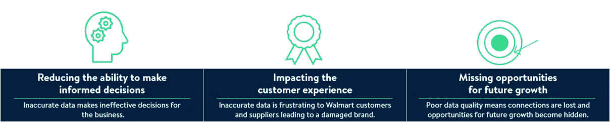

# 良好数据的重要性

> 原文：<https://medium.com/walmartglobaltech/the-importance-of-good-data-c5d6c5d3095d?source=collection_archive---------0----------------------->

(Image designed and owned by Walmart)

数据正在彻底改变我们在沃尔玛的运营方式，其质量对我们的客户和业务至关重要。良好的数据为客户提供丰富的产品信息，帮助他们做出明智的选择，帮助我们改善客户体验，并使我们能够做出明智的商业决策。坏数据会导致更多的坏数据、糟糕的决策和影响业务的低效率。

沃尔玛全球技术公司的数据战略和见解团队深入研究了创建和维护良好数据的重要性。这有助于我们避免不良数据的意外成本。

想想这个:IBM 估计仅在美国每年的不良数据成本就达 3.1 万亿美元。根据 Gartner 的数据，组织每年因[不良数据](https://www.gartner.com/smarterwithgartner/how-to-create-a-business-case-for-data-quality-improvement/)损失 1500 万美元，其他行业专家估计，企业在处理[数据质量问题](https://sloanreview.mit.edu/article/seizing-opportunity-in-data-quality/)上浪费了 15%到 25%的收入。《哈佛商业评论》估计，员工浪费 50%的时间搜寻数据、纠正错误和确认不确定数据的来源。

如果没有正确利用和使用数据，它会通过以下方式影响公司的成功:

(Image designed and owned by Walmart)

好的数据可能是一个重要的竞争优势，因此提高数据质量代表着一个巨大的机会。由于我们每天都在使用数据，因此我们的团队正在采取措施，确保全公司的员工都能随时获得好的数据。我们致力于帮助他们快速准确地做出业务决策。

这从我们为保持数据质量而制定的数据政策、标准和流程开始。这些控制了我们数据的质量，同时让员工有时间为客户服务，促进业务增长。这些政策概述了:

*   有效治理数据所需的特定角色和职责
*   数据分类的正确方法
*   在我们的组织内部以及与第三方共享数据的负责任的方式
*   将数据用作产品时确保安全性和质量的规则

为了介绍我们的政策、标准和流程，我们推出了一种学习模式，这种模式可以自定进度，并根据科目分成几个小段，以适应繁忙的日程安排。

我们让我们的员工能够创建和维护好的数据。这降低了沃尔玛不良数据的成本，有助于我们更好地为顾客服务。每个人都尽自己的一份力，我们就能显著提高为未来业务做出准确、明智决策的能力。

*1。*

**2。*[*https://www . Gartner . com/smarterwithgartner/how-to-create-a-business-case-for-data-quality-improvement/*](https://www.gartner.com/smarterwithgartner/how-to-create-a-business-case-for-data-quality-improvement/)*

**3。*[*https://Sloan review . MIT . edu/article/seizing-opportunity-in-data-quality/*](https://sloanreview.mit.edu/article/seizing-opportunity-in-data-quality/)*

**4。*[*https://retailtouchpoints . com/resources/Bad-data-costs-business-9-700 万-每年#:~:text = Bad %20 data % 20 costs % 20 business % 20% 249.7% 2000 万% 20 每年% 20% 2D % 20 retail % 20 touchpoints*](https://retailtouchpoints.com/resources/bad-data-costs-businesses-9-7-million-annually#:~:text=Bad%20Data%20Costs%20Businesses%20%249.7%20Million%20Annually%20%2D%20Retail%20TouchPoints)*