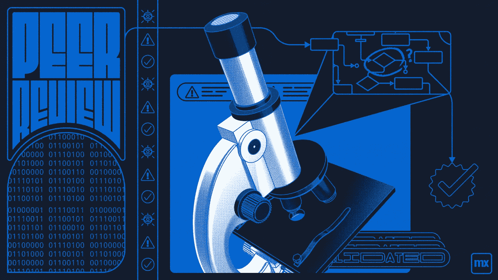

# 同行评议在 Mendix 中的重要性

> 原文：<https://medium.com/mendix/the-importance-of-peer-review-in-mendix-70525da1459b?source=collection_archive---------3----------------------->

Importance of Peer Review in Mendix

# 关于同行评议的一点注记

同行评审通常是对软件产品的技术内容和质量控制实践的评估，通过允许团队预先和频繁地评审他们的开发工件。这是软件开发中至关重要的一步，因为它为软件增加了有形的价值，并确保了最终目标的完整性。作为一种质量改进和控制策略，代码评审的好处被广泛接受。开发社区现在理解了代码审查对整体软件质量的影响，并且有能力在代码提交给 QA 进行测试之前识别和纠正错误。

## 执行同行评审

每个 Mendix 项目中的代码都必须在组织内接受同行评审。这应由直接同事(如果适用)完成，如果只有一名团队成员，则应要求核心团队的一名成员进行申请审查。**最终目标是通过检查代码是否符合约定准则来交付更高质量的应用程序**。它创造了一个团队成员可以协作和共享知识的环境，这通常会节省时间和降低风险。

## 列出同行评审

*   它容易阅读吗？这让 KIS 满意吗(保持简单)？
*   流和文件夹的命名遵循逻辑结构吗？
*   所有的访问权限设置是否正确？
*   有代码重用或代码重复吗？
*   如何覆盖和测试流程中的错误处理？
*   是否存在任何性能风险？
*   日志记录和错误处理是否以正确的方式完成？
*   你明白你的改变对现有应用的影响吗(回归)？

## 实用清单

在发展过程中，每个故事都经历了一系列阶段。

1.  **由开发者在本地实施**
2.  **开发商在当地测试**
3.  **提交**到团队服务器
4.  标记为“**准备好接受同行评审**

然后，同级应在**技术**和**功能**层面检查故事:

**技术**:

*   页面和微流是否被赋予了正确的权利？
*   错误处理和验证是否正确实施？
*   微流程遵守基本的指导方针(每个流程最多 X 个动作，可读的，等等)。)
*   考虑应用程序性能(是否有嵌套循环？循环中有提交吗，等等。)
*   微流程是否以技术上正确的方式实施？
*   符合基本惯例。
*   正确的安全设置

**功能性**:

*   页面和微流放在正确的文件夹中了吗？
*   页面和微流有明确的名称吗？
*   变更是否以合理、用户友好和正确的方式实施？
*   微流是否如故事中描述的那样起作用？
*   结果是否符合定义为**验收标准的预期？**

> **验收标准**指的是一组预定义的要求，必须满足这些要求才能将用户故事标记为完成。有时也称为“完成的定义”。

**不是**同行评审的一部分:同行评审者**不应该**对模型/页面/微流程进行修改，因为:

*   最初的开发人员可能会以不同的方式看待实现
*   最初的开发者也许不能从他们的错误中吸取教训
*   最初的开发人员不知道最初的实现发生了什么。

## 阅读更多

 [## 为应用性能实施社区最佳实践

### 1 简介本文档由 Mendix 社区创建并为其服务。它收集了以下方面的最佳性能实践…

docs.mendix.com](https://docs.mendix.com/howto/general/community-best-practices-for-app-performance/)  [## 实施 Mendix 最佳发展实践

### 1 简介本文档可用作采用一致的命名和建模约定的参考，同时…

docs.mendix.com](https://docs.mendix.com/howto/general/dev-best-practices/) 

*来自发布者-*

*如果你喜欢这篇文章，你可以在我们的* [*中页*](https://medium.com/mendix) *找到更多喜欢的。对于精彩的视频和直播会话，您可以前往*[*MxLive*](https://www.mendix.com/live/)*或我们的社区*[*Youtube PAG*](https://www.youtube.com/c/MendixCommunity/community)*e .*

*希望入门的创客，可以注册一个* [*免费账号*](https://signup.mendix.com/link/signup/?source=direct) *，通过我们的* [*学苑*](https://academy.mendix.com/link/home) *获得即时学习。*

有兴趣更多地参与我们的社区吗？加入我们的 [*Slack 社区频道*](https://join.slack.com/t/mendixcommunity/shared_invite/zt-hwhwkcxu-~59ywyjqHlUHXmrw5heqpQ) *。*