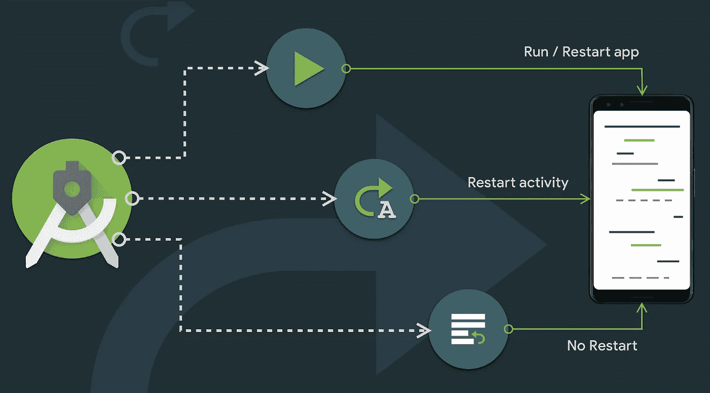
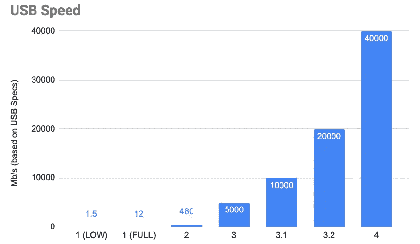
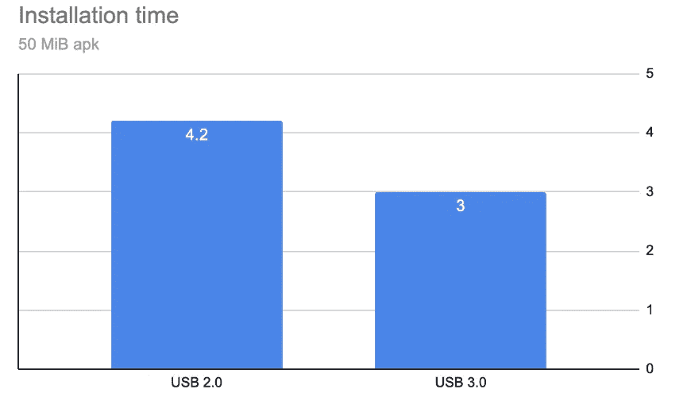
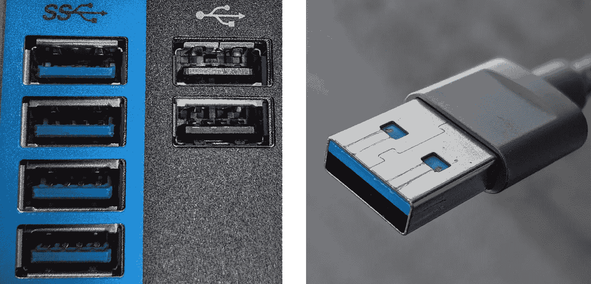
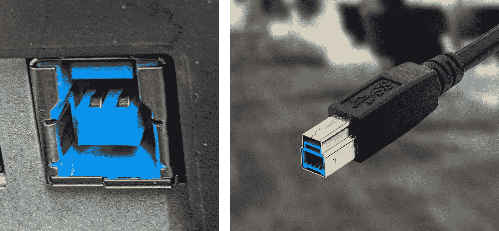
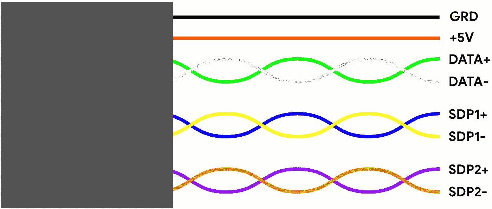
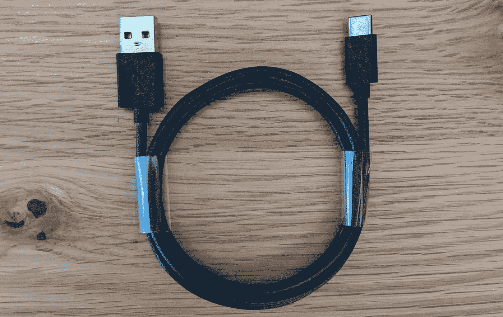

# USB 超高速对 Android 开发的重要性

> 原文：<https://medium.com/androiddevelopers/the-importance-of-usb-superspeed-for-android-development-e87534dc8c75?source=collection_archive---------4----------------------->

# 概观

迭代速度是构建高质量 Android 应用的关键因素。你进步得越快，结果就越完美。本文讨论如何优化部署时间。

# 部署 101

Android Studio 3.5 进行了大量改进，以缩短迭代时间。根据代码的结构，开发人员现在可以选择使用[应用更改](/androiddevelopers/android-studio-project-marble-apply-changes-e3048662e8cd)，这将交换更改的代码并重新启动当前活动。如果代码与活动生命周期无关，可以使用“应用代码更改”来代替，以便只交换修改的代码，而不重新启动正在运行的活动。

Apply Changes introduced two new ways to deploy an app.

在应用更改的基础上，Android Studio 3.5 引入了“增量推送”，在后续的运行调用中，只向设备发送 APK 中已更改的部分。通过 [sendfile(2)](http://man7.org/linux/man-pages/man2/sendfile.2.html) 将新部分和“旧”部分交替提供给包管理器，在设备上重建应用程序，实现接近零拷贝的安装。

总之，这些大大减少了安装时间。然而，为了充分利用这些优化，开发人员必须注意设备连接的质量。

# 为什么 USB 速度很重要

无论“增量推送”是否触发，一些数据都必须传输到设备。对于仿真器，这是通过 TCP/IP 完成的，但是在真实设备的情况下，将使用 USB。USB 连接越快，等待的时间就越少，迭代的速度就越快。

好消息是 USB 越来越快了。1996 年的第一个版本提供了最大 12 Mb/s，随着 2019 年 8 月 4.0 版的发布，我们现在已经进入了多 Gb/s 时代。

From 1996 to 2019, USB signal rate improved from 1.5MiB/s to 40GiB/s.

如果你不太关注细节，USB 是一项简单的技术。只要两个设备支持相同的 USB 版本，你只需抓住一根 USB 电缆，连接它们，它就可以工作了。客户端层甚至不需要改变。这是一顿“免费午餐”。

作为一名开发人员，保持最快的 USB 速度是非常重要的。在一定程度上(手机的闪存驱动器不能以 USB 3.2 的 20 Gb/s 写入，但可以超越 USB 2.0)，USB 传输速率和迭代速度之间存在直接的相关性。如果您使用 50 兆字节的 apk，使用 USB 3.0 比 USB 2.0 快 25%。你在每次安装上节省了整整一秒钟，这将在一天结束时累加起来。

Installing a 50MiB app with USB 3.0 is 30% faster than with USB 2.0.

坏消息是，使用 USB 3.0 设备以 USB 2.0 的速度运行非常容易。使用错误的电缆或坏的集线器是确保速度慢于预期的两种最佳方式。

# 避免降低 USB 连接速度

有三个简单的规则，你可以遵循，以帮助避免放慢你的 USB 连接。

1.  寻找蓝色。
2.  明白 USB-C 是什么意思。
3.  链接 USB 设备时要小心。

# 寻找蓝色

如果你正在处理 USB 类型 A 或 USB 类型 B 连接器，你是幸运的。 [USB 3.0 规范](https://www.usb3.com/whitepapers/USB%203%200%20(11132008)-final.pdf)建议对连接到 USB 3 的连接器进行颜色编码。支持 x 的硬件。如果你看到类似下面这些图片的东西，你就在正确的道路上。

USB 类型-A:

Left: USB Type-A female. Right: USB Type-A male.

USB 类型 B:

Left: USB Type-B female. Right: USB Type-B male.

# 了解 USB-C 连接器

USB-C 连接器大约与 USB 3.1 同时推出。许多人认为一个意味着另一个，或者他们有某种联系。他们不是。

USB 2.0 电缆由四根导线组成。两个给总线供电，两个传输数据。

A USB 2.0 cable contains four wires.

USB 3。x 电缆完全向后兼容。它们有两条 USB-2 信号所需的导线，以及两条用于 USB-3 上行和下行的专用双绞线。

A USB 3.+ cable contains eight wires.

USB Type-C 连接器不指示连接了多少根线。它们仅指连接器的形状。因为它们制造成本更低，所以有许多带有 USB-C 连接器的电缆，但只有 USB-2 接线。

The Type-A/C cable bundled in the Nexus 6P box.

上面这条电缆是捆绑在 Nexus 6P 的包装盒中的。这些手机具有连接到 USB type-C 连接器的 USB 2.0 集线器。

这些电缆里只有四根电线。

如果这是您永久插入工作站作为“首选”电缆的东西，并且您使用它在手机之间交换，您很可能会降低使用 USB-3 设备的体验。

在处理 USB type-C 连接器时，确保寻找 SS(超高速)符号的存在。

USB Super-Speed symbol.

如果是电话连接器，请仔细检查规格。即使是最近的手机，如 Pixel 3a 和 Pixel 3a XL，也有 USB 2.0 集线器。

# 链接 USB 设备

要避免的最后一个错误是使用坏的集线器。这和用错电缆一样糟糕。一种常见的配置是将我的所有设备(键盘、鼠标和开发人员的手机)插入一个充当 USB 集线器的显示器。

许多集线器的预期用途是集中“轻量级”外围设备，如只需要 USB 2.0 功能的键盘、鼠标和耳机。

确保您的 USB 集线器支持 3.0，方法是检查它是否有蓝色连接器，或者如果它只有 USB type-C 连接器，请查阅文档。

# 有用的工具

如果您有疑问，您可以仔细检查主机与设备协商的 USB 速度。

*   在 Mac 上:`***system_profiler SPUSBDataType***`
*   在 Linux 上:`***lsusb -vvv***`
*   在 Windows 上:`***USBView.exe***`