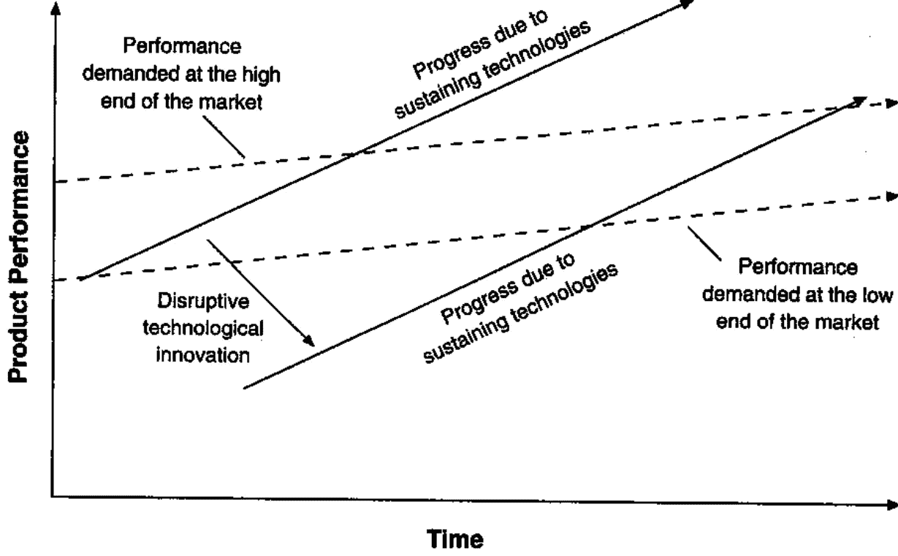
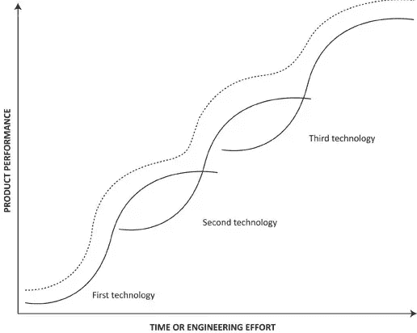
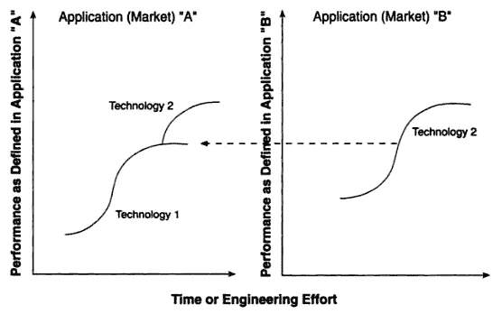

# 创新者的困境

> 原文：<https://medium.com/version-1/the-innovators-dilemma-6de68da8fabc?source=collection_archive---------2----------------------->

我最近偶然看到一本克莱顿·M·克里斯坦森的书:《创新者的困境》(Christensen，2013)。这本书并不新，第一版于 1997 年问世，大部分分析都是关于磁盘和机械挖掘机行业的颠覆性技术变革。

这远早于电子商务、云，更不用说数字双胞胎、物联网(IoT)、边缘计算、人工智能商业服务等。这本书显示了它的年龄，当它声称“在不久的将来，”互联网设备“可能会成为颠覆性的技术”(第十九页)。

尽管如此，我在克里斯滕森的书中发现了许多有用的见解，他的结论在 21 世纪的第三个十年仍然适用。继续阅读，找出原因…

**颠覆性创新**

我以前从来没想过“颠覆性”这个词的由来。当我与第 1 版客户交谈时，我同样使用“前沿”和“颠覆性”技术来描述我们的业务领域，主要是机器学习(ML)、人工智能(AI)和机器人流程自动化(RPA)。但是为什么前沿技术是颠覆性的呢？根据克里斯滕森的说法，这是因为与可持续技术相比，它们“改变了市场中的价值主张”。

这是明智的，它仍然适用于前面提到的技术。正是在这个意义上，我将在这篇文章中提到颠覆性和可互换的前沿技术。

**可持续发展与颠覆性技术**

Christensen 的分析将可持续技术与颠覆性技术的比较框定在一个角度，即前者倾听当前市场基础的需求，不断推动改进，直到性能超过客户的需求(“东北拉力”)。与此同时，性能低于成熟产品市场要求的颠覆性技术也有所改进，在这些市场上变得更有竞争力。

正是现有市场中的这种性能过剩，给了颠覆性创新出现的理由。这个概念如下图所示:老牌公司根据“东北拉力”移动，而新进入的公司寻求“向上流动”。

Figure 1: The Impact of Sustaining and Disruptive Technological Change (p. xx)

作者的论点是，许多主要组织往往专注于其当前客户的需求，没有时间探索风险较低的市场，即使成功，也无法与利益相关者对主要市场的预期增长率相匹配。

**一般组织障碍**

在创新方面，有些组织比其他组织更适合。

常见的限制是显而易见的，比如过多的繁文缛节和规避风险的文化。但底线是，创新意味着彻底的改变:训练有素的组织通常在改进他们一直在做的事情方面做得更好。用克里斯滕森的话来说:“解决公司最强大客户需求的可持续项目[……]*几乎总是*从市场小、客户定义不明确的颠覆性技术中抢占资源”(第 43 页，草书不是我的)。

这与下一个问题有关。

**价值网**

价值网络是组织为满足客户需求而运作的环境。由于这在很大程度上取决于过去的选择，技术的价值是根据过去和现在的客户和市场来衡量的。按照企业通常采用的标准，颠覆性创新是不确定的。因此，资源往往被分配给持续创新，而不是激进的创新。

价值网络还定义了公司交付产品和服务的优先顺序的成本结构。可持续创新的技术变革的 S 曲线只与一个价值网络相关(图 2)，对产品性能有单一和一致的衡量。

Figure 2: The Conventional Technology S-Curve (p. 40)

相反，破坏性创新是由不同价值网络中的多个属性来衡量的(图 3)。

Figure 3: Disruptive Technology S-Curve (p. 41)

因此，技术 S 曲线虽然是可持续技术的一个有价值的预测指标，但不能用于颠覆性技术，因为正如克里斯滕森所说，它们问了“错误的问题”。相反，这里的重要问题是，颠覆性技术是否以及何时会改进到与市场需求轨迹相交(图 1)。

**中层管理在资源分配过程中的作用**

作者正确地指出，大多数创新建议来自组织内部深处，而不是来自高层。因此，中层管理人员在选择项目时起着至关重要的作用。

标准是合理的:

*   最小化项目失败的风险。
*   最大化组织的短期利润。

经理的职业生涯和福利待遇取决于中层管理人员满足这两个标准的程度。项目失败是糟糕的，如果他们失败是因为项目没有满足当前客户的需求，或者更糟糕的是如果项目的市场根本不存在。

因此，高层管理者更喜欢控制资源分配，但通常情况下，资源分配已经由中层管理者的日常选择决定了。

克里斯滕森展示了一位创新者和他的经理之间为颠覆性技术分配资源的假想对话，非常清楚地说明了这一点。当面对谁可能是潜在买家的问题时，创新者在竞争对手投降之前快速实施想法的动力:“嗯，我不确定，但肯定有市场”(第 83 页)。

在资源分配竞赛中，针对新市场的项目提案毫无胜算:针对当前客户需求的项目总是会胜出。即使最高管理层致力于投资颠覆性技术，如果这不符合他们的模式，组织中的大多数人也会持怀疑态度，不太可能合作(第 84 页)。

**资源依赖理论**

如果我们接受克里斯滕森的假设，即当前客户的需求驱动着企业，那么，实际控制企业资源的是企业的客户。这被称为资源依赖，它表明一个企业在那些为其生存提供必要资源的组织外实体的限制下运作。

不幸的是，这在颠覆性技术中几乎行不通，颠覆性技术通常着眼于未来客户的需求，而这些需求他们通常并不知道(目前还不知道！).作者的策略是“创建一个独立的组织，并将其嵌入到*确实*需要该技术的新兴客户中”(第 102 页)。克里斯滕森提供了几个例子，但最有趣的可能是惠普。在 80 年代中期，他们是激光打印技术的领导者。一旦喷墨技术变得可用，惠普没有忽视这一颠覆性技术，而是创建了一个完全自主的单位，让两家企业相互竞争。

但不需要如此极端，具有不同报告路线和有限目标(与主流组织相比)的自治业务单位可以使“资源依赖为我们服务，而不是反对我们”(第 218 页)。由于范围较小，独立的业务单位也提供了一种更适合破坏性创新的失败态度。

**组织规模与市场规模的对比**

创造一个新市场比进入一个已建立的市场风险更小。也更有收获。尽管如此，小型新市场几乎无法满足大公司的增长需求。

大多数项目是根据其利润和增长影响来资助的。对于经理人来说，很难证明与这种增长没有明显关联的投资是合理的，因为颠覆性创新会带来更低的利润率。这是千真万确的，有时组织中最优秀的人甚至根本不想参与这个项目。一方面，技术人员“希望从事主流程序，而不是外围程序”(第 218 页)。另一方面，管理者“不想花费宝贵的管理精力不断捍卫我们的存在”。

正如作者指出的“每一项创新都是困难的。这种困难是不可估量的，尤其是在那些组织中，大多数人都在不断地质疑为什么要做这个项目”(第 134 页)。这就是为什么高层管理人员的支持是创新想法成功的关键。

**结论**

在这篇文章中，我根据我在版本 1 的[创新实验室](https://www.version1.com/it-service/innovation-labs/)的经历，分享了对*创新者的困境* (Christensen，2013)的一些思考，该实验室专注于通过颠覆性技术来解决我们客户的业务问题。

根据定义，如果市场是新的，那么它就不能被分析。因此，当涉及到前沿技术时，管理者应该专注于学习和发现，而不是执行计划。学习计划比执行计划更适合创新。

当得到最高管理层的支持时，如版本 1 中的情况，像创新实验室这样的倡议将有经验、重点和范围来将颠覆性技术应用于客户组织面临的实际业务问题，为这些组织甚至不知道的可能性铺平道路。这可以在现有或新的市场中创造新的商业机会，推动创新并解决之前强调的所有挑战。

**参考文献**

克里斯滕森，2013 年。创新者的困境:当新技术导致大公司失败。哈佛商业评论出版社。