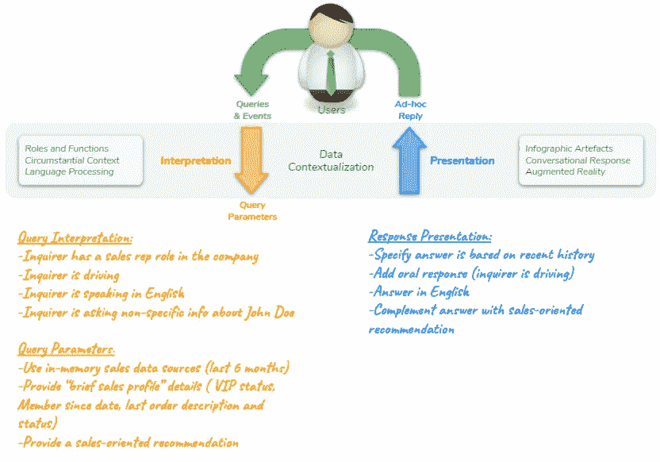
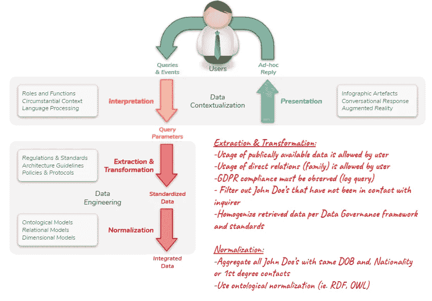
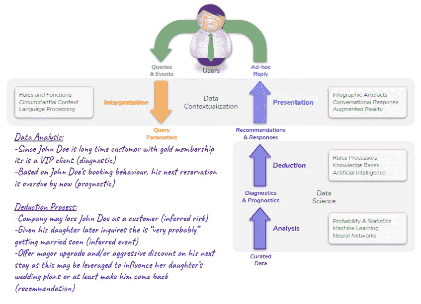
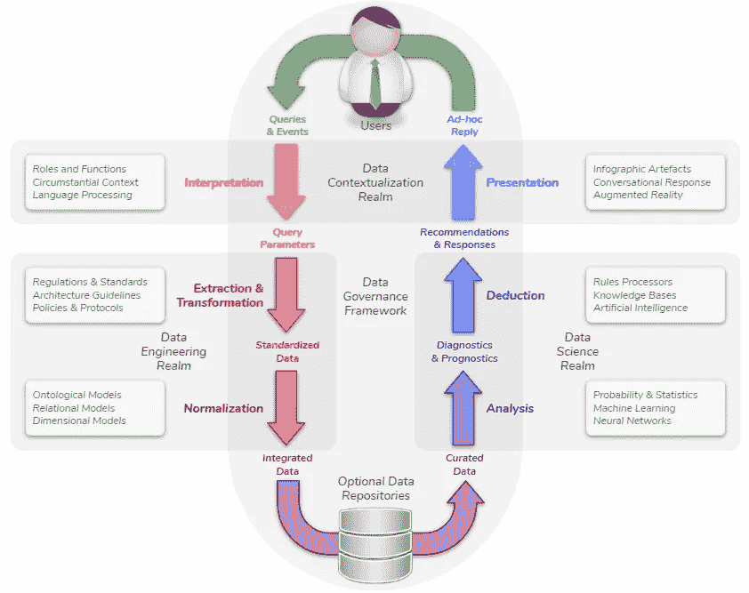

# 洞察资本化价值链

> 原文：<https://medium.com/globant/the-insights-capitalization-value-chain-b4b98515c859?source=collection_archive---------1----------------------->

*本文讨论了随着对话界面、关联数据和人工智能等相对较新技术的引入，商业智能价值主张如何显著增长。*

***对话界面*** *使查询信息或建议某事的行为更加自然和即时，尽管如此，这需要在传统的数据工程过程中增加一个新的步骤，以便正确地解释所提出的问题。*

***关联数据*** *允许实时包含来自可信数据源的相关外部数据，这增加了可用于通过高级分析和机器学习技术获得后视、洞察和预见的数据集。*

*最后但同样重要的是，* ***人工智能*** *使用这些诊断和预测来丰富数据输出，并提出行动建议，从而缩短做出最适当决策的时间。*

> **智能情境化**

到目前为止，大多数**商业智能**都是通过自助服务分析工具开发的，这些工具要求用户具备一定程度的技术背景，以便获得正在查看的信息，尽管如此，随着对话界面的使用越来越多，这些商业智能工具需要变得更加智能，以便通过更简单和自然的问题提供相同的结果。这不仅需要能够解释所请求的信息，还需要能够“将查询置于上下文环境中”,以确定需要提供的详细程度，并根据具体情况提供有意义的建议。

例如，如果我是一名销售代表，我正在通过 *Alexa* 向 *John Doe* 查询信息，如果是这样的话，一个有用的建议将是向我的客户建议一个个性化的报价或会员升级，但如果我是一个在财务团队工作的人，建议将更侧重于警告我与此人相关的信用风险或信用机会。

> **关联数据**

同样，数据的数量、速度、种类和波动性超过了关系数据仓库的能力，当前的“数据湖”仓库将被外部原始数据(如物联网和社交媒体)的绝对数量超过，这些数据需要与内部历史数据相结合，以便提供更好的诊断和预测。

在这方面，关联数据将是几乎实时地从外部来源获得补充数据的关键。互联网将有效地成为公共和私有数据所在的“数据海洋”(SPARQL 是获取它的关键)。

根据前面的例子，如果我是一名旅行社代理人，那么获取与提供有意义的推荐相关的社交媒体事实会很有用，这些数据可以是 John Doe 在电子商务网站上的最新评论，或者是他的社交媒体渠道上最近使用的标签。

> **人工智能**

解释关联数据和知识库的基本原理超出了本文的范围(尽管这可能是下一篇文章的有趣主题)，同时我只想说，使用本体模型来规范化数据允许使用人工智能来“推断”事件或风险，并通过预定义的响应协议或通过“演绎”过程来建议行动路线。

根据该示例，可能会发现根据 John Doe 的预订行为，他的下一次预订早就应该进行了，这可能表明他的偏好发生了变化，并且他的女儿可能要结婚了，因为她最近已经与一家旅行社的同事预约了，以了解我们公司的婚礼计划。

通过人工智能，这两个“可能的事实”将成为制定建议的基础，以避免失去重要客户并有利于销售机会的结束。

> **增强和整合的洞察资本化价值链**

通过对话能力、链接数据和人工智能来增强传统数据工程，使其最终用户能够以更自然的方式与智能应用程序进行交互，并允许实时集成外部数据，以产生更好的诊断和预测，在人工智能的帮助下，不仅提供所需的信息(以最易懂的方式)，还可能包括使决策过程更有效和高效的建议。

在 Globant，我们有技术工作室来处理这个增强和集成的**洞察资本化价值链**所涉及的每个领域。此外，我们通过架构、治理和运营框架对这些产品进行补充，以确保它们的可移植性、可扩展性以及符合适用的标准和法规。

推荐系统并不是一个新事物，但现在它们增强了实时和人工智能功能，我们将能够以更自然的方式进行交互。