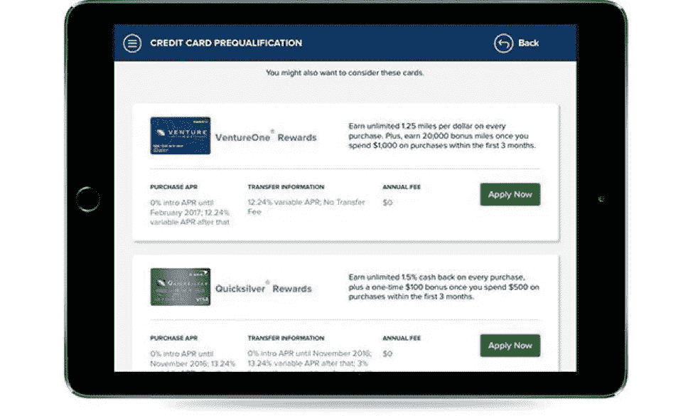

# 金融科技和信贷服务的交集

> 原文：<https://medium.com/capital-one-tech/the-intersection-of-fintech-and-credit-offers-1c1d935d1ef4?source=collection_archive---------2----------------------->

Capital One DevExchange C[redit provides API](https://developer.capitalone.com/products/credit-offers/homepage/)的产品经理 Brandee Shin 帮助我们了解金融科技的背景，它如何为这一新的 API 产品奠定基础，以及可能将它带入一些非常有趣的领域的假设用例。

## **你在第一资本公司工作了多久，为什么加入这家公司？**

我从 2015 年 8 月开始在 Capital One 工作。我的背景是 FinTech。我以前为贝宝工作。我加入 Capital One 的一个主要原因是，尽管他们是一家银行，但他们在技术上做了很多创新。看到他们在做什么，我真的很兴奋。所以，我来了。

## **给我们讲讲“金融科技”为什么这个术语最近变得如此流行，它对金融业意味着什么？**

“FinTech”代表金融科技。FinTech 背后的想法是将软件和更侧重于科技公司的想法用于金融服务。它已经存在很长时间了，从 90 年代末开始。金融科技目前是一个热门话题，因为你现在看到更多传统金融公司进入这一领域。消费者现在看到了更多的创新，或者渴望他们的银行有更多的创新。它正在成为主流。

Brandee Shin, Product Manager for the Capital One Credit Offers API, in her work environment.

## 金融科技的重大飞跃是什么？例如，PayPal 的突破是什么？还有什么其他的重大发展让我们走到了今天？

PayPal 的成功在很大程度上归功于易贝。这是一个很大的用例。PayPal 允许任何人向电子邮件地址汇款。加上易贝，这使得任何人都可以在他们的客厅里用信用卡付款，用他们面前已经有的东西:他们联网的电脑。它降低了准入门槛。您不再需要购买这种独立的专有设备来处理卡交易。诸如此类的事情导致了后来的金融科技。

就该行业最近的变化而言，比特币对金融科技产生了巨大影响。它已经存在了一段时间，我们看到公司开始接受比特币作为支付方式。看看它会走向何方应该会很有趣。不久前，移动支付出现了大爆发。有了智能手机，你实际上在口袋里有了一台电脑，这使得 Square 这样的移动读卡器能够进入实体空间。除此之外，智能手机给我们带来了应用商店和微交易热潮。这使得规模较小的支付处理商能够通过在处理费用上具有竞争力而获得吸引力。所以(她笑)，有很多。

## **金融科技的下一件大事是什么？**

我确信手机会起到一定作用，但老实说，这可能是我们没有预料到的。很难预测我们的下一个杀手级用例会是什么。但是与外部开发者合作将帮助我们看到新的潜力。这是下一个伟大想法最有可能产生的地方。

## **为什么信贷优惠 API 对客户有好处？**

从客户的角度来看，作为一个美国人，你的信用报告非常重要。拥有良好信用的秘方需要遵循一些规则。你需要有信用，并明智地使用它。但同时你也不能太频繁地查询信用，因为那与你的报告相悖。

信用报价 API 允许你看到哪些报价你可以通过资格预审，而不必实际提交一份与你的信用报告不符的完整申请。这样，如果你在对你感兴趣的卡片进行比较购物，你可以提前看一下清单，而不必承诺购买某一张卡片。我们的信用卡优惠 API 可以帮助您更好地决定您真正想要的信用卡。

Capital One DevExchange Credit Offers API features personalized offers.

## **开发者的关键收获是什么？**

发生这种情况时，无需将客户重定向到另一个站点。

> 它发生在开发者自己的网站或应用程序中，并在 60 秒或更短的时间内返回。

我们正在努力缩短这个时间，甚至更快。我们知道结果越快，客户就越有可能做出回应。重要的是要理解这是一个可能的资格预审报价的个性化列表。上面有顾客的名字。

## **开发人员想知道这个 API 的其他特性和好处是什么？**

(递减列表)
如果您已经登录，并且客户已经提供了他们的基本信息:名、姓、地址——您只需使用他们的社会保险号的后四位进行确认，即可获得优惠。这是 API 所需的四个字段。

诸如收入水平、支票或储蓄账户等其他信息是可选的。API 被设计成轻量级的。

有简单安全的 OAuth 凭证进行认证。

我们提供了一个参考应用，它很小，但是我们听说它在实现中非常有帮助。另外，我们的文档也得到了很多积极的反馈。

## **您的团队在为 DevExchange 准备信贷优惠 API 时遇到的最大挑战是什么，您是如何克服这些挑战的？**

为了做到这一点，我们连接到一个第三方数据库，这个数据库将我们与征信机构联系起来。我们有一个技术团队与第三方合作，另一个拥有我们的核心服务。他们的时间表根本不一致，这使得我们的敏捷过程非常具有挑战性。然后，我们有另一个技术团队在开发 API 网关——外部开发人员与之接口。这些团队不在同一个地理位置。所以让这些团队了解彼此的技术和限制是很困难的。另外，我们的日程很紧。这些后勤挑战是最大的普遍挑战。

我们解决这个问题的方法是，让人们在早期就在同一个房间里确定依赖关系，并一起制定时间表。通过视频聊天进行定期的面对面对话对于管理持续的物流挑战变得至关重要。在最初的会议后，我们制定了所有的计划，团队之间的定期视频聊天解决了地理、日程和沟通方面的挑战。

## 您希望看到信贷优惠 API 的哪种用例？

目前，信贷优惠 API 主要关注可能的资格预审。我想看到这更多地进入浏览体验。无论顾客身在何处——在博客、论坛、旅游网站上——都要为他们提供购物选择。有多少次有人想，“我想要一张首都一号卡，我会直接去那里，”而他们可能在其他地方，它就出现了，他们在想，“我很想参加这次航行。我想知道我是否应该把它放在一张卡片上。外面有什么样的牌？”如果你能在浏览体验中提供优惠，你就更有可能获得客户。通常情况下，在这种情况下你只会有一个广告，但这有更深的含义。我想这就是我们要去的地方。

## **总之**

随着可能的资格预审信贷的个性化提供成为新的规范，看看实现了什么其他用例将是有趣的。如果 Brandee Shin 的有根据的猜测是任何迹象，信贷优惠可能会在客户决定去购买新信用卡之前找到他们。

通过访问 DevExchange 网站上的[产品主页，了解更多有关 Credit Offers API 及其如何帮助您扩展或改进产品的信息。在那里，您可以找到特性、概述、文档等。](https://developer.capitalone.com/products/)

