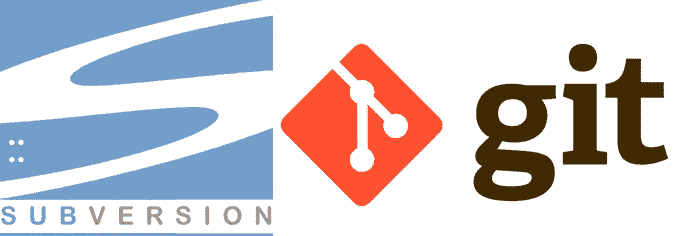
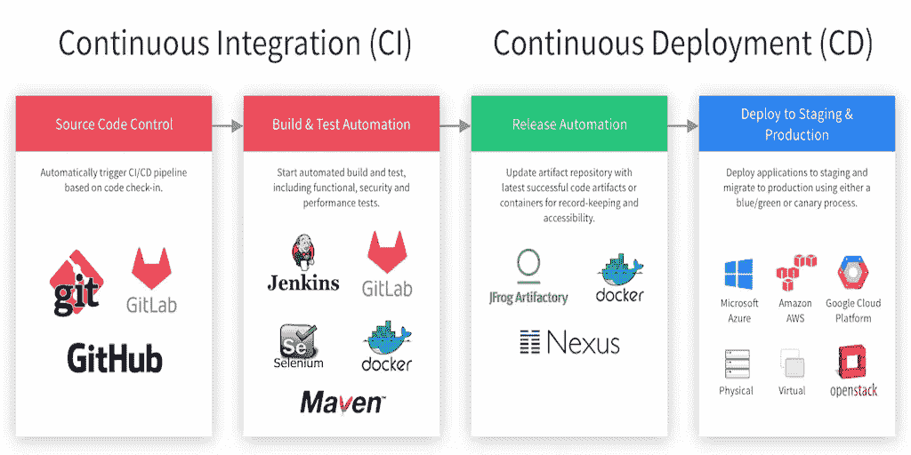
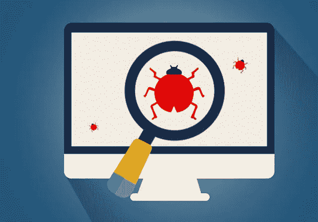
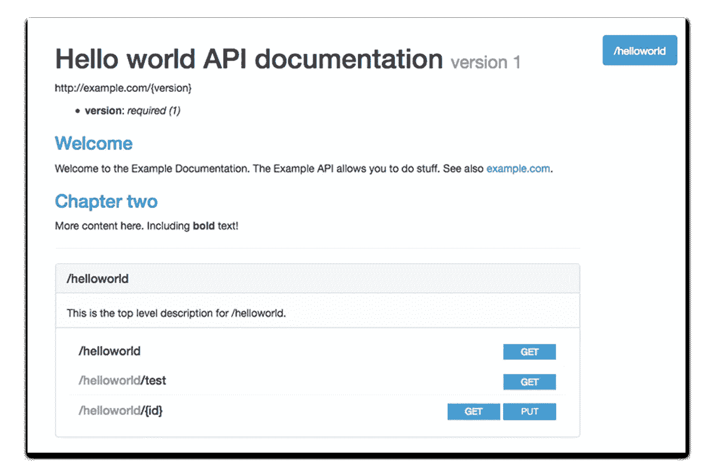
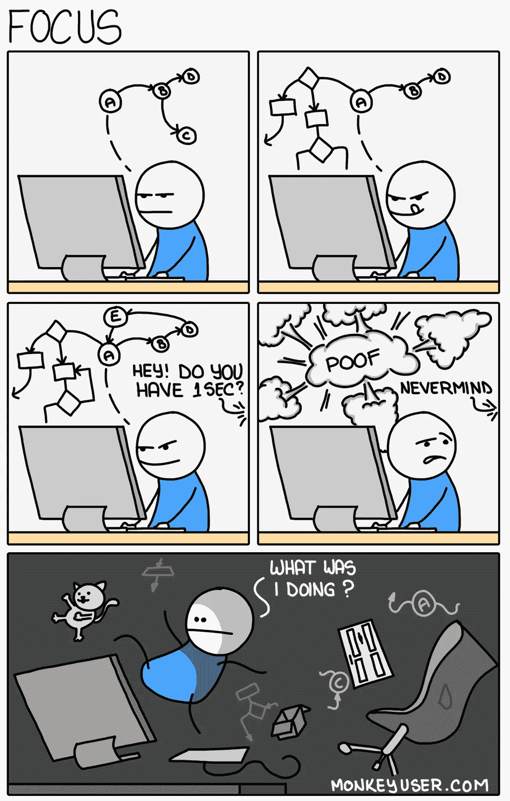
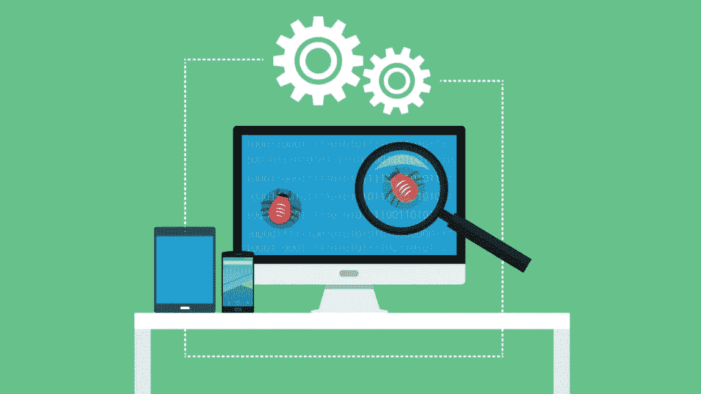

# The Joel Test: 12 Langkah Memiliki Tim yang Ideal

> 原文：<https://medium.easyread.co/the-joel-test-12-langkah-memiliki-tim-yang-ideal-9de4c1ab4055?source=collection_archive---------2----------------------->

## Bagaimana mengukur kualitas sebuah tim untuk mencapai tim yang memiliki standard kualitas code yang baik dalam software engineering?

*Tulisan ini adalah penjelasan ulang mengenai Joel Test, dengan beberapa perubahan sesuai dengan situasi modern software engineering saat ini. Saya menulisnya sesuai dengan yang Joel prakarsa, akan tetapi tes ini di tulis olehnya pada tahun 2000\. Tentu saja banyak perbedaan dalam proses dan tidak sepenuhnya sesuai dengan case yang di alami sendiri oleh Joel pada tahun 2000\. Sehingga saya membuat beberapa perubahan yang disesuaikan dengan case yang ada sekarang ini dan tentu saja yang saya alami sendiri.*

Ketika kamu sedang mengerjakan sebuah aplikasi, tentu saja kamu tidak akan lepas dari kerjasama yang dibangun di dalam sebuah tim, baik itu tim di perusahaan, organisasi, komunitas ataupun dengan kerabat dekat kamu. *Nah* , sebagai rekan kerja di tim tersebut, kamu pasti ingin mengetahui seberapa baik kualitas tim kamu dan bagaimana pengaruh setiap orang di dalam tim bagi kesuksesan pembangunan aplikasi kamu. Untuk mengetahui hal tersebut, kamu dapat melakukan sebuah tes, yakni **“The Joel Test”** .

## Apa itu The Joel Test?

The Joel Test adalah sebuah tes sederhana yang terdiri dari 12 pertanyaan yang dapat membantu kamu mengukur seberapa baik kualitas tim kamu. Tes ini dibuat oleh [**Joel Spolsky**](https://www.joelonsoftware.com/about-me/) **Co-Founder dan CEO Stackoverflow.com** . Tes ini dibentuk berdasarkan dengan konsep **SEMA (Software Engineering Measurement and Analysis)** yang memiliki tujuan yang sama, yaitu mengukur kualitas sebuah tim. Dewasa ini masih banyak perusahaan, organisasi, dan lain sebagainya yang masih kurang mampu untuk menganalisis bagaimana *performance* mereka untuk mengontrol proyek, meningkatkan proses pembangunan, mengevaluasi teknologi baru, dan melacak kinerja tim. Oleh karena hal tersebut, tes ini akan dapat membantu kamu menilai tim kamu. Meskipun tes ini sudah cukup lama diprakarsai oleh Joel, namun kali ini saya akan mencoba menjelaskannya dengan menyesuaikan pada keadaan *software engineering* sekarang ini.

Hal yang menarik dan mudah ketika mengerjakan The Joel Test ini ialah kamu hanya perlu menjawab setiap pertanyaan dengan **yes** atau **no** . Kamu tidak perlu melihat barisan kodingan kamu, *bugs* yang diselesaikan dan lain sebagainya yang menyangkut aplikasi kamu. Lalu setelah selesai mengisi keduabelas pertanyaan tersebut, selanjutnya kamu memberikan poin 1 untuk setiap pertanyaan yang memiliki jawaban yes, dan 0 untuk setiap pertanyaan yang memiliki jawaban no.

Skor yang bernilai 12 tentu saja berarti sempurna. Artinya kamu dan tim kamu telah berhasil menerapkan keduabelas poin tersebut untuk mendapatkan sebuah tim yang sempurna. Jika skor yang dihasilkan 11, maka tim kamu masih dapat ditoleransi, tetapi kamu harus meningkatkan poin mana yang kurang untuk menjadi sempurna. Akan tetapi jika skor yang didapatkan oleh tim kamu berkisar 10 ke bawah, maka kamu dan tim kamu mendapatkan masalah yang serius sehingga harus segera diperbaiki.

Tentu saja, tes ini **bukan** satu-satunya faktor yang dapat menentukan kesuksesan atau kegagalan tim kamu. Akan tetapi tes ini akan membantu kamu untuk membentuk tim dan kerjasama yang lebih baik, disiplin dan konsisten. ***Jadi apa saja pertanyaan yang perlu kamu jawab?***

## 1\. Apakah kamu menggunakan source control?

Saat membangun sebuah aplikasi, kita harus menggunakan satu *source control* atau *codebase* yang dapat di jalankan di semua *environment* . Beberapa contoh *source control* adalah *git* , *svn* dan lain sebagainya.

svn and git, taken from Google Image Search

Jika kamu tidak menggunakan *source control* , kamu akan kesulitan saat bekerjasama dengan tim kamu. Komunikasi antar tim akan sulit dilakukan. Masing-masing anggota dalam tim tidak akan tahu apa yang sedang dikerjakan oleh teman setimnya.

Terlebih lagi jika terjadi kesalahan akan sulit untuk di *rollback* . Selain itu, ketika menggunakan *source control* , proses *tracking* dan manajemen proyek akan lebih mudah. Jadi, apakah kamu dan tim kamu sudah menggunakan *source control?*

## 2\. Apakah kamu melakukan proses build hanya dalam satu kali proses?

Maksud dari pertanyaan ini ialah bertujuan untuk memvalidasi berapa banyak langkah yang diperlukan oleh tim kamu untuk merilis aplikasi versi terbaru?

Sebuah tim yang baik adalah tim yang memiliki sebuah *script* yang dapat dijalankan untuk mengotomatisasi proses *build* aplikasi, dimulai dari *install dependecies, code check* , *lint* , *unit-testing, compiling* , *build* , dan lain sebagainya.

Jika tim kamu melakukan semua proses *build* secara manual dan tidak terotomatisasi, maka akan sangat membosankan kepada *engineer* yang bertugas melakukan proses *build* tersebut. Terlebih jika ternyata terdapat banyak tahapan sebelum deployment, namun pada tahap kesekian ada kesalahan, maka kamu harus mengulang lagi dari awal secara manual. *Bayangkan jika terdiri dari 20 tahap dan salah di tahap ke-18* 😱

Untuk alasan inilah, akan lebih baik jika kamu beralih untuk membuat *script* yang dapat mengotomatisasi proses *build* aplikasi kamu dan akan benar-benar membantu kamu.

Hal ini juga sangat berkaitan dengan ***The 12 Factor App*** bagian [***Admin Process***](https://12factor.net/admin-processes) ***.*** Tentang mengotomatisasi proses atau step yang sama dan berulang-ulang.

> *Run admin/management tasks as one-off processes*

## 3\. Apakah kamu menggunakan automated test dan CI/CD ?

Pada Joel Test disebutkan kita harus melakukan Daily Build. Namun karena software engineering sudah berkembang dengan mulai maraknya CI/CD ( *Continuous Integration* / *Continuous Development* ), maka tidak heran jika standard tim *software engineering* yang baik adalah tim yang menggunakan CI/CD.

CI/CD taken from Google Image Search

Kemudahan dalam *modern automated test* dan CI/CD adalah kita bisa menerapkannya pada *source control* kita. Contohnya pada *github* , kita bisa memakai *Travis, Buddy.works, CircleCI* dan sebagainya, serta mengatur *rule* untuk setiap perubahan sebelum dapat di- *merge* ke *branch master* setelah lulus *test* (berhasil/sukses) dari *automated test* yang sudah kita *setup* .

Sehingga meskipun kita memiliki satu *codebase* , setiap *programmer* tetap bisa mengerjakan fitur produk masing masing dengan *codebase* yang terupdate yang telah lulus *test* termasuk *integration test* dan tidak ada bug secara [*whitebox test*](https://en.wikipedia.org/wiki/White-box_testing) .

## 4\. Apakah kamu menggunakan issue/bug tracker?

Tidak peduli dengan apa yang akan kamu katakan, jika kamu sudah bekerja di dalam tim dan tidak memiliki satu sumber untuk menyimpan data-data mengenai *bug* pada aplikasi kamu, maka kualitas *code* yang kamu miliki masih kurang. Banyak *programmer* yang berpikir bahwa mereka dapat mengingat semua *bug* di kepala mereka, akan tetapi hal tersebut dapat dikatakan sebagai omong kosong. Mungkin kita memang dapat mengingat sekitar 2–3 *bug* dalam satu waktu, akan tetapi kita juga dapat dengan mudah melupakannya.

bug taken from Google Image Search

Untuk mengatasi hal ini, kamu perlu menyimpan data mengenai *bug* pada aplikasi kamu. Kamu dapat membuat sebuah repositori yang berisikan *bug* aplikasi kamu. Daftarkan *issue* yang aplikasi kamu miliki. Atau kamu juga dapat membuat *bugs management tracker* yang kamu tanam pada aplikasi kamu. Misalnya jika aplikasi kamu terjadi *bug* maka secara otomatis akan mengirimkan pemberitahuan mengenai *bug* tersebut. Misalnya jika aplikasi *mobile* kamu dapat menggunakan [*Fabric*](https://fabric.io) .

Data-data yang diperlukan minimal terdiri dari:
- Nama dan deskripsi *bug* atau *issue*
- Langkah untuk menghasilkan ( *reproduce* ) *bug* atau *issue*
- Kondisi awal yang diharapkan ( *expected result* )
- Kondisi yang terjadi ( *actual result* )
- Siapa yang akan menghandle *bug* atau *issue* tersebut
- Status *bug* , misalnya *complete, on progress* , dan lain sebagainya.

Jika masih kesusahan, cukup buat sebuah tabel dengan 5 kondisi diatas sebagai kolom dan mulailah melacak *bug* pada aplikasi kamu. Hal ini tentu saja sudah mudah dilakukan sekarang ini, terlebih jika kamu menggunakan *source control* , seperti git pada github, gitlab, bitbucket dsb. Mereka biasanya sudah menyediakan *issue/bug tracking,* yang sudah mencakup data-data diatas.

## 5\. Apakah kamu menyelesaikan bugs terlebih dahulu sebelum menulis fitur baru?

Secara umum, semakin lama kamu menunda untuk memperbaiki *bug* , maka semakin mahal (waktu dan uang) yang kamu habiskan untuk memperbaikinya. Misalnya ketika kamu membuat kesalahan *logic* , kamu pasti akan langsung memperbaikinya. Jika *code* yang kamu kerjakan pada saat itu langsung kamu perbaiki, maka waktu yang kamu butuhkan tidak terlalu lama karena *code* yang kamu tulis masih segar di ingatan kamu. Beda halnya jika *code* yang kamu tulis sudah beberapa hari yang lalu, maka bisa saja kamu sudah melupakannya dan ketika kamu memperbaikinya akan memakan waktu lama. Belum lagi kamu harus memikirkan bagaimana *mereproduce* *bug* tersebut. Atau *bug* tersebut sudah sangat lama, lalu kamu kembali ingin memperbaikinya, kamu malah merasa janggal dengan *code* tersebut.

Itu adalah salah satu alasan untuk memperbaiki *bug* sesegera mungkin, karena akan membutuhkan waktu yang lebih sedikit. Artinya jika kamu memiliki waktu sebelum mengerjakan fitur baru, alangkah baiknya kamu langsung memperbaiki *bug* yang ada sehingga memudahkan kamu nantinya.

## 6\. Apakah kamu memiliki schedule yang up-to-date dan tidak ngaret?

Milikilah jadwal dan selalu *up-to-date* dengan jadwal yang sudah kamu dan tim kamu susun. Terkadang akan banyak *meeting* dan aktifitas yang harus kita hadapi sebagai *programmer* . *Meeting* di pagi hari, demo fitur, *fixing bugs* , mengerjakan fitur baru, bahkan menemui *user* atau *client* , dan lain sebagainya. Sehingga diperlukan *schedule* yang selalu *up-to-date* dan tidak ngaret tentu saja.

time management taken from Google Image Search

*Shedule* yang terstruktur juga akan sangat membantu saat kita bekerja. Sehingga kita bisa memprioritaskan fitur apa yang harus dikerjakan lebih dahulu. Dan tidak menganggu *schedule* yang sudah dicanangkan.

> Bad schedule management akan berpengaruh pada produktifitas tim anda.

## 7\. Apakah kamu memiliki spesifikasi dan dokumentasi?

Sudah menjadi hal yang lumrah bahwa semua orang pasti mengatakan menulis spesifikasi dan dokumentasi adalah hal yang sangat perlu dilakukan. Namun pada kenyataannya sangat sedikit yang mau mengerjakannya.

Banyak yang mengakui bahwa memiliki spesifikasi dan dokumentasi akan membantu kita membangun aplikasi. Akan tetapi banyak dari *programmer* benci untuk merancang dan menulis dokumen. Akibatnya ketika sebuah tim terdiri dari *programmer* yang seperti itu, maka mereka akan memilih untuk menuliskan kode mereka daripada dokumen spesifikasi. Dan suatu saat nanti besar kemungkinan akan terjadi banyak miskomunikasi antar *programmer* , karena tidak memiliki spesifikasi yang sama.

Bisa dibayangkan jika kita menulis spesifikasi terlebih dahulu, saat kita menemukan sebuah *case* permasalahan, kita dapat langsung mencari solusi untuk mengatasinya. Berbeda jika kita mengerjakan tanpa spesifikasi. Saat kita berpikir sudah selesai, namun ternyata setelah di- *deploy* ke *production* , kita malah menemukan masalah, maka proses penyelesaiannya akan berbeda dan memakan *cost* yang lebih mahal.

API Documentation taken from Google Image Search

Contoh nyata dalam membuat spefisikasi aplikasi yang saat ini biasa diterapkan yakni, membuat *draft* atau mendefinisikan *API Documentation* sebelum mengerjakan aplikasinya. Saat membuat sebuah fitur pada *product* yang terdiri atas API dan *frontend(web/mobile)* , maka kita harus terlebih dahulu membuat spesifikasi API kita sehingga kedua tim API dan *frontend(web/mobile)* bisa sepakat bekerja secara paralel.

## 8\. Apakah programmer bekerja dalam kondisi yang tenang?

Ketika bekerja, sangat penting bagi *programmer* untuk memiliki zona produktifitas. Jika seseorang sudah bekerja di zona produktif mereka, maka mereka akan dengan mudah menuangkan apa yang di pikiran mereka ke dalam pekerjaan. Akan tetapi jika mereka terlalu lama menemukan zona produktifitas mereka maka mereka akan menghabiskan waktu dengan bermain-main dan tidak mengerjakan aplikasi.

Sangat sulit untuk masuk ke zona produktif. Jika di perkirakan secara angka, untuk masuk ke dalam zona produktif cukup memakan waktu sampai 15 menit sampai programmer fokus kembali ke pada masalah yang akan di solve.

Akan tetapi akan sangat mudah masuk ke zona bermain. Misalnya keributan, panggilan telepon, pergi keluar untuk makan siang, harus berkendara 5 menit ke Starbucks untuk minum kopi, dan interupsi oleh rekan kerja — terutama interupsi oleh rekan kerja — semuanya membuat kamu keluar dari zona itu.

comic about focus taken from mongkeyuser.com

Jika seorang rekan kerja mengajukan pertanyaan, menyebabkan interupsi 1 menit saja, tetapi ini membuat kamu keluar dari zona cukup parah sehingga kamu membutuhkan waktu setengah jam untuk menjadi produktif kembali, produktivitas kamu secara keseluruhan berada dalam masalah serius.

Jika kamu berada di lingkungan berisik, maka akan susah bagi kamu untuk bekerja. Produktivitas bergantung pada kemampuan untuk menyulap banyak detail kecil dalam memori jangka pendek sekaligus. Gangguan apa pun dapat menyebabkan detail ini mogok.

Ketika kamu melanjutkan pekerjaan, kamu tidak dapat mengingat detail apa pun yang sebelumnya sedang kamu kerjakan, seperti nama variabel lokal yang kamu gunakan atau di mana kamu terapkan algoritma penelusuran dan kamu harus terus mencari hal ini yang memperlambat kamu sampai ke zona produktif.

## 9\. Apakah semua tools yang kamu pakai merupakan tools terbaik dan premium yang bisa di beli?

Saat membangun *software* dengan bahasa *programming* yang harus di *compile* , maka proses *compilation* itu haruslah sangat cepat. Kecepatan kompilasi biasanya bergantung pada spesifikasi *hardware* komputer.

Bisa dilihat, jika saat kamu membangun aplikasi android, tentu kamu membutuhkan laptop yang benar-benar bagus. Karena untuk *debugging* saja menggunakan *Android Studio* biasanya membutuhkan memori RAM yang sangat besar atau I/O disk yang cepat . Jika laptop yang digunakan memiliki spek yang *standard* atau minimun, maka hanya untuk melihat hasilnya saja, bisa memakan waktu lebih dari 1 jam. Tentu saja saat kompilasi memakan waktu 1 jam kita tidak bisa berbuat apa-apa selain menunggu. Laptop akan *ngadet* dan *hank* jika kita membuka aplikasi lain. *Programmer* pasti akan bosan dan tidak produktif jika hal ini terjadi. Untuk itu pakailah *tools* yang memang terbaik untuk produktifitas misalnya membelikan laptop terbaru dan keluaran terbaru kepada *programmer* anda. Jika kamu bingung, kamu bisa cari tahu laptop rekomendasi untuk programmer di Internet.

Atau jika tim *designer* akan melakukan suatu *design,* tetapi kamu tidak membelikan mereka *Adobe Photoshop* atau *Ilustrator* , atau sejenisnya yang bersifat premium. Mereka bisa saja tetap mengerjakannya, tetapi hasilnya tentu saja tidak sebagus yang bisa diciptakan dengan *tools* yang premium.

Atau kepada *backend programmer* , yang selalu berhubungan dengan *cli* dan *console* yang cukup banyak, memiliki 2 monitor tentu lebih gampang saat *debugging* dari pada satu monitor.

Disamping itu, *programmer* ataupun tim *development* akan sangat merasa senang dan semangat jika mereka diberikan barang-barang yang sangat keren dan *ter-up-to-date (Coolest things and up to date stuff)* . Ini adalah langkah termudah untuk menahan mereka tetap bekerja pada perusahaanmu selain menawarkan gaji yang *competitive* .

## 10\. Apakah kamu memiliki tester?

Jika tim kamu tidak memiliki *dedicated tester* atau paling tidak satu dari tim kamu mengerti melakukan *software testing* , maka kamu menghasilkan aplikasi yang gagal dan penuh *bugs,* dan kamu menghabiskan uang untuk membayar programmer yang banyak tetapi tidak mengetahui tentang *software testing* .

Software Testing taken from Google Image Search

Karena seorang *dedicated tester* lebih baik dan teliti ketika mengetes aplikasi kamu. Karena mereka bisa lebih fokus pada *testing* dan *bugs tracing* .

## 11\. Apakah kandidat baru pada tim diberikan tes live code saat interview?

Apakah kamu akan merekrut seorang pesulap tanpa mengetahui trik sulap yang mereka mampu? Tentu saja tidak.

Sama dengan di sebuah tim, kamu harus melakukan test yang *real* untuk memastikan kandidat baru pada tim kamu. Setiap kandidat baru akan diberikan pertanyaan mengenai kodingan. Suruh mereka melakukan koding suatu aplikasi atau *logic* , dan pastikan mereka dapat menjelaskan apa yang mereka perbuat pada aplikasi atau kodingan mereka.

## 12\. Apakah kamu memiliki usability testing?

Tes ini akan membantu kamu untuk memperbaiki aplikasi kamu. Aplikasi yang baru kamu buat dan akan kamu rilis, coba berikan kepada 5–6 orang secara random. Biarkan mereka memakai aplikasi kamu, dan kamu dapat mempelajari prilaku mereka ketika menggunakan aplikasi. Desain UI tidak sesulit yang kamu pikirkan dan ini sangat penting untuk dilakukan. Kita dapat mengetahui bagaimana sebenarnya *user* memakai aplikasi kita. Bahkan jika kemampuan *design* kita tidak terlalu baik, hal ini akan sangat membantu kita saat merancang aplikasi kita.

# Conclusion

Demikian sedikit penjelasan tentang Joel Test mengenai mengukur seberapa baik kualitas tim. Seperti yang saya sebutkan sebelumnya, tentu saja tes ini **bukan** satu-satunya faktor yang dapat menentukan kesuksesan atau kegagalan tim kamu. Tetapi tes ini cukup baik untuk di jadikan sebagai langkah awal. Tes ini juga bisa kamu tanyakan saat interview kepada perusahaan yang hendak kamu tuju. Jika skor mereka dibawah 10, seperti disebutkan oleh Joel, maka mereka memiliki masalah cukup serius dengan *management* produktifitas dan tim. Namun keputusan tetap di tangan kamu tentunya.

> Jadi sekarang mari jawab ke-12 pertanyaan ini
> 1\. Apakah kamu menggunakan *source control* ?
> 2\. Apakah kamu melakukan proses *build* hanya dalam satu kali proses?
> 3\. Apakah kamu menggunakan *automated* *test* dan *CI/CD* ?
> 4\. Apakah kamu menggunakan *issue/bug tracker* ?
> 5\. Apakah kamu menyelesaikan *bugs* terlebih dahulu sebelum menulis fitur baru?
> 6\. Apakah kamu memiliki schedule yang *up-to-date* dan tidak ngaret?
> 7\. Apakah kamu memiliki spesifikasi dan dokumentasi?
> 8\. Apakah *programmer* bekerja dalam kondisi yang tenang?
> 9\. Apakah semua *tools* yang kamu pakai merupakan *tools* terbaik dan premium yang bisa di beli?
> 10\. Apakah kamu memiliki *tester* ?
> 11\. Apakah kandidat baru pada tim diberikan tes *live code* saat *interview* ?
> 12\. Apakah kamu memiliki *usability testing* ?

***稍加改动翻译自:***[***https://www . joelonsoftware . com/2000/08/09/the-Joel-test-12-steps-to-better-code/***](https://www.joelonsoftware.com/2000/08/09/the-joel-test-12-steps-to-better-code/)