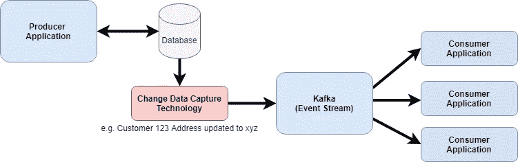
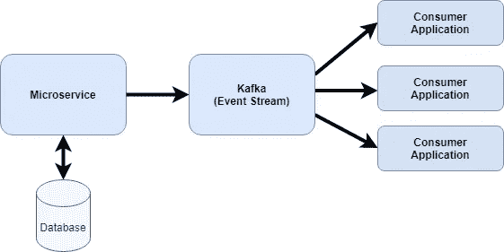
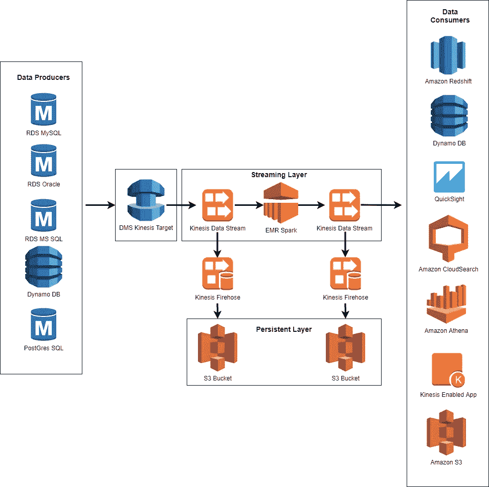
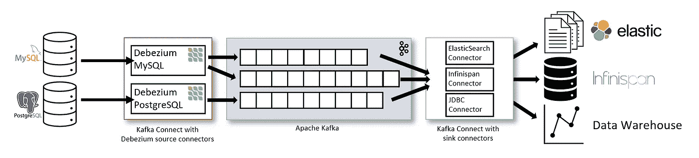
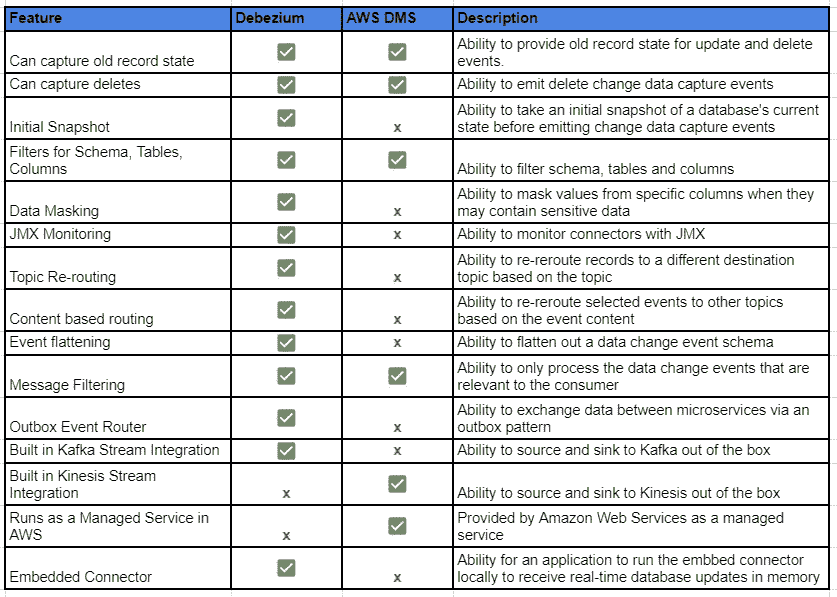

# 利用变更数据捕获实现从批处理到实时的转变

> 原文：<https://medium.com/capital-one-tech/the-journey-from-batch-to-real-time-with-change-data-capture-c598e56146be?source=collection_archive---------0----------------------->

## 使用变更数据捕获技术为微服务生成可消费数据

在当今的数字时代，客户要求服务始终具有最新的数据。然而，整个行业中的许多金融应用程序仍然是批处理的整体，并且定期(通常是每天)对呈现的数据集执行基于批处理的处理。这给希望在数据发生变化时快速做出反应的数据消费者带来了挑战。最终，处理速度只能与最慢的依赖项一样快。

我们如何解决这个问题？将 monolith 分解成微服务是一个开始，但如果数据发布仍然每天进行一次，这并不能解决问题。使用[反应式架构](/capital-one-tech/microservices-when-to-react-vs-orchestrate-c6b18308a14c)让你更接近解决问题，因为解耦的微服务将事件发布到事件流。但是，如果用微服务批量处理这些事件，也会存在同样的问题。要解决这个问题，我们必须从数据生产者和他们的数据发布模式开始。

在本文中，我们将通过应用[事件源](https://martinfowler.com/eaaDev/EventSourcing.html)模式和使用所谓的[变更数据捕获(CDC)](https://en.wikipedia.org/wiki/Change_data_capture) 来进一步讨论微服务反应模式。CDC 是一种现代技术，它利用事件源在数据库发生更改时实时传输数据更新。这使得微服务消费者能够订阅流，并在金融应用程序中发生时获得实时更新。在本文中，我们将提供:

*   CDC 和活动采购概述
*   关于何时使用 CDC 的指导
*   常用 CDC 技术的高级比较，包括 [Debezium](https://debezium.io/) 和 [AWS 数据迁移服务(DMS)](https://aws.amazon.com/dms/)

# 变更数据捕获和事件源概述

## 什么是变更数据捕获(CDC)？

CDC 最初是作为基于批处理的数据复制的替代方案出现的。在某个时间点，数据复制需要系统离线，因为它们要将整个数据库从源位置复制到目标位置。CDC 对此进行了改进，在更小的数据集上提供连续复制—在单个事件级别。大多数数据库都有一个事务日志来跟踪数据库中的所有事务。CDC technologies 通常会读取该事务日志，并提供接口来流式传输事务，因为它们碰巧是流式技术，如 [Kafka](https://kafka.apache.org/) 。消费者应用程序然后通过订阅特定主题来消费它们。

Example flow of CDC

当事务流出到事件流时，它们被认为是事件。这遵循了[反应式架构](/capital-one-tech/microservices-when-to-react-vs-orchestrate-c6b18308a14c)的风格，意味着消费者应用/微服务可以被预编程以对特定事件做出反应，并与生产者分离。在[面向服务的架构](https://en.wikipedia.org/wiki/Service-oriented_architecture) (SOA)被技术行业完全采用之前，一个常见的反模式是消费者应用程序直接连接到生产者应用程序数据库。这通常会给生产者带来性能问题，因为消费者要对生产者的操作数据库进行代价高昂的查询。此外，它将消费者与生产者的数据模型紧密耦合在一起。每当生产者做出改变，消费者必须改变，否则他们会破产。这也导致生产者的数据如何被消费缺乏透明度。对于 SOA 和[微服务架构风格](/capital-one-tech/delivering-microservices-for-enterprise-with-devops-fd253a6c2f1e)，我们总是希望通过利用带有契约的接口来提供一定程度的抽象，从而分离生产者和消费者。在上面的例子中，抽象是 Kafka，但它也可能是一个 API。

## 什么是事件采购？

如前所述，CDC 技术是生产者发布单个数据事务的一种方式，因为它们作为事件出现在数据库中。我们可以应用[事件源](https://martinfowler.com/eaaDev/EventSourcing.html)模式来获得更多的好处。根据 [Martin Fowler 的](https://en.wikipedia.org/wiki/Martin_Fowler_(software_engineer))定义，事件源将应用程序状态的所有更改存储为一系列事件。然后可以重放这一系列事件以获得当前状态。事件是不可变的，意味着它们不能被改变。如果它们的状态需要改变，则添加新的事件。Kafka 是事件源实现的最佳选择，因为它是持久的。当从卡夫卡那里读到一个信息时，它并没有被破坏。相反，它根据配置的保留策略保留在 Kafka 中。这使得事件重放成为可能。

Example of Event Sourcing

事件采购的概念已经以不同的形式存在了几个世纪。法律合同是一个常见的例子。合同不是重写，而是修改。另一个事件源的例子是国际象棋比赛。通过事件源，我们记录玩家的每个动作。在任何时间点，你都可以重放他们的所有动作，以获得棋盘的当前状态。这是一个很好的模式，适用于需要对单个状态变化进行审计的用例。一旦产生了一定数量的事件，我们将希望产生一个快照事件记录。这提供了当前状态视图，并在重放事件时节省了消费者的时间。想象一下，如果一个事件流中有数十亿个事件。您不希望每次都重放每个事件来获得当前状态。相反，您可能希望从最新的快照开始工作。

总之，CDC 是一种从数据库中生成状态变化作为事件的方法，而事件源是一种捕获单个事件的模式，可以通过重放这些事件来获得当前状态。

# 关于何时使用 CDC 的指导

在某些情况下，使用 CDC 是一种反模式。例如，如果构建一个新的应用程序，我不会使用 CDC。相反，我会通过使用[域驱动设计/事件风暴](/capital-one-tech/event-storming-decomposing-the-monolith-to-kick-start-your-microservice-architecture-acb8695a6e61)的受限上下文来设计微服务和数据。每个微服务除了将某些数据元素存储到其数据存储中(如果需要)之外，还会将其事件发布到流中。微服务将发布事件，而不是让数据库通过 CDC 发布事件。这种方法的优点是微服务可以将事件转换成可读性更好的业务事件。从商业现成产品读取数据库的 CDC 事件通常需要解释。是的，您可以让一个进程从流中读取 CDC 事件，翻译它并将其发布回来，但这是一个额外的处理跳跃。为什么不让制片人从一开始就拥有那个翻译并出版它呢？此外，从数据库更新开始到 CDC 事件发布到事件流中，CDC 可能会有一小段延迟。这可能取决于数据库更新的发生和到达事件流的跳数。

Example of a mIcroservice publishing events to Kafka

我发现 CDC 更适合现有的应用程序，在现有的应用程序中，将一个整体转化为微服务要么是进一步的发展，要么应用程序是一个定制的现成产品，无法修改。它还支持并行采用方法，消费者可以按照自己的节奏迁移到新模式。在这些场景中，有几个因素需要考虑，以确定 CDC 是否合适。

*   **消费者渴望增量数据更新**。如果消费者只需要当前状态，而不是详细的更新，那么就不需要 CDC。
*   **消费者渴望实时数据更新。**这可能是显而易见的，但如果消费者只需要每天一次或更少的数据，那么就不需要 CDC。这就像为你从未读过的杂志订阅付费一样。
*   **数据生产者可以适应 CDC。**如果您的数据来源于不受您控制的数据生产商，如第三方供应商，他们必须愿意采用 CDC。来自每日批处理文件的流事件将实现数据可分解性，但是这些事件将是陈旧的。我们的目标是在事件发生时立即进行流式处理，以便微服务能够实时做出反应。
*   **消费者可以通过重放事件来获取当前状态。非常重要的一点是，消费者应该明白，要获得当前状态，他们必须回放事件。如果一些消费者接受这一点，而其他人不接受，一种方法是使用一个单独的服务来生成和发布基于 CDC 事件的当前状态。**

这些是您何时使用 CDC 的一些关键原因。接下来，我们将比较和对比几种常见的 CDC 技术。

# 常用 CDC 技术的比较

在本节中，我们将比较业界常见的两种 CDC 技术: [Debezium](https://debezium.io/) 和[亚马逊(AWS)数据迁移服务(DMS)](https://aws.amazon.com/dms/) 。我们将从以下几个方面对它们进行比较:

*   运营模式(例如开源、基于云的托管服务)
*   成熟
*   支持的数据库
*   本地流集成

## AWS 数据迁移服务

让我们从 [AWS DMS](https://aws.amazon.com/dms/) 开始，它是 AWS 上基于云的托管服务。AWS DMS 主要以其数据迁移功能而闻名，该功能支持将数据库迁移到 AWS。2018 年 6 月，AWS DMS [推出了对 CDC 的](https://aws.amazon.com/blogs/database/aws-dms-now-supports-native-cdc-support/)支持，AWS 每年都在继续完善。它的工作方式是通过 API 读取数据库事务日志。该事务日志记录对数据库所做的所有更改。它使用我们前面讨论过的事件源模式。截至 2021 年初，它支持许多[数据库](https://docs.aws.amazon.com/dms/latest/userguide/CHAP_Introduction.Sources.html)，包括 Oracle、SQL Server、MySQL 和 Amazon Aurora。它的独特功能之一是可以在特定时间点从数据库复制切换到 CDC。如果您需要在切换到 CDC 之前从另一个源进行一次性同步，这可能很有价值。从本地流集成的角度来看， [Kinesis 数据流](https://aws.amazon.com/blogs/database/use-the-aws-database-migration-service-to-stream-change-data-to-amazon-kinesis-data-streams/)是 AWS DMS 支持的目标。这意味着 AWS DMS 可以直接向 Kinesis 发送 CDC 事件。最初，AWS DMS 需要一个 lambda 来与 Kinesis 集成，然而这后来得到了增强，以支持与 Kinesis 的直接集成。下面是来自亚马逊的插图，展示了整合的可能性:

Example of integration options with AWS DMS

## Debezium

现在我们来看看业界的另一项 CDC 技术， [Debezium](https://debezium.io/) 。Debezium 是专为 CDC 开发的开源(Apache 2.0)技术。它的第一个[版本](https://debezium.io/releases/)是 2019 年 5 月，截至 2021 年初，它有一个非常活跃的开源社区，超过 266 个[贡献者](https://www.openhub.net/p/debezium)。与 AWS DMS 类似，它读取数据库事务日志来获取更改。然而，它的不同之处在于，它提供了两个读取数据的高级选项。

**选项#1**

一种是使用内置的 [Kafka Connect](https://debezium.io/documentation/reference/architecture.html) 功能，该功能支持源连接器(如 [Kafka](https://kafka.apache.org/) )和接收连接器(从 Kafka 主题中读取事件并将它们发送到其他系统)。Kafka 是一种开源分布式流产品，以其高性能、容错、可伸缩性和可靠性而闻名，是该部署选项的一部分。应用程序可以通过 Kafka 主题订阅 CDC 事件(通常每个数据库表一个主题)。

[Example](https://debezium.io/documentation/reference/architecture.html) of using Debezium with Kafka Connect

**选项 2**

第二种选择是让应用程序在其应用程序中利用 Debezium 嵌入式连接器引擎。这种方法不利用 Kafka 或 Kafka Connect，而是使应用程序能够在内存中接收实时数据库更新。这种方法可能提供更好的性能，但是将生产者和消费者耦合在一起，而利用以前的 Kafka 方法提供了一个抽象层，将生产者和消费者分离。与 AWS DMS 类似，Debezium [支持](https://debezium.io/documentation/faq/#what_databases_can_debezium_monitor)许多数据库，包括 MySQL、MongoDB、PostgreSQL 和 SQL Server。

# 何时使用 AWS DMS 与 Debezium

现在，我们已经对这两种技术进行了高度的比较，您什么时候会使用其中一种技术？如果两者的操作模型对您的环境都是有效的选择，那么最终它取决于您的使用案例。我建议评估您的数据库是否受支持，以及您是否偏好原生流集成(例如 Kinesis 或 Kafka)。确定在切换到 CDC 之前是否需要进行完整的数据库复制。此外，评估 Debezium 嵌入式连接器引擎是否合适。这是一个更简单的解决方案，但是要注意耦合的权衡。如果您在这一点上还没有决定，我建议您评估一下这些特性，看看您的用例是否有任何优势。下面是基于 [Debezium](https://debezium.io/documentation/reference/features.html) 和 [AWS DMS](https://aws.amazon.com/dms/) 之间的高级功能比较的并排功能比较。

# 摘要

CDC 是一种强大的技术，可以将单片应用的批量数据转换为实时事件，推动您迈向微服务之旅。当用来解决正确的问题时，它是非常强大的。我希望你发现这篇文章内容丰富，并祝你好运，把你的整块石头从批量转换到实时！

*披露声明:2021 首创一号。观点是作者个人的观点。除非本帖中另有说明，否则 Capital One 不隶属于所提及的任何公司，也不被这些公司认可。使用或展示的所有商标和其他知识产权是其各自所有者的财产。*