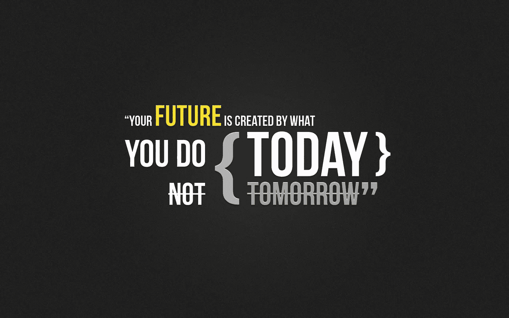
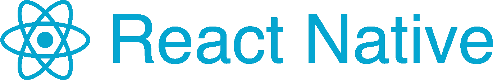
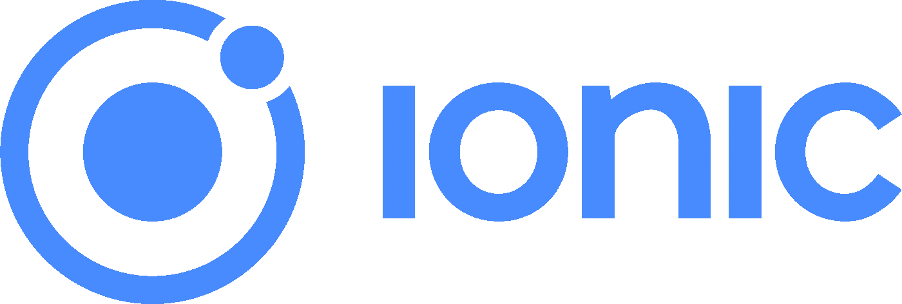

# 对离子反应:比较

> 原文：<https://medium.com/quick-code/the-journey-from-react-native-to-ionic-f9511ec6c76a?source=collection_archive---------1----------------------->

我做混合应用开发者已经快一年了。在此之前，我是一名前端开发人员，我的范围和技能仅限于 HTML CSS 和一些 jQuery。我从来没有尝试过学习 javascript，因为第一次尝试对我来说总是很难。

> 人类有一种处于舒适区的趋势，这种舒适区基本上是一种精神概念及其界限。他们自己建立了一个界限，并且由于现在发展起来的心态，他们从此被限制住在这个界限之内，任何超越这个界限的事情看起来都超出想象，甚至有时是不可能的。

# 过渡到 JavaScript 世界

在我第一次面对 JavaScript 之后，我知道我必须掌握自己的主动权。我做的第一件事是开始阅读不同的教程。过了两个星期，我发现这不是我想要的。我学到了很多东西，但仍然缺少一些东西。然后我意识到我必须制定一个计划。

我决定继续实践我所学到的东西，并开始基于我所学到的东西构建一些小的[项目](https://sudhirkumarojhaa.github.io/Space-war/)，很快谷歌 Chrome 开发者控制台成为了我喜欢的世界。我不知道那里有这么多要学习和探索的东西。很快我就喜欢上了它，console.log 是我最喜欢的测试工具。只是为了增加乐趣，我的控制台中的语句总是很幽默。

# 学习反应自然

我从事 web 开发已经很久了，并且仅限于 Web，直到我遇到 React Native。一个简单的事实是，你可以使用 JavaScript 构建移动应用程序，这让我选择了 React Native，很快我就开始构建简单的应用程序并开始享受它。React Native 对我来说很容易，因为以下几点:

1.  我有 HTML 和 CSS 的想法，所以构建应用程序对我来说很容易。
2.  ES6 和 JSX 去掉了冗长的 JavaScript 代码。
3.  我学会了发展线框，逻辑，甚至有时是概念，我从来没有想过我能做到。
4.  React Native 为您提供了增强代码可重用性的组件概念。

> 我遇到的唯一缺点是它需要 Mac 来运行 iOS 开发的 Xcode，而我没有。:-)

React Native 可以同时提供 Android 和 iOS 应用这一事实并不足以让客户端找到你，因为大多数客户端要么以操作系统为中心，要么害怕使用新技术。一开始就像干旱一样，一直持续到我有了一个与位置跟踪和考勤管理相关的大项目。很有趣。这给了我建立一些小项目的信心。一切都很顺利，但缺乏定期项目导致我学习另一个框架，即离子。

# 向爱奥尼亚移动

Ionic 是唯一一个移动应用堆栈，支持 web 开发人员使用单一代码库为所有主要应用商店和移动 web 构建应用。凭借 Ionic 的平台连续性，您的应用在每台设备上都有宾至如归的感觉。

## 学习离子的优势:

*   免费开源 Github 上的 100%源代码
*   完全跨平台— IOS、Android、Windows、Web、桌面、PWA
*   主要本机插件—摄像头、蓝牙、推送通知
*   一流的文档—清晰一致

学习 ionic 很容易，它带我回到了我的 web 开发时代，拥有同样的风格和代码自由。预先开发的组件提高了速度，甚至 API 或第三方支持也易于集成和实施。

> 学习 Ionic 的主要限制或者说瓶颈是你必须学习 Angular JS 和 web 组件。为了避免这种情况，我浏览了 Angular 和 web 组件中一些主要使用的组件，由于我过去使用聚合物的经验，这些组件变得很容易。:-)

# 结论:

我猜你现在已经看完整篇文章了，一定在这两个或者哪个框架更好更易学之间左右为难。让我很高兴为你做那件事。如果你擅长 JS，并且想学习一些新的独特的东西，那么就去 React Native 吧，因为它不依赖于任何其他框架，并且完全基于 JS。但是如果你的主要目标是开发 web 应用程序和移动应用程序，那么选择 Ionic，因为 Ionic 是唯一一个可以让你方便使用的框架。

## 一些随机的激励词:

所以基本上永远不要低估自己，不断尝试新技术，学习新技术，保持更新。项目的不同主要是基于复杂性、期限，有时甚至是技能。所以你可以做任何事情，开发网站，创建移动应用程序，只要有奉献精神和一些时间计划。避免拖延，很快你就会开始享受你所做的事情，这就是我们所需要的，不是吗？通过我的[网站](http://sudhirkumar.in/)保持联系。

> 通过我的 [github 库](https://github.com/sudhirkumarojhaa)了解更多关于我和我的项目。你也可以查看我在[媒体](/@sudhirKr)发表的其他文章。

## 谢谢，继续学习分享:-)