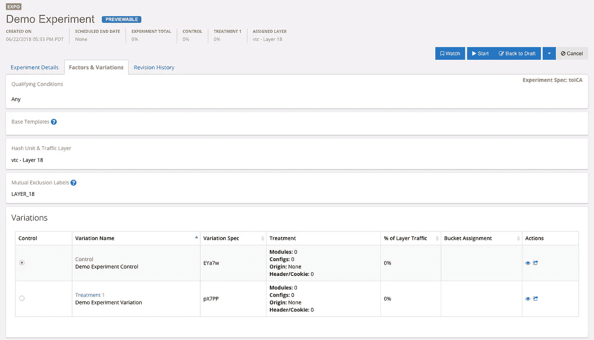
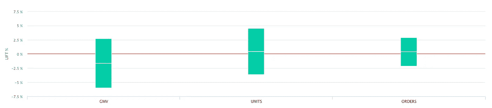

# 沃尔玛实验室的 A/B 测试之旅

> 原文：<https://medium.com/walmartglobaltech/the-journey-of-a-b-testing-at-walmartlabs-3b9bba8e558f?source=collection_archive---------2----------------------->

Image Credit: [holdentrils](https://pixabay.com/en/lab-science-scientific-chemistry-512503/)

如果有人告诉你，你的电子商务网站的改变可能会带来每年数百万美元的收入，你会在意吗？如果这一变化导致收入下降 0.5%，你想知道吗？你想知道之前的影响是由所有的访问者到你的网站吗？在沃尔玛，通过 A/B 测试，我们能够通过对整个网站流量的子集测试新功能和变化，以低风险回答这些问题。

过去几年，我们在沃尔玛进行的 A/B 测试项目经历了曲折。它最终涉及到推动测试的文化转变，Expo 的开发，我们自己的内部 A/B 测试平台，以及开发一个强大的实验过程。

# 自上而下的文化转变

虽然 A/B 测试一直在沃尔玛进行，但它并不是产品开发核心的一部分。这种将实验作为开发生命周期一部分的文化转变是 A/B 测试项目成功的关键，而在 WalmartLabs 建立实验文化的关键之一是管理层的支持。

作为这一转变的一部分，A/B 测试流程和产品开发生命周期已经整合。测试计划的创建和审查是流程的一部分。产品经理和分析师一起定义所需的流量、测量的指标和成功的标准。开发人员与 QA 合作，以确保处理措施得到实施，并对实验的所有变化起到预期的作用。为了保持过程有组织，测试经理协调这些活动，并配置和安排测试。

此外，产品开发现在确保所有新功能都通过 A/B 测试流程推出。开发人员确保他们的代码可以作为实验的一部分运行，并且应用程序平台与 A/B 测试平台相集成。有一个团队专门负责管理实验，并确保它们被成功地定义、执行和分析。本质上，A/B 检测是一等公民。

# 一个属于我们自己的平台

我们 A/B 测试项目成功的另一个关键是我们的内部平台 Expo。为什么我们最终建立了一个内部平台？这实际上并不罕见。有很多公司都有自己的内部实验平台，比如网飞、谷歌和 LinkedIn。一些公司甚至开源了他们的软件，比如脸书和 Intuit。WalmartLabs 一直在使用第三方系统，但它没有与应用平台很好地集成，随着新测试流程的开发，它变得不太适合。通过构建 Expo，我们能够根据我们的需求定制它，开发与平台组件的紧密集成以促进测试开发和设置，并提供更及时和定制的支持。

Expo Experiment Management UI

Expo 是一个服务器端 A/B 测试平台，与我们的应用框架深度集成。它既支持网络应用测试，也支持本地移动应用。该平台包括一个 UI，允许测试经理设置和监控测试以及查看结果。

Expo 与我们的应用程序框架的集成允许应用程序开发人员实现特性，而无需特别考虑 Expo。例如，可以通过我们的配置管理系统将处理实现为特征开关，因为基于实验变化的替代值的覆盖机制在配置管理系统本身内。另一种处理类型通过我们的内容管理系统公开，它实际上不需要开发者的交互，允许网站管理员配置不同的内容与实验相关联。这些集成提供了几个优点。

1.  开发并不复杂，为每个测试定制 A/B 测试平台代码。
2.  测试后可能没有代码清理。
3.  获胜的治疗可以独立于代码改变/部署而被激活
4.  激活所有流量的获胜处理可以在不要求实验连续运行的情况下完成。

虽然构建内部平台需要一定程度的投资，但事实证明这是我们的优势。它允许为我们的 A/B 测试过程构建功能，并帮助将实验构建到开发生命周期中。

# 一切都与数据有关

当有人运行 A/B 测试时，他们期望结果，无论结果是肯定的还是否定的，他们都需要是正确的。我们在构建自己的平台时面临的一个挑战是建立对结果的信任。在强大的产品分析团队和改进的数据管道的支持下，我们得以实现这一目标。

Experiment Results in Expo UI

值得注意的是，Expo 本身并不提供结果报告。我们的平台依赖于通过产品分析团队拥有的系统处理的结果数据。Expo 确实为该管道提供了源数据，该管道给出了会话和访问者的映射，这些会话和访问者被分配到了哪些实验变体，以及哪些实验变体是合格的。它还通过 UI 显示结果，为用户提供从测试设置到结果分析的统一体验。这种关注点的分离也减轻了 Expo 开发团队在 A/B 测试范围之外运行和维护数据管道的负担。

# 经验教训

迄今为止，我们走过的路程并不总是一帆风顺的，但我们已经能够从沿途的颠簸中学到不少东西。

第一个教训是管理层的支持是关键，我们需要使 A/B 测试成为产品开发生命周期的核心部分。虽然有些变革可以自下而上进行，但灌输一种实验文化需要自上而下的方法。

第二个教训是要有一个记录良好的过程，并坚持下去。我们很少允许流程出现例外，这迫使每个人以一致的、定义良好的方式做事。这个过程的一个主要方面是测试计划、期望和结果的交流。

第三个教训是加倍报告，因为没有结果，测试就没有目的。作为其中的一部分，我们花费了额外的精力来验证产生的结果，以确保平台和数据的可信度。为了使过程工作和程序成功，测试和结果需要可靠和可信，否则程序就会被破坏。

最后一个教训是，在开发平台时要有明确的要求，以便我们专注于针对我们需求的功能，这也是我们一开始就构建内部平台的原因之一。此外，问题或需求可能通过过程而不是平台中的变化来解决，重要的是要认识到这一点，并简化我们花时间开发的东西。

沃尔玛实验室的 A/B 测试计划将继续发展，因为我们将继续完善流程和平台，并在更多组织中支持 A/B 测试。