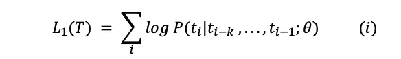
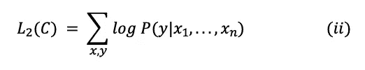
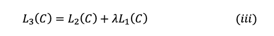

# 开放人工智能 GPT 模型之旅

> 原文：<https://medium.com/walmartglobaltech/the-journey-of-open-ai-gpt-models-32d95b7b7fb2?source=collection_archive---------0----------------------->

Photo Credit : [Image](https://pixabay.com/photos/road-winding-street-bridge-1030789/) by [Free-Photos](https://pixabay.com/photos/?utm_source=link-attribution&utm_medium=referral&utm_campaign=image&utm_content=1030789) from [Pixabay](https://pixabay.com/?utm_source=link-attribution&utm_medium=referral&utm_campaign=image&utm_content=1030789)

OpenAI 的生成式预训练转换器(GPT)模型通过引入非常强大的语言模型，在自然语言处理(NLP)社区掀起了风暴。这些模型可以执行各种自然语言处理任务，如[问题回答](https://en.wikipedia.org/wiki/Question_answering)、[文本蕴涵](https://en.wikipedia.org/wiki/Textual_entailment#:~:text=Textual%20entailment%20(TE)%20in%20natural,hypothesis%20(h)%2C%20respectively.)、文本摘要等。没有任何监督训练。这些语言模型只需要很少甚至不需要例子就能理解任务，并且执行起来相当于甚至优于以监督方式训练的最先进的模型。

在本文中，我们将介绍这些模型的发展历程，并了解它们是如何在两年的时间内发展的。我们将在此讨论以下主题:

1.GPT-1 论文讨论([通过生成性预训练](https://cdn.openai.com/research-covers/language-unsupervised/language_understanding_paper.pdf)提高语言理解)。

2.讨论 GPT-2 论文([语言模型是无监督的多任务学习者](https://cdn.openai.com/better-language-models/language_models_are_unsupervised_multitask_learners.pdf))及其随后对 GPT-1 的改进。

3.讨论 GPT-3 论文[(语言模型很少被学习](https://arxiv.org/pdf/2005.14165.pdf))以及使其成为迄今为止 NLP 见过的最强大的模型之一的改进。

本文假设读者熟悉 NLP 术语和[转换器](https://arxiv.org/abs/1706.03762)架构的基础知识。

让我们从逐一理解这些文件开始。为了使这个旅程更容易理解，我将每篇论文分成四个部分:论文中讨论的目标和概念、使用的数据集、模型架构和实现细节，以及它们的性能评估。

# **通过生成性预训练提高语言理解** (GPT-1):

在这项工作之前，大多数最新的 NLP 模型都是专门针对特定任务进行训练的，如情感分类、文本蕴涵等。使用监督学习。然而，监督模型有两个主要限制:

他们需要大量的带注释的数据来学习一个特定的任务，这通常是不容易得到的。

二。除了他们所接受的训练之外，他们不能概括任务。

本文提出使用未标记数据学习生成语言模型，然后通过提供特定下游任务(如分类、情感分析、文本蕴涵等)的示例来微调该模型。

> 无监督学习用作监督微调模型的预训练目标，因此得名生成性预训练。

让我们浏览一下本文中讨论的概念和方法。

1.**学习目标和概念**:这种用于 NLP 任务的*半监督*学习(无监督预训练，然后监督微调)有以下三个组成部分:

a.**无监督语言建模**(预训练):对于无监督学习，使用标准语言模型目标。

其中 T 是无监督数据{ t1，…，TN }中的特征集，k 是上下文窗口的大小，θ是使用随机梯度下降训练的神经网络的参数。

b.**监督微调**:该部分旨在最大化观察标签 y 的可能性，给定特征或标记 x_1，…，x_n。

其中 C 是由训练示例组成的带标签的数据集。

不是简单地最大化等式(ii)中提到的目标，作者添加了一个 [**辅助学习目标**](#e96b) 用于监督微调，以获得更好的概括和更快的收敛。修改后的培训目标表述为:

其中，L₁(C 是学习语言模型的辅助目标，λ是赋予该辅助学习目标的权重。λ被设置为 0.5。

通过向 transformer 模型添加一个 linear 和一个 softmax 层来获得下游任务的任务标签，从而实现了受监督的微调。

c.**特定于任务的输入转换**:为了在微调过程中对模型的架构做出最小的改变，特定下游任务的输入被转换成有序序列。令牌按以下方式重新排列:

—输入序列中添加了开始和结束标记。

—在示例的不同部分之间添加了分隔符标记，以便输入可以按有序序列发送。对于像问题回答，多项选择问题等任务。每个示例都发送了多个序列。例如，训练示例包括用于问答任务的上下文、问题和答案的序列。

2.**数据集** : GPT 一号使用了[图书语料库](https://yknzhu.wixsite.com/mbweb)数据集来训练语言模型。BooksCorpus 有大约 7000 本未出版的书籍，这些书籍有助于在看不见的数据上训练语言模型。该数据不太可能在下游任务的测试集中找到。此外，这个语料库有大量连续的文本，这有助于模型学习大范围的依赖关系。

3.**模型架构和实现细节** : GPT 一号使用了 12 层的只解码的变换器结构，带掩蔽自注意来训练语言模型。模型的架构在很大程度上保持不变，如关于变压器的[原著](https://arxiv.org/abs/1706.03762)中所述。[屏蔽](#6c42)有助于实现语言模型目标，其中语言模型无法访问当前单词右侧的后续单词。

以下是实现细节:

a.**用于无监督训练**:

*   [字节对编码](#acc9) (BPE)使用了 40，000 个合并的词汇。
*   模型使用 768 维状态将标记编码到单词嵌入中。位置嵌入也在培训中学习。
*   使用 12 层模型，每个自我注意层中有 12 个注意头。
*   对于位置式前馈层，使用 3072 维状态。
*   使用 Adam optimiser，学习率为 2.5e-4。
*   注意、剩余和嵌入辍学用于正规化，辍学率为 0.1。L2 正则化的修改版本也用于无偏倚的权重。
*   使用 GELU 作为激活函数。
*   该模型在大小为 64 和序列长度为 512 的小批量上训练了 100 个时期。该模型共有 117M 个参数。

b.**用于监督微调**:

*   对于大多数下游任务，有监督的微调只需要 3 个时期。这表明模型在预训练期间已经学习了很多关于语言的知识。因此，最小的微调就足够了。
*   来自无监督预训练的大多数超参数用于微调。

4.**绩效与总结**:

> 在与模型进行比较的 12 项任务中，GPT-1 在 9 项任务中的表现优于经过专门训练的监督型最新模型。

这款机型的另一个重大成就是它在各种任务上体面的[****零射击性能****](#b2d9) **。该论文证明了该模型在不同的自然语言处理任务(如问答、模式解析、情感分析等)上的零命中率性能已经得到了发展。由于预先训练。**

**GPT-1 证明语言模型是一个有效的预训练目标，可以帮助模型更好地概括。该架构有助于迁移学习，并且只需很少的微调就可以执行各种 NLP 任务。该模型显示了生成性预训练的力量，并为其他模型开辟了道路，这些模型可以通过更大的数据集和更多的参数更好地释放这种潜力。**

# ****语言模型是无监督的多任务学习器(** GPT-2):**

**GPT-2 模型的发展主要是在使用更大的数据集和向模型添加更多参数以学习更强的语言模型方面。让我们看看 GPT 新协议模型的重大发展和本文中讨论的概念:**

1.  ****学习目标和概念**:以下是本文在 NLP 背景下讨论的两个重要概念。**

*   ****任务条件**:我们已经看到语言模型的训练目标被公式化为 P(输出|输入)。然而，GPT-2 旨在使用相同的无监督模型学习多项任务。为此，学习目标应该修改为 P(输出|输入，任务)。这种修改被称为任务条件化，在这种情况下，模型被期望为不同的任务产生相同输入的不同输出。一些模型在架构级别实现任务调节，其中模型被输入和任务两者。对于语言模型，输出、输入和任务都是自然语言的序列。因此，通过向模型提供示例或自然语言指令来执行任务，来执行语言模型的*任务条件。任务条件形成了零射击任务转移的基础，我们将在下面讨论。***
*   ****零镜头学习和零短任务转移**:GPT 2 的一个有趣的能力是[零镜头任务转移](#21cf)。[零触发学习](#b2d9)是零触发任务转移的一种特殊情况，在这种情况下，没有提供任何示例，模型根据给定的指令理解任务。GPT 2 号的输入不是像 GPT 1 号那样重新安排序列，而是以一种期望模型理解任务的性质并提供答案的格式给出的。这样做是为了模拟零射击任务转移行为。例如，对于英语到法语的翻译任务，给模型一个英语句子，后跟单词法语和提示(:)。该模型应该理解这是一个翻译任务，并给出英语句子的法语对应物。**

**2.**数据集**:为了创建一个广泛且高质量的数据集，作者们抓取了 Reddit 平台，并从高投票率文章的出站链接中提取数据。由此产生的名为 WebText 的数据集包含来自 800 多万个文档的 40GB 文本数据。该数据集用于训练 GPT-2，并且与用于训练 GPT-1 模型的图书语料库数据集相比是巨大的。由于许多测试集包含维基百科文章，所有维基百科文章都从网络文本中删除。**

**3.**模型架构和实现细节** : GPT 二号有 15 亿个参数。这比 GPT 1 号(117 米参数)多 10 倍。与 GPT 1 号的主要区别是:**

*   **GPT-2 有 48 层，使用 1600 维向量来嵌入单词。**
*   **使用了 50，257 个标记的更大词汇表。**
*   **使用了 512 的较大批量和 1024 个令牌的较大上下文窗口。**
*   **层标准化被移动到每个子块的输入，并且在最终自关注块之后添加了附加层标准化。**
*   **初始化时，残差层的权重按 1/√N 进行缩放，其中 N 是残差层的数量。**

**作者用 117M(与 GPT-1 相同)、345M、762M 和 1.5B (GPT-2)的参数训练了四个语言模型。每一个后续的模型都比前一个模型更容易混淆。*这确立了同一数据集上语言模型的* [*困惑度*](#0d4b) *随着参数个数的增加而减小。*此外，参数数量最多的模型在每个下游任务中表现更好。**

**4.**表现和总结** : GPT-2 在几个下游任务数据集上进行了评估，如阅读理解、总结、翻译、问题回答等。让我们来看看其中的一些任务以及 GPT 2 号在这些任务上的表现:**

*   **GPT-2 在零触发设置中为 8 个语言建模数据集中的 7 个改进了当时现有的最先进水平。**
*   **[儿童图书数据集](https://arxiv.org/pdf/1511.02301.pdf)评估语言模型在名词、介词、命名实体等词类别上的性能。GPT-2 将常用名词和命名实体识别的最新准确率提高了约 7%。**
*   **[LAMBADA](https://arxiv.org/abs/1606.06031) 数据集评估模型在识别长期依存关系和预测句子最后一个单词方面的性能。GPT-2 将困惑度从 99.8 降低到 8.6，并显著提高了准确性。**
*   **GPT-2 在阅读理解任务中的表现优于四个基线模型中的三个。**
*   **在法语到英语的翻译任务中，GPT-2 在零镜头设置方面比大多数无监督模型表现得更好，但并不优于最先进的无监督模型。**
*   **GPT-2 在文本摘要方面表现不佳，其性能类似于或低于为摘要而训练的经典模型。**

> **GPT-2 能够在零触发的 8 个测试语言建模数据集的 7 个上实现最先进的结果。**

**GPT-2 表明，在更大的数据集上进行训练和拥有更多的参数提高了语言模型理解任务的能力，并超过了零镜头设置中许多任务的最先进水平。该论文指出，随着模型容量的增加，性能以对数线性方式增加。此外，语言模型的复杂度下降并没有表现出饱和，而是随着参数数量的增加而持续下降。事实上，GPT-2 不适合网络文本数据集，更多时间的训练可以进一步减少困惑。这表明 GPT-2 的模型大小不是极限，建立更大的语言模型将减少困惑，并使语言模型在自然语言理解方面更好。**

# ****语言模型很少镜头学习者** (GPT-3):**

**为了寻求建立非常强大的语言模型，这种模型不需要微调，只需要很少的演示就可以理解并执行任务，Open AI 建立了具有 1750 亿个参数的 GPT-3 模型。这个模型的参数比微软强大的图灵 NLG 语言模型多 10 倍，比 GPT-2 多 100 倍。由于大量的参数和广泛的数据集 GPT-3 已被训练，它在零炮和少炮设置的下游 NLP 任务中表现良好。由于它的大容量，它具有写文章的能力，很难与人类写的文章区分开来。它还可以执行从未明确训练过的即时任务，如对数字求和、编写 SQL 查询和代码、解读句子中的单词、根据任务的自然语言描述编写 React 和 JavaScript 代码等。让我们了解一下新 GPT 协议中提到的概念和发展，以及该模型的一些更广泛的影响和局限性:**

1.  ****学习目标和概念**:让我们讨论一下本文中讨论的两个概念。**

*   ****情境学习**:大型语言模型使用它们接受训练的文本数据开发模式识别和其他技能。在学习预测给定上下文单词的下一个单词的主要目标时，语言模型也开始识别数据中的模式，这有助于它们最小化语言建模任务的损失。后来，这种能力在零射击任务转移期间帮助模型。当只有很少的例子和/或它需要做什么的描述时，语言模型将这些例子的模式与它过去从类似数据中学到的知识相匹配，并使用这些知识来执行任务。这是大型语言模型的强大功能，随着模型参数数量的增加而增加。**
*   ****少拍、单拍和零拍设置**:如前所述，少拍、单拍和零拍设置是零拍任务转移的特例。在少镜头设置中，为模型提供任务描述和尽可能多的适合模型上下文窗口的例子。在一次设置中，模型仅提供一个示例，而在零次设置中，不提供任何示例。随着模型容量的增加，模型的少炮、一炮和零炮能力也随之提高。**

**2.**数据集** : GPT-3 在五个不同的语料库上进行训练，每个语料库都有一定的权重。高质量的数据集被更频繁地采样，并且模型在其上被训练超过一个时期。使用的五个数据集是 Common Crawl、WebText2、Books1、Books2 和 Wikipedia。**

**3.**模型和实现细节**:GPT 三号的架构与 GPT 二号相同。与 GPT-2 的几个主要区别是:**

*   **GPT-3 有 96 层，每层有 96 个注意头。**
*   **GPT-3 的单词嵌入量从 GPT-2 的 1600 增加到 12888。**
*   **上下文窗口大小从 GPT-2 的 1024 个令牌增加到 GPT-3 的 2048 个令牌。**
*   **使用亚当优化器，β_1=0.9，β_2=0.95，ε= 10^(-8).**
*   **交替密集和局部带状稀疏注意模式被使用。**

**4.**性能和总结** : GPT-3 在一系列语言建模和自然语言处理数据集上进行了评估。对于语言建模数据集，如 LAMBADA 和 Penn Tree Bank，GPT-3 在少镜头或零镜头设置下的表现优于当前水平。对于其他数据集，它无法击败最先进的技术，但改善了零炮最先进的性能。GPT-3 在自然语言处理任务中也表现得相当好，如闭卷问答、模式解析、翻译等。，经常击败最先进的或性能可媲美微调模型。对于大多数任务，与一次和零次拍摄相比，该模型在少量拍摄设置中表现更好。**

**除了在传统的自然语言处理任务上对模型进行评估之外，还在算术加法、单词解读、新闻文章生成、学习和使用新单词等综合任务上对模型进行了评估。对于这些任务，性能也随着参数数量的增加而增加，并且该模型在少镜头设置中的性能优于一次和零镜头设置。**

**5.**局限性和更广泛的影响**:本文讨论了 GPT-3 模型的几个弱点和有待改进的地方。让我们在这里总结一下。**

*   **虽然 GPT-3 能够产生高质量的文本，但有时它在形成长句和一遍又一遍地重复文本序列时开始失去连贯性。此外，GPT-3 在自然语言推理(确定一个句子是否暗示另一个句子)、填空、一些阅读理解任务等任务上表现不佳。该论文引用 GPT 模型的单向性作为这些局限性的可能原因，并建议在这种规模下训练双向模型来克服这些问题。**
*   **该论文指出的另一个限制是 GPT-3 的通用语言建模目标，该目标对每个标记进行同等加权，并且缺乏标记的面向任务或目标的预测的概念。针对这一点，本文提出了增加学习目标、使用强化学习来微调模型、增加其他模态等方法。**
*   **GPT-3 的其他限制包括由于其沉重的架构而导致的从模型进行复杂和昂贵的推理，语言和模型生成的结果的可解释性较差，以及关于什么帮助模型实现其少量学习行为的不确定性。**
*   **除了这些限制之外，GPT-3 还具有滥用其类人文本生成能力进行网络钓鱼、垃圾邮件、传播错误信息或进行其他欺诈活动的潜在风险。此外，由 GPT-3 生成的文本具有它所训练的语言的偏见。GPT-3 生成的文章可能有性别、民族、种族或宗教偏见。因此，谨慎使用这些模型并在使用之前监控它们生成的文本变得极其重要。**

## ****结局注**:**

**本文通过三篇论文总结了 OpenAI GPT 模型的发展历程及其演变。这些模型无疑是非常强大的语言模型，通过仅使用指令和少量示例执行大量任务，彻底改变了自然语言处理领域。尽管这些模型在自然语言理解方面还不能与人类相提并论，但它们无疑为实现这一目标指明了前进的方向。**

## ****词汇:****

1.  **辅助学习目标是与主要学习目标一起学习的附加训练目标或任务，通过使模型更通用来提高模型的性能。这篇[论文](https://arxiv.org/abs/1704.07156)提供了这个概念的更多细节。**
2.  **屏蔽指的是用一些其他虚拟标记来移除或替换句子中的单词，使得模型在训练时无法访问这些单词。**
3.  **字节对编码是一种数据压缩技术，其中频繁出现的连续字节对被替换为数据中不存在的字节，以压缩数据。为了重建原始数据，使用包含替换字节映射的表。这篇[博客](https://towardsdatascience.com/byte-pair-encoding-the-dark-horse-of-modern-nlp-eb36c7df4f10)详细解释了 BPE。**
4.  **零镜头学习或行为指的是一个模型在过去没有看到任何这种例子的情况下执行任务的能力。在零镜头学习期间没有梯度更新发生，并且模型应该理解任务而不看任何例子。**
5.  **零镜头任务迁移或元学习指的是在很少或没有例子的情况下呈现模型的设置，以使其理解任务。术语零炮来自于不执行梯度更新的事实。模型应该理解基于例子和指令的任务。**
6.  **困惑是语言模型的标准评估标准。困惑是测试集的逆概率，它由测试集中的字数归一化。具有较低复杂度的语言模型被认为比具有较高复杂度的语言模型更好。阅读[这篇](https://towardsdatascience.com/perplexity-in-language-models-87a196019a94)博客，了解更多关于困惑的解释。**

****参考文献:****

1.  **拉德福德，a .，纳拉辛汉，k .，萨利曼斯，t .和苏茨基弗，I .，2018 年。通过生成性预训练提高语言理解能力。**
2.  **a .、Wu、j .、Child、r .、Luan、d .、Amodei、d .和 Sutskever，I .，2019 年。语言模型是无人监督的多任务学习者。 *OpenAI 博客*， *1* (8)，第 9 页。**
3.  **布朗，汤姆·b，本杰明·曼，尼克·赖德，梅勒妮·苏比亚，贾里德·卡普兰，普拉富拉·达瑞瓦尔，阿尔温德·尼拉坎坦等人《语言模型是很少出手的学习者》 *arXiv 预印本 arXiv:2005.14165* (2020)。**
4.  **Rei，m，2017。用于序列标记的半监督多任务学习。 *arXiv 预印本 arXiv:1704.07156* 。**
5.  **Waswani，a .，Shazeer，n .，Parmar，n .，Uszkoreit，j .，Jones，l .，Gomez，A.N .，Kaiser，l .和 Polosukhin，I .，2017 年。你需要的只是关注。在*辊隙*中。**

**注意:为了简洁起见，博客的链接在参考文献中没有重复。**