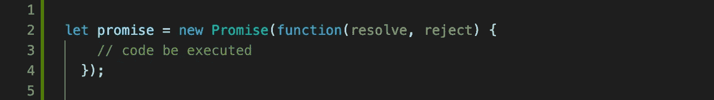
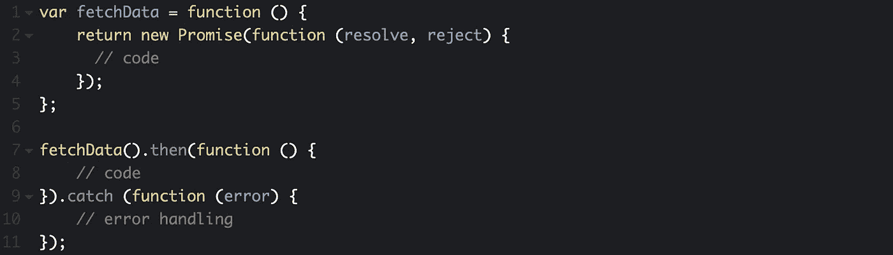
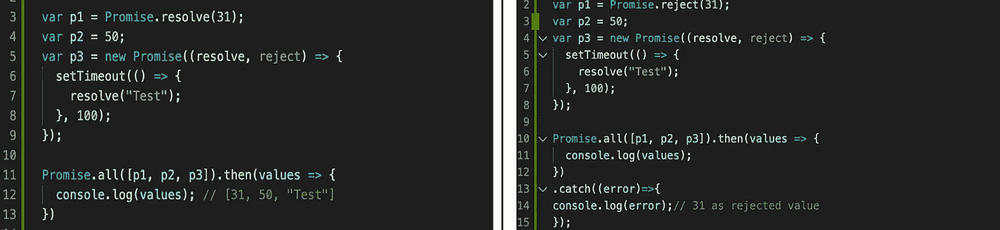
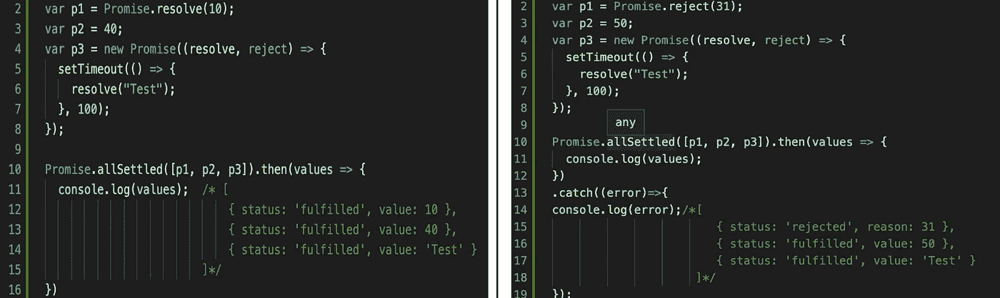
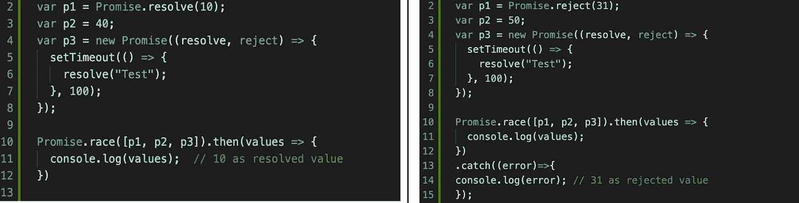
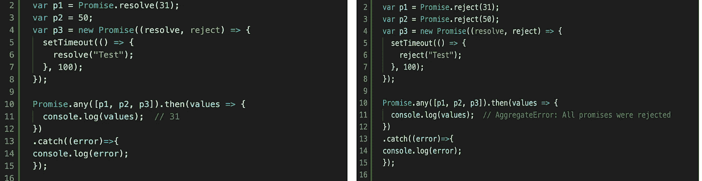
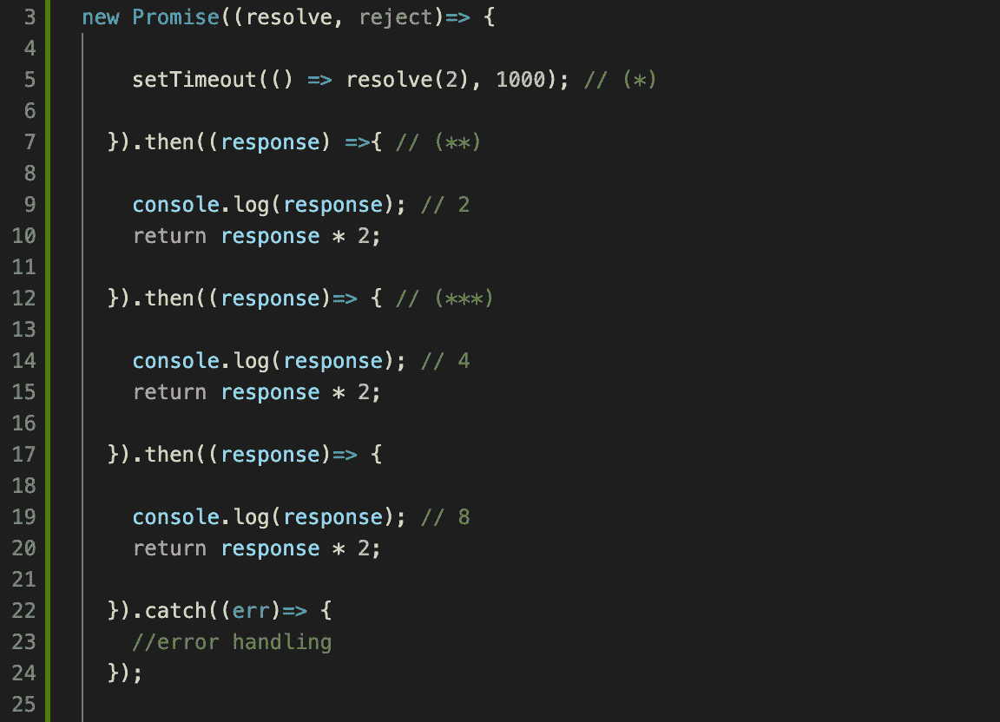
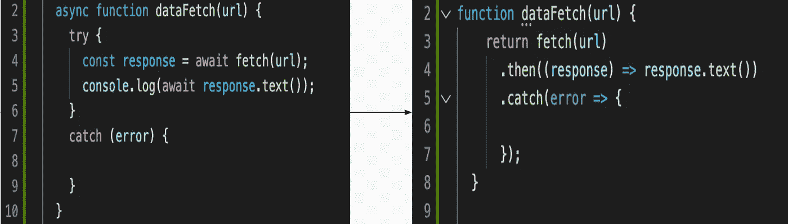
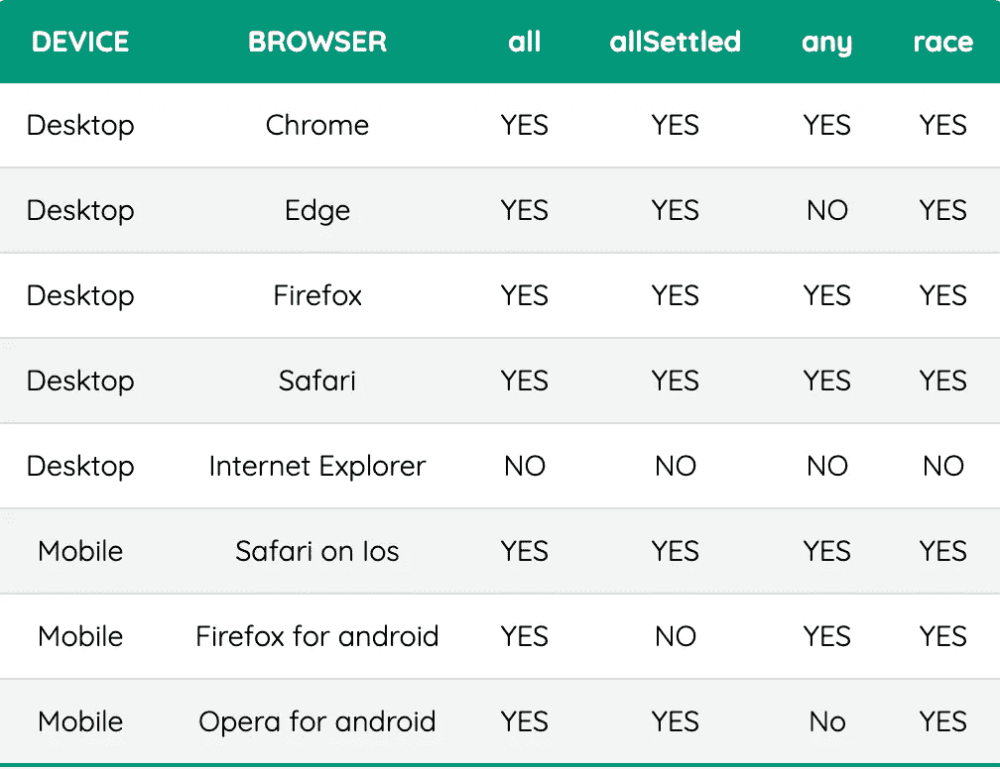

# JS 彩虹桥——关于承诺，我们需要知道的一切

> 原文：<https://medium.com/globant/the-js-bifrost-all-that-we-need-to-know-about-promises-2c7b087b56f3?source=collection_archive---------1----------------------->

## 理解承诺及其解决实际应用问题陈述的方法

欢迎回到“JS Bifrost ”,这是您通向神级 JavaScript 的坚实基础的道路。这是本系列的下一篇文章。我们关注的焦点是 javascript 中的**承诺及其方法**

一个**承诺**是一个对象，用来表示一个异步任务的最终**完成**或**失败**。它将产生一个**值**作为结果。

有点困惑不是吗？？？让我们用通俗的语言来理解。

Photo by [bruce mars](https://unsplash.com/@brucemars?utm_source=medium&utm_medium=referral) on [Unsplash](https://unsplash.com?utm_source=medium&utm_medium=referral)

我们可以说，承诺是某种协议，如果满足某个条件，它将被履行或拒绝。此外，与其马上去做，不如在不久的将来给予价值。

> **注:****IPL**(印度超级联赛)是印度职业 20 人板球联赛。

让我们用一个 IPL(**I****P**romise '**ll**)拍卖的例子来理解承诺

当一个球队在 IPL 拍卖中买下某个球员时，让我们说 Virat Kohli 希望，那个球员会为他们表演并赢得比赛。我们可以说玩家**承诺**某个特权，他会得分。比赛结束后，如果该玩家得分跑赢，我们可以说该承诺**履行**或**解决**相反，如果他不能按预期得分跑赢，我们可以说该承诺**被拒绝**或未履行**。**

## 承诺是如何运作的？

当玩家进来的时候 **IPL 拍卖**让我们说帕特康明斯与一些开始**基地**价格说 **2 亿卢比**。**多个加盟店** ( **KKR、、、**等。)可以同时为该播放器出价，该出价应该高于底价，比如 2.5 cr、4.5 cr、13cr 等。这个**投标**的过程我们可以说是**异步**任务，同时多个投标我们可以说是多个任务并行运行，其中包括 KKR( **承诺)**、MI( **回调)、**等。在**多次**出价后，一家特许经营公司说 **KKR** 出价最高说 13cr 我们可以说 KKR 将得到该球员**承诺**得到**解决**成功。

## 如何创造一个承诺？

现在我们已经理解了承诺的概念，让我们深入研究一下如何在 JS 中实现它。

一个承诺可以有以下几种状态

1.  悬而未决的
2.  感到满足的
3.  拒绝

让我们用一个板球的例子来理解这些状态，比如说 **IPL** **狂热**正处于顶峰。

Photo by [Alessandro Bogliari](https://unsplash.com/@theinfluencermarketingfactory?utm_source=medium&utm_medium=referral) on [Unsplash](https://unsplash.com?utm_source=medium&utm_medium=referral)

在板球比赛中，当任何一个队接受检查时，它将处于**等待**状态，直到时间裁判检查必要的东西(球棒边缘等)。)，过了一段时间，当裁判对这个决定完全有把握时，他就会做出决定，宣布出界/不出界。获得对他们有利的决定的团队为出局/不出局，我们可以说被评审的决定为**满足**，如果不为**拒绝**或失去对各自团队的评审。

承诺提供了处理**已解决** / **已拒绝**状态的方法。

1.  然后
2.  捕捉

当一个承诺被成功解决时，它将调用**。then()** 方法，在这里我们可以执行一些操作，比如返回 resolve。另一方面，如果我们得到一个错误作为响应，那么**。catch()** 方法将被调用。

在上面的例子中，我们从 fetchData 方法中返回一个 promise 对象，该方法将 **resolve** 和 **reject** 作为回调。如果承诺成功达成**。然后()**方法将被调用，或者如果它得到**拒绝**或者发生了一些错误，那么**。catch()** 方法将被调用。

## 承诺。所有

它接受一个承诺的**数组**或**可迭代**作为输入，并将结果作为单个承诺返回。当**我们通过的所有**承诺都将成功**解决**时，我们最终得到的这个承诺才会**解决**。另一方面，如果我们作为输入传递给 P**promise . all**方法的任何承诺被**拒绝**或**出错**输出，那么我们得到的结果也是承诺被**拒绝**。

在上面的例子中，我们声明了三个承诺 **p1** 、 **p2** 、 **p3、**，并将它们作为数组传递给 **Promise.all** 方法，当所有承诺都成功解析时，我们得到的结果将是一个值数组。另一方面，如果作为 Promise.all 方法的输入传递的任何承诺被拒绝或出错，则结果是被拒绝的承诺。

## **诺言.一切都谈妥了**

它以一个承诺的**数组**或**可迭代的**作为输入，并将返回输出作为每个 **承诺**的**的承诺对象，无论它是被**解决**还是被**拒绝。**当我们希望**我们作为输入传递的所有承诺**彼此**独立**时，这种方法很有用。**

在上面的例子中，我们声明了三个承诺 p1、p2、p3，并将它们作为一个数组传递给 **Promise.allSettled** 方法，这是我们得到的结果当所有承诺都成功解析时，我们将得到一个**数组**或一个包含每个**承诺**的**状态**和**值**的对象。另一方面，如果任何承诺得到**出错**或**拒绝**那么我们将得到那个，结果，就像右边的例子**状态**我们得到的是作为**拒绝**和作为值 **31** 的原因。

## **无极.竞**

它将一个承诺的**数组**或**可迭代**作为输入，并将结果作为单个承诺返回，无论该承诺是**履行的** / **解决的**还是**拒绝的**无论哪一个先可用，我们都将得到那个**承诺**作为结果。

在上面的例子中，我们声明了三个承诺 **p1** ， **p2** ， **p3，**并将它们作为一个数组传递给 **Promise.race** 方法当任何承诺成功得到**resolve**时，我们将得到的结果作为一个响应，就像在左边的例子中，我们将得到 **10** 作为 **resolved** 值。另一方面，如果任何承诺被**出错**或**拒绝**，那么我们将得到的结果就像右边的例子一样，我们将**拒绝的**承诺作为值 **31** 。

## **承诺**

它将一个承诺的**数组**或**可迭代**作为输入，并将结果作为一个**单个**承诺返回，其中**用来自承诺的值解析**。如果作为输入传递的所有承诺都被**拒绝**，那么我们将得到 **AggregateError** (它是由**单个**错误包装的**多个**错误的集合)作为输出。

在上面的例子中，我们声明了三个承诺 **p1** 、 **p2** 、 **p3、**并将它们作为一个数组传递给 **Promise.any** 方法当任何承诺成功解析时，我们将得到的结果作为一个响应，就像在左边的例子中一样，我们将得到 **31** 作为**解析的**值。另一方面，如果所有承诺都得到**出错的**或**被拒绝的**，那么我们将得到**合计错误，**结果**，**就像示例右侧的所有承诺都被**拒绝**。

## **承诺链**

当我们需要调用多个相关的异步调用时，其中一个调用的结果是另一个调用的输入，以此类推。从一个承诺调用另一个承诺的过程称为承诺链。

在上面的例子中，我们使用的是倍数**。然后()**方法得到多个解析方法的响应，最后得到最终响应结果。万一我们出错或者任何承诺被**拒绝**，我们可以通过**来处理。【catch()方法。**

## 承诺 vs 异步/等待

开发人员中有一个常见的误解，即 async/await 与承诺不同。

**警惕！**但它们是**而不是**引擎盖下的**异步/等待**使用**承诺**起作用。下面是 async-await 的一个例子。

但是 **async/await** 确实让开发人员在编写复杂逻辑或同时处理多个异步调用时更加轻松。同时管理**多个** **承诺**或**承诺** **链接**调用总是令人厌倦的，这就是我们通过使用 **async/await 可以获得的主要优势。让我们通过例子来理解这一点。**

## **承诺及其不同方法的浏览器兼容性**

> all(可迭代)，allSettled(可迭代)，any(可迭代)，race(可迭代)

# 收场白

## *同步编程模式*

当您调用执行长时间运行的操作的函数时，它只在操作完成时返回，并且可以返回结果。这将在动作进行期间停止您的程序。

## *异步*编程模式

这种模式允许多件事情同时发生。当你开始一个动作时，你的程序继续运行。当动作完成时，程序得到通知并访问结果(例如，从磁盘复制数据)。

> “谁能在泥淖沉淀时静静地等待？谁能在行动前保持不动？”
> 
> —老子，道德经

通过承诺、表示未来可能完成的动作的对象以及`async`函数，异步编程变得更加容易，这些函数允许您编写一个异步程序，就像它是同步的一样。

我希望这篇文章是有用的，帮助你理解承诺和它的方法对你写无错误代码的有用性。感谢阅读！

更多敬请关注我们下面的'***JS 彩虹桥*** '！！

 [## JS 双花聚结(？？)运算符

### what-why-how 无效合并运算符以及链接和逻辑运算

medium.com](/globant/the-js-bifrost-nullish-coalescing-operator-6ac55e59f61f)  [## JS Bifrost——Javascript 中的 Currying 函数

### JS 的世界

medium.com](/globant/the-js-bifrost-currying-functions-in-javascript-e03a216b4b59)  [## JS 彩虹糖——浅拷贝还是深拷贝？

### 复制数据都是关于值、引用和内存分配的

medium.com](/globant/the-js-bifrost-shallow-or-deep-copy-22144e6787d6)  [## 带有 JavaScript 函数的更干净的代码

### 了解纯函数和高阶函数来编写最先进的代码！

medium.com](/globant/cleaner-code-with-javascript-functions-d08d3bb37836)  [## JS 彩虹桥——理解称为(IIFE)的编码模式

### 最受欢迎的函数表达式习语

medium.com](/globant/the-js-bifrost-understanding-the-coding-pattern-called-iife-794b46006550)  [## JS 彩虹糖——就是它了！

### 使迭代或递归函数更加优化的编程实践

medium.com](/globant/the-js-bifrost-memoization-it-is-65f890f14308)  [## JS Bifrost——不可思议的 JavaScript 特性

### 您应该在项目中开始使用的 7 个 Javascript 特性

medium.com](/globant/the-js-bifrost-incredible-javascript-features-587b78865e67)  [## JS 彩虹桥——回调地狱

### 你需要知道如何应对这个地狱，如何超越陈词滥调！

medium.com](/globant/the-js-bifrost-callback-hell-4c699e1954b8)  [## JS 彩虹桥——回调地狱

### 你需要知道如何应对这个地狱，如何超越陈词滥调！

medium.com](/globant/the-js-bifrost-callback-hell-4c699e1954b8) 

## **参考文献**

[eloquentjavascript.net](https://eloquentjavascript.net/)

[developer.mozilla.org](https://developer.mozilla.org/)

[javascript.info](https://javascript.info/)