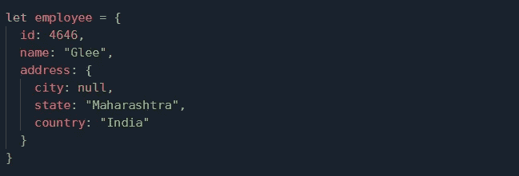
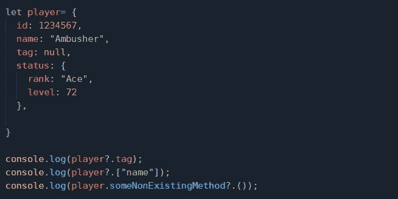
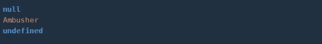
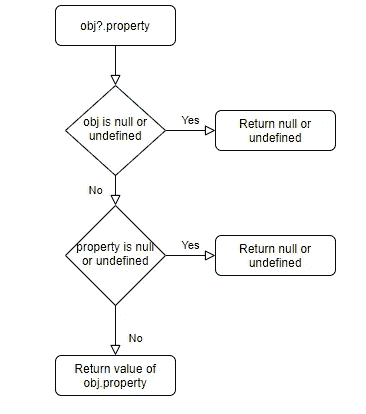

# JS 双行符—可选的链接操作符(？。)

> 原文：<https://medium.com/globant/the-js-bifrost-optional-chaining-operator-ccb6bbdd2c35?source=collection_archive---------2----------------------->

## 简单方便地访问嵌套对象属性…

欢迎来到 JS Bifrost 的世界，你正在深入到 JavaScript 的启蒙世界。这是本系列的下一篇文章。我们将讨论 JavaScript 中新引入的操作符—“**可选链接**”。


当我们处理-
**数据时会发生什么——容易遍历。**
**嵌套数据—很少难以遍历。
数据中更多层次的嵌套——遍历起来很痛苦；更多的代码行。**

啊啊……工作太多？？？😰


坚持住。**可选链接**来救你！！！

**可选链接操作符**现已引入 JavaScript，并包含在 ES2020 中。

# 什么是可选链接(？。) ?？

可选链接是 JavaScript 的一个新特性，它有助于轻松访问嵌套对象的属性。


> **可选链接是通过使用？(问号)还有。(点)运算符。**

在深入到**可选链接**的实现之前，让我们先了解一下 **null** 和 **undefined** 的概念，以便清楚地理解可选链接运算符。

考虑`player`对象的例子

```
let player = {id: 1234567,name: "AMBUSHER",tag: null}
```

**空:**

`null`值表示*无值*，即提到的“**空**字。**" "(空白字符串)或空格不是空值**。 ***未输入任何内容(留空)的记录或字段为空值。***

例如`tag`房产是一个`null`

**未定义:**

`undefined` 指 ***未定义或不存在的属性、对象或值。***

例如`rewards`是`player`对象中不存在的`undefined`属性

现在，我们知道了`null`和`undefined`，让我们看看如何使用它。

# 怎么用？？

使用 `?.` 操作符，我们可以**遍历深度嵌套的对象。**

有三种语法:

`1\. obj?.property`

返回 `obj` **的**属性，如果** `obj` **存在**，否则*返回 null 或未定义。***

`2\. obj?.[property]`

这个语法就像第一个语法一样*，但是在这种情况下，**属性应该总是在方括号中用双引号(‘propName’)或单引号(‘propName’)引用**。*

`3\. obj?.method()`

**调用** `obj` **的方法()，如果**`obj`**存在，否则*返回空或未定义。***

**我们也可以把这个语法写成`obj.method?.()`。**

**现在我们已经熟悉了可选链接的**语法，让我们一步一步地理解它的**验证**:****

1.  **如果 o *对象*是**不存在**，那么它将 ***返回为未定义。*****

**2.如果*对象*是作为提到的**，那么 ***输出为空。*******

**3.如果*对象*是**存在**，那么**检查对象的属性是否为空或者未定义。**如果***属性未定义或者*** 为空，那么 ***返回属性或者方法调用的值。*****

**我们已经看到了使用可选链接操作符(`?.`)的所有方法，让我们理解它是如何工作的..？？**

# **它是如何工作的？？**

**可选链接运算符**检查** `**?.**` **运算符前的对象是否为空或未定义。****

**如果对象 ***不为空或者未定义*** 那么它将 ***检查*** `***?.***` ***运算符后提到的对象的属性。*** 如果**是有效的，那么它将 ***返回属性值，否则为空或未定义。*******

****使用`obj?.property`语法****

****考虑一个具有*属性 id、名称、地址(包括城市、州、国家)的`employee`对象的例子。*****

********

****下面的例子考虑一个上面的`employee`对象。****

****在上面的例子中，它检查`employee`对象是`null`还是`undefined`。*如果通过，它将在？。运算符*，否则 ***将根据其值返回*** `***null***` ***或*** `***undefined***` ***。*******

****示例 1:****

********

****在示例 1 中，检查`employee`对象是否存在。*当它出现在这里时，它将继续检查同样可用的* `*name*` *属性。*那么**输出的将是** `**name**` **属性的值，即“Glee”。******

****示例 2:****

********

****在示例 2 中，首先检查`employee`对象是否存在，*它存在，因此它检查再次出现在那里的地址属性/对象*，然后它*检查用户没有输入的城市属性(这意味着城市是空的)*。这就是为什么**返回为** `**null**` **。******

****示例 3:****

********

****在示例 3 中，此*与前一个一样工作，首先检查雇员对象，然后检查地址属性或对象*，然后检查*中未在地址对象中定义的 pinCode 属性。这就是为什么**它返回未定义。*******

****截至目前，我们已经看到了**如何实现可选链接**，是不是远比我们想象的要简单……？？🤗****

********

******让我们看看其他两种语法的实现…******

****考虑一个`player`对象的例子，它具有类似 *id、名称、标签、状态的属性(包括等级和级别属性)。*****

******例子******

********

******输出:******

********

****在上面的例子中，我们**使用了所有 3 种语法**，让我们一个一个理解。****

```
**player?.tag**
```

****在第一种情况下，`player`对象**存在，**因此它**检查玩家对象的** `**tag**` **属性。**标签属性是**定义的**，但是**为空**(没有赋值)。这就是为什么**返回空值。******

```
**player?.["name"]**
```

****在第二种情况下，**属性在方括号[]中用双引号(" ")**表示。这里，`**player**` **对象存在****名称属性也可用**带值“**伏击者”**。然后**作为*伏击者返回。*******

```
**player.someNonExistingMethod?.()**
```

****在第三种情况下，**我们使用方法作为属性，并调用方法**。这里，首先**检查** `player` **对象**的可用性，然后**检查未定义的** `someNonExistingMethod**()**`命名属性**。**这就是为什么**返回未定义。******

****我们也可以将上述语句写成`player?.someNonExistingMethod()`。它将给出与上述语句相同的结果。****

> *******如果方法()在 object 中定义，我们通过*** `*player.methodName?.()*` ***或*** `*player?.methodName()*` ***来访问它，那么它就会执行。*******

******如何访问嵌套对象属性******

****在上面的例子中，我们可以将`rank`访问为`player?.status?.rank`或`player.status?.rank`，它将**返回等级值，即** " **Ace** "。****

****正如我们已经看到的所有类型的语法的实现，它非常容易理解和实现。**如果你对可选链接没有清晰的了解，让我们用图解法来看看……******

********

****How Optional Chaining works??****

****上面的流程图清楚地显示了可选链接。如果 obj 不为空或未定义，只有这样才能进行属性检查。这同样适用于嵌套的对象。****

********

****既然我们已经深入理解了**可选链接操作符**，希望你会发现它简单且易于实现。****

# ****结论****

****通过使用`?.`操作符，可选链接是遍历复杂嵌套对象的简单易行的方法。**问号？句号。使事情像往常一样排序**，它也发生在可选链接中😄。****

*****有时问题看起来更复杂、更困难，但当我们深入研究时，它会比我们想象的更容易，我们会让它成为可能。无论问题有多复杂，我们都能找到解决方案****……*******

****如果你喜欢看这篇文章，请分享:)谢谢。****

****探索“ ***The JS Bifrost*** ”以获得更多的 JavaScript 系列文章！！！****

****[](/globant/cleaner-code-with-javascript-functions-d08d3bb37836) [## 带有 JavaScript 函数的更干净的代码

### 了解纯函数和高阶函数来编写最先进的代码！

medium.com](/globant/cleaner-code-with-javascript-functions-d08d3bb37836) [](/globant/the-js-bifrost-nullish-coalescing-operator-6ac55e59f61f) [## JS 双花聚结(？？)运算符

### what-why-how 无效合并运算符以及链接和逻辑运算

medium.com](/globant/the-js-bifrost-nullish-coalescing-operator-6ac55e59f61f) [](/globant/the-js-bifrost-shallow-or-deep-copy-22144e6787d6) [## JS 彩虹糖——浅拷贝还是深拷贝？

### 复制数据都是关于值、引用和内存分配的

medium.com](/globant/the-js-bifrost-shallow-or-deep-copy-22144e6787d6) [](/globant/the-js-bifrost-memoization-it-is-65f890f14308) [## JS 彩虹糖——就是它了！

### 使迭代或递归函数更加优化的编程实践

medium.com](/globant/the-js-bifrost-memoization-it-is-65f890f14308) [](/globant/the-js-bifrost-incredible-javascript-features-587b78865e67) [## JS Bifrost——不可思议的 JavaScript 特性

### 您应该在项目中开始使用的 7 个 Javascript 特性

medium.com](/globant/the-js-bifrost-incredible-javascript-features-587b78865e67) [](/globant/the-js-bifrost-understanding-the-coding-pattern-called-iife-794b46006550) [## JS 彩虹桥——理解称为(IIFE)的编码模式

### 最受欢迎的函数表达式习语

medium.com](/globant/the-js-bifrost-understanding-the-coding-pattern-called-iife-794b46006550) 

# 参考

[https://developer . Mozilla . org/en-US/docs/Web/JavaScript/Reference/Operators/Optional _ chaining](https://developer.mozilla.org/en-US/docs/Web/JavaScript/Reference/Operators/Optional_chaining)

[https://javascript.info/optional-chaining](https://javascript.info/optional-chaining)****