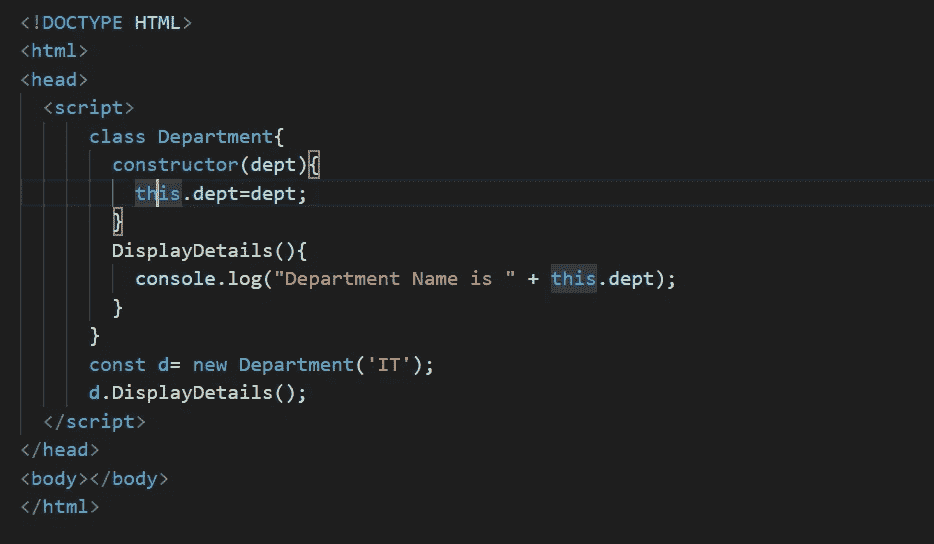
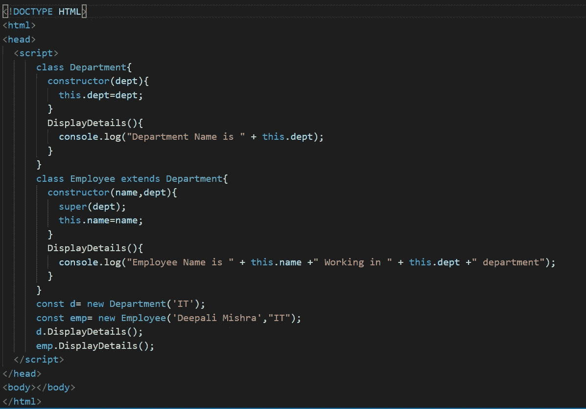
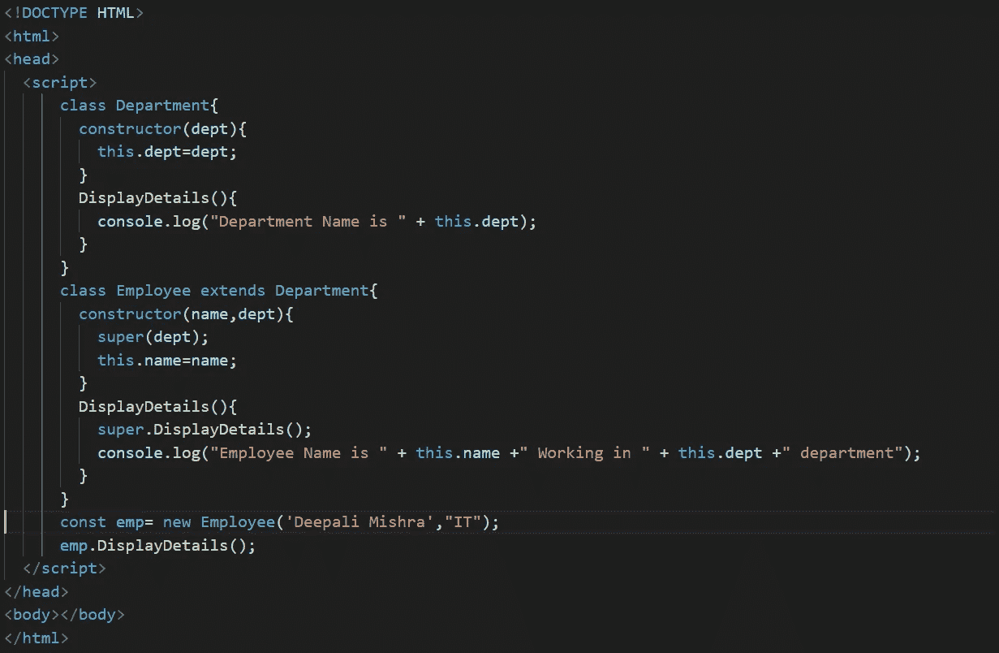

# JS 双花 ES6 方式的“多态性”

> 原文：<https://medium.com/globant/the-js-bifrost-polymorphism-in-es6-way-311ca07b1203?source=collection_archive---------0----------------------->

## ES6 说我的方式或高速公路！！！

欢迎回到“JS Bifrost ”,这是您通向神级 JavaScript 的坚实基础的道路。这是本系列的下一篇文章。我们关注的焦点是 JS: ES6 方式中的**多态性。**

多态是一个面向对象的概念，它能够创建具有多个实例的属性、方法和对象。我们将看到以下几点

1.  T21 多态是如何在 Javascript ES6 中工作的
2.  如何**实现**呢？

# **多态性概述**

多态性是一个自定义的关键字，其中 poly 表示许多，morphism 表示一种形式。这意味着单个动作可以以多种形式执行，这是面向对象语言的一个非常基本的术语。

让我们举一个多态性的例子，即`Employee`和`Department`的关系。

所以这里我们有一个`Department`类，它将`DisplayDetails()`作为函数，将`dept`作为该类的属性，它将在控制台上打印“部门名称”。这是一个简单的类示例。

让我们使用这个类实现**多态**，并创建一个名为`Employee`的派生类，看看它是如何工作的。

这里我们创建了一个具有`name`属性和`DisplayDetails()`函数的派生类`Employee`。我们创建一个派生类`emp`的对象，并将值`name`作为 Deepali Mishra 传递，将 department 作为‘IT’传递。构造函数的`super()`函数将 dept 值传递给`Department`类，并将`dept`值赋给`dept`属性。`emp`对象引用了`derived` 类`DisplayDetails()` 函数，因此它将在控制台上打印“员工姓名为 Deepali Mishra，在 it 部门工作”。

这就是多态的工作原理。让我展示我们如何将超类`DisplayDetails()`放入派生类中，这样父属性将被继承到派生类中。

因此，通过使用`super.DisplayDetails()`，我们可以继承派生类方法中的方法逻辑。所以`super`是关键字，通过使用它我们可以访问父类的属性或方法。

# **让**总结一下

因此，我们可以看到 JS ES6 中的多态性可以用来在应用程序的不同部分之间进行通信，以实现统一的目标或平稳地运行应用程序。它还使代码清晰、易读和模块化。所以在这里，我们准备在我们的应用程序中为不同的场景选择 ES6 方式的多态性。

荣誉🎉您在通往上帝级别的 JavaScript 的 Bifrost 中前进了一步。

敬请期待下一集***JS 彩虹桥***

 [## JS Bifrost——JavaScript 中的发布-订阅模式

### JavaScript 设计模式通过将设计模式应用于脚本语言来编写结构化和可维护的 JavaScript

medium.com](/globant/the-js-bifrost-publish-subscribe-pattern-in-javascript-df796b7a4c12)  [## JS 彩虹桥——让“这个”保持平静！

### 揭开这个令人困惑的关键字和 call、apply、bind 方法用法的神秘面纱。

medium.com](/globant/the-js-bifrost-keep-the-this-at-peace-d87011b5a685)  [## JS Bifrost——Javascript 中的 Currying 函数

### JS 的世界

medium.com](/globant/the-js-bifrost-currying-functions-in-javascript-e03a216b4b59)  [## JS 彩虹糖——浅拷贝还是深拷贝？

### 复制数据都是关于值、引用和内存分配的

medium.com](/globant/the-js-bifrost-shallow-or-deep-copy-22144e6787d6)  [## JS 彩虹桥——理解称为(IIFE)的编码模式

### 最受欢迎的函数表达式习语

medium.com](/globant/the-js-bifrost-understanding-the-coding-pattern-called-iife-794b46006550)  [## JS 彩虹糖——就是它了！

### 使迭代或递归函数更加优化的编程实践

medium.com](/globant/the-js-bifrost-memoization-it-is-65f890f14308)  [## JS Bifrost——不可思议的 JavaScript 特性

### 您应该在项目中开始使用的 7 个 Javascript 特性

medium.com](/globant/the-js-bifrost-incredible-javascript-features-587b78865e67)  [## JS 彩虹桥——回调地狱

### 你需要知道如何应对这个地狱，如何超越陈词滥调！

medium.com](/globant/the-js-bifrost-callback-hell-4c699e1954b8)  [## JS 彩虹桥——关于承诺，我们需要知道的一切

### 理解承诺及其解决实际应用问题陈述的方法

medium.com](/globant/the-js-bifrost-all-that-we-need-to-know-about-promises-2c7b087b56f3)  [## JS 中的继承——原型和类继承

### 欢迎来到 JS Bifrost，这是您通向神级 JavaScript 坚实基础的道路。这是下一篇文章…

medium.com](/globant/the-js-bifrost-inheritance-in-js-prototype-and-class-inheritance-84ec4c60b1a2)  [## 带有 JavaScript 函数的更干净的代码

### 了解纯函数和高阶函数来编写最先进的代码！

medium.com](/globant/cleaner-code-with-javascript-functions-d08d3bb37836)  [## JS 双花聚结(？？)运算符

### what-why-how 无效合并运算符以及链接和逻辑运算

medium.com](/globant/the-js-bifrost-nullish-coalescing-operator-6ac55e59f61f)