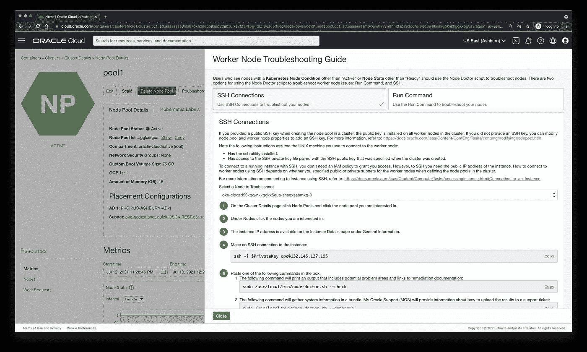
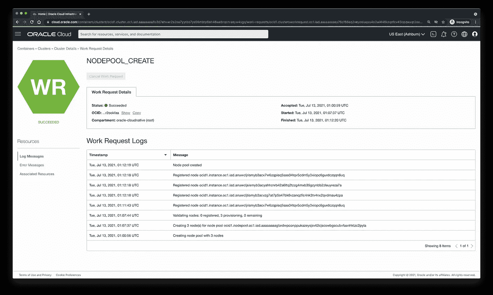

# 库伯内特淋巴结医生

> 原文：<https://medium.com/oracledevs/the-kubernetes-node-doctor-6e44b9b4193c?source=collection_archive---------0----------------------->


A doctor for something other than worker nodes

# 介绍节点医生

我们很高兴地[宣布面向 Kubernetes (OKE)工作节点故障排除工具的新 Oracle 容器引擎的可用性，我们称之为节点医生](https://docs.oracle.com/en-us/iaas/releasenotes/changes/565b4160-c473-442e-8ad6-4a1696d29ec9/)。[节点医生](https://docs.oracle.com/en-us/iaas/Content/ContEng/Tasks/contengtroubleshooting_topic-node_troubleshooting.htm)现在预装在所有 OKE 工作节点上。

Node Doctor 专注于与 Kubernetes 和 Oracle 云基础设施(OCI)之间的交集相关的常见问题，其中大多数问题会影响 Kubernetes 工作节点的运行状况。Node Doctor 运行许多检查，以确保工作节点按预期运行。例如，Node Doctor 可用于指示某个节点上的 pod 数量是否过多，从而导致 kubelet(在每个工作节点上运行的主节点代理)出现问题，或者某个节点是否正在运行已知的错误版本的依赖项(如 runC ),并且应该被回收。

Node Doctor 旨在解决与 OKE 集群工作节点相关的常见基础设施级别问题。如果用户发现自己的 workers 节点有问题，例如 Kubernetes 节点状况不是“活动”或者节点状态不是“就绪”,则应该使用 Node Doctor 对其节点进行故障诊断。Node Doctor 提供了对潜在问题的见解，因此您可以让您的节点重新联机。它还可用于捕获有用的数据，以便与 Oracle 技术支持共享。我们构建了 Node Doctor，让客户能够自己解决问题。



Node Troubleshooting with Node Doctor

要解决节点问题，只需导航到包含有问题节点的节点池，然后单击**解决节点问题**。这将打开一个关于如何访问节点和运行节点医生的多选项对话框。我们知道我们的用户遵循不同的方法来确保他们的节点按照他们的安全实践受到保护。记住这一点，我们选择支持多个路径来访问节点和运行 Node Doctor。对其工作节点拥有 SSH 访问权限的用户可以通过 SSH 连接，并自己运行命令。没有 SSH 访问权限的用户可以利用 OCI 计算功能，该功能允许拥有正确权限的用户在节点上运行命令，即使没有 SSH 访问权限。有关在 OCI 计算主机上运行命令的更多信息，请参见[在实例上运行命令](https://docs.oracle.com/en-us/iaas/Content/Compute/Tasks/runningcommands.htm)。

# 核心功能

节点医生有两个功能，**检查节点问题**和**生成支持包**:

## 检查节点问题

```
sudo /usr/local/bin/node-doctor.sh --check
```

该命令将执行一些前提条件检查，以确保 worker 节点的基础就位。这包括验证 Kubernetes 工作节点上运行的主节点代理 kubelet 是否处于活动状态，是否运行正确的版本，以及是否可以访问 Kubernetes API 服务器。确认满足前提条件后，它将检查各种常见问题，并根据检查结果在问题旁边打印`PASS`或`FAIL`。它还会将检查的输出保存在日志文件中，以供将来参考。如果其中一项检查失败，Node Doctor 还会打印补救步骤和适用的文档链接。例如，特定的网络相关问题，包括不活动的 proxymux 证书或不可访问的 kube-apiserver，将返回以下输出:

```
Network related failures have been detected. Please validate the network settings. Common mistakes include not using a service gateway, incorrect security list rules, and specifying the wrong subnet. https://docs.oracle.com/en-us/iaas/Content/ContEng/Concepts/contengnetworkconfig.htmhttps://docs.oracle.com/en-us/iaas/Content/ContEng/Concepts/contengnetworkconfigexample.htm"]
```

这就是节点医生`--check`命令的实际效果:

```
$ sudo /usr/local/bin/node-doctor.sh -c
/usr/local/bin/oke-node-doctor does not exist.
Verified OK
chmod: cannot access ‘oke-node-doctor’: No such file or directory
INFO: Successfully downloaded node doctor.
Running node doctor...
PASS node health...
PASS DNS lookup...
PASS kubelet cert rotation flag...
PASS kubelet logs...
PASS service health...
PASS instance metadata...
PASS image and instance info...
PASS yum status...
PASS flannel status...
PASS coredns status...
PASS proxymux-client status...
PASS kube-proxy status...
PASS pods in ImagePullBackOff...
PASS pods failed mounting volume...
PASS runc version...
PASS pod usage...
​
NODE DOCTOR REPORT
------------------
16/16 checks passed
0 Signal(s) generated
​
Node doctor scan is complete. Report has been saved at /var/log/oke-node-doctor/oke-node-doctor-814.log
```

## 生成支持包

```
sudo /usr/local/bin/node-doctor.sh --generate
```

该命令将执行上述`--check`命令的动作，还将生成一个支持包，一个包含诊断信息的. tar 文件，可与 Oracle 技术支持共享。我的 Oracle 支持(MOS)将提供有关如何上传的信息。tar 文件，包含支持票据的捆绑包。

这就是节点医生`--generate`命令的实际效果:

```
sudo /usr/local/bin/node-doctor.sh --generate$ sudo /usr/local/bin/node-doctor.sh -g
INFO: /usr/local/bin/oke-node-doctor already exists and MD5 match.
Running node doctor...
PASS node health...
PASS DNS lookup...
PASS kubelet cert rotation flag...
PASS kubelet logs...
PASS service health...
PASS instance metadata...
PASS image and instance info...
PASS yum status...
PASS flannel status...
PASS coredns status...
PASS proxymux-client status...
PASS kube-proxy status...
PASS pods in ImagePullBackOff...
PASS pods failed mounting volume...
PASS runc version...
PASS pod usage...
​
NODE DOCTOR REPORT
------------------
16/16 checks passed
0 Signal(s) generated
​
Node doctor scan is complete. Report has been saved at /var/log/oke-node-doctor/oke-node-doctor-2127.log
Generating node doctor bundle...
Generated /tmp/oke-support-bundle-2021-07-12T18-01-12.tar
```

# 节点池工作请求

我们最近重新审视了我们公开节点池和控制平面 CRUD 操作的工作请求的方式。作为这一更改的一部分，我们为每个请求添加了详细信息，包括日志消息、错误消息和相关资源。除了 Node Doctor 提供的信息之外，这为有用的诊断提供了另一个来源。可以从控制台、SDK、CLI、API 和其他界面访问工作请求的详细信息。例如，其群集无法创建的用户可以导航到特定于其群集的控制台的“工作请求详细信息”页面，并查看日志以了解有关失败的详细信息。更多信息，请参见[查看工作请求](https://docs.oracle.com/en-us/iaas/Content/ContEng/Tasks/contengviewingworkrequests.htm#contengviewingworkrequests.)。



Node Pool Work Requests

# 未来计划

随着时间的推移，Node Doctor 将继续得到增强，以包括我们发现的其他问题、症状和解决方案。

最初发表于[blogs.oracle.com](https://blogs.oracle.com/cloud-infrastructure/post/simplifying-kubernetes-node-troubleshooting-with-node-doctor)。