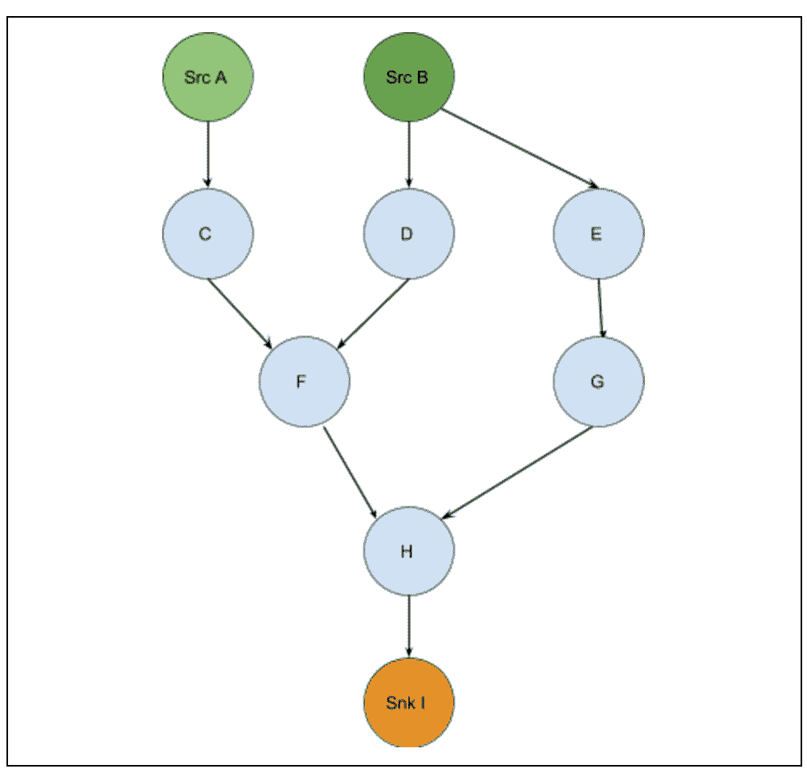
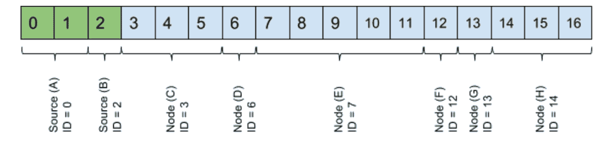

# 可能的小引擎:Pinterest 排名的关键 DSL

> 原文：<https://medium.com/pinterest-engineering/the-little-engine-that-could-linchpin-dsl-for-pinterest-ranking-17699add8e56?source=collection_archive---------5----------------------->

Angela Sheu | Pinterest 工程师，Home feed 基础设施

在 Pinterest，我们正在建立一个视觉发现引擎，拥有 1000 多亿个想法的不断增长的数据集。我们的工程师的任务是在正确的时间向正确的用户展示正确的想法，包括 home feed、搜索、相关 pin 等。工程师使用共享 Pin 特征和用户属性，每天做出超过 10B 条推荐。因为多个团队使用相同的数据管道和框架，所以在开发环境和生产环境中一致地使用模型是很重要的。

之前，团队为开发机器学习(ML)模型创建了单独的流程。随着这些模型变得越来越复杂，团队对模型开发工作流的需求也越来越相似，我们需要一种通用语言来表达、评估和跨多个团队部署模型。我们的答案是关键的 DSL，我们将在本帖中展示原因。

## **为什么是 DSL 的关键？**

机器学习系统中只有极小一部分代码真正进行“机器学习”其余的通常是胶水代码，它执行一些版本的:(1)将数据注入评分系统，(2)将数据转换成数字特征列表，以及(3)解释模型以将特征组合成分数。

有了领域特定语言(DSL)，开发人员可以更专注于功能开发和实际的机器学习，因为不再需要编写粘合代码。

## **创建模型规格**

使用关键 DSL 语法编写的模型规范是以下形式的有序语句列表:

Linchpin 有一个小型的可用计算节点库(即“转换”)，这些节点旨在充当原始操作。有时还有更复杂的转换，例如用于我们的梯度推进决策树(GBDT)模型的决策树转换和用于我们的神经网络模型的多线性转换。如果现有的库不能表达所需的特性，开发人员只需编写一个新的关键转换。

如果我们为一个用户的主页 feed 排列一个 Pin，一个示例模型规格可能如下所示:

*Note: This is an extremely simplified model for illustration.*

## **引擎盖下的一瞥**

关键有两个主要部分:(1)将模型规范解析成计算图，以及(2)评估创建的图。前者特定于关键的 DSL，而后者是一个计算系统——独立于 DSL 格式。

***阶段 1:*** 关键点将模型规范解析为模型 DAG，并构建模型节点图。这些节点可以是源节点、内部节点(变换/计算节点)或接收器节点。在这个阶段，每个节点都已经确定了其输出的大小和值类型，允许我们执行初步的验证检查。

***阶段 2:*** 调用者为关键点提供数据进行评分，并将给定的数据注入源节点。然后，林奇平评估所有后续的内部节点，并从接收器节点提取输出返回给调用者。

将所有内容放在一起，我们可能会在阶段 1 中创建以下 DAG:

我们在计算过程中维护一个值数组，可能如下所示:

## **我们如何使用关键点**

2014 年，home feed 团队用 Java 设计并实现了这个 DSL 来对个性化内容进行排名。在接下来的两年里，家庭饲料发生了显著的变化。随着 Pinterest 的快速增长，用户数量增加了 2 倍，排名的 pin 数量从每天大约 50 个增加到 700 个。我们曾经离线对内容进行预排名，现在我们的系统可以实时对内容进行排名。因此，延迟和性能变得至关重要。2015 年，出于性能优化的目的，我们在 C++中实现了一个[可定位性](/@Pinterest_Engineering/pinnability-machine-learning-in-the-home-feed-64be2074bf60) DSL V2，DSL 被重命名为“关键点”(Pinnability 是我们的机器学习模型的统称，这些模型在 Pinterest 上提供推荐。)

在 home feed 中，我们看到了采用关键技术的以下好处:

*   *输入与计算解耦。*因为关键使我们能够从计算中分离输入，我们在不同的环境和上下文中应用相同的计算。这保证了离线训练和在线评分之间的一致性，以及用于生成训练数据的 Hadoop 计算将与来自 [RealPin](/@Pinterest_Engineering/open-sourcing-rocksplicator-a-real-time-rocksdb-data-replicator-558cd3847a9d) 的发球得分结果保持一致。
*   *易于实验。*在任何给定的一周内，Pinnability 工程师可能会执行 20 项新的实验，同时还会决定是否关闭或交付现有的实验模型。通过使用关键的 DSL，我们能够将模型视为数据，并可以在单个模型规格中运行多个具有所有特性变化的实验。我们只是通过改变评分时使用的模型规范来发布模型，并且可以回滚一个坏的模型或者运行旧的、退役的模型。
*   *从基础设施变更中分离出建模变更。*关键的 DSL 还使我们能够将功能开发与基础设施代码分开。2017 年初，home feed infrastructure 团队将 Pinnability 的数据源从 Thrift 迁移到 FlatBuffers 格式，而 Pinnability 团队将他们的模型从使用 GBDT 改为并行的神经网络。

除了 home feed 团队之外，相关的 Pins、搜索和广告团队也已经开始使用关键。这意味着首页提要针，搜索结果和相关针都使用关键排名。

## 关键的未来

随着模型变得越来越复杂，使用关键的 DSL 语法来指定模型的方法可能会变得不实用，并且经常容易出错。我们已经开始努力使用 python 接口建立和调试模型的机制，类似于在 TensorFlow 中建立模型的方式。

在那之前，关键已经大大加快了 ML 工程师的开发速度，并为 Pinterest 的众多团队提供了开发和评估模型的方法。它作为我们推动 Pinterest 排名系统的关键引擎之一，继续稳步前进。

*致谢:开发和采用关键是跨职能部门的努力；感谢主页 feed Infra、主页 feed 排名、服务系统、相关 pin、搜索和广告团队。*

*特别鸣谢、Angela Sheu、Xiaofang Chen、Derek Cheng、Jaison George、Guo、Utku Irmak、、、Mukund Narasimhan、、、刘中达、Raymond Shiau、Tim Koh、Zheng Liu、Zhao Zheng、Zack Drach、Mihai Roman 和 Sloane Sturzenegger。*