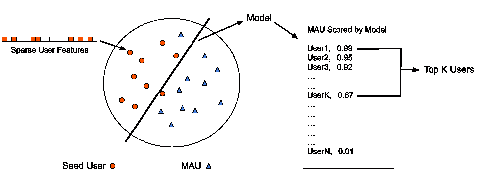
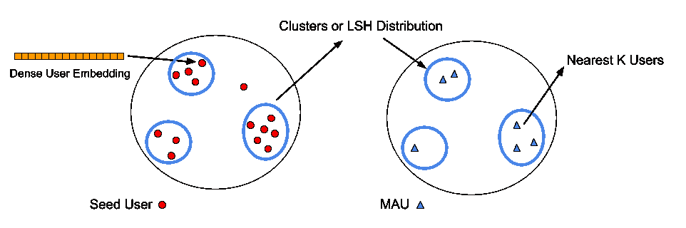
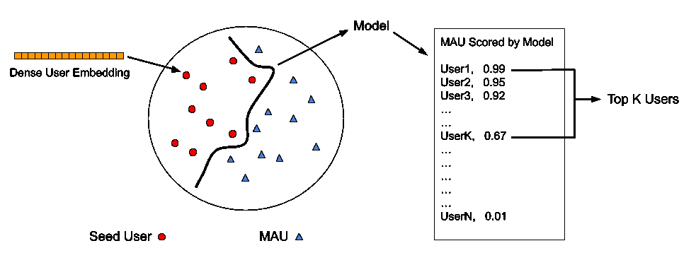
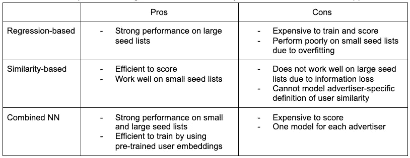
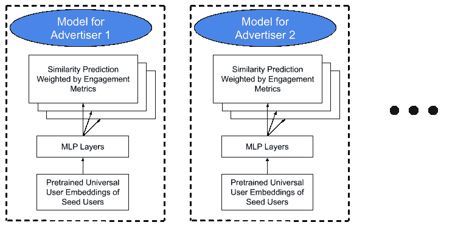
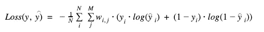
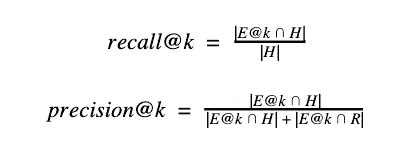
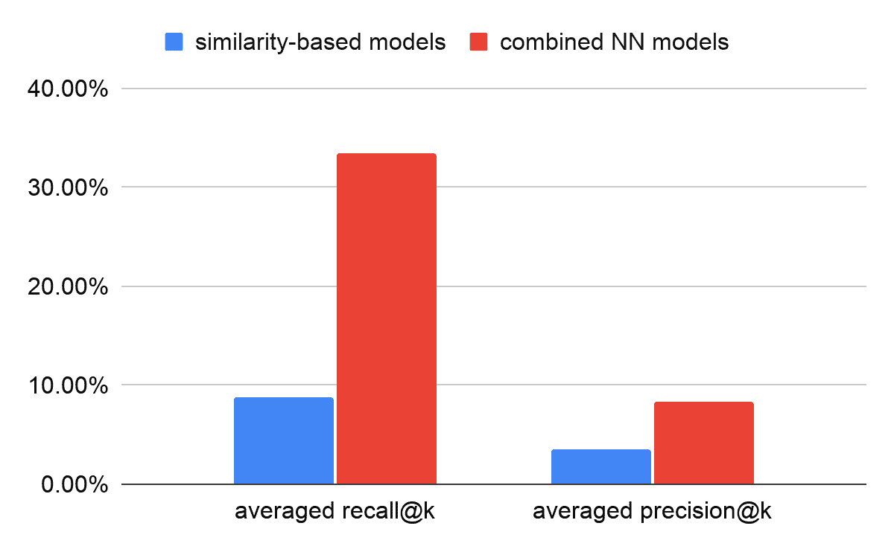
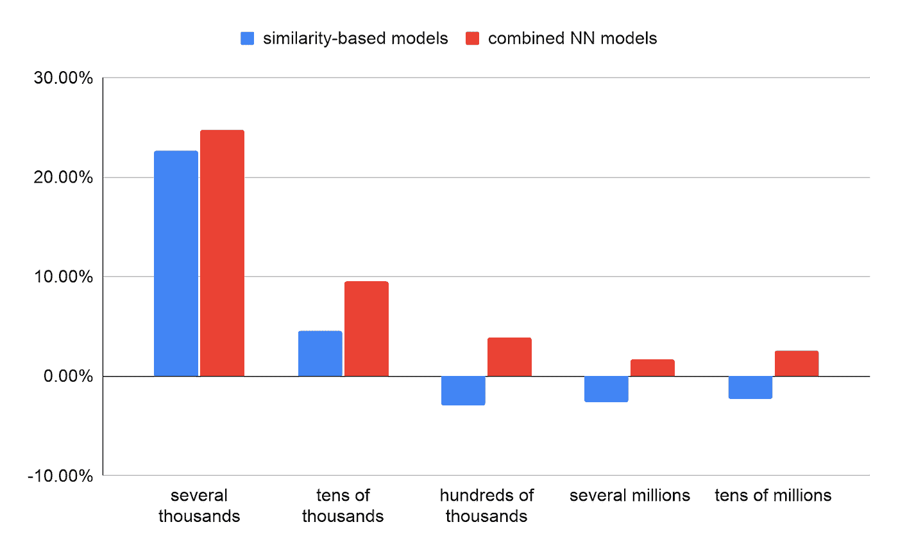
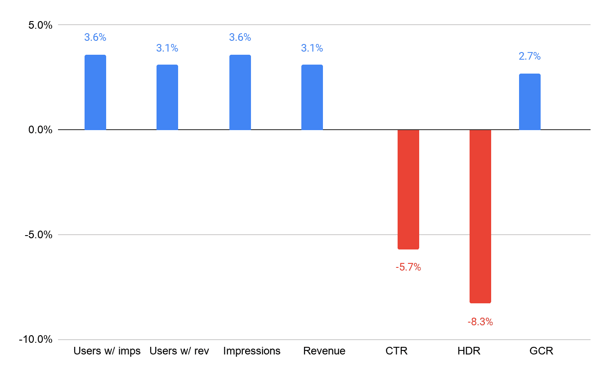

# 投放相关广告背后的机器学习

> 原文：<https://medium.com/pinterest-engineering/the-machine-learning-behind-delivering-relevant-ads-8987fc5ba1c0?source=collection_archive---------0----------------------->

Felix Fang |广告商解决方案集团软件工程师

徐驰|广告解决方案集团软件工程师

Pinterest 是人们进行计划和购物的地方，让品牌的想法和广告有助于将 Pinners 从灵感变为行动。我们的目标是确保广告继续是附加的，而不是对 Pinterest 的侵扰。由于平台上独特而强大的第一方信号，广告主可以根据他们在平台上的兴趣、意图和参与度来接触 Pinners。

为了帮助在数亿观众中向正确的广告人投放正确的广告，我们为广告商提供了实现相关性的功能，包括 Actalike (AAL)观众，在业内也被称为长相相似的观众。AAL 受众通过受众扩张帮助广告商接触潜在的新用户。

在这篇博客中，我们将重点关注相关广告投放的机器学习模型组件，并解释我们如何通过通用用户嵌入表示以及每广告客户分类器模型来实现高质量的受众扩展。我们通过显示比基于回归和基于相似性的方法更好的性能来展示所提出的组合方法的能力。

# 我们提出的方法:用户嵌入+ MLP 分类器

AAL 方法主要分为两类:基于回归的方法和基于相似性的方法。基于回归的方法将任务视为二元分类问题，离线训练每个种子列表的模型，并使用此类模型直接对候选用户进行评分，如图 2a 所示。基于相似性的方法从一组用户嵌入中学习种子列表表示，并根据 Jaccard 相似性、余弦相似性或点积基于最近邻扩大受众，如图 2b 所示。

Figure 2a. Regression-based approach. This is a discriminative model, and a linear model is often used since the features are sparse.

Figure 2b. Similarity-based approach. This is a generative model, and approximate nearest neighbor searching is used for speed.

Figure 2c. Combined NN approach. This is a discriminative model, and using dense user embeddings allows using a neural network model.

我们发现，每种基于回归或基于相似性的方法都有其独特的优势:基于回归的方法对每个种子列表执行监督学习，并擅长编码种子列表结构(较低的偏差，较高的方差)，而基于相似性的方法执行用户表示学习，这解决了数据稀疏性(较低的方差，较高的偏差)。为了结合两个世界的优势，我们采用预先训练的用户嵌入并显式学习种子列表分类器。因为预先训练的用户嵌入已经编码了高级信息并且是密集的，所以它允许下游分类器模型更快地收敛，并且允许采用神经网络，否则该神经网络在稀疏输入的情况下不能很好地工作。类似的想法可以在[ [5](https://docs.google.com/document/d/1PIXm82pDVGS6dc489wB4Px0z5Fpc2T6mM9jlxJ7Pm08/edit#bookmark=id.52i2wpw1fkkf) ]中找到。以下是比较不同受众拓展方法的总结:

Table 1\. Comparisons of regression-based, similarity-based, and combined NN approaches.

## 模型架构

我们直接将使用有机 *<用户、pin >* 交互训练的标准化用户嵌入馈送到我们的每广告客户模型。关于如何训练通用用户嵌入的更多细节可以在[6]中找到。对于每个广告客户，我们参考种子列表作为正面示例，使用来自目标国家/地区的每月活跃用户(mau)作为负面示例，并使用多层感知器(MLP)神经网络构建二元分类器，如图 3 所示:

Figure 3\. Per-advertiser multi-head model training architecture. Models for advertisers share the same architecture.

接下来，我们想研究样本加权如何改进我们的模型。我们的理由是用户参与可以提供更多关于种子用户成员的信息。与多任务学习不同，这里我们设计的模型只关注相似性预测任务。为此，我们对每个正例使用不同的样本权重。样本权重可以基于诸如印象数、点击率(CTR)等用户参与度量来决定。在这种方法中，我们可以区别对待每个种子用户，并优先考虑那些具有较高历史指标的用户。为了确保样本权重呈正态分布，我们对大于 1 的样本应用对数变换；对于那些小于 1 的指标(如 CTR)，我们通过 10⁶提升指标，然后应用对数变换。然后，我们使用最小-最大缩放将所有样本权重归一化到[0，1]内，以便所有样本权重都在同一缩放比例上。在我们的在线 alpha 实验中，我们发现这种样本加权在类似观众行为的目标切片中分别提高了 0.82%、0.38%和 0.44%的收入、印象数和 eCPM(每千分之一的有效成本)。

为了训练该模型，我们针对如下定义的加权二进制交叉熵损失函数进行优化:

其中 *N* 表示样本数量， *M* 表示不同的参与度指标。基于这些参与度指标，我们计算样本权重。

## 离线评估

为了评估受众扩展的质量，我们假设种子列表中的受众彼此相似。因此，我们将种子列表分为 90%和 10%的用户，用 90%的用户训练一个模型，使用该模型对除 90%训练集之外的所有 mau 进行评分，并检查 10%的坚持用户在扩展中如何排名。

受众扩张本质上是一个排名问题:从所有符合条件的候选用户中找到最相似的 *k* 用户。基本上，我们根据种子的相似性分数对所有符合条件的人进行排名，并选择前 *k* 。我们用 *recall@k* 和 *precision@k* 来衡量一个扩展列表有多好。这些被定义为:

其中 *E@k* 是扩展列表中具有前 *k* 个用户的用户集合， *H* 是坚持的用户集合， *R* 是从具有与 *H* 相同大小的 mau 中随机选择的用户集合。我们进一步在多个 *k* 上对 *recall@k* 和 *precision@k* 进行平均，以找出给定不同目标扩展大小的方法的性能。

我们比较了所有方法的结果，以更好地了解联合方法的优势。在此评估中，基于回归的模型是使用基于原始特征训练的逻辑回归模型实现的。基于相似性的模型基于位置敏感散列(LSH)。在所有结果中，我们使用基于回归的模型作为基线，并显示了与基线相比的相对收益。图 4 中的数字表明，就*召回@k* 和*精度@k* 而言，组合 NN 方法优于回归和基于相似性的方法。

Figure 4\. Overall comparisons among regression-based, similarity-based, and combined NN models (Baseline: regression-based).

除了整体比较，我们还评估了不同种子列表大小的模型。具体来说，我们根据种子列表大小将广告商分为五组:几千、几万、几十万、几百万、几千万。图 5 和图 6 中的数字告诉我们，基于回归和基于相似的模型分别只在大小种子列表上表现相对较好。然而，我们提出的组合神经网络模型在不同的种子列表大小上优于这两个模型。对于小种子列表，组合模型以及基于相似性的模型都受益于预先训练的通用用户嵌入，从而避免过拟合。对于大型种子列表，结果令人惊讶，因为为了训练组合模型，我们仅使用多达 200，000 个正样本，而对于基于回归的模型，我们使用所有正样本，即百万种子用户。我们相信使用预先训练的用户嵌入作为输入也允许模型更快地收敛。此外，MLP 层能够捕捉非线性关系，并进一步提高组合神经网络模型的性能。

Figure 5\. Average recall@k for different seed list sizes among regression-based, similarity-based, and combined NN models (Baseline: regression-based).

Figure 6\. Average precision@k for different seed list sizes among regression-based, similarity-based, and combined NN models (Baseline: regression-based).

## 生产端到端系统

因为回归和基于相似性的模型相互补充，我们以前版本的 AAL 系统是一个混合解决方案，混合了分类器和基于相似性的模型的扩展。对于新版本，我们生产了建议的组合模型，以大大简化 AAL 系统的复杂性。因此，我们节省了基础设施和维护成本，并将端到端运行时间加快了 20%以上。我们使用 Spark 和 Kubernetes 来扩展我们的系统，以支持定期训练的种子列表模型，并根据每个种子列表对用户进行评分(种子列表和用户分别在 O(10⁵和 O(10⁸的范围内)。

## 在线评估

在我们的在线 A/B 测试中，混合系统(混合分类器和基于相似性的模型)和组合的 NN 模型分别是控制和处理候选。图 7 表明，在我们为期两周的在线实验中，对于 AAL 广告，我们观察到广告印象用户和收入用户的统计显著增长，这导致 AAL 广告印象和收入的增长(分别为 3.6%和 3.1%)。虽然我们观察到 AAL 广告的点击率下降了 5.7%，但我们也看到隐藏率下降了 8.3%(HDR)，良好点击率上升了 2.7%(GCR)，这表明 AAL 广告的用户参与质量有所提高。我们从理论上认为，这些指标的变化与我们的离线评估一致:组合神经网络模型的召回率大大提高，这转化为在线实验期间更好的用户接触，从而导致更多用户的广告印象和收入。

Figure 7\. Online A/B Test Results for Act-alike Ads (Baseline: Blended)

# 结论

为了发现高质量的 actalike 用户用于受众扩展目标，我们使用预先训练的通用用户嵌入，并为每个种子列表建立神经网络分类器。该方法在查全率和查准率方面都优于基于原始特征训练的传统回归模型和基于用户嵌入的相似性模型。我们还使用历史用户参与度指标来进一步提高 actalike 扩展在线指标。

# 未来的工作

AAL 系统的统一为许多未来的 AAL 项目铺平了道路。在撰写本文时，已经推出了进一步提高系统效率和基础设施成本的产品。该团队正在研究更深入的建模结构，如深度因子分解机和上下文 AAL，以实现更高质量的 AAL 受众扩展。

*要在 Pinterest 了解更多工程知识，请查看我们的* [*工程博客*](https://medium.com/pinterest-engineering) *，并访问我们的*[*Pinterest Labs*](https://labs.pinterest.com/?utm_source=medium&utm_medium=blog-article&utm_campaign=fang-xu-july-20-2021)*网站。要查看和申请空缺职位，请访问我们的* [*职业*](https://www.pinterestcareers.com/?utm_source=medium&utm_medium=blog-article&utm_campaign=fang-xu-july-20-2021) *页面。*

# 承认

我们要感谢保罗·努内斯、雅各布·高、斯科特·邹、向崇元、和斯蒂芬妮·德韦特所做的贡献。我们还要感谢陈龙斌、阮亚龙、肖恩·麦柯迪、叶茂和鲁洛夫·范·兹沃尔的领导。

# 参考

[1]马，强&华，伊珊&文，贾谊&夏，甄&奥曼迪，罗伯特&陈，大同.(2016).给长相相似的观众打分。647–654.10.1109/ICDMW.2016.0097

[2]多安、科阿&亚达夫、普朗朱尔&雷迪、钱丹。(2019).用于相似建模的对立因子分解自动编码器。2803–2812.10.1145/3357384.3357807.

[3]刘，海山&帕多，戴维&刘，昆&塔库尔，马诺杰&曹，弗兰克&李，崇哲。(2016).在线社交网络广告的受众拓展。165–174.10.1145/2939672.2939680.

[4]蒋军，林，谢，姚军，陆，等(2019)。基于端到端神经预测的综合受众拓展。在 J. Degenhardt，S. Kallumadi，U. Porwal 和 A. Trotman(编辑。)，SIGIR 2019 年电子商务研讨会的会议录，与第 42 届国际 ACM SIGIR 信息检索研究与发展会议共同举办，eCom@SIGIR 2019，法国巴黎，2019 年 7 月 25 日(第 2410 卷)。

[5]刘、、葛、、张、徐、林、.(2019).推荐系统中基于实时关注度的相似模型。2765–2773.10.1145/3292500.3330707.

[6]德韦特，斯蒂芬妮和欧，贾凡。(2019).寻找行为相似的用户:为扩大广告受众转移学习。2251–2259.10.1145/3292500.3330714.