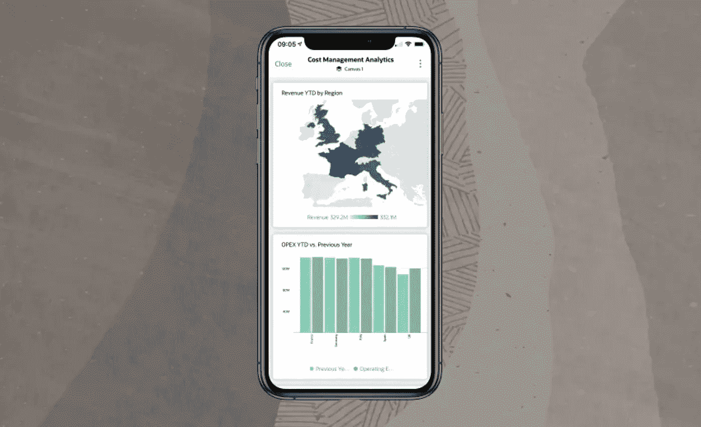

# 魔法(网址)消失了！

> 原文：<https://medium.com/oracledevs/the-magic-url-is-gone-6b069834100e?source=collection_archive---------7----------------------->

# (这是一件好事)

我同事雅克的客座博文。

针对 Android 的 Oracle Analytics、针对 iOS 的 Oracle Analytics 和针对日复一日的 Oracle Analytics 的最新更新移动应用程序(现在可在应用商店上购买)不再需要特殊的配置步骤，即在您的 Oracle Analytics Cloud 实例上使用 *Magic URL* 。

从今天开始，您的 Oracle Analytics Cloud 用户在打开移动应用程序时，只需在服务器名称字段中键入 Oracle Analytics Cloud 实例 URL 或您的*虚荣 URL* 。然后，如果您已经配置了 SSO 流，应用程序会自动将您的用户带入 SSO 流；如果您是这样配置的，应用程序会自动将用户带入基本身份验证流。

这一直是移动社区的首要功能要求，Oracle 很高兴为您的移动用户大大简化对 Oracle Analytics Cloud 实例的访问。

对于配置了 *Magic URL* 并已经投入生产的客户，不需要进行任何更改，您的用户可以继续*原样*。然而，展望未来，新用户可以访问 Oracle Analytics Cloud 实例，而不需要 *Magic URL* 。

有关移动访问 Oracle Analytics Cloud 的更多详细信息，请参见[一天天使用 Oracle Analytics](http://www.oracle.com/pls/topic/lookup?ctx=en/cloud/paas/analytics-cloud&id=BIDAY)和[为 Android 和 iOS 使用 Oracle Analytics](http://www.oracle.com/pls/topic/lookup?ctx=en/cloud/paas/analytics-cloud&id=AAIOS)。

想谈谈吗？加入我们的[甲骨文开发人员公共闲置频道](https://bit.ly/devrel_slack)！