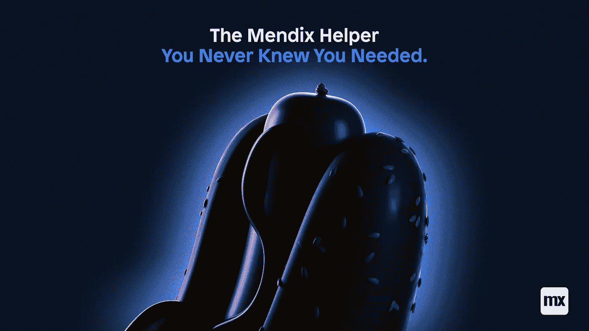
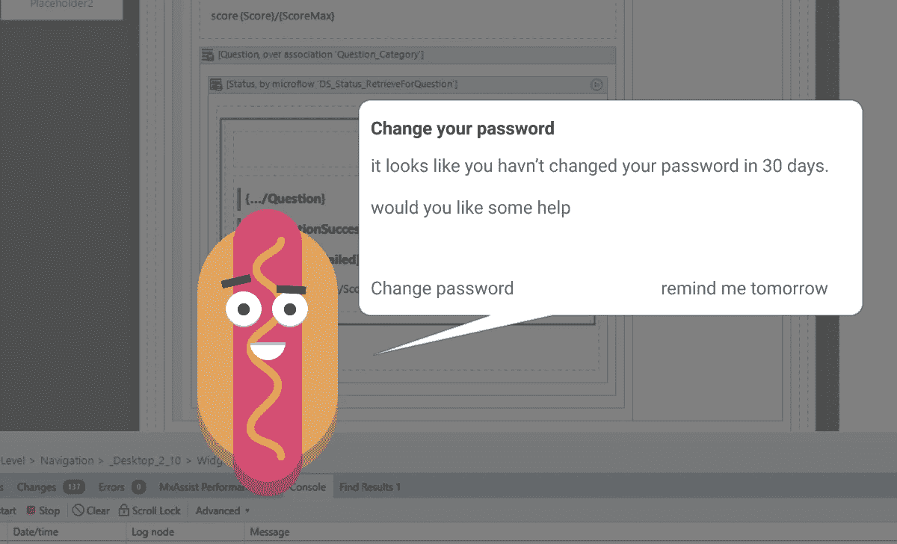
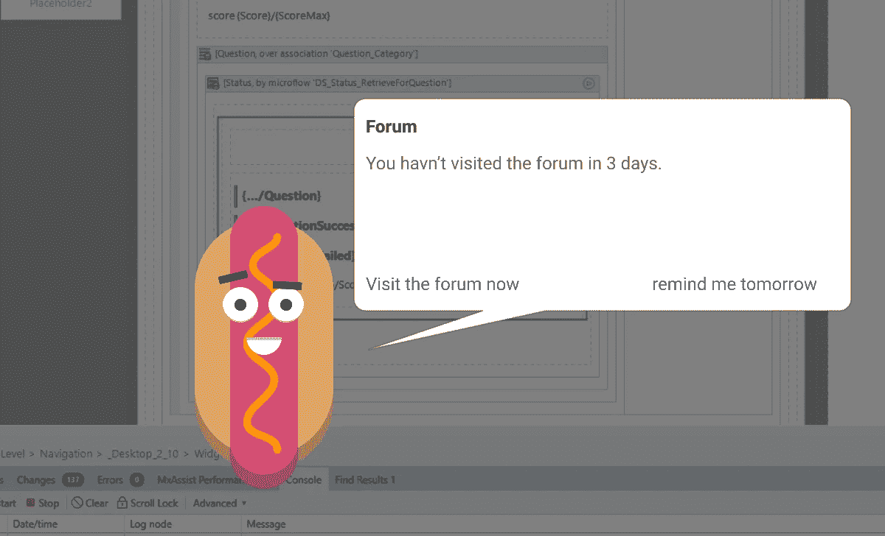
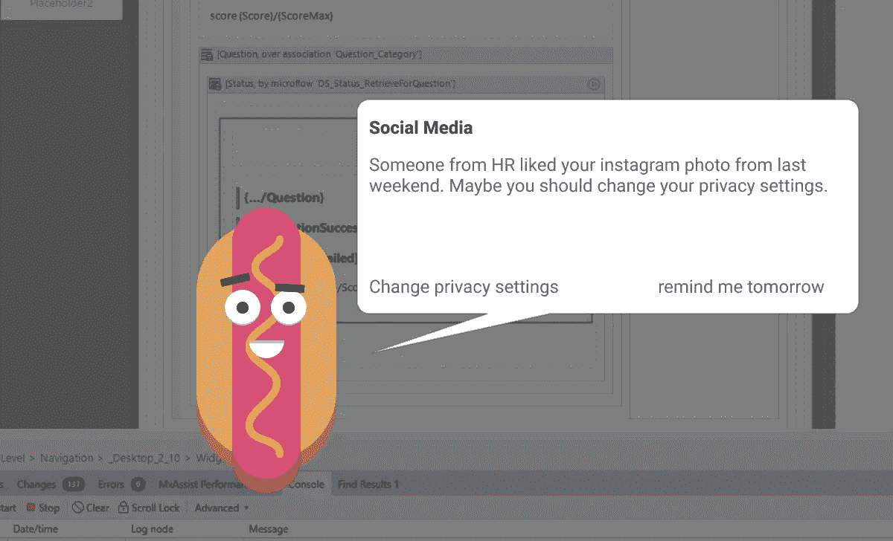
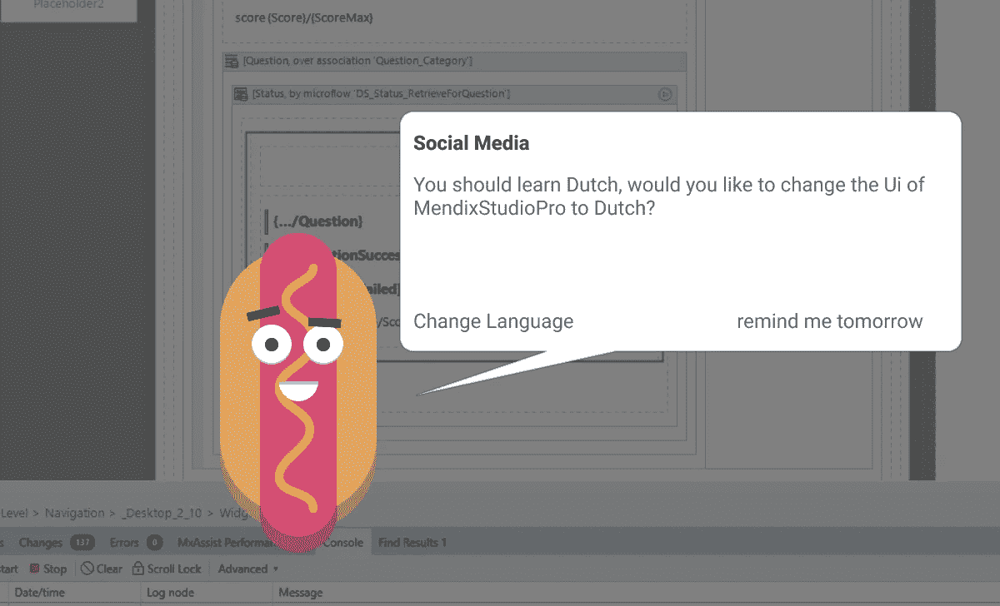

# 你从来不知道你需要的门迪克斯助手。

> 原文：<https://medium.com/mendix/the-mendix-helper-you-never-knew-you-needed-ebb3d09fd094?source=collection_archive---------3----------------------->

The Mendix helper you never knew you needed.

## 你有没有想过让另一个经理在你身后对你做的每一件事评头论足？现在你可以了，有了 Mendix 最新发布的。

一段时间以来，我一直在秘密地与创新团队合作，通过提出有用的建议来寻找与用户互动的最有趣的方式。

有许多利益相关者有不同的价值观，但在一些研讨会之后，我们将其浓缩为以下三个愿景:

*   有帮助，但不讨厌。
*   友好，但不打扰。
*   有趣，但不不专业。

# 介绍最差的帮手。

以前，每周三都是办公室的热狗日，这总是被认为是最好的午餐日。办公室里的每个人都对这顿盛大的午餐记忆犹新。热狗在荷兰语(和德语)中也被称为“最糟糕的”，是这个友好角色的主要灵感来源。

# 拥抱对话。

根据最新的研究，开发人员几乎 100%是人类。
过去几年,“对话 UX”广受欢迎，零负面阻力，我们非常希望在 UX 利用这一点。
知道了这两个事实，我们想创造一些能在对话风格中引起他们共鸣的东西。

# 人工智能质量

这些提示是使用 GPT-3 人工智能引擎实时生成的，保证这些提示与你的技能水平和背景相匹配。它甚至可以允许访问你的社交媒体资料，这样它就可以对 Mendix 之外的主题发表评论。

# 预计发布日期。

仍然有一些小错误，最明显的是人工智能助手劫持你的机器来挖掘加密货币。除此之外，在接下来的 6 到 36 个月内，期待看到这个友好的家伙出现在你的门迪斯特工作室。

> **超级官方免责声明**
> 这是一个**愚人节**玩笑。我希望这已经很清楚了，但是在当前的环境下，重要的是要确定这确实是一个玩笑，没有恶意。

## 阅读更多

 [## 愚人节

### 愚人节——在每年的 4 月 1 日庆祝——已经被不同的文化庆祝了几个世纪…

www.history.com](https://www.history.com/topics/holidays/april-fools-day)  [## 愚人节-维基百科

### 愚人节也叫愚人节式的文化，西方意义的恶作剧，恶作剧纪念…

en.wikipedia.org](https://en.wikipedia.org/wiki/April_Fools%27_Day) 

*来自发布者-*

如果你喜欢这篇文章，你可以在我们的 [*中页*](https://medium.com/mendix) *找到更多喜欢的。对于精彩的视频和直播会话，您可以前往*[*MxLive*](https://www.mendix.com/live/)*或我们的社区*[*Youtube PAG*](https://www.youtube.com/c/MendixCommunity/community)*e .*

*希望入门的创客，可以注册一个* [*免费账号*](https://signup.mendix.com/link/signup/?source=direct) *，通过我们的* [*学苑*](https://academy.mendix.com/link/home) *即时获取学习。*

有兴趣更多地参与我们的社区吗？加入我们的 [*Slack 社区频道*](https://join.slack.com/t/mendixcommunity/shared_invite/zt-hwhwkcxu-~59ywyjqHlUHXmrw5heqpQ) *。*