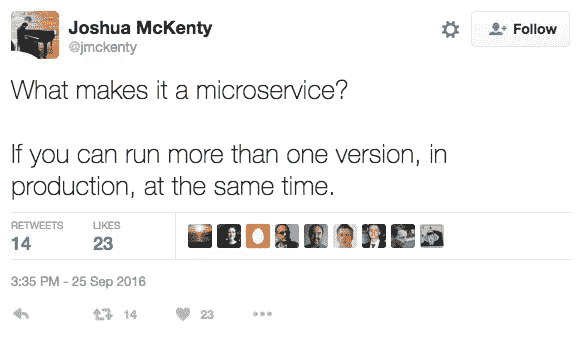

# 微服务悖论

> 原文：<https://medium.com/capital-one-tech/the-microservices-paradox-e55d5af2fda5?source=collection_archive---------4----------------------->

9 月 12 日，我有幸参加了在 [API World](http://apiworld.co/) 举行的关于微服务主题的小组讨论。当我第一次被邀请成为小组成员时，我很矛盾——对我来说，关于微服务的讨论注定会陷入与关于 DevOps 和敏捷的讨论相同的黑暗沼泽。似乎对所有这些概念都有一个大致的理解，但没有关于如何实施和维持它们的科学。

但是，嘿，这就是它的乐趣，对不对？当我意识到我将与各种各样但才华横溢的人分享这个舞台时，这太有趣了，不能错过。除了[我](https://twitter.com/lindybrandon)，这个小组还包括来自加州 API 学院的[罗尼·米特拉](http://twitter.com/mitraman)；[来自 Pivotal 软件和云代工厂的 Josh McKenty](http://twitter.com/jmckenty)；来自养蜂场的 Jakub Nesetril 以及来自 Oauth.io 和 APIDays 的 [Medhi Medjaoui](https://twitter.com/medjawii) 。

# 观众简介

大多数情况下，本次会议的听众分为产品管理、运营和开发三部分。有些人已经踏上了微服务之旅，而其他人只是在探索这个概念。

# “微服务”的定义是什么？

Mehdi 以一个最尴尬的问题开始了讨论:你对微服务的定义是什么？当然，这是一个棘手的问题，因为定义是多种多样和微妙的。

正如任何好的小组一样，我们都有基于我们的经历和职业的不同观点。我们确实普遍认为微服务既有业务方面也有技术方面。

***这是商业术语！***

通常，我们认为微服务是由业务需求驱动的:

o *快速交付*
如今，在大多数市场上保持竞争力意味着快速推出新功能或新服务，且几乎不产生额外费用。如果您正在运行一个单一的应用程序或一个具有大型交织组件的应用程序，那么特性更改可能会很危险和复杂。部署大规模的应用程序还会影响没有改变的特性和组件，因为所有的东西都必须一起部署。

凭借其狭窄的焦点和独立的数据存储，微服务可以独立快速地创建和部署。这使得新的业务需求可以在几周或几天内得到满足，而不是几个月或(ack！)年。

o *低维护*
许多微服务的倡导者实际上提倡‘无’维护。他们的理论是，如果你需要修改一个微服务，你实际上应该扔掉它，建立一个新的。目的是防止微服务增加开销——让服务满足需求，然后在需求变化时构建新的服务。

不管你是否坚持这种想法，事实是微服务的维护成本越低越好。这允许团队在新的或不断发展的业务需求到来时保持灵活和可用。

“提高你的变化率，所有其他的事情都会随之而来。”—[*R*onnie Mitra](http://twitter.com/mitraman)，CA[API 学院](http://apiacademy.co/)API 设计总监，专家组成员

***这是个专业术语！***

与许多这样的概念一样，微服务也是一种服务于业务需求的技术实现。专家组一致认为，创建微服务需要考虑一些基本的技术因素，包括:

o *界限*
这是构建成功且易于管理的微服务的关键。边界是阻止微服务成为宏服务的限制因素。与任何其他架构构造一样，您必须了解整个应用环境，然后确定各个微服务的界限。

一个微服务的边界可以沿着任务线(即这个微服务只做这一个功能，不做其他)或者沿着数据线(即这个微服务只访问和管理这个数据块，不做其他)或者沿着在你的应用环境中有意义的任何其他线来绘制。当您清楚地定义边界时，您可以更容易地确定何时何地需要添加更多的服务。但是要小心[康威定律](https://en.wikipedia.org/wiki/Conway%27s_law)！专家组继续引用这个陷阱，因为基于团队结构设计微服务非常容易，而不是反过来。

o *持续部署*
微服务的全部意义在于允许快速开发。如果您没有将微服务与持续部署相结合，您就失去了大部分优势。为持续集成/持续部署(CICD)准备适当的流程和工具是微服务的一个基本技术考虑因素。

为了加速引入 API 的能力，持续交付是必不可少的，双方都有很多可用的工具 — [雅各布·奈瑟里尔](http://twitter.com/jakubnesetril),[养蜂场](http://apiary.io/)创始人兼首席执行官，专家组成员

***不是，是组织术语！***

最后，无论专家组成员倾向于将该术语作为技术术语还是业务术语，我们都同意它需要组织方面的考虑。采用微服务生活方式的组织至少需要包括:

o *小型离散团队*
这些团队本质上可能是短暂的——组成团队来构建一个服务，然后重新组织来构建一个不同的服务。但是我们都同意，要真正有效，团队需要遵循[“两块披萨”规则](https://blog.bufferapp.com/small-teams-why-startups-often-win-against-google-and-facebook-the-science-behind-why-smaller-teams-get-more-done)。否则，你会牺牲速度和注意力。

o *DevOps 心态*
和微服务一样，DevOps 可以因为各种原因，以各种方式实现。但其背后的理念是打破功能之间的壁垒，这对于交付高质量和可管理的微服务至关重要。“你建造它，你拥有它”是一个关键原则。

o *灵活性*
微服务与生俱来的乐趣之一就是它们是如此的离散，它们可以独立存在。这意味着每个团队都可以采用他们喜欢的框架和语言，而不必担心公司标准。因为它们的生命周期很短，几乎不需要维护，所以您不必担心将代码交给维护团队。

*“微服务更像是一种哲学，就像 REST 或其他架构原则一样……它是一种商业、技术和文化的东西。”*—[Mehdi Medjaoui](http://twitter.com/medjawii),[oauth . io](http://oauth.io/)联合创始人，小组主持人

# 小组讨论的三个关键要点

讨论中有几个要点强调了微服务实施的矛盾本质。

## **巨石是最好的起点**

作为一个行业，我们倾向于用“整体”作为负面描述。然而，在许多情况下，应用程序应该是一个整体。如果应用程序足够独立、足够简洁，那么整体式架构是不错的。但是，当您发现您在快速变化和持续部署方面遇到困难时，可能是时候进入微服务了。

“最重要的是用持续交付来衡量你的组织嗅觉。”— [迈克·阿蒙森](http://twitter.com/mamund)[API 学院](http://apiacademy.co/)API 架构总监，观众

最好的微服务架构来自于变得难以管理的整体。拥有初始的 monolith 也有助于您更好地了解您的微服务边界。

## **更小的服务同时带来简单性和复杂性**

当您构建小型离散服务时，这些单独的服务可以非常简单地描述、构建和维护。但是由小型服务组成的更广泛的基础设施的整体复杂性本身就可能变得昂贵。在企业范围内实施微服务之前，请考虑一些陷阱:

o *多条通信路径*
每个微服务都有一条到其他微服务的通信路径，这使得你的整体系统成为一个复杂的会话网络。

o *多个失败点*
当你考虑所有这些对话时，想象一下如果这些对话中的任何一个失败了，会有多少失败点。如果没有强大的监控和通知功能，对微服务系统进行故障排除会非常麻烦和困难。

o *多个版本可以共存*
事实上，对于专家组成员之一的 Josh McKenty 来说，这是微服务的一个关键要求。根据 Josh(他在这方面有丰富的经验)的说法，如果你可以在生产中同时运行同一微服务的多个版本，你就成功了。

## **微服务可以导致扩散，这可能会带来更好的东西**

总是同意的面板是无聊的面板吧？我们不同意的一个领域是企业筒仓组织激增服务的趋势。嗯，我们同意它们会扩散，但是我们不同意这是不是一件好事。在某种意义上，做同样事情的服务的扩散是浪费工作和重复劳动；从另一个意义上来说，允许自由地不受限制地建造所需要的东西的文化可以带来大规模的创新。

# **总之**

虽然对微服务的观点和看法可能不同，但很明显，它们解决了特定的问题，需要跨越业务、技术和组织的界限来实施。如果您的变化率很高，并且快速部署是您的目标，微服务可能是您的答案——只需准备好跨职能投资即可。

*声明:本博客中的观点是作者/受访者的观点，不一定是 Capital One 的观点。除非本帖中另有说明，否则 Capital One 不属于所提及的任何公司，也不被其认可。使用或展示的所有商标和其他知识产权都是其各自所有者的所有权。这篇博文是 2016 Capital One。*