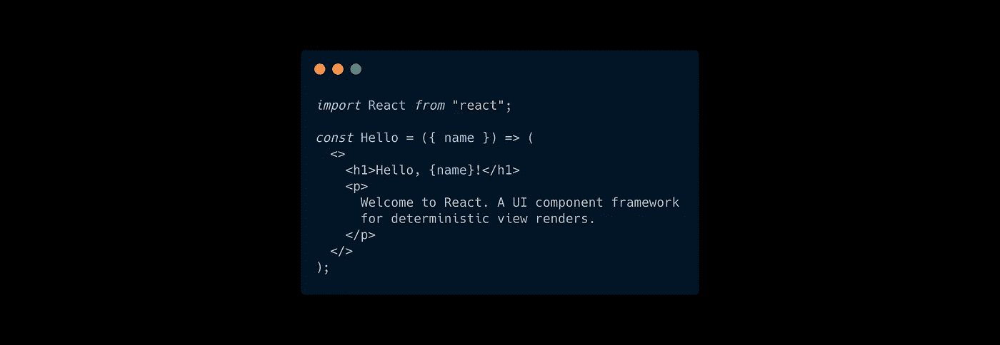
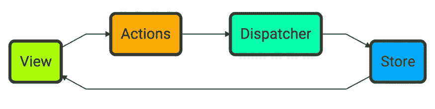
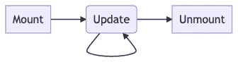
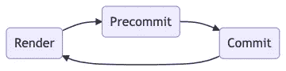
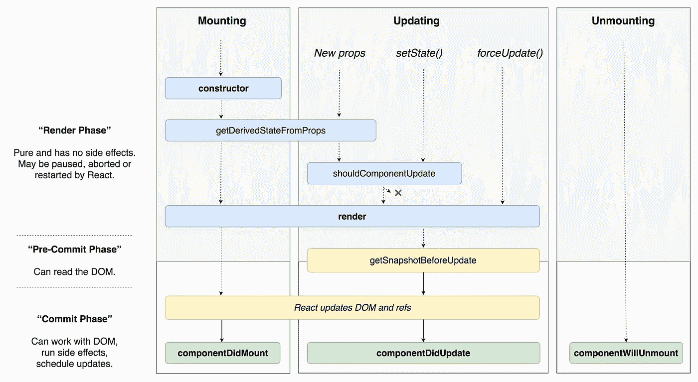

# 反应过来的缺失介绍

> 原文：<https://medium.com/javascript-scene/the-missing-introduction-to-react-62837cb2fd76?source=collection_archive---------0----------------------->

## 为什么 React 是世界顶级 UI 框架



React 是世界上最流行的 JavaScript 框架，但它并不酷，因为它很流行。它流行是因为它很酷。大多数 React 介绍直接向您展示如何使用 React 的示例，并跳过“为什么”。

太酷了。如果您想立即开始使用 React，官方文档中有很多资源可以帮助您[开始使用](https://reactjs.org/docs/getting-started.html)。

这篇文章是写给那些想知道“为什么要做出反应？React 的工作原理是什么？API 设计的目的是什么？”

# 为什么要反应？

> 当 UI 组件不知道网络、业务逻辑或应用程序状态时，生活会更简单。给定相同的属性，总是呈现相同的数据。

当 React 首次推出时，它从根本上改变了 JavaScript 框架的工作方式。当其他人都在推动 MVC、MVVM 等时，React 选择将视图渲染与模型表示分离，并为 JavaScript 前端生态系统引入了一个全新的架构:Flux。

React 团队为什么要这么做？为什么它比之前的 MVC 框架(和 jQuery 意大利面)更好？

在 2013 年，脸书刚刚花了相当多的精力集成聊天功能:这个功能将在整个应用程序体验中实时可用，集成在网站的几乎每个页面上。这是一个在已经很复杂的应用中的复杂应用，DOM 不受控制的突变，以及多用户 I/O 的并行和异步特性给脸书团队带来了困难的挑战。

例如，当任何东西都可以在任何时间出于任何原因抓取 DOM 并对其进行变异时，您如何预测将呈现给屏幕的内容，以及您如何证明呈现的内容是正确的？

在 React 之前，您无法用任何流行的前端框架做出这些保证。DOM 竞争条件是早期 web 应用程序中最常见的错误之一。

> ***非确定性=并行处理+可变状态***——[马丁·奥德斯基](https://en.wikipedia.org/wiki/Martin_Odersky)

React 团队的首要任务就是解决这个问题。他们通过两项关键创新做到了这一点:

*   **采用 flux 架构的单向数据绑定**。
*   **组件状态是不可变的。**一旦设定，组件的状态不能改变。状态更改不会更改现有的视图状态。相反，它们触发一个具有新状态的新视图呈现。

> “我们发现，从概念上来说，构建和呈现我们的视图的最简单的方法就是尽量避免突变。”— Tom Occhino，JSConfUS 2013

有了 flux，React 驯服了不受控制的变异问题。React 没有将事件侦听器附加到任意数量的任意对象(模型)来触发 DOM 更新，而是引入了一种操作组件状态的方法:分派到存储。当存储状态改变时，存储将要求组件重新呈现。



Flux architecture

当有人问我“为什么我应该关心 React”时，我的回答很简单:因为我们想要**确定性视图渲染，**和 React 使这变得容易得多。

> **注意:**从 DOM 读取数据是一种反模式，目的是实现域逻辑。这样做违背了使用 React 的目的。相反，从存储中读取数据并在渲染之前做出选择。

如果确定性渲染是 React 的唯一技巧，它仍将是一项惊人的创新。但是 React 团队还没有完成创新。他们推出了更多的杀手级功能，多年来，他们增加了更多。

# JSX

JSX 是 JavaScript 的扩展，它允许你以声明的方式创建自定义的 UI 组件。JSX 有重要的好处:

*   **简单的声明式标记。**
*   **与您的组件放在一起。**
*   **按关注点分开，**(如 UI vs 状态逻辑，vs 副作用)而不是按**技术**(如 HTML，CSS，JavaScript)。
*   **抽象掉 DOM 差异。**
*   **从底层技术中抽象出来**这样你就可以用 React 瞄准许多不同的平台。(例如[反应](https://reactnative.dev/)、 [VR](https://github.com/facebook/react-360) 、[网飞·吉本](https://netflixtechblog.com/crafting-a-high-performance-tv-user-interface-using-react-3350e5a6ad3b)、[画布/WebGL](https://github.com/raphamorim/react-ape) 、[邮件](https://github.com/chromakode/react-html-email)、...)

在 JSX 之前，如果你想写声明性的 UI 代码，你必须使用 HTML 模板，而且当时还没有好的标准。每个框架都使用它们自己的特殊语法，你必须学会做一些事情，比如循环数据、插入变量或进行条件分支。

今天，如果你看看其他框架，你仍然需要学习特殊的语法，比如 Angular 的`*ngFor`指令。因为 JSX 是 JavaScript 的超集，所以 JSX 标记中包含了 JavaScript 的所有现有特性。

您可以使用`Array.prototype.map`迭代条目，使用逻辑运算符，使用三元表达式分支，[调用纯函数](/javascript-scene/master-the-javascript-interview-what-is-a-pure-function-d1c076bec976)，在[模板文字](https://developer.mozilla.org/en-US/docs/Web/JavaScript/Reference/Template_literals)上插值，或者 JavaScript 表达式可以做的任何事情。在我看来，这是竞争 UI 框架的一个巨大优势。

一开始你可能会纠结于几条规则:

*   在 JSX，`class`属性变成了`className`。
*   对于您想要显示的项目列表中的每一个项目，您需要一个稳定的、惟一的标识符用于 JSX `key`属性。添加或删除项目时，密钥不能更改。实际上，在您的数据模型中，大多数列表项都有惟一的 id，这些 id 通常作为键非常有用。

React 并没有为 CSS 开出单一的解决方案。您可以将一个 JavaScript 样式对象传递给 style 属性，在这种情况下，许多常见的样式名称将被转换为对象文字形式的 camelCase，但还有其他选项。我混合搭配了几种不同的解决方案，这取决于我所应用的样式的范围:主题化和公共布局的全局样式，以及仅用于该组件的局部范围。

以下是我最喜欢的选项:

*   **CSS 文件**可以加载到您的页眉中，用于通用的全局布局、字体等。它们工作正常。
*   [**CSS 模块**](https://github.com/css-modules/css-modules) 是本地范围的 CSS 文件，可以直接导入到 JavaScript 文件中。你需要一个正确配置的[装载器](https://github.com/webpack-contrib/css-loader)。 [Next.js](https://nextjs.org/) 默认启用。
*   [**styled-jsx**](https://github.com/vercel/styled-jsx) 让你在 React 组件中内嵌声明样式，类似于 HTML 中的`<style>`标签。这些样式的范围是超本地的，这意味着只有兄弟标签及其子标签会受到样式的影响。Next.js 也默认启用 styled-jsx。

# 合成事件

React 提供了一个包装 DOM 事件的包装器，称为合成事件。他们非常酷有几个原因。合成事件:

1.  **消除事件处理中的跨平台差异**，让你的 JS 代码更容易在每个浏览器中工作。
2.  **自动进行内存管理。**如果你要用原始的 JavaScript + HTML 制作一个无限滚动的列表，你需要委托事件或者在元素滚动时挂钩和脱钩事件监听器，以避免内存泄漏。合成事件被自动委托给根节点，这意味着 React 开发人员可以免费获得事件内存管理。

> **注意:**在 React v17 之前，由于事件池的原因，无法在异步函数中访问合成事件属性。相反，从事件对象中获取所需的数据，并在闭包环境中引用它。[事件池在 v17](https://reactjs.org/blog/2020/08/10/react-v17-rc.html) 中被移除，因为浏览器优化处理了它。
> 
> **注意:**在 v17 之前，合成事件委托给单据节点。在 v17 之后，合成事件被委托给 React 根节点。

# 组件生命周期

React 组件生命周期的存在是为了保护组件状态。当 React 绘制组件时，组件状态不得发生变化。相反，一个组件进入一个已知的状态，绘制，然后打开效果、状态更新和事件的生命周期。

理解生命周期是理解如何用 React 方式做事的关键，这样你就不会与 React 发生冲突，也不会因为不正确地改变或读取 DOM 中的状态而意外地违背了使用 React 的初衷。

从 React 0.14 开始，React 引入了类语法来挂钩 React 的组件生命周期。React 有两个不同的生命周期需要考虑:挂载、更新和卸载:



React Lifecycle

在更新生命周期中，还有三个阶段:



React Update Cycle

*   除了调用钩子之外，你的渲染函数应该是确定性的，并且没有副作用。你通常应该认为它是一个从道具到 JSX 的纯功能。
*   **预提交** —这里您可以使用`getSnapShotBeforeUpdate`生命周期方法从 DOM 中读取。如果您需要在 DOM 重新呈现之前读取滚动位置或元素的呈现大小之类的内容，这很有用。
*   **提交** —在提交阶段，React 更新 DOM 和 refs。你可以使用`componentDidUpdate`或`useEffect`挂钩来接入它。这是可以运行效果、安排更新、使用 DOM 等的地方。

Dan Abramov 制作了一个很棒的图表，详细说明了从 React 类的角度可以看到的所有细节:



React Component Lifecycle Diagram by Dan Abramov ([Source](https://twitter.com/dan_abramov/status/981712092611989509))

在我看来，将一个组件视为一个长期存在的类并不是 React 工作方式的最佳心理模型。请记住:React 组件状态并不意味着被改变。它应该被替换，当前状态的每次替换都会触发一次重新渲染。这启用了 React 最好的特性:使创建**确定性视图渲染变得容易。**

对于这种行为，一个更好的心理模型是，每次 React 渲染时，它都会调用一个返回 JSX 的确定性函数。该函数不应该直接调用自己的副作用，而是可以将效果排队等待 React 运行。

换句话说，你应该把大多数 React 组件看作是从道具到 JSX 的纯函数。

**一个纯粹的函数:**

*   **给定相同的输入，总是返回相同的输出**(确定性)。
*   **没有副作用**(例如，网络 I/O、登录控制台、写入本地存储等。)

> **注意:**如果你的组件需要效果，使用`useEffect`或者调用一个通过 props 传递的[动作创建器](/javascript-scene/10-tips-for-better-redux-architecture-69250425af44)，在中间件中处理效果[。](https://redux-saga.js.org/)

# 反应钩

React 16.8 引入了一个新的概念: [**React 钩子**](https://reactjs.org/docs/hooks-intro.html) 是允许你在不使用类语法或者直接调用生命周期方法的情况下进入 React 组件生命周期的函数。您不用声明类，而是编写一个呈现函数。

调用钩子通常会引入副作用——这种副作用会让你的组件挂钩到组件状态和 I/O 之类的东西上。

`[useEffect](https://reactjs.org/docs/hooks-effect.html)`让你在组件生命周期中合适的时间运行效果，可以是组件挂载之后(比如`[componentDidMount](https://reactjs.org/docs/react-component.html#componentdidmount)`)，提交阶段(比如`[componentDidUpdate](https://reactjs.org/docs/react-component.html#componentdidupdate)`)，或者组件卸载之前(比如`[componentWillUnmount](https://reactjs.org/docs/react-component.html#componentwillunmount)`)。

注意三个不同的生命周期方法是如何从一个 React 钩子上掉下来的？这是因为钩子允许您将相关的逻辑放在一起，而不是将逻辑放在生命周期方法中。

很多组件需要在组件挂载时挂接一些东西，每次组件重绘时更新，然后在组件卸载前清理，防止内存泄漏。使用`useEffect`，您可以在一个函数调用中完成所有这些，而不是将您的逻辑分成 3 个不同的方法，与所有其他不相关的也需要使用这些方法的逻辑混合在一起。

**挂钩使您能够:**

*   将你的组件写成函数而不是类。
*   更好地组织你的代码。
*   **在不同组件之间共享可重用逻辑**。
*   **编写钩子**创建你自己的定制钩子(从另一个钩子内部调用一个钩子)。

一般来说，比起基于类的组件，你应该更喜欢函数组件和 React 钩子。它们通常代码更少，组织更好，可读性更强，可重用性更高，可测试性更强。

# 容器与表示组件

为了提高组件的模块化和可重用性，我倾向于将组件分为两部分:

*   **容器组件**是连接到数据存储的组件，可能有副作用。
*   **表示组件**是*大部分是*纯组件，给定相同的道具和上下文，它们总是返回相同的 JSX。

> **提示:**纯成分不应与[反应混淆。PureComponent](https://reactjs.org/docs/react-api.html#reactpurecomponent) ，以纯组件命名，因为对非纯组件使用它是不安全的。

**演示组件:**

*   不要接触网络
*   不要从本地存储中保存或加载
*   不要生成随机数据
*   不要直接读取当前系统时间(例如，通过调用类似`Date.now()`的函数)
*   不要直接与商店互动
*   可以使用本地组件状态，比如表单输入，只要你可以传入一个初始状态，这样它们就可以被确定性地测试

最后一点就是为什么我称表示组件为“大部分是纯的”。一旦 React 控制了生命周期，他们实质上是从 React 全局状态中读取组件状态。所以像`useState`和`useReducer`这样的钩子提供隐式数据输入(没有在函数签名中声明的输入源),使得它们在技术上不纯。如果你想让它们真正纯净，你可以把所有的状态管理责任委托给容器组件，但是在我看来，只要你的组件仍然是单元可测试的，这就太过分了。

> “完美是好的敌人”——伏尔泰

## 容器组件

容器组件是处理状态管理、I/O 和任何其他效果的组件。它们不应该呈现自己的标记，而是将呈现委托给它们包装的表示组件。通常，React+Redux 应用程序中的容器组件将简单地调用`mapStateToProps`、`mapDispatchToProps`，并用结果包装表示组件。它们还可能构成许多跨领域的问题(见下文)。

# 高阶组件

**高阶组件(HOC)** 是接受一个组件并返回一个组件以便组合成附加功能的组件。

高阶组件通过将一个组件缠绕在另一个组件上来工作。包装组件添加了一些 DOM 或逻辑，可能会也可能不会向包装组件传递额外的属性。

与 React hooks 和 [render props](https://reactjs.org/docs/render-props.html) 组件不同，hoc 可以使用标准函数组合来组合，因此您可以声明性地混合所有应用程序组件的共享行为，而这些组件并不知道这些行为的存在。例如，这里有一个来自 EricElliottJS.com 的特设项目:

这混合了 EricElliottJS.com[上所有页面共有的所有共同的、交叉的关注点。`withEnv`拉入环境设置，`withAuth`添加 GitHub 认证，`withLoader`在加载用户数据时显示一个微调器，`withLayout({ showFooter: true })`在页面底部显示我们的默认布局，`withFeatures`加载我们的功能切换设置，`withRouter`加载我们的路由器，`withCoupon`处理神奇优惠券链接，`withMagicLink`使用](https://ericelliottjs.com)[魔法](https://magic.link/)处理我们的无密码用户认证。

> 提示:[密码过时且危险](/javascript-scene/passwords-are-obsolete-how-to-secure-your-app-and-protect-your-users-1cd6c7b7c3bc)。今天，没有人应该用密码认证来编写新的应用程序。

我们网站上几乎所有的页面都使用了这些功能。在高阶组件中完成这种组合后，我们可以用一行代码将其组合到我们的容器组件中。这是我们的课程页面处理程序的样子:

```
import LessonPage from '../features/lesson-pages/lesson-page.js';
import pageHOC from '../hocs/page-hoc.js';export default pageHOC(LessonPage);
```

除了这些 hoc 之外，还有一种常见但很糟糕的选择，那就是末日金字塔:

每一页都重复。如果你需要在任何地方改变它，你必须记住在任何地方都要改变它。为什么这么烂应该是不言而喻的。

利用组合来解决横切关注点是降低应用程序中代码复杂性的最佳方式之一。作文这个话题太重要了，我为此写了一整本书:[《作文软件》](/javascript-scene/composing-software-the-book-f31c77fc3ddc)。

# 概述

*   **为什么反应？** *确定性视图呈现，*由*单向数据绑定促成，*和*组件状态不可变。*
*   JSX 在你的 JavaScript 中提供了简单的声明性标记。
*   **合成事件**平滑跨平台事件，减少内存管理难题。
*   组件生命周期的存在是为了保护组件状态。它包括装载、更新和卸载，更新阶段包括呈现、预提交和提交阶段。
*   React hooks 允许你在不使用类语法的情况下进入组件的生命周期，也使得在组件之间共享行为变得更加容易。
*   **容器和表示组件**允许你将表示问题从状态和效果中分离出来，使你的组件和业务逻辑更加可重用和可测试。
*   **高阶组件**使得在你的应用程序中跨多个页面共享可组合行为变得容易，你的组件不需要知道它们(或者与它们紧密耦合)。

## 后续步骤

在这篇简单的 React 简介中，我们涉及了许多函数式编程概念。如果你真的想了解如何构建 React 应用程序，加强你对概念的理解是个好主意，比如[纯函数](/javascript-scene/master-the-javascript-interview-what-is-a-pure-function-d1c076bec976)、[不变性](/javascript-scene/the-dao-of-immutability-9f91a70c88cd)、[约束函数、部分应用程序和函数组合](/javascript-scene/curry-and-function-composition-2c208d774983)。这些主题都包含在[EricElliottJS.com](https://ericelliottjs.com/)的视频和代码练习中。

我推荐用 [Redux](/javascript-scene/10-tips-for-better-redux-architecture-69250425af44) 、 [Redux-Saga](https://redux-saga.js.org/) 和 [RITEway](https://github.com/ericelliott/riteway) 进行配对反应。我推荐把 Redux 和 [Autodux](https://github.com/ericelliott/autodux) 和 [Immer](https://github.com/immerjs/immer) 配对。对于复杂的状态转换，请查看 [Redux-DSM](https://github.com/ericelliott/redux-dsm) 。

当你打好基础，准备用 React 构建真正的应用时， [Next.js](https://nextjs.org/) 和 [Vercel](https://vercel.com/) 可以自动完成构建配置、CI/CD 和高度优化的无服务器部署的设置过程。这就像有一个全职的 DevOps 团队，但它实际上节省了你的钱，而不是花费你的全职工资。

***埃里克·艾略特*** *是一位科技产品和平台顾问，《 [*【作曲软件】*](https://leanpub.com/composingsoftware)*[*【EricElliottJS.com】*](https://ericelliottjs.com)*[*devanywhere . io*](https://devanywhere.io)*的联合创始人，以及 dev 团队导师。他曾为 Adobe Systems、* ***、Zumba Fitness、*** ***【华尔街日报、*******【ESPN、*******【BBC】****等顶级录音艺人和包括* ***Usher、【Metallica】********

*他和世界上最美丽的女人享受着与世隔绝的生活方式。*