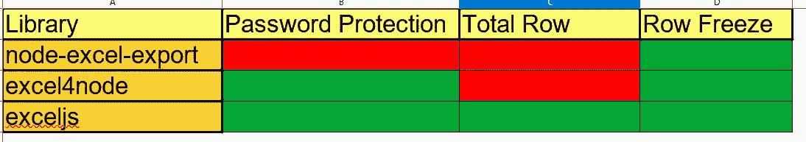
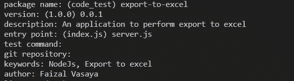
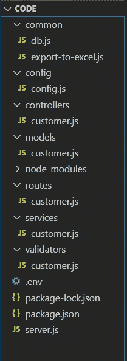
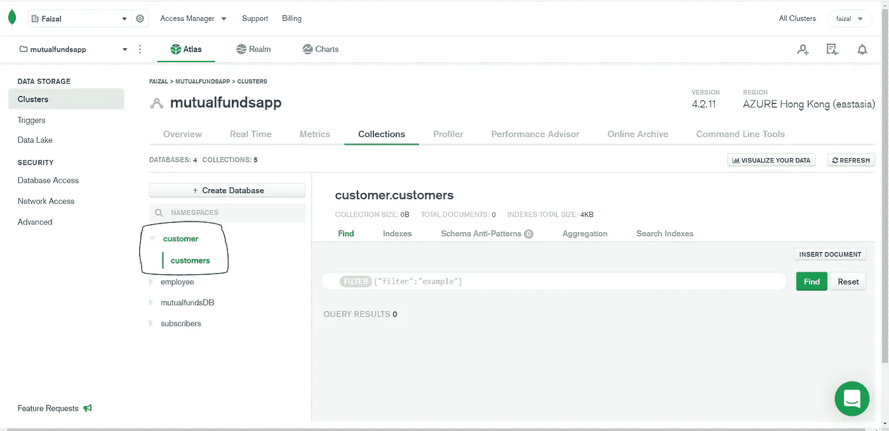
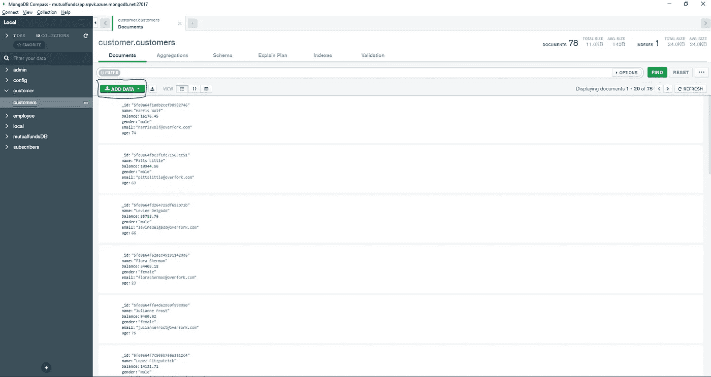
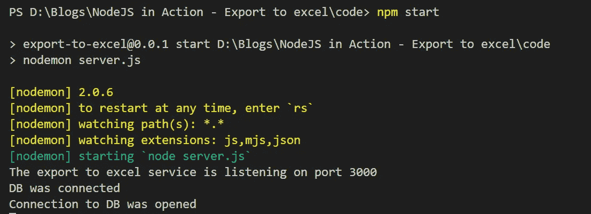
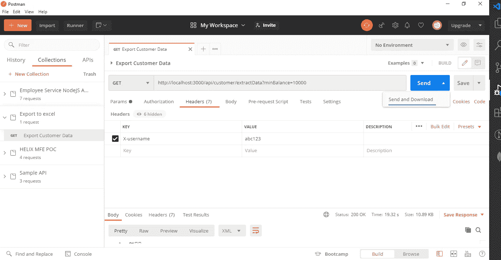

# 在 NodeJS 中解开导出 Excel 之谜

> 原文：<https://medium.com/globant/the-mystery-behind-export-to-excel-in-nodejs-dd2563285e66?source=collection_archive---------0----------------------->

## 如何使用 NodeJS 和 Express 创建到 excel 服务的导出


# 先决条件

读者应该对 NodeJS 和 ExpressJS 有基本的了解，因为这篇文章更多的是针对一个特定的用例，而不是对 Node 和 Express 的概述:)

# 用例

几个月前，我被分配了一项令人难以置信的任务，为银行领域的一个应用程序创建导出到 excel 服务。我们花了大量的研究、努力和毅力来实现这个目标，因此我们想到与开源社区共享这个库。

让我们制定导出到 excel 服务的基本要求。

*   导出的 excel 文件应包含当前银行余额大于等于查询参数中指定金额的客户列表。
*   工作表应受密码保护，以便修改，密码为提出导出文件请求的用户的用户名。用户名将出现在请求标题中。
*   默认情况下，包含客户列表的工作表应该应用筛选器。
*   当用户滚动客户列表时，第一行应该冻结。
*   总计行应该显示在最后，以显示所有客户的总余额。

既然意识到了问题陈述，那就一步步来解开这个谜团吧。策略是用 Express 应用程序创建一个 NodeJS，它使用一个库将 JSON 文档从 MongoDB 导出到一个 excel 文件。与往常一样，在 npm 世界中，考虑到有大量的库可用，为定义的用例选择最佳的库需要大量的试错。对于我们的使用案例和功能请求，我们必须从以下可用选项中进行选择:



NPM export to excel libraries mapped to its supported feature set

基于上面提到的技术和特性集分析，我们决定使用 [exceljs](https://www.npmjs.com/package/exceljs) 作为我们的用例。ExcelJS 支持开箱即用的密码保护，这将使我们能够使用用户名作为密码来保护生成的文件。除此之外，它还支持一些特性，比如末尾的合计行和行冻结，以及冻结包含网格标题的第一行。

考虑到这一点，我们已经准备好动手直接研究代码了。我们还在等什么？让我们开始吧。

# 应用程序设置

**步骤 1:** 让我们使用以下命令创建一个 npm 包。

`npm init`

它会问你几个问题，回答如下:



Answering the questions asked while npm init

**第二步:**使用以下命令安装 [express](https://www.npmjs.com/package/express) 、 [http-status-code](https://www.npmjs.com/package/http-status-code) 、[mongose](https://www.npmjs.com/package/mongoose)、 [nodemon](https://www.npmjs.com/package/nodemon) 和 [dotenv](https://www.npmjs.com/package/dotenv) 。

`npm install express http-status-codes mongoose exceljs --save`

`npm install nodemon dotenv --save-dev`

**步骤 3:** 在你的工作目录下创建以下文件和文件夹。



Folder structure to begin the development of export to excel service

**步骤 4:** 接下来，我们将设置数据库。我们将使用 MongoDB [Atlas cloud 数据库](https://docs.atlas.mongodb.com/getting-started)，但是你也可以自由地在本地安装 [MongoDB。](https://mongoosejs.com/docs/connections.html)



MongoDB Atlas with customer database and customers collection

**步骤 5:** 现在，让我们将样本数据插入到客户集合中，以便它可以用于生成报告。我们已经使用了 [json-generator](https://www.json-generator.com/) 工具，使用下面提到的模式来生成样本记录。复制该模式，您应该能够生成大约 33 条用于测试的记录。

```
[
  '{{repeat(5, 100)}}',
  {
    _id: '{{objectId()}}',
    name: '{{firstName()}} {{surname()}}',
    balance: '{{floating(1000, 40000, 2)}}',
    gender: '{{gender()}}',
    email: '{{email()}}',
    age: '{{integer(18, 90)}}'
  }
]
```

**第六步:**从 json 生成器工具下载 json 文件，[使用](https://docs.mongodb.com/compass/current/import-export) [MongoDB 指南针工具](https://www.mongodb.com/try/download/compass)将其导入到 MongoDB 中。这是备份数据库的最后一步。



Customer data imported into MongoDB Compass

**第七步:**将以下内容添加到*中。我们在步骤 3 中创建的 env* 文件。该文件将包含与应用程序相关的所有配置。

```
APPLICATION_ENV=developmentAPPLICATION_PORT=3000CUSTOMER_DB_URL=<Your db connection string>
```

**第 8 步:**在 *config/config.js* 文件中添加以下内容。该文件中的代码负责读取 NodeJS 加载的环境变量，并提供单一访问点。

```
"use strict";const APP = Object.freeze({PORT: process.env.APPLICATION_PORT,ENVIRONMENT: process.env.APPLICATION_ENV,});const MONGODB = Object.freeze({CUSTOMER_DB_URL: process.env.CUSTOMER_DB_URL,});module.exports = {APP,MONGODB,};
```

**第九步:**在 *common/db.js* 中添加如下与建立数据库连接相关的代码。

```
"use strict";const { MONGODB } = require("../config/config");const mongoose = require("mongoose");module.exports = () => {const DB_OPTIONS = {useNewUrlParser: true,useUnifiedTopology: true,};mongoose.connect(MONGODB.CUSTOMER_DB_URL, DB_OPTIONS);const db = mongoose.connection;db.on("error", (error) => {console.log(`Connection to DB failed due to ${error}`);mongoose.disconnect();});db.once("connected", () => {console.log(`DB was connected`);});db.once("open", () => {console.log(`Connection to DB was opened`);});db.on("disconnected", () => {console.log(`Database was disconnected`);});process.on("SIGINT", () => {db.close(() => {console.log(`Connection was closed successfully`);process.exit();});});};
```

**步骤 10:** 在根级可用的 *server.js* 文件中，添加以下内容来测试到数据库的连接，并在端口 3000 上运行 express 应用程序

```
require("dotenv").config();const app = require("express")();const { APP } = require("./config/config");const connectDb = require("./common/db");const customers = require("./routes/customer");connectDb();app.use("/api", customers);app.listen(APP.PORT, () => {console.log(`The export to excel service is listening on port ${APP.PORT}`);});
```

**步骤 11:** 在根文件夹下的 *package.json* 文件中添加启动命令。这里我们设置了 *nodemon* ，以确保每当我们保存对 js 文件的更改时，应用程序都会被重新加载。您的 package.json 应该是这样的。

```
{"name": "export-to-excel","version": "0.0.1","description": "A service for exporting JSON to excel","main": "server.js","scripts": {"start": "nodemon server.js","test": "echo \"Error: no test specified\" && exit 1"},"author": "Faizal Vasyaa","license": "ISC","dependencies": {"exceljs": "^4.2.0","express": "^4.17.1","http-status-codes": "^2.1.4","mongoose": "^5.11.8"},"devDependencies": {"dotenv": "^8.2.0","nodemon": "^2.0.6"}}
```

# 路线和验证

**步骤 1:** 让我们创建一个路由，用户将调用它来生成一个 excel 文件。在 *routes/customer.js* 文件中添加以下内容。这里，我们添加了几个验证器来检查在查询参数中收到的余额和标题中用户名的可用性(记住，需要生成的报告需要查询参数和标题中的用户名来设置密码)

```
const customerRouter = require("express").Router();const customerController = require("../controllers/customer");const {balanceValidator,usernameValidator,} = require("../validators/customer");customerRouter.get("/customer/extractData",balanceValidator,usernameValidator,customerController.extractData);module.exports = customerRouter;
```

**步骤 2:** 下一步是在 *validators/customer.js* 文件中创建验证器。添加以下代码行来创建余额验证器和用户名验证器。

```
"use strict";const { StatusCodes } = require("http-status-codes");const balanceValidator = (request, response, next) => {if (!request.query.minBalance) {return response.status(StatusCodes.UNPROCESSABLE_ENTITY).json({message: "Minimum balance is required to extract customer data",});} else if (isNaN(request.query.minBalance)) {return response.status(StatusCodes.UNPROCESSABLE_ENTITY).json({message:"Minimum balance must be a valid integer or floating point number to extract customer data",});} else if (parseFloat(request.query.minBalance) >=Number.MAX_SAFE_INTEGER - 1) {return response.status(StatusCodes.UNPROCESSABLE_ENTITY).json({message: "Unsupported number to extract customer data",});}next();};const usernameValidator = (request, response, next) => {const username = request.get("X-username");if (!username) {return response.status(StatusCodes.UNPROCESSABLE_ENTITY).json({message: "Username is required to extract customer data",});}next();};module.exports = {balanceValidator,usernameValidator,};
```

**步骤 3:** 现在我们已经验证了我们的请求，让我们创建控制器，该控制器将把 minBalance 和 username 移交给服务进行进一步处理。在*控制器/customer.js* 文件中增加以下内容。

```
"use strict";const customerService = require("../services/customer");const extractData = async (request, response, next) => {try {const username = request.get("X-username");const workbook = await customerService.exportToExcel(parseFloat(request.query.minBalance),request.get("X-username"));response.set({"Content-disposition": `attachment; filename=${username}.xlsx`,"Content-Type":"application/vnd.openxmlformats-officedocument.spreadsheetml.sheet",});return workbook.xlsx.write(response).then(() => {response.status(200).end();});} catch (err) {return response.status(500).json({message: `Internal server error: ${err.toString()}`,});}};module.exports = { extractData };
```

# 准备好嚼肉了吗？

**步骤 1:** 这里是导出到 excel 服务，其职责是从控制器获取最小余额和用户名，查询数据库以获取余额大于最小余额的客户，创建此类客户的 excel 并将其发送回控制器。首先在 *models/customer.js* 中添加以下代码。

```
"use strict";const mongoose = require("mongoose");const customerSchema = new mongoose.Schema({name: {type: String,},balance: {type: Number,},gender: {type: String,enum: ["male", "female"],},email: {type: String,},age: {type: Number,},},{collection: "customers",});module.exports = mongoose.model("Customer", customerSchema);
```

**步骤 2:** 接下来，我们将创建一个简单的服务，它将获取余额高于最小余额的客户数据，并将其返回给控制器。在 *services/customer.js* 中添加以下代码

```
"use strict";const Customer = require("../models/customer");const exportToExcelUtility = require("../common/export-to-excel");const customerProjection = {_id: 0,__v: 0,};const exportToExcel = async (minBalance, username) => {try {const customers = await Customer.find({balance: { $gte: minBalance },}).select(customerProjection);const rows = transformRows(customers);const columns = [{ name: "Name", totalsRowLabel: "Total:", filterButton: true },{ name: "Gender", filterButton: true },{ name: "Age", filterButton: true },{ name: "Email", filterButton: false },{name: "Balance",totalsRowFunction: "custom",totalsRowFormula: `SUBTOTAL(109,E2:E${rows.length + 1})`,filterButton: false,},];return exportToExcelUtility(rows, username, "Customer", columns);} catch (err) {throw err;}};const transformRows = (customers) => {const transformedRows = customers.map((row) => {let transformedRow = [];transformedRow.push(row._doc["name"]);transformedRow.push(row._doc["gender"]);transformedRow.push(row._doc["age"]);transformedRow.push(row._doc["email"]);transformedRow.push(row._doc["balance"]);return transformedRow;});return transformedRows;};module.exports = { exportToExcel };
```

**第三步:*常用/导出到 excel.js* 中的**并添加以下内容。

```
"use strict";const excel = require("exceljs");const exportToExcelUtility = async (rows, username, sheetName, columns) => {// Creating a workbooklet workbook = new excel.Workbook();workbook.creator = username;workbook.lastModifiedBy = username;workbook.created = new Date();workbook.modified = new Date();// Adding worksheet to workbooklet worksheet = workbook.addWorksheet(sheetName, {views: [{ state: "frozen", xSplit: 0, ySplit: 1 }],});worksheet.state = "visible";worksheet.properties.defaultColWidth = 30;// Adding table to worksheetworksheet.addTable({name: sheetName,ref: "A1",headerRow: true,totalsRow: true,style: {theme: "TableStyleLight1",showFirstColumn: true,showRowStripes: true,},columns: columns,rows: [...rows],});// Adding password to worksheet to protect it from editingawait worksheet.protect(username);return workbook;};module.exports = exportToExcelUtility;
```

一旦我们完成了所有这些步骤，运行`npm start`应该会在下面的命令提示符下显示输出



## 如何测试

*   打开 postman，输入网址[http://localhost:3000/API/customer/extract data？minBalance=1000](http://localhost:3000/api/customer/extractData?minBalance=1000) 0，点击发送和下载按钮，如下所示。



*   应该会出现一个提示，要求您将文件保存在给定的位置。
*   一次，用 MS Excel 打开保存。

## 已知问题:

*   如果你需要支持 Libre office，这个库不适合你。此库生成的文件在 MS Excel 和 Libre office 中没有相同的行为。
*   在某些版本的 MS Excel 中，打开文件时可能会收到警告。你可以忽略它们，继续前进。

希望这对你来说是个有趣的实验。如果您在运行上述演示时遇到问题，请随时通过评论或 [LinkedIn](https://www.linkedin.com/in/faizalvasaya/) 联系我们:)