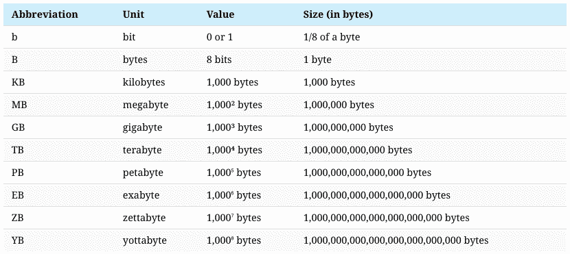
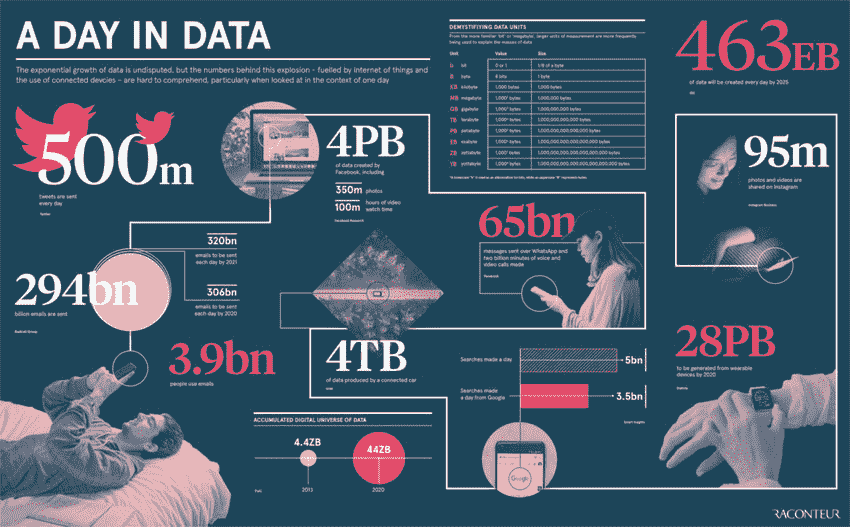
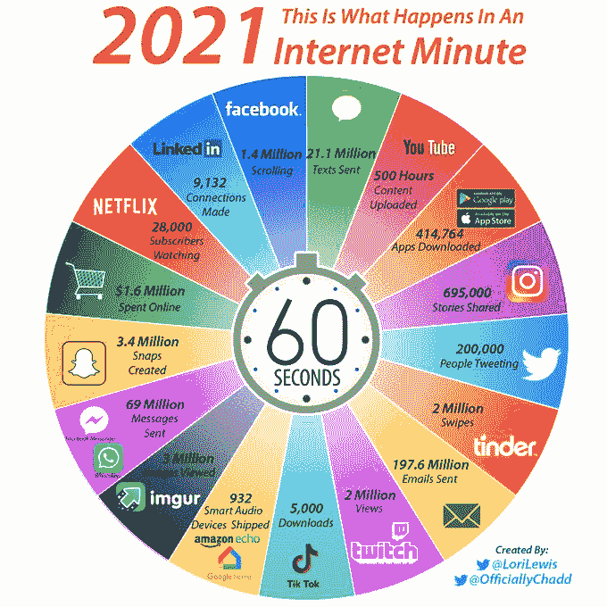
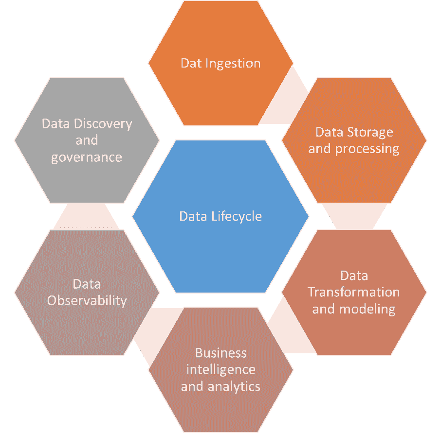
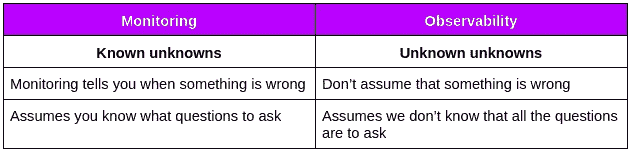
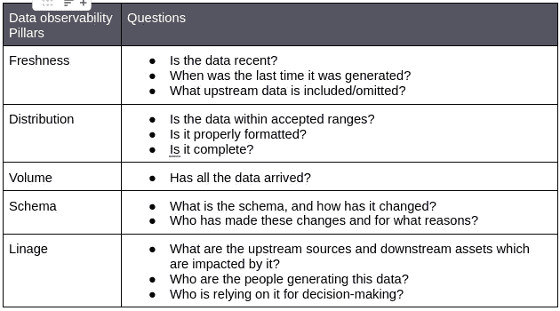

# 对数据可观察性的需求

> 原文：<https://medium.com/globant/the-need-for-data-observability-8bef064ac282?source=collection_archive---------0----------------------->

# 世界数据趋势

根据 [Statista](https://www.statista.com/) 的预测，全球创建、捕获、复制和消费的数据总量预计将快速增长，在 2020 年达到 64.2 兆字节。在到 2025 年的未来五年中，全球数据创建预计将增长到 180 多亿字节。

2020 年，创建和复制的数据量创下新高。这一增长高于之前的预期，原因是新冠肺炎疫情的需求增加，因为更多的人在家工作和学习，并更经常地使用家庭娱乐选项。

# 互联网上有多少数据？

*   据估计，2020 年初，世界上的数据量为 440 亿字节。
*   到 2025 年，全球每天生成的数据量预计将达到 463。
*   谷歌、脸书、微软和亚马逊存储了至少 1,200 的信息。
*   全世界每分钟在互联网上的商品上花费将近 100 万美元。
*   电子艺界每天处理大约 50tb 的数据。
*   到 2025 年，世界上将有 750 亿台物联网设备
*   到 2030 年，每 10 个 6 岁及以上的人中就有 9 个是数字活跃分子。

# 每天产生多少数据？

预计到 2020 年，整个数字世界将达到 440 亿字节

以下是[信息图](https://www.raconteur.net/)中突出显示的一些重要的每日统计数据:

*   发送了 5 亿条推文
*   发送了 2940 亿封电子邮件
*   脸书上创建了 4pb 的数据
*   每辆联网汽车都会产生 4tb 的数据
*   650 亿条信息在 WhatsApp 上发送
*   进行了 50 亿次搜索
*   到 2025 年，预计全球每天将产生 463 的数据，相当于每天 212，765，957 张 DVD！

这种趋势的一个非常生动的例子是 [Lori Lewis](https://lorilewismedia.com/) 的“一分钟内的互联网”，这种数据量每分钟都在移动，使得对数据质量进行评估变得越来越复杂。

目前，[希捷](https://www.seagate.com/gb/en/)拥有约 4 辆 ZB，预计 2025 年将达到 175 辆 ZB

根据数据会议，鉴于今年的数据量预计将超过 180 ZB，数据增长越来越受到关注，同时也为组织提供了更多价值，因此确保数据质量的解决方案几乎没有受到更多关注。

# 数据质量的重要性

数据质量是衡量数据可靠性、完整性和准确性的一项功能，是了解数据是否符合业务需求的一种方式。

云、分布式数据架构和团队的兴起，以及向数据生产的转移，将帮助他们的业务转向更可信的分析和数据的责任推给了数据领导者(除了数据架构师之外，还出现了一些新的角色，如数据管家、数据所有者和数据战略家),这使得获得可靠的数据成为一场漫长的比赛中非常重要的方面，并涉及数据管道中的许多阶段。此外，致力于提高数据质量不仅仅是一项技术挑战，而是一项组织和文化承诺。

数据可靠性是在整个数据生命周期中以高可用性和健康的方式交付数据的能力，作为数据质量报告中数据管道执行期间交付的组件。

如果根据不准确的数据做出关键的战略决策，或者浪费宝贵的时间来查找和诊断数据问题听起来很平常，那么公司就会遭受数据停机。

数据停机的根源是什么？大量不可靠的数据。

数据停机指的是数据不完整、错误、丢失或不准确的时间段。对于任何认为自己是数据驱动的、影响几乎每个团队的组织来说，这都是非常昂贵的，实际上，这通常是在临时基础上以被动的方式解决的。

# 数据平台

除了在数据管道的所有阶段对数据问题进行监控和警报之外，交付可靠的数据还需要智能数据平台，这是一种技术组合，能够从摄取到分析对数据进行整体管理。

在构建数据平台时，重要的是要考虑六个相互关联的基础层:

数据质量是指数据准确、完整、及时以及与您的业务需求一致的程度。

从最基本的角度来说，数据治理是一个主动管理数据的框架，通过提高数据质量来帮助您的组织实现其目标和业务目标。

端到端的数据可观测性对于确保数据质量至关重要。

有效的可观察性工具将连接到您现有的数据堆栈，提供端到端的沿袭，允许您显示下游依赖关系并自动监控您的静态数据，而无需从您的数据存储中提取数据，也不会危及您的安全性或合规性。

具有可观察性使得审计、违规调查和其他可能的数据灾难更容易理解和解决

# 对数据可观察性的需求

数据可观察性是指组织全面了解其系统中数据的健康状况、消除数据停机的能力。

上面概述的挑战正是数据可观察性要解决的问题。

数据可观察性为您提供了对数据管道健康状况的透明度和控制，因此当问题发生时，您可以快速了解:

1.  问题出在哪里？
2.  谁需要解决？

了解这些信息可以更快地发现和解决问题，并最大限度地减少数据停机时间。

可观测性不仅仅是监测，监测涵盖了“已知的未知”，而可观测性涵盖了“未知的未知”。

为了识别和消除数据停机，团队必须利用数据可观察性的五个支柱，并采用自动化检查来监控管道性能。

可观察性可以是一个选项，与数据记录和监控、数据质量管理和分析的最佳实践相结合

数据的可观察性使得发现和修复问题的根本原因变得更加容易

考虑到潜在的高风险问题，使用数据可观察性的解决方案有助于

*   检测并阻止事件传播
*   找到并解决问题的根本原因
*   数据可观察性是一种解决方案，为组织提供了测量其系统内数据的健康和使用情况以及整个系统的健康指标的能力。

通过使用自动记录和跟踪信息，观察者可以解释数据集和管道的健康状况，数据可观测性使数据工程师和数据团队能够识别整个系统中的数据质量问题并发出警报。这使得从根本上解决数据引发的问题变得更快、更容易，而不仅仅是在问题出现时进行修补

# 如何实现数据的可观测性

有一些指标需要考虑，以实现数据的可观察性和数据质量；这些指标可以是关键绩效指标公式的一部分，以实现数据方面的目标和关键成果。

数据质量指标:

*   准确(性)
*   完全
*   一致性
*   一致
*   完整
*   及时
*   独一无二的

如何确保这些质量指标都存在于您的数据集和系统中？

使用类似于软件应用程序可观察性和可靠性的原则，并将其应用于数据质量，这些问题可以被识别、解决并主动呈现。

为了生成这种类型的端到端数据可观察性，有必要记录和跟踪数据管道和数据集内的以下信息:

*   应用
*   用户
*   血统
*   分配
*   基于时间的指标
    频率
    新鲜度
    时间范围
*   完整性
    缺失值
    卷
*   (计划或理论的)纲要

# 实现数据可观察性解决方案的注意事项

为了实现数据弹性并避免数据事故，组织必须采取 3 个关键步骤:

1.  提高数据问题的可见性和意识
2.  根据上下文记录、测量和跟踪数据使用情况
3.  使用自动化持续验证和测试生产中的数据质量

给定软件工程中可观察性的三个支柱:

1.  韵律学
2.  跟踪
3.  日志

这一概念在数据可观察性方面的延伸是 5 个支柱，如下所示:

每一个支柱都涵盖了拥有智能仪表板以实现数据可观察性所需的指标。

问题栏提供了一些示例，作为定义已定义 KPI 公式的指南。

市场上有很多软件工具可以轻松构建令人惊叹的仪表盘，或者构建更复杂、更精密的仪表盘，涉及 ML 和 AI，选择取决于公司、预算、项目、技术平台和其他变量。

数据可观察性之旅更多地取决于团队的具体情况，取决于项目中的目标和 KPI，专注于解决最大的痛点，而不是从已经足够平稳运行的地方开始。

记住倾向于快速行动，展示高价值和投资回报率，并以互动方式处理工作。

# 参考

1.  [Statista](https://www.statista.com/) 是一家专注于市场和消费者数据的德国公司——[2010 年至 2025 年创造、消费和存储的数据量](https://www.statista.com/statistics/871513/worldwide-data-created/)，由[阿恩·冯出版](https://www.statista.com/aboutus/our-research-commitment/388/arne-von-see)
2.  世界经济论坛(WEF)——[每天产生多少数据](https://www.weforum.org/agenda/2019/04/how-much-data-is-generated-each-day-cf4bddf29f/)
3.  洛里·刘易斯媒体——每一秒都很重要，每一个人都很重要