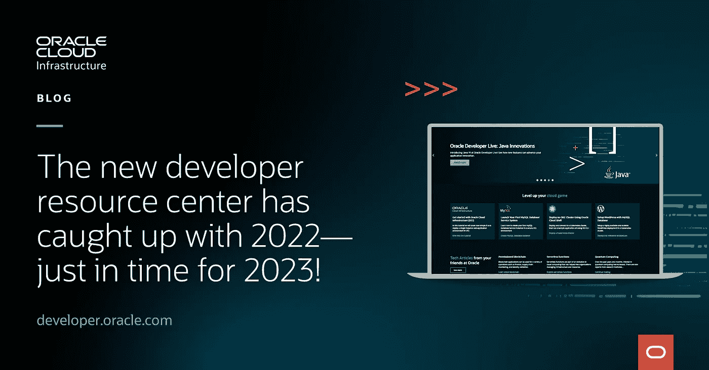

# 新的开发人员资源中心赶上了 2022 年—正好赶上 2023 年！

> 原文：<https://medium.com/oracledevs/the-new-developer-resource-center-has-caught-up-with-2022-just-in-time-for-2023-a4febaa20d8c?source=collection_archive---------1----------------------->

**注:**原作者- [马尼什·卡普尔](https://blogs.oracle.com/authors/manish-kapur)

我们新的开发者资源中心已经工作了几个月，我们很兴奋地宣布重新设计的 developer.oracle.com[的推出。这是一个巨大的进步，我们努力满足开发人员的需求，并提供技术知识，而不是所有的销售和营销绒毛。没有比在我们最重要的 Oracle CloudWorld 大会上发布这一产品更好的时机了。](https://developer.oracle.com/)

Developer.oracle.com 是所有开发者的一站式目的地。对于从新手到专业人员的开发者来说，它是深度技术内容的统一资源。了解 Oracle 提供并与之集成的技术，包括开源技术，并通过教程、示例、实验室和社区互动获得实践经验。

我们改善了用户体验，并在基于云的现代内容管理系统(CMS)上构建了一个全新的设计系统，使我们能够快速创建和更新内容，并与开发人员交互以发布第三方内容和教程。我们甚至集成了 GitHub 和 Markdown 内容管道。我们的目标是为每位开发人员提供应对下一个编码挑战所需的资源，并为使用 Oracle 产品的开发人员提供一个分享经验的平台。

我们不会就此停止更新。在接下来的几个月中，我们将继续对该网站进行进一步的改进，例如动画、交互式内容、可访问性以及与像您这样的开发人员每天使用的工具的集成。

我们努力吸引开发者，而不是卖给他们。Oracle 提供免费和付费服务，以及各种各样的技术，每个开发人员都可以在任何规模的产品中使用这些技术。[Developer.oracle.com](https://developer.oracle.com)是您了解最新可用工具的地方，也是您找到帮助您理解、互动并最终采用新技术的资源的地方。

如果您正在探索云产品，并想知道 Oracle 如何解决您的技术挑战，请查看[developer.oracle.com](https://developer.oracle.com)解决方案可能包含 Oracle 产品，也可能不包含，无论哪种情况，我们都希望为您提供应对您所面临挑战的最佳解决方案。

我们想让这次对话成为双向对话。我们希望收到您的来信，并获得您对您希望在本网站上看到的内容类型的反馈。来[加入我们的 Slack 频道](https://bit.ly/devrel_slack)吧，让我们一起交流想法，不断改进这个网站。欢迎所有人！