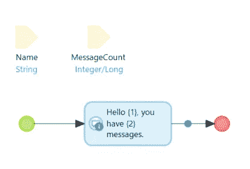
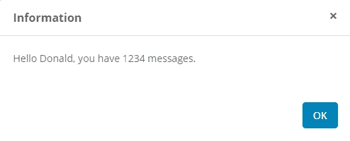
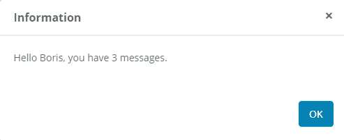

# 从 Java 动作调用 Mendix 微流的新方法

> 原文：<https://medium.com/mendix/the-new-way-to-call-mendix-microflows-from-java-actions-46152923dbbc?source=collection_archive---------0----------------------->


Mendix 8.7 刚刚发布，随之而来的是一种在 Java 动作中调用微流的新方法。

添加了一组新的流畅的 Java 动作来替换内核中旧的[执行方法](https://apidocs.mendix.com/8/runtime/com/mendix/core/Core.html#execute(com.mendix.systemwideinterfaces.core.IContext,java.lang.String,boolean,java.util.Map))。我们现在使用[微流调用](https://apidocs.mendix.com/8/runtime/com/mendix/core/Core.html#microflowCall(java.lang.String))来调用微流，以及相关的 inTransaction、withParam、withParams 和 execute 方法。这些构成了新的[微流调用生成器](https://apidocs.mendix.com/8/runtime/com/mendix/core/actionmanagement/MicroflowCallBuilder.html)界面的一部分。

# 让我们来看几个实际的例子。

首先，我们需要构建一个供 Java 操作调用的微流。在这种情况下，微流将接受两个参数，一个名为 Name 的字符串和一个名为 MessageCount 的 Integer/Long。微流中有一个活动，只说“您好，您有 MessageCount 条消息。”。微流参数中的 Name 和 MessageCount 被替换。我们会保存它 SUB_ShowMessageCount。



我们的第一个 Java 动作将在调用微流时使用 withParam 选项。首先，我们创建 Java 动作。当我们“为 Eclipse 部署”时，这将创建一个存根 Java 操作供我们填充。在这种情况下，我们想告诉 Donald 他有 1234 条消息。

```
// BEGIN USER CODEcom.mendix.core.Core.microflowCall("TestCallingJava.SUB_ShowMessageCount").inTransaction(true).withParam("Name", "Donald").withParam("MessageCount", "1234").execute(this.getContext());return null;// END USER CODE
```

如果我们调用这个 Java 动作，我们调用 TestCallingJava 模块中的 SUB_ShowMessageCount 微流。我们说我们希望它出现在事务中，我们也传递 Name 和 MessageCount 参数和值，然后最终在当前上下文中执行它。这将给我们以下信息。



Donald sees this message.

如果我们不想使用多个 withParam 方法，我们可以构建一个键值的 Java [映射](https://docs.oracle.com/javase/8/docs/api/java/util/Map.html)，并使用 withParams 方法传递它。要调用同一个示例，但是要告诉 Boris 他有 3 条消息，我们可以使用下面的 Java 代码。

```
// BEGIN USER CODEjava.util.Map<String, Object> params = new java.util.HashMap<>();params.put("Name", "Boris");params.put("MessageCount", 3);com.mendix.core.Core.microflowCall("TestCallingJava.SUB_ShowMessageCount").inTransaction(true).withParams(params).execute(this.getContext());return null;// END USER CODE
```

这看起来非常类似于我们之前的例子，但是在开始，我们构建了一个键值的 HashMap[来使用 withParams 传递。运行这个程序，我们会在屏幕上看到以下消息。](https://docs.oracle.com/javase/8/docs/api/java/util/HashMap.html)



Boris sees this message.

# 概括起来

我希望这已经给出了关于从 Java 动作调用 Mendix 微流的有用概述。Mendix 在这里所做的更改让人感觉更加容易和清晰，这应该会带来更好的代码可维护性。现在…去做吧！