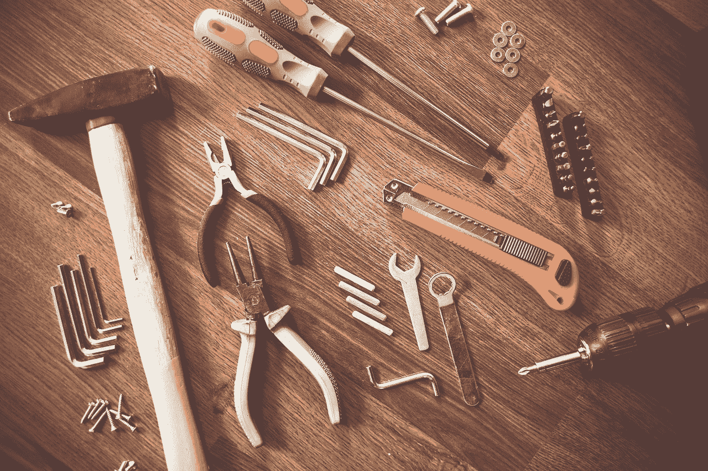
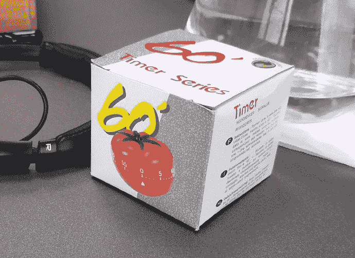

# 新手工具包

> 原文：<https://medium.com/globant/the-newbie-toolkit-adba22fcab0c?source=collection_archive---------0----------------------->

Source: [https://pixabay.com/es/photos/herramientas-construir-embarcaciones-864983/](https://pixabay.com/es/photos/herramientas-construir-embarcaciones-864983/)

我并不擅长写长文章，我更喜欢写得恰到好处，这就是这篇文章的风格:直接而中肯。

今天，我给你们带来了一系列我在学术和职业生活中使用过的工具。说明这一点的最好例子发生在 2015 年夏天，当时我设法在短短一个月内通过了系统工程学位的四门考试(当我的朋友们在海滩上玩得很开心时，这对我是一个重大挑战)。

在这种情况下，首要问题是保持**对**的关注。很难(至少对我来说)专注于一项任务而不被互联网生活提供的所有可能的干扰分心。所以，为了能够集中注意力，我开始使用[番茄工作法](https://francescocirillo.com/pages/pomodoro-technique)。在几天的时间里，通过大量的练习，这种技术帮助我培养了足够的自律能力，可以在几个小时内不看手机的情况下学习，同时还能保持一点社交生活。

第一步:✔现在我很集中，但是我有很多事情要做！下一步该怎么办？我应该从哪里开始？还剩下多少！？我需要有条理，我不能一次做完所有的事情。创建一个[看板](https://es.wikipedia.org/wiki/Kanban)帮助我组织我的优先事项，设定我一次可以做多少事情的限制，并可视化每项任务的进度。举例来说，在结束番茄大战的休息回来后，我只要看看公告板就可以重新组织我的活动。

A great coworker and project partner from Globant gave me this timer as a gift

但是等等…我的朋友们在海边，我在这里，学习…我需要动力，或者至少需要一些东西来推动我坚持下去，不放弃…使用**游戏化**帮助我完成任务，在某种程度上我获得了某种奖励(无论是外部的还是外部的)。因此，通过这些奖励，我能够保持动力和专注，因此**是高效的**。这里有一个有趣的游戏化课程[https://es.coursera.org/learn/gamification](https://es.coursera.org/learn/gamification)。

现在我很专注，也很有动力，但是为了什么？我想去哪里？为了使这一切永久有效，有必要设定一个目标。 [**丰田改进形**](http://www-personal.umich.edu/~mrother/Homepage.html) 让我有可能设定目标，并定义实现目标的小步骤。多亏了指导形，我能够系统地克服前进道路上的障碍。

总而言之，这些工具，我称之为新手工具包，提供了关注点、动力、工作可视化和清晰可达的目标。你做什么来实现你的目标？