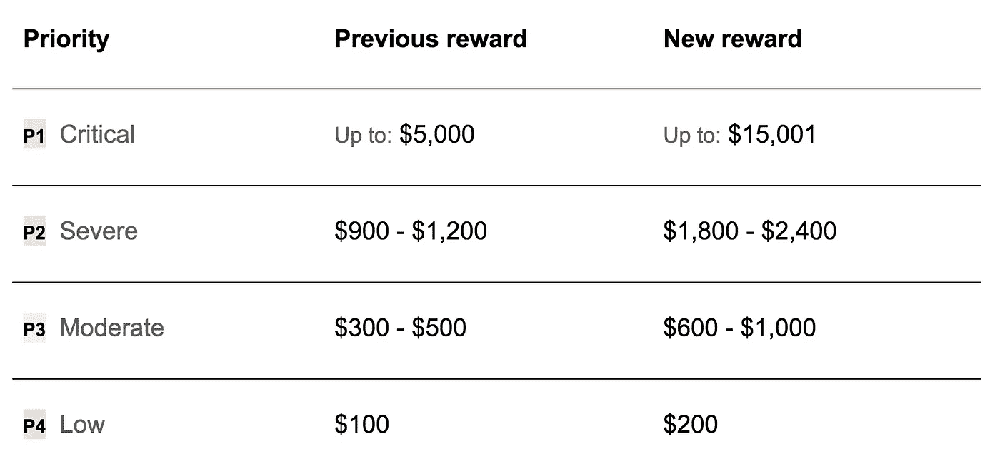

# Pinterest 的下一个 Bug Bounty 时代

> 原文：<https://medium.com/pinterest-engineering/the-next-era-of-bug-bounty-at-pinterest-a646a72a0cd3?source=collection_archive---------2----------------------->

Devin Lundberg | Pinterest 技术主管，产品安全

当安全研究人员发现一个软件中的错误时，负责任的做法是通知公司，以便他们可以修复它。因此，像 Pinterest 这样的平台需要为那些提供有效报告的人提供清晰和可操作的计划，通常是奖励或认可。对我们来说，这是以负责任的披露政策的形式出现的，这是我们多年来发展的。

我们与 [Bugcrowd](https://bugcrowd.com/pinterest) 合作管理该项目，并与他们现有的研究人员社区整合，涵盖各种 Pinterest 属性，包括 pinterest.com 子域名(如 help.pinterest.com)、移动应用、浏览器扩展和开源项目。自 2015 年以来，我们向研究人员提供了金钱奖励(或“奖金”)，并不断提高这些奖励。我们利用 Bugcrowd 的漏洞评级分类法，根据严重性公平分配奖励，这允许对研究人员的奖励有一个合理的预期，并有助于将注意力集中在最具影响力的类型的 bug 上。

这个项目取得了巨大的成功。数百名研究人员参与了该项目。我们已经奖励了超过 35，000 美元给超过 150 个有效的非重复提交，最高的单项奖励是 2，500 美元。

今天，我们再次宣布增加对各级错误的奖励，以显示我们对负责任的披露和研究人员的持续承诺。

如果你是有兴趣参与我们项目的安全研究人员或开发人员，[请阅读 Bugcrowd 上的简介和条款，并加入我们。](https://bugcrowd.com/pinterest)