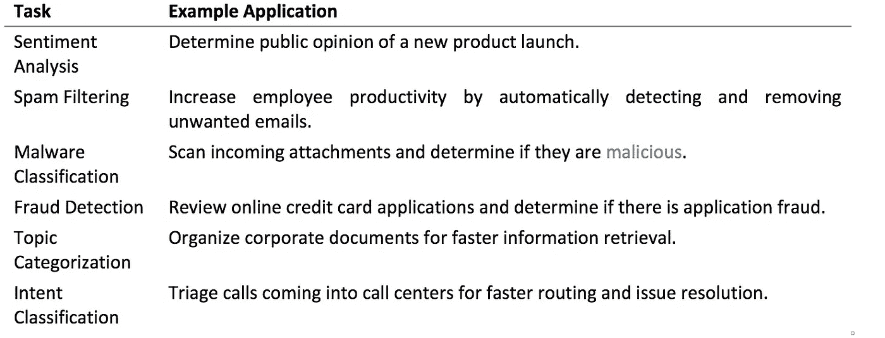

# NLP 剧本，第 1 部分:深入研究文本分类

> 原文：<https://medium.com/capital-one-tech/the-nlp-playbook-part-1-deep-dive-into-text-classification-61503144de78?source=collection_archive---------0----------------------->

Mackenzie Sweeney 和 Bayan Bruss，机器学习工程师，Capital One

# 介绍

Capital One 在 2016 年成立了机器学习中心(C4ML)，以促进机器学习在整个业务中的采用；在这种情况下，我们的团队成为机器学习产品交付、创新、教育和合作伙伴关系的内部、企业范围的咨询和卓越中心。随着 C4ML 的迅速扩展，我们已经解决了各种领域的问题，总是寻求平衡使用最先进的技术和对开发速度、可伸缩性和可解释性的实际关注。C4ML 经常运作的一个领域是自然语言处理(NLP)。去年，我们开始提炼最新的文献，向我们在 C4ML 的同事介绍各种 NLP 问题的最佳技术，我们希望通过这里的一系列博客帖子将我们的讨论扩展到更广泛的 ML 实践者社区。虽然结构可能会有所不同，但我们在每篇文章中的目标是提供一些 NLP 问题类别中最佳模型的整洁比较。与此同时，我们将讨论 Capital One 为使用和推进这些技术正在进行的一些工作。

在这篇文章中，我们从自然语言处理中的一个典型问题开始:文本分类。最简单地说，这需要训练一个模型来学习区分许多已知类别的语言模式。这可以是两类(二进制)或更多类(多类)。对于分类的一个很好的介绍，请查看[这篇博客](/simple-ai/classification-versus-regression-intro-to-machine-learning-5-5566efd4cb83)由大卫·福莫发表的文章。

下表提供了 Capital One 文本分类的一些重要商业应用示例。

具体来说，我们将关注情感分析和主题分类。我们将首先解释表述这些问题的各种方法。为了让您能够为这些任务开发自己的强大系统，我们将提供一个决策树来帮助您在近年来涌现的四种不同方法中进行选择。

# 应用程序

## 情感分析和主题分类

情感分析试图确定文本的情感。根据你对“情感”和“文本”的工作定义，你可以用几种方式来表述这个问题

情感可以是二元的、分类的、顺序的或连续的。当建模为连续时，情绪通常被称为“极性”，类似于正负电荷。下图说明了这些不同的选项，并提供了每个选项的示例。

Sentiment Modeling Options

“文本”的定义是你所关注的写作水平:文档、句子、实体或方面水平。最后两个最好用例子来解释。想象一下对智能手机的回顾，讨论它的优点和缺点。评论者可以讨论相机的正面和负面。也许它的分辨率很高，但变焦距离有限。在这个例子中，手机的相机是实体，人们对相机的多个方面——分辨率和变焦距离——表达了情感。虽然这种情感理解水平通常是理想的，但准确建模也是最具挑战性的。完成这一挑战性任务的一种方法是将文档级情感分析与另一种称为主题分类的分类方法相结合。

## 最先进方法入门

您可能想知道从哪里开始解决您自己的 NLP 问题。Capital One 中的机器学习项目通常从对最先进解决方案的文献综述开始；然而，学术文献的实验很少与具体的商业问题相匹配。我们必须从既定的一流方法转化为针对我们特定用例的定制解决方案。下面的诊断树代表了我们的典型翻译过程，我们提供该过程来帮助您开始您自己的翻译过程。它只需要了解您的数据特征和您自己的时间限制。本节的其余部分将讨论此诊断树中列出的方法，以便您可以快速开始应用您认为最适合您的问题的方法。

Which Model to Use? Your Decision Tree

让我们先从最简单的模型开始。2016 年，Joulin 等人提供了经验证据，证明对于更小、更简单的数据集，在术语频率-反向文档频率(TFIDF)矩阵上训练的逻辑回归模型表现与最佳神经网络模型一样好；它的训练速度也快了一个数量级，实现起来也简单得多。虽然随着数据量的增加，性能会急剧下降，但这个模型仍然是一个很好的基线，任何更复杂的模型都应该超越它。有很多很好的资源可以解释[什么是 TFIDF](/@acrosson/summarize-documents-using-tf-idf-bdee8f60b71)、[逻辑回归是如何工作的](http://blog.yhat.com/posts/logistic-regression-python-rodeo.html)、[如何将它们用于文本分类](http://fastml.com/classifying-text-with-bag-of-words-a-tutorial/)。

在过去十年左右的时间里，深度学习模型在 NLP 的几乎每个任务上都表现出了领先的性能。所有这些模型的起点都有一个共同的任务:将文本表示嵌入到神经网络可以使用的向量中。大多数技术通过[将输入单元分解成密集的嵌入矩阵](https://papers.nips.cc/paper/5477-neural-word-embedding-as-implicit-matrix-factorization)来实现这一点。当这些单元是单词时，这种方法很好地处理了由大多数自然语言词汇的庞大规模所导致的维数灾难。

## 字符 CNN

虽然这种因式分解方法在字符级仍然有用，但最近的研究表明，对于良好的性能来说，这并不是必需的。在字符级工作还有其他好处:它消除了对预处理的需要，可以处理词汇表之外的单词，并且是一种语言无关的方法。例如，张的角色 CNN (2015)跳过了因式分解步骤，使用量化程序嵌入文本——这是第一个公开的这样做的方法。下面的 GIF 演示了这是如何工作的。

Character Quantization

Character CNN Architecture (reference 1)

字符 CNN 由以下阶段组成:

1.选择您的字符集并执行字符量化。

2.为您的文本选择一个合适的长度，并将所有输入内容截断/填充到该长度。张等人选择了 1014，他说“看起来 1014 个字符已经可以捕获大部分感兴趣的文本。”

3.通过 6 个卷积层馈送结果向量，最大池在之间。池层的大小为 3，并且不重叠。在前 2 层使用大小为 7 的内核，然后在最后 4 层使用大小为 3 的内核。

4.通过 3 个全连接层馈送卷积模块的输出，每个层之间有 50/50 的压差。

5.通过您的分类图层输入最终输出。

## 字符 CRNN

Xiao 和 Cho 的字符级 CRNN (2016)将张模型中的一些卷积层替换为递归层，并在嵌入层中添加回。他们声称这可以更有效地捕捉文本序列中的冗长依赖关系。这种方法将所需的参数减少了 1.35 到 90 倍，并且似乎提高了小数据集的性能。该模型中使用的循环层使用长短期记忆(LSTM)单位。

字符 CRNN 由以下阶段组成:

1.一键编码字符，保留您选择的字符集。

2.将编码字符嵌入到大小为 8 的密集实值向量中。

3.应用 2-3 个卷积层；在最后一层使用 3 的内核大小，在前面的层使用 5 的内核大小。在大小为 3 的卷积之间使用最大池。

4.施加 50/50 的压差，然后通过尺寸为 128 的双向 LSTM 馈电；再次应用 50/50 退出。

5.取两个方向的最后一个隐藏状态，连接起来形成一个二维向量。把它输入你的分类层。

Character CRNN Architecture (reference 2)

## 非常深入的 CNN

Conneau 等人(2017)也受到张工作的启发，在字符层面构建了一个文本分类模型。像肖和赵一样，他们认为难以捕捉文本中的长期依存关系是张的字符 CNN 的一个限制，但他们采取了一种非常不同的方法来解决这个问题，认为“LSTMs 是用于序列处理的通用学习机器，缺乏特定于任务的结构……文本具有相似的属性:字符组合形成 n-grams、词干、单词、短语、句子等。”

受用最新和最伟大的从业者技巧(Simonyan 和 Zisserman，2014 年，he 等人，2016 年)连接和训练的大量卷积的成功应用的启发，Conneau 和他的合作者设计了他们自己的用于文本分类的“非常深度的 CNN”(VD CNN)。这个巨大的模型使用 29 个卷积层(比张的模型增加了 5 倍)和分解的字符级嵌入来征服其他层。通过堆叠许多具有较小(大小为 3)内核的卷积，他们声称他们的网络可以自行学习将这些“3-gram 特征”组合成新的分层结构特征的最佳方式。他们的实验表明，他们的方法在大型数据集上确实优于字符级 CNN 和 CRNN，但在较小的数据集上表现不佳。再多层还是买不到免费的午餐。

## 快速文本(Joulin 等人，2016 年)

2016 年，脸书人工智能研究院发布了一个名为 [FastText](https://github.com/facebookresearch/fastText) 的模型。FastText 利用许多已知的性能增强技术来获得接近最先进的精度，与上面讨论的其他方法相比，在训练速度上有显著的提高。FastText 的核心依赖于 Mikolov 的 Word2Vec 论文(2013)中引入的连续词袋(CBOW)模型。在最初的 CBOW 模型中，一个句子中的几个单词被传递到一个单层前馈神经网络中，该模型试图预测应该在这些单词中间的单词。FastText 用预测类别取代了预测单词的目标。这些单层模型的训练速度非常快，伸缩性也非常好。

FastText Model Architecture (reference 4)

除了将 CBOW 模型重新用于文本分类任务之外，作者还使用了许多“技巧”来提高速度和准确性。两个主要的技巧是用一个[层次化的 softmax](http://ruder.io/word-embeddings-softmax/index.html#hierarchicalsoftmax) 替换类别上的 softmax，以及结合降维[散列技巧](https://www.quora.com/Can-you-explain-feature-hashing-in-an-easily-understandable-way/answer/Luis-Argerich?share=03fb46a5&srid=kpBo)使用 n-gram 特征。

FastText 在许多其他任务上也表现得非常好。我们将在接下来的文章中讨论这些。我们通常对 FastText 背后的简单性和良好的工程精神非常满意。正如伍迪·格思里曾经说过的，“任何傻瓜都能把事情变得复杂。只有天才才能让它变得简单。”

# 构建决策树

那么，我们如何理解这四种方法来构建我们的决策树呢？张等人收集、整理并发布了一组基准数据集，对文本分类方法进行了有效的比较。用他们的话说:

“…大多数用于文本分类的开放数据集都非常小…因此，我们没有使用它们来混淆我们的社区，而是为我们的实验建立了几个大规模的数据集，从几十万到几百万个样本不等。”

所有四种方法的作者都使用这些数据集来评估它们的性能，从而能够进行简单的比较。下表提供了每个数据集的一些一般特征。

Datasets (reference 1)

虽然所有模型都使用这些数据集，但 FastText 是最后发布的，它的比较包括这里讨论的所有其他方法。所以我们包括了 FastText 论文的结果，如下所示。

Accuracy (reference 4)

FastText 在文本分类任务中表现非常好。从这些结果中可以看出，在较小的数据集上，它始终优于字符 CNN 和 CRNN。在较大的数据集上，VDCNN 优于 FastText。然而，决策并不像“对小数据集使用 FastText，对大数据集使用 VDCNN”那么简单。VDCNN 是一个复杂得多的模型，这种复杂性带来了培训成本。下表显示了字符 CNN、VDCNN 和 FastText 之间的速度比较。虽然字符 CNN 可能需要几天，而 VDCNN 可能需要几个小时，但 FastText 即使在最大的数据集上也只需几秒钟。

Speed Comparison (reference 4)

最后，我们必须记住，FastText 是在单词级别操作的，而其他方法都是在字符级别操作的。虽然 FastText 的最新版本采用子词“语素”(Bojanowski，2016 年)来处理词汇外的词，但它仍然不是语言不可知的。特别是，FastText 的单词嵌入要求用户使用特定于语言的预处理来处理经常有噪声的数据。

# 结论

我们希望这篇文章给了你一个有用的剧本来解决你自己的文本分类问题。虽然我们不认为这些方法中的任何一种已经“解决”了这些问题，但我们确实相信，将它们放在您的工具包中，并知道如何以及何时应用它们，将有助于您为自己的业务问题设计出有效的解决方案。在以后的文章中，我们计划为其他 NLP 问题提供类似的工具包和剧本。

# 参考

1.张、项、赵军波、杨乐存。2015."用于文本分类的字符级卷积网络."神经信息处理系统进展，649–657。

2.肖，怡君和赵京贤。2016."结合卷积和递归层的有效字符级文档分类."arXiv:1602.00367 [Cs]，一月。[http://arxiv.org/abs/1602.00367.](http://arxiv.org/abs/1602.00367.)

3.Conneau、Alexis、Holger Schwenk、loc Barrault 和 Yann Lecun。2017."用于文本分类的非常深的卷积网络."计算语言学协会欧洲分会第 15 届会议论文集:第 1 卷，长论文，1:1107–1116。

4.朱林、阿曼德、爱德华·格雷夫、皮奥特·博亚诺夫斯基和托马斯·米科洛夫。2016."高效文本分类的锦囊妙计."arXiv:1607.01759 [Cs]，七月。http://arxiv.org/abs/1607.01759.

5.何、、、任、。2016."深层剩余网络中的身份映射."arXiv:1603.05027 [Cs]，三月。【http://arxiv.org/abs/1603.05027\. 

6.西蒙扬，凯伦和安德鲁·齐泽曼。2014."用于大规模图像识别的非常深的卷积网络."arXiv:1409.1556 [Cs]，九月。[http://arxiv.org/abs/1409.1556.](http://arxiv.org/abs/1409.1556.)

7.米科洛夫、托马斯、伊利亚·苏茨基弗、程凯、格雷戈·科拉多和杰弗里·迪安。2013."单词和短语的分布式表示及其组合性."arXiv:1310.4546 [Cs，Stat]，10 月。[http://arxiv.org/abs/1310.4546.](http://arxiv.org/abs/1310.4546.)

8.博雅诺斯基，皮奥特，爱德华·格雷夫，阿曼德·朱林和托马斯·米科洛夫。2016."用子词信息丰富词向量."arXiv:1607.04606 [Cs]，七月。[http://arxiv.org/abs/1607.04606.](http://arxiv.org/abs/1607.04606.)

9.本吉奥、约舒阿、雷让·杜查姆、帕斯卡尔·文森特和克里斯蒂安·贾乌文。2003."一个神经概率语言模型."机器学习研究杂志 3(二月):1137–1155。

10.布雷，大卫 m，安德鲁 Y. Ng，迈克尔乔丹。2003."潜在的狄利克雷分配."机器学习研究杂志 3(1 月):993–1022。

11.加尔，亚林和邹斌·格拉马尼。2015."作为贝叶斯近似的辍学:表示深度学习中的模型不确定性."arXiv:1506.02142 [Cs，Stat]，6 月。[http://arxiv.org/abs/1506.02142.](http://arxiv.org/abs/1506.02142.)

这些是作者的观点。除非本帖中另有说明，否则 Capital One 不属于所提及的任何公司，也不被其认可。使用或展示的所有商标和其他知识产权都是其各自所有者的所有权。本文为 2018 首都一。