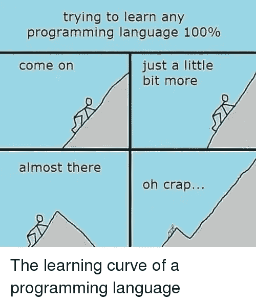

# 一种能统治所有人的编程语言

> 原文：<https://medium.easyread.co/the-one-programming-language-to-rule-them-all-989ccc024b1b?source=collection_archive---------1----------------------->

Rule Them All !!

我在大学的时候，学过三种编程语言。我学了 C，C#，Javascript。那时候，我觉得很难掌握所有这些语言。最让我沮丧的语言是 C#。它具有复杂的语法、多种数据结构、访问级别等。Javascript 简单了很多，但是不使用 C#(我当时用的是 ASP.NET)怎么搭建我的后端呢？

我开始思考是否有一种编程语言可以成为解决所有问题的灵丹妙药。我认为这将使开发人员的生活更加轻松。如果我可以使用一种语言，我为什么要学习越来越多的语言，我可以只用一种语言建立这个世界上的任何东西？所以我开始列出一些“统治一切”编程语言的清单。

> 1.应该能够构建具有不同用途的所有类型的应用程序。
> 
> 2.应该能够在桌面、移动和 web 等不同平台上构建应用程序。
> 
> 3.简单的学习曲线。
> 
> 4.高性能、易读、轻便

所有清单都准备好了，我们开始吧。为了寻找“黄金”编程语言！我尝试学习市场上所有(流行的)编程语言。尝试了一些语言 A 的基础知识，看了语言 B 的教程，等等。回头看看我的清单，看看是否符合任何标准。

随着时间的推移，我仍然找不到任何符合我所有标准的编程语言。这件事的结论是

> **没有解决所有问题的灵丹妙药。**

我知道很多人不能适应各种编程语言。我并不是说我们应该学习所有的编程语言，但是这些人对一种编程语言太熟悉了，他们期望自己能解决各种问题。

然后我又开始思考。如果我找不到任何编程语言来管理它们，如何选择正确的编程语言来解决我的问题，更不用说最大化我的生产力了？回顾我的清单，我发现一些标准可以引导我找到这些问题。问题帮助我确定我是否真的需要学习这种编程语言或找到另一种语言。所以问题来了

The “One Size Fits All” Toilet

## 1.您想构建什么样的应用程序？

软件应用程序有各种用途。有商业应用程序、信息聚合器、生活应用程序、游戏等等。知道你想要构建什么可以引导你找到正确的编程语言。你的应用需要低于 500 毫秒的响应吗？你的应用程序有复杂的计算吗？问一些关于你的应用的问题！

## 2.你的 app 会搭建在什么平台上？

在你找到了你要构建什么样的应用，你要为你的用户提供什么样的价值之后，你需要知道你的 app 会构建在什么平台上。是 web app，手机 app，还是桌面 app？如果是手机 app，是在安卓还是 iOS 上？是 Windows 的还是 Mac 的？因为没有适合所有平台的单一编程语言。每个平台或操作系统都是使用特定的编程语言构建的。比如为什么要做一个 MacOS 的 app 就要学 C#？如果你想做一个 Android 应用，为什么要学 Swift？关键是寻找该平台上可用的语言。

## 3.学习曲线怎么样？

一些平台几乎没有编程语言可供选择。但是有些平台你只能用一种编程语言来构建。比如在 Swift 出来之前，Objective-C 是你构建自己的 iOS 或者 MacOS 应用的唯一选择。在 linux 服务器上构建后端怎么样？你有几种选择，比如 Java、Ruby、Golang 等等。如果你要构建的 app 只有一种编程语言选项，那么学习那种语言是没有选择的。但是如果你有更多的选择，在你开始之前考虑一下学习曲线。因为学习曲线会影响你的生产力。如果语言很难使用，你将来回跳转到 [StackOverflow](http://stackoverflow.com) 或者它的文档来寻找解决方法。我不是说不需要学习(相对)硬的编程语言。但是也要考虑你的情况。你会长期学习吗？你有截止日期吗？

## 4.他们提供的“卖点”是什么？

每个产品都有自己的卖点。我说的不是商业产品——而是任何一种产品，包括编程语言，都有自己的长处。您可以在其文档中找到每种编程语言的优势，或者在社区/互联网上找到任何评论。比如 Golang 就以性能和可读性著称。如果你的应用程序不能忍受额外的 100 毫秒的延迟，那么就用 Golang 吧！或者像 Clojure，对函数式编程有好处。你不用 OOP？将 Clojure 添加到您的选项中！

I hope COBOL still exists these days

## 5.还和市场有关系吗？

如果你是为了工作而编程，在选择语言之前考虑一下这个问题。但如果只是为了好玩，可以跳过这一部分。这一点适用于有“竞争者”的语言。服务器端开发对编程语言的选择很少。事实上，许多人为了工作而编程，这完全没问题。他们需要知道市场需要什么。比如为什么要学 PASCAL(听起来太老了不是吗😂？)什么时候市场需要 Node.js 开发者？或者如果有人真的喜欢在大公司工作，那就学习 Java / C#。他们太需要它了！

太多的选择会让我们陷入选择的悖论。但是，世界上所有的开发人员都在发明新的语言来为其他开发人员服务，以便他们可以更容易地构建自己的应用程序。我想这不是一件坏事。关键不是什么编程语言最好，而是哪种编程语言最能解决我目前的问题。就像在我的[上一篇文章](https://medium.com/easyread/things-i-learned-after-two-years-being-a-software-engineer-c83d5e2c668)中，我了解到编程语言只是解决某个问题的工具。根据您的需求选择合适的语言！没有解决所有问题的灵丹妙药。

希望对你们有帮助。干杯🤙