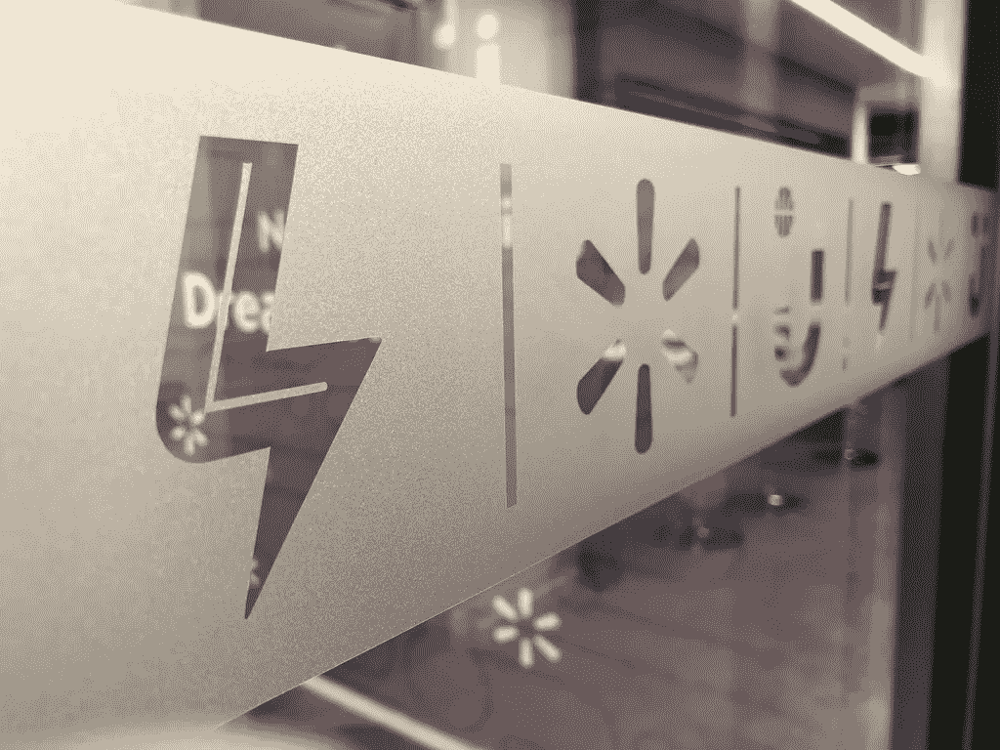

# 另一个技术三连胜:心态、技能、工具

> 原文：<https://medium.com/walmartglobaltech/the-other-tech-trifecta-mindset-skillset-toolset-2c93a4124856?source=collection_archive---------4----------------------->

*人民部分*

谁会让零售更上一层楼？就我个人而言，我赌我的团队。随着沃尔玛推出货架扫描机器人、支付应用、混合云栈、个性化和其他技术来数字化改造业务，它需要思维灵活、行动精确的人。我如何建立一个适应性强的团队？通过一个从未有过的相关公理:心态、技能、工具。

在这三者中，我发现大多数公司依赖工具集——我们每天在工作中使用的触觉技能和物理工具。为了这次对话，他们包括硬件知识、特定的编程语言、按照规范开发的能力…以及许多其他能力。这些类型的技能是可以学习的，很容易定义，并且可以通过学习、经验或两者来扩展。技能组合是相关的，因为它也在成长和变化——它是一个人如何根据他们所知道的工具来行动。

我一直在寻找具备我们需要的特定专业知识的合适人选。是的，我非常重视技能和工具。但是，让我们面对现实吧，技术总是在不断发展。五年前最热门的编程语言并不是我开发当今技术的首选。我们不能再使用五年前的工具，我们需要现代化的开源平台、易于访问的基础设施、卓越的工程笔记本电脑、简单的协作工具等，而且我们会不断更新它们。

尽管心态很难改变。你是否全面地、渐进地应对挑战？你愿意尝试新事物吗？你能很好地与团队合作吗？这就是我要说的，在很大程度上，这是天生的。从招聘的角度来看，如果我可以在懂必要的编码语言的候选人和有创新思维的候选人之间做出选择，我会一直雇佣有态度的人。我发现天赋与持久性和适应性的关系远不止一种编码语言——当然，我雇佣的一些最优秀的人已经使用了几种，并且对每一种都有强烈的看法。正确的态度是自我更新的工具。它更加持久和无孔不入，也是我首先寻找的。

成长中的组织面临的最大问题是如何改变行为，如何提高敏捷性。如果团队中只有 5%的人不参与，创新就永远不会起飞。我不喜欢一个认为“那永远行不通”的员工我希望那个人的反应是，“我可以运送它！”

在过去的六个月里，我一直在让我团队中的每个人都使用同一个工具集(你知道他们——Github、吉拉、Slack、# one ops[http://oneops.com/](http://oneops.com/)、CI/CD 管道等)。).考虑到我们正在实施的项目的多样性，以及我们正在筹备的其他项目，这不是一项容易的任务。但是有了一个为未来做好准备的、有预见性的团队，这是可行的。我们不断简化并提供培训和鼓励，让每个人都有机会更新他们的工具集和技能集。有了弹性船员，真的没那么难。

一家公司可以说它很敏捷，但如果它不是招聘过程中不可或缺的一部分，这也只是口头上的。为了取得成功，像沃尔玛实验室这样的团队需要能够适应行业变化的充满活力的头脑。如果有人有正确的心态——动机、多才多艺、好奇心——我可以给他们一切需要的东西，让他们发展自己的技能，在公司(甚至在另一家公司)的各种岗位上工作！正确的心态打开了可能性，但是只有拥有正确工具集的候选人将会被淘汰。