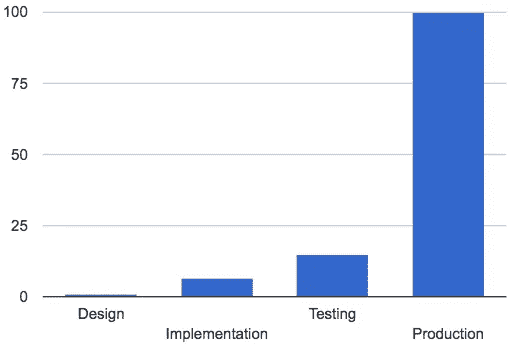

# 跳过 TDD 和代码评审的惊人成本

> 原文：<https://medium.com/javascript-scene/the-outrageous-cost-of-skipping-tdd-code-reviews-57887064c412?source=collection_archive---------2----------------------->

The Color of Money — Chris Potter (CC BY 2.0)

***更新 2019 年 1 月 26 日:*** *我注意到“修复一个生产 bug 可能比在设计时修复一个 bug 多花费****100 倍*** *”的说法是不真实的。我仍然认为 TDD 具有积极的投资回报和节省时间的能力，但是你应该把这看作是一种主观意见，而不是科学事实。我们的行业非常需要关于 TDD 和其他质量控制措施的影响的更好的数据收集。对于大学和大型软件组织之间的研究合作来说，这将是一个很好的主题。*

近年来，越来越多的公司邀请我谈论测试驱动开发(TDD)的好处，并分享如何实现更高效的质量过程的建议。

TDD 是编写自动化测试的过程，以确保在编写实现之前代码能够工作。您编写一个测试，看着它失败(红色)，编写实现，看着测试通过(绿色)，如果需要的话进行重构。当你构建系统时，重复这个循环。

这个过程已经得到了深入的研究，并且已经证明它对于提高软件质量非常有用。但是，您是否知道它也为组织节省了大量时间和金钱？

经理们列举的等待这么久才实施 TDD 的主要原因之一是成本。使用 TDD 时，最初的[项目构建通常会多花 30%的时间。](https://www.computer.org/csdl/mags/so/2007/03/s3024.pdf)

那些管理人员需要知道的是 [TDD 减少了 40% — 80%的生产 bug 密度](https://www.computer.org/csdl/mags/so/2007/03/s3024.pdf)，这是非常重要的。生产中更多的错误导致维护成本急剧上升。

由于返工、元工作(关于工作的工作)、责任移交、中断以及最终的客户支持、bug 分类和维护的成本呈指数级上升，修复一个生产 bug 的成本可能比在设计时修复一个 bug 多 100 倍，比在实现时修复一个 bug 多 15 倍。

***注:*** *这种说法受到了质疑，但毫无疑问，软件质量提高了开发人员的生产力。参见* [*“软件质量的经济学”*](https://www.amazon.com/Economics-Software-Quality-Capers-Jones/dp/0132582201) *深入了解软件质量的可用数据，以及软件质量对您的组织可能产生的影响。我们需要对软件质量度量进行更多的研究，这样我们就可以对如何管理开发团队做出更明智的决策。*

Relative costs of fixing bugs

使用这些数字，让我们看看一个虚构的项目在有和没有 TDD 的情况下的相对成本。该项目将需要 1000 小时的前期实施，不包括 TDD，也不包括维护:

在我们虚构的例子中，我们节省了 623 个工时，或者对于一个 4 人的团队来说，节省了大约一个月的开发时间。如果我们向每个开发人员支付美国全国平均水平(9.5 万美元)，并在工资之外扣除平均 30%的福利，我们将节省近 37，000 美元。

当然，这是一个虚构的例子，做了很多假设。您的收获将基于许多因素而变化，包括您的团队在 TDD 方面的经验，是否存在其他质量度量(例如代码审查)等等…

以下是所做的假设:

*   没有 TDD 的生产错误:100
*   使用 TDD 的生产 bugs(减少 60%，介于 40% — 80%之间)
*   在实施(TDD)阶段修复 bug 的平均时间:1 小时(该数字仅用于计算产品 bug 修复成本)
*   修复一个产品缺陷的平均时间:大约 15 小时

玩弄这些变量中的任何一个显然都会改变结果。非常确定的是，TDD 节省了时间和金钱，因为维护成本被考虑在内——大量的时间和金钱。

根据我在实际生产项目中的经验，这个虚构例子的相对结果对我来说是真实的，无论有没有 TDD。

## 代码审查也有类似的效果

代码审查也有类似的效果。事实上，一些研究发现代码审查比 TDD 更有效。根据 1988 年的一项研究， [**花在代码审查上的每一个小时可以节省 33 个小时的维护时间**](http://www.ifsq.org/finding-ia-2.html) 。

这非常不寻常，但是代码审查的 bug 捕获好处与我的个人经验并不一致。我发现自动化测试在捕捉 bug 方面更有用——那么我们如何解释代码审查的非凡有效性呢？

**知识分享。**当您使用代码评审时，您的团队会在开发人员使用反模式和其他不良实践时进行自我纠正。与此同时，他们分享有效的模式，互相教授更好的做事方法，并互相教授如何编写更可读的代码。

最终的结果是，你的初级开发人员很快上升到团队中最聪明的开发人员的水平，并且你的整个团队的速度提高了。在你的团队中，很难过分强调导师文化的价值。

# 中断的代价

为什么修复生产 bug 要多花这么多钱？因为一旦一个 bug 到了生产阶段，成本远不止是简单的修复 bug 的成本。

在生产中修复一个 bug 比在开发过程中修复一个 bug 要昂贵得多。要了解这种差异的大小，首先必须了解打断一个开发人员的成本。

产品 bug 修复通常意味着功能开发的上下文和节奏的中断。换句话说，开发人员从他们当前工作的环境中被拉出来，转到 bug 的环境中，在那里需要时间来吸收相关的代码和流程，诊断根本原因，修复 bug，然后重新吸收他们之前工作的环境。

[每一次上下文切换都会耗费开发人员 20 分钟的生产力](http://blog.ninlabs.com/2013/01/programmer-interrupted/)，但是流血不止。打断开发人员来修复一个 bug 很可能会导致他们在被打断之前正在处理的代码中出现更多的 bug。根据微软的研究，[一个被中断的任务需要两倍的时间来完成，并且包含两倍于未被中断的任务的错误](http://dl.acm.org/citation.cfm?doid=985692.985715)。

换句话说，修复生产中发布的 bug 的成本不仅仅是修复生产 bug 的成本。中断会增加当前开发工作的成本，并引入更多最终需要修复的错误。

另一方面，多任务处理是一个非常糟糕的主意。为了提高效率，开发人员需要一次专注于一件事。

# 结论

下一次有人告诉你他们没有时间或预算进行 TDD 或代码评审时，自信地告诉他们，“在这种情况下，你真的没有时间或预算跳过 TDD”。

# **接下来的步骤**

更好地理解 TDD 及其在软件开发过程中的作用:

*   [“关于 TDD 和单元测试的 5 个常见误解”](/javascript-scene/5-common-misconceptions-about-tdd-unit-tests-863d5beb3ce9)
*   [“单元测试 vs 功能测试 vs 集成测试”](https://www.sitepoint.com/javascript-testing-unit-functional-integration/)
*   [“每个单元考试必答的 5 个问题”](/javascript-scene/what-every-unit-test-needs-f6cd34d9836d)
*   [“ES6 中的 TDD&React 网络广播”](https://ericelliottjs.com/product/tdd-es6-react/)
*   通过导师提升你的团队:如何编写更多可测试的代码，TDD，CI/CD 过程，等等

# 通过实时 1:1 辅导提升您的技能

DevAnywhere 是达到高级 JavaScript 技能的最快方法:

*   现场课程
*   弹性工时
*   一对一指导
*   构建真正的生产应用

[https://devanywhere.io/](https://devanywhere.io/)

***埃里克·艾略特*** *是* [*【编程 JavaScript 应用】*](http://pjabook.com) *(O'Reilly)的作者，也是*[*devanywhere . io*](https://devanywhere.io/)*的联合创始人。他为 Adobe Systems******Zumba Fitness*******华尔街日报*******ESPN******BBC***等顶级录音师贡献了软件经验******

**他和世界上最美丽的女人一起在任何他想去的地方工作。**