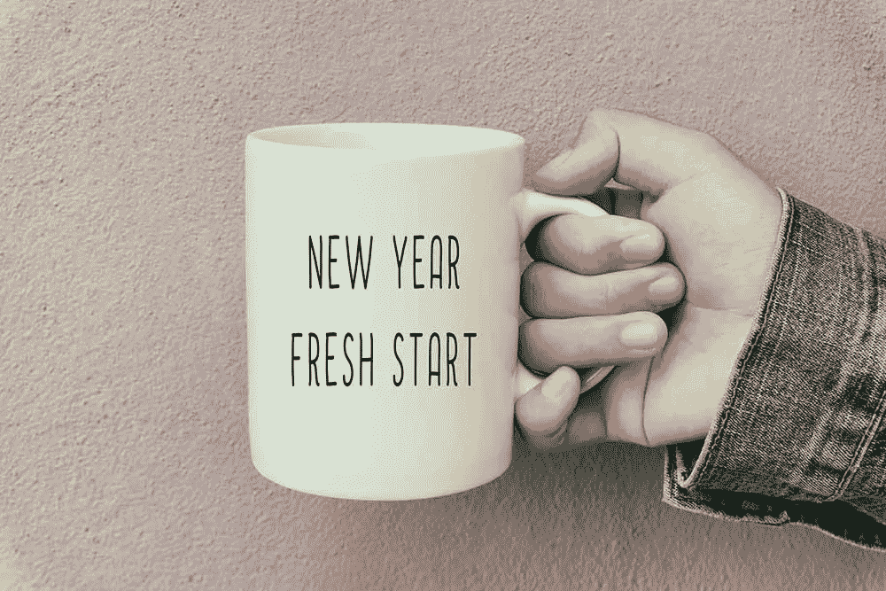
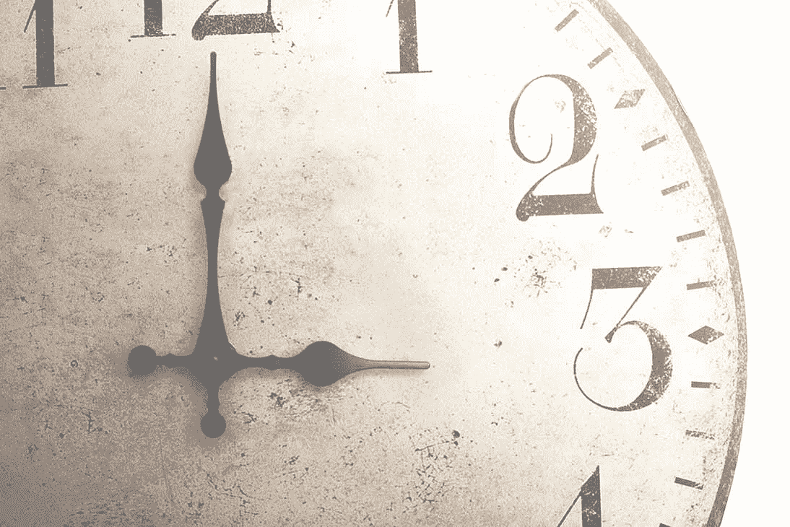
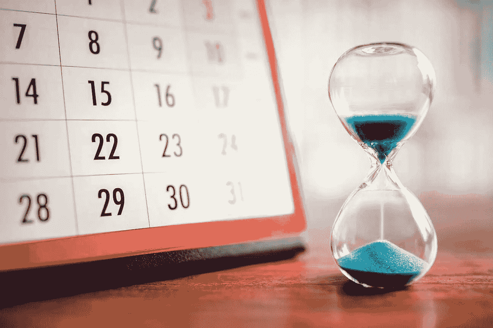
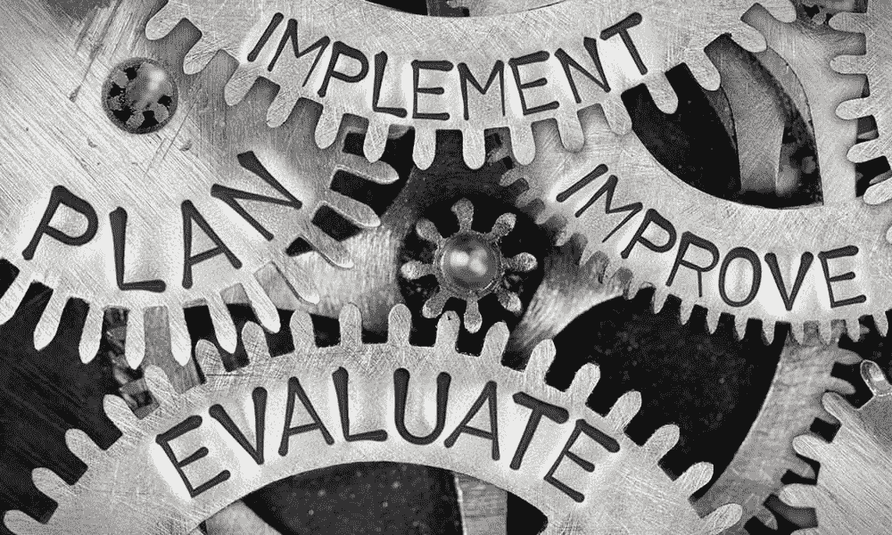

# 10%的力量以及它如何从现在开始改变你的生活。

> 原文：<https://medium.com/walmartglobaltech/the-power-of-10-and-how-it-can-change-your-life-starting-now-e7506f77564d?source=collection_archive---------6----------------------->

# 你在利用时间吗？

> 时间是免费的，**但它是无价的**。你不能拥有它，**但你可以使用它**。不能留着，**但是可以花掉**。一旦你失去了它，就再也找不回来了。 —哈维·麦凯

时间:一个将事件联系在一起的独特系统，代表一种测量形式，并标志着一个重要的时刻或截止日期。

我们抱怨需要更多的时间，希望有能力让它慢下来，或者让它一起冻结。在极少数情况下，你可能会遇到无聊的情况，在这种情况下加快速度可以节省时间！

不管你如何看待时间，有一件事是肯定的:这是一种你无法获得更多的免费资源。最终时间会用完，当时间用完时，你会不会回顾你的生活，希望你有效地利用了时间？

# 你达到了你人生中想要的目标了吗？

你也有能力完成你想做的任何事情，然而，有时怀疑、不安全感、恐惧或拖延会悄然而至，阻碍你在生活中前进。

你可以采取两个简单的步骤来克服这个恶性循环:(1)学会设定现实的目标(2)更有效地管理你的时间。

在这篇文章中，我将分享一个我使用的叫做“10%的力量”的技巧。这是一个简单而有效的方法，可以帮助你更好地利用时间，当你设定现实的目标时，你会消除以下负面情绪:

*   **怀疑:**“我不相信我能做到。”
*   **不安全感:**“我太老了，开始不了。”
*   恐惧:“我还没准备好。”
*   **拖延症:**“我明天就开始。”

# 你有 10%的时间吗？

你是否觉得陷入了一个无法在生活中前进的循环中？如果我告诉你 10%可以改变你的人生，你会相信吗？让我们分解一下，看看…

## 10%的力量

一年有 8760 个小时。如果你拿走其中的 10%，你还有 876 个小时。你可能会想，“那又怎么样”。让我进一步解释一下。

所以在剩下的 876 小时中，你得到:

*   一个月 73 小时
*   一周 17 小时
*   一天 2.4 小时

所以问题来了，“你如何利用你一年的 10%或者一天的 2.4 小时呢？”你会利用这段时间狂看网飞的节目、浏览你的社交媒体账户、YouTube 或者阅读名人新闻吗？

现在花点时间自我反省。你是否看到了一个机会，可以将你的努力重新聚焦于实现一个迟迟未能实现的目标？

# **用每天 2.4 小时改变你的生活**

今年你有想要完成的变革目标吗？如果有，帮我个忙:第一步，想好你的目标，写下来。第二步，找出你可以重新集中精力的机会，腾出**每天 2.4 小时**来实现你的目标。第三步，投资自己。

## 投资自己

这完全是对自己的投资。这里有几个简单的例子:

*   当早上准备好或者坐在车阵中的时候，听一本有声读物，学习一些新的东西
*   花时间做你的兼职项目，而不是在电脑前或看电视
*   如果你要去旅行，把钱花在一个你感兴趣的主题的会议上
*   从快乐时光中休息一会儿，然后回家，为你的个人里程碑分配时间

记住，你可以随心所欲地使用你每天 2.4 小时的**。这里 30 分钟，那里一小时。目标是学习如何掌握你的时间，消除浪费。如果你不控制你的时间，别人会，时间最终会控制你。**

# ****今年你会有什么不同****

****

**你将如何处理这些信息？**

**你会继续让怀疑、不安全感、恐惧或拖延拖你的后腿，还是会通过努力做好以下事情来掌控自己的生活:**

*   **设定[现实的目标](/walmartlabs/these-three-basic-principles-will-help-you-accomplish-anything-2e5dbbbe0402)**
*   **用 10%的力量来实践高效的时间管理**
*   **投资自己**

**问问你自己，你想对你的工作、个人生活和人际关系产生什么样的影响。我保证，如果你用今年 10%的时间关注你自己，这将改变你的生活。**

**现在就行动起来，把它完成！**