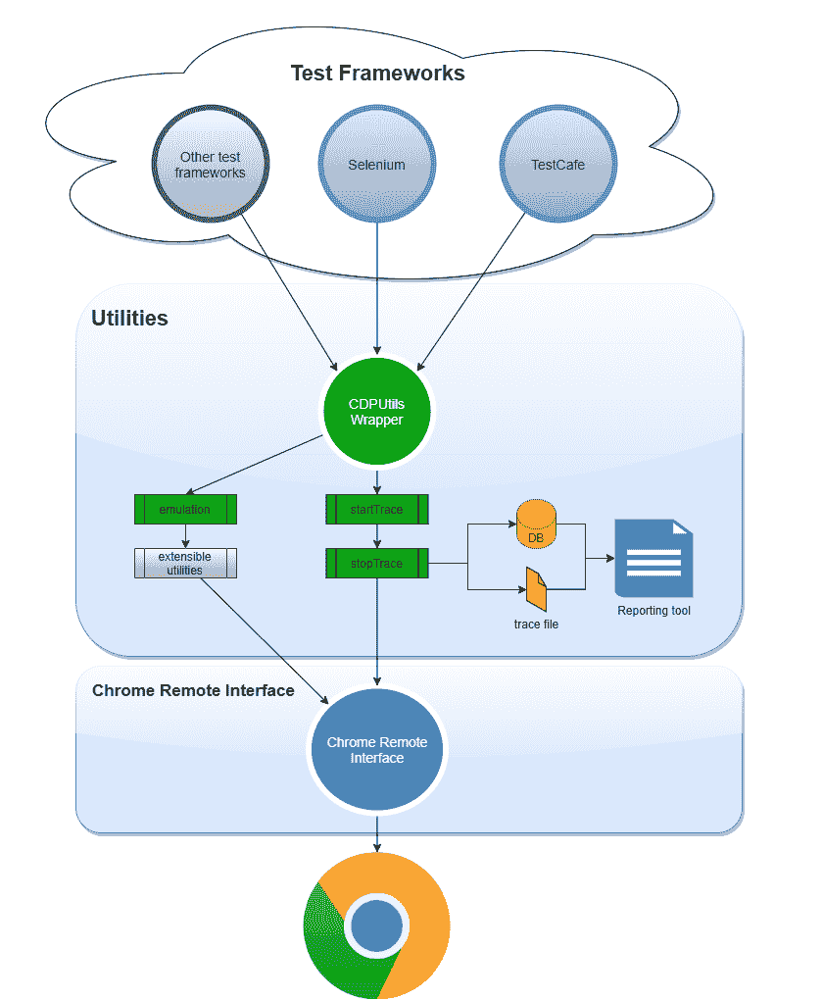
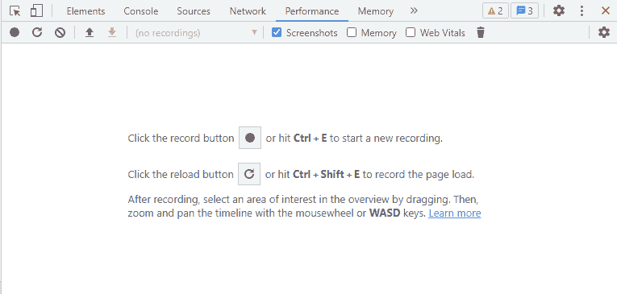
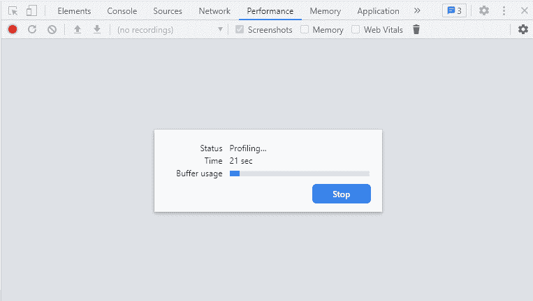
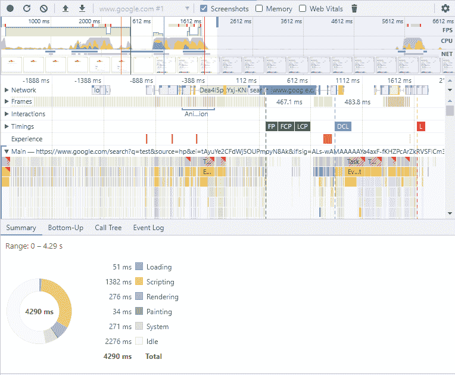
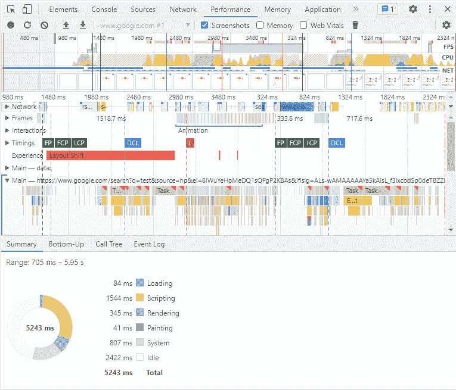

# Chrome Devtools 协议的力量

> 原文：<https://medium.com/globant/the-power-of-chrome-devtools-protocol-cbb2c47f1c29?source=collection_archive---------0----------------------->

## 第一部分—追踪域


首先，我想描述一下 CDP 是什么意思。[“Chrome Devtools 协议”](https://chromedevtools.github.io/devtools-protocol/)是一个强大的调试和剖析 Chrome 的协议。通过这个协议，你将可以访问不同的“域”,这将允许你像使用 Chrome 开发工具那样与浏览器进行交互。这就是测试自动化和性能测试出现的时候，我想通过描述如何独立于任何自动化工具将 CDP 集成到测试自动化或性能测试过程中来开始这篇文章，只需使用 CDP 而无需做太多的工作。在您可以使用的功能之间，有跟踪、性能、模拟网络条件(网络节流)、读取控制台消息、模拟地理位置等等。

我将在这篇文章中描述一些在测试过程中发生在日常生活中的测试场景，它将利用这个伟大的协议，你将通过编程访问 Chrome 拥有的宝石。

文章分为不同的部分，如:

*   [跟踪](https://chromedevtools.github.io/devtools-protocol/tot/Tracing/)域，它将允许您获取跟踪指标。
*   [网络](https://chromedevtools.github.io/devtools-protocol/tot/Network/)域，我们将捕获网络请求并将其导出到 HAR 文件。
*   R [untime](https://chromedevtools.github.io/devtools-protocol/tot/Runtime/) 域，允许我们从浏览器中提取控制台日志、错误和警告。
*   [性能](https://chromedevtools.github.io/devtools-protocol/tot/Performance/)允许您获取性能指标的域。

# 必需的包

使用 CDP 需要一些依赖项。我已经将它们添加到我的 package.json 文件中，作为每个域提供的不同特性的实用工具。

```
npm install chrome-remote-interface
npm install chrome-har
npm install devtools-protocol
npm install [@types/har-format](http://twitter.com/types/har-format)
```

## 包装参考

*   **chrome-remote-interface**→CDP 上的抽象。这里可以找到[这里](https://github.com/cyrus-and/chrome-remote-interface)。
*   **chrome-har** →将网络事件消息转换为 har 格式。这里可以找到[。](https://github.com/sitespeedio/chrome-har)
*   **devtools-protoco** l →协议类型的类型脚本定义。这里可以找到[的](https://www.npmjs.com/package/devtools-protocol)。
*   **@ types/har-format**→har 格式的打字稿定义。这里可以找到。

# 放弃

由于这篇文章和更多的调查工作，我已经在提到的包之上开发了一个包装器，它将展示如何使用这个协议。它可以在 https://github.com/germanbisogno/cdp-utils 的[找到，它不是任何实际工具或库的替代品；相反，它只是一个包装器，带有用于测试自动化或性能测试的通用工具。如果您希望在您的项目中使用提到的包，您可以使用 chrome-remote-interface 或 chrome-har 直接导入这些包，就像该项目在其 package.json 中引用的那样。](https://github.com/germanbisogno/cdp-utils)

请查看下图，以便更好地理解:



A basic representation of how Test Frameworks can interact with CDP through Chrome Remote Interface.

# 使用跟踪域

Chrome 开发者工具允许你记录性能，你可以将它导出到一个 JSON 文件，如下图所示，你可以使用开发者工具手动完成:



The tab shown in the image above is to Analyze runtime performance. You can start the recording by clicking in the top left circle.



The image above shows the recording in progress.

对于这个例子，我们将记录一个简单的在 Google 中搜索的测试动作。完成记录后，它会显示许多关于跟踪的丰富信息，例如:



How the result of a recording looks like.

正如你所看到的，有关于加载、脚本、渲染和绘画的信息，它还捕捉了我的手动测试的截图(在谷歌中搜索)。

如果你需要更多关于如何使用性能标签的信息，你可以点击查看[。](https://developer.chrome.com/docs/devtools/evaluate-performance/reference/)

# 我们如何实现自动化？

这可以通过使用[跟踪](https://chromedevtools.github.io/devtools-protocol/tot/Tracing/)域来完成，该域目前是 CDP 中的一个实验性功能，将捕获我们之前使用开发人员工具所做的工作。

请注意，像[木偶师](https://github.com/puppeteer/puppeteer)、[测试咖啡馆](https://github.com/DevExpress/testcafe)和 [Selenium 4](https://www.selenium.dev/blog/2021/announcing-selenium-4/) 这样的优秀框架已经在使用这个协议。你也可以看看这些并实现它们。

我们将使用 CDP，我选择了 Selenium 作为测试框架来展示如何将其与该协议集成。现在，让我们进入代码！

首先，我们需要为 CDP 连接创建一个 cdpClient.ts 文件:

现在我们有了一个实例化 CDP 客户端的类，让我们创建一个抽象类 traceOperations.ts，在这种情况下为`startTrace`和`stopTrace`定义两个功能，然后我们将从这个类扩展到其余的专用类。

请注意，当我们停止跟踪时，将有可能从不同的域中检索数据，如运行时、跟踪和性能，其中包括在我们开始和停止跟踪时获取指标。

让我们实现`Tracing`类并从`TraceOperations.`扩展它

我们在这里使用了一些命令，如`Tracing.start`，它将启动跟踪并接收跟踪配置，我们稍后将描述可以在其上配置什么。

我们利用两个事件`Tracing.dataCollected`来从 Chrome 中产生的事件中收集数据，以及在数据收集后执行`Tracing.End`时调用的`Tracing.tracingComplete`，然后我们将能够将跟踪存储到一个 JSON 文件中，该文件可以从 Chrome 中导入，或者只是将事件返回到测试中，并执行断言或任何其他您想要对数据执行的操作。

有关跟踪事件格式的更多信息，请参见此[链接](https://docs.google.com/document/d/1CvAClvFfyA5R-PhYUmn5OOQtYMH4h6I0nSsKchNAySU/preview)。

# 配置文件

请注意，`Tracing.start`命令需要一个配置，此处描述为，在本例中，我们提供了 cdp.config.json 部分，其中指定了我们希望包含在跟踪中的类别。例如:

注意第 5 行中使用了“-*”。您排除了任何类别，在本例中，我们已经明确指定了它们，例如，“disabled-by-default-dev tools . screen shot”将用于在我们的跟踪中包含屏幕截图。

# 开发一个测试！

我们有一个类来建立客户端连接，另一个类来执行跟踪。因此，让我们在 Selenium 测试中实现它们吧！。它将在谷歌搜索给定的标准。

值得一提的是，在下面的例子中，我们使用 POM ( *页面对象模型*，一种用于测试自动化的模式)来创建一个 Google 页面。你可以在这里找到更多关于这个模式[的详细信息。](https://www.browserstack.com/guide/page-object-model-in-selenium)

请注意，在前面的代码中需要强调几件重要的事情— remote-debugging-port=${port}。这将需要在一个特定的端口，通常是 9222，使用 CDP 来启动 Chrome。在本例中，我们使用 endpoint-utils 包来获得一个空闲端口；这里可以找到[。如果您正在并行运行测试，那么最好使用一个工具来为每个 CDP 会话获取一个空闲端口。](https://github.com/inikulin/endpoint-utils)

最后，我们可以在 Chrome 中导入 tracing.json 文件，瞧！我们手中又有了丰富的信息！



Importing the resulting file into the performance tab in Chrome.

希望你已经享受了前一节，你可以开始使用跟踪域了！

# 结论

我们讨论了跟踪领域和它的一些不同特性，正如你所看到的，这就是为什么我把这篇文章称为“CDP 的力量”。这是非常强大的，我们可以利用 Chrome 和许多其他领域进行许多操作，这对开发人员和测试人员或任何对这个伟大协议感兴趣的人来说都是一个真正的瑰宝。当您测试您的应用程序、创建基线和监控您的测试结果时，有许多丰富的信息需要获取。

我们将在接下来的文章中继续讨论更多的领域。我还想介绍更多关于处理所有这些信息的内容，并通过引入更多的处理和报告工具以一种时尚的方式将其可视化。

希望你喜欢这次旅行！下次见！

**感谢阅读！**