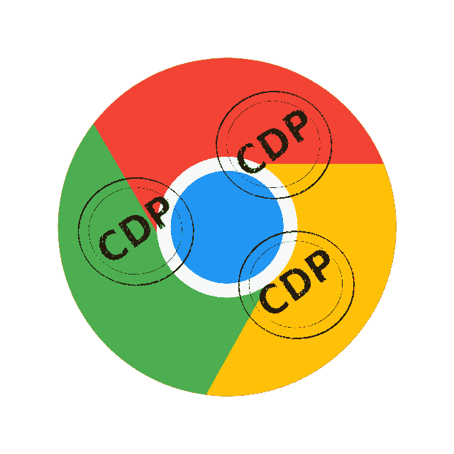

# Chrome Devtools 协议的力量——第四部分

> 原文：<https://medium.com/globant/the-power-of-chrome-devtools-protocol-d4711a1db53d?source=collection_archive---------0----------------------->

第四部分—绩效领域



在[上一篇文章](/globant/the-power-of-chrome-devtools-protocol-f4b1bcd4fb34)中，我们介绍了使用 [CDP](https://chromedevtools.github.io/devtools-protocol/) 的[运行时](https://chromedevtools.github.io/devtools-protocol/tot/Runtime/)域的强大特性，以及如何在 Selenium 测试中实现它。在本文中，我们将讨论[性能](https://chromedevtools.github.io/devtools-protocol/tot/Performance/)领域，以及我们如何在测试运行期间从页面中获取性能指标。

你可以在 https://github.com/germanbisogno/cdp-utils 找到完整的代码。让我们投入进去吧！

# 使用性能域

[性能](https://chromedevtools.github.io/devtools-protocol/tot/Performance/)域的主要目的是从页面中获取指标。我们将关注于`getMetrics`方法，它将允许我们在测试执行期间提取运行时指标。

请在下面找到一些可以通过这个 API 使用的基准；如果你需要更多关于度量的信息，你可以查看木偶师文档[这里](https://github.com/puppeteer/puppeteer/blob/main/docs/api/puppeteer.page.metrics.md):

*   `Timestamp`:获取度量样本时的时间戳。
*   `Documents`:页面上的文件数量。
*   `Frames`:页面的帧数。
*   `JSEventListeners`:页面上事件的数量。
*   `Nodes`:页面上 DOM 节点的数量。
*   `LayoutCount`:全部或部分页面布局的总数。
*   `RecalcStyleCount`:页面样式重新计算的总数。
*   `LayoutDuration`:所有页面布局的组合持续时间。
*   `RecalcStyleDuration`:所有页面样式重新计算的总持续时间。
*   `ScriptDuration`:JavaScript 执行的组合持续时间。
*   `TaskDuration`:浏览器执行的所有任务的总时长。
*   `JSHeapUsedSize`:使用的 JavaScript 堆大小。
*   `JSHeapTotalSize`:总的 JavaScript 堆大小。

如果你想获得其他 web 重要 KPI，如 [LCP](https://web.dev/lighthouse-largest-contentful-paint/) (最大内容油漆) [CLS](https://web.dev/cls/?gclid=Cj0KCQjwteOaBhDuARIsADBqRejyKA3K3vtbIbyFeUeclXYShlDEOk4jeGOqgkJ548C8nVdsMdPinlkaAjCbEALw_wcB) (累计布局移位)或 [TBT](https://web.dev/lighthouse-total-blocking-time/) (总阻塞时间)，你可以使用 Google [Lighthouse](https://github.com/GoogleChrome/lighthouse) ，本文不做介绍。

# 我们如何实现自动化？

让我们实现一个用 Typescript 编写的类`Performance`，我们将从`TraceOperations`再次扩展它，就像在以前的文章中一样。上一篇[文章](/globant/the-power-of-chrome-devtools-protocol-cbb2c47f1c29)中使用的所有 npm 依赖项都是必需的。

在最后一个类示例中，我们使用了`Performance.enable`来收集和报告指标，使用`Performance.disable`来禁用和停止。此外，我们添加了`getMetrics`方法来获取测试中返回的指标，或者将它们存储在一个文件中。

注意`Protocol.Performance.GetMetricsResponse`是包含我们将在`getMetrics`方法中返回的指标的对象。看看这个物体的样子:

```
export interface GetMetricsResponse {
 /**        
  * Current values for run-time metrics.             
  */ 
  metrics: Metric[];        
}
```

那么，`Metric`接口的格式如下:

```
/**
* Run-time execution metric.
*/export interface Metric {
  /**
  * Metric name.
  */
  name: string; /**
  * Metric value.
  */
  value: number;
}
```

有关此协议的类型脚本定义的更多信息，请查看[‘类型/协议. d . ts’](https://github.com/ChromeDevTools/devtools-protocol/tree/master/types)

# 开发一个测试！

现在让我们编写一个测试，它将使用性能域并在用户操作中获取性能指标。`startTrace`和`stopTrace`方法再次发挥作用。

因此，这个测试将输出两个文件，startTrace.json 和 endTrace.json:前者在跟踪开始时记录指标，后者在跟踪结束时记录指标。运行测试后，您将拥有两个文件，其内容类似于以下内容:

```
{ metrics:
[ { name: ‘Timestamp’, value: 1760243.235006 },
  { name: ‘AudioHandlers’, value: 3 },
  { name: ‘Documents’, value: 9 },
  { name: ‘Frames’, value: 4 },
  { name: ‘JSEventListeners’, value: 1455 },
  { name: ‘LayoutObjects’, value: 1745 },
  { name: ‘MediaKeySessions’, value: 0 },
  { name: ‘MediaKeys’, value: 0 },
  { name: ‘Nodes’, value: 2778 },
  { name: ‘Resources’, value: 56 },
  { name: ‘ContextLifecycleStateObservers’, value: 17 },
  { name: ‘V8PerContextDatas’, value: 3 },
  { name: ‘WorkerGlobalScopes’, value: 0 },
  { name: ‘UACSSResources’, value: 0 },
  { name: ‘RTCPeerConnections’, value: 0 },
  { name: ‘ResourceFetchers’, value: 9 },
  { name: ‘AdSubframes’, value: 0 },
  { name: ‘DetachedScriptStates’, value: 1 },
  { name: ‘ArrayBufferContents’, value: 42 },
  { name: ‘LayoutCount’, value: 37 },
  { name: ‘RecalcStyleCount’, value: 115 },
  { name: ‘LayoutDuration’, value: 0.25534 },
  { name: ‘RecalcStyleDuration’, value: 0.092492 },
  { name: ‘DevToolsCommandDuration’, value: 0.14261 },
  { name: ‘ScriptDuration’, value: 0.839995 },
  { name: ‘V8CompileDuration’, value: 0.063373 },
  { name: ‘TaskDuration’, value: 2.691882 },
  { name: ‘TaskOtherDuration’, value: 1.298072 },
  { name: ‘ThreadTime’, value: 1.760892 },
  { name: ‘ProcessTime’, value: 2.734375 },
  { name: ‘JSHeapUsedSize’, value: 17165052 },
  { name: ‘JSHeapTotalSize’, value: 34803712 },
  { name: ‘FirstMeaningfulPaint’, value: 0 },
  { name: ‘DomContentLoaded’, value: 1760241.873843 },
  { name: ‘NavigationStart’, value: 1760241.082286 } ]
}
```

有了这些信息，您可以在测试自动化过程中的任何时刻比较性能的状态。

有了这些指标，你就可以测量你的测试步骤的持续时间，比如用`TimeStamp`来获取初始和结束时间，或者用`JSHeapUsedSize`来表示 JavaScript 的内存使用情况，或者评估任何其他指标来确保你的应用程序的预期性能。

# 结论

我们讨论了性能领域及其一些不同的特性。这个域将有助于评估来自页面的指标，并使用这个 API 返回的基准值在您的测试自动化中执行必要的断言。

最后，我们完成了关于 CDP 及其强大功能的四篇文章。我们已经介绍了[跟踪](/globant/the-power-of-chrome-devtools-protocol-cbb2c47f1c29)、[网络](/globant/the-power-of-chrome-devtools-protocol-part-ii-3fb8239785db)、[运行时](/globant/the-power-of-chrome-devtools-protocol-f4b1bcd4fb34)和性能域。

我邀请您自己探索更多的领域，并发现这个协议在您的测试自动化中是多么有用！

我希望你喜欢这次旅行！下次见！

**感谢阅读！**