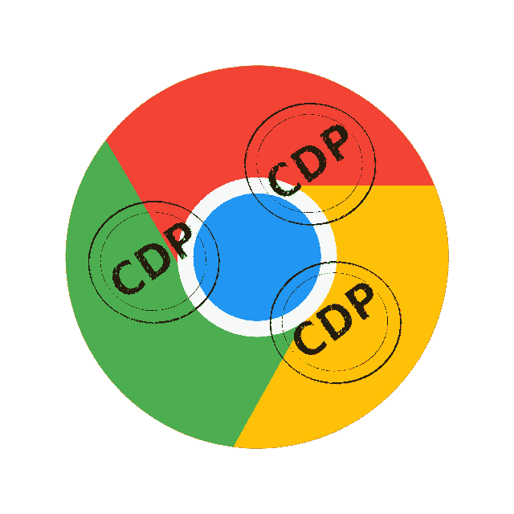
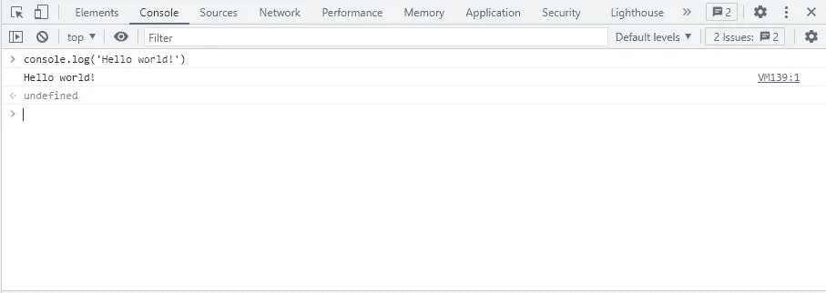

# Chrome Devtools 协议的力量——第三部分

> 原文：<https://medium.com/globant/the-power-of-chrome-devtools-protocol-f4b1bcd4fb34?source=collection_archive---------0----------------------->

第三部分—运行时域

在[上一篇文章](/globant/the-power-of-chrome-devtools-protocol-part-ii-3fb8239785db)中，我们介绍了使用 [CDP](https://chromedevtools.github.io/devtools-protocol/) 的[网络](https://chromedevtools.github.io/devtools-protocol/tot/Network/)域的强大功能，以及如何在 Selenium 测试中实现它。在本文中，我们将介绍[运行时](https://chromedevtools.github.io/devtools-protocol/tot/Runtime/)域，以及如何使用该域捕获控制台消息，如错误、警告和日志。

你可以在 https://github.com/germanbisogno/cdp-utils 找到完整的代码。让我们投入进去吧！

# 使用运行时域

在测试执行期间，我们将使用[运行时](https://chromedevtools.github.io/devtools-protocol/tot/Runtime/)域从控制台获取数据。运行时域使用远程评估和镜像对象公开 JavaScript 运行时，您可以通过该域访问控制台。

*   打开 devtools (F12)并转到控制台选项卡
*   编写控制台日志消息`console.log('Hello world');`
*   消息出现了！

Printing log messages in the console

您可以将消息记录到控制台，您的应用程序可能也会这样做。它也可用于使用`console.warning`或`console.error`记录警告和错误。(如果您需要有关如何使用控制台选项卡的更多信息，您可以查看此处的。)

控制台的开发人员工具中没有可用的记录，所以我们将直接跳到代码中来实现这个类。

# 我们如何实现自动化？

让我们实现一个类`Runtime`来监听控制台事件。请考虑将需要在[上一篇文章](/globant/the-power-of-chrome-devtools-protocol-cbb2c47f1c29)中使用的 npm 依赖项。

在这种情况下，我们使用`Runtime.enable`来启用运行时域，使用`Runtime.consoleAPICalled`来监听控制台事件。或者，因为它已经在其他类中实现，控制台事件可以保存到 JSON 格式的文件中，或者只是在测试中返回这些信息来执行断言。

# 开发一个测试！

让我们在下面的测试中捕获浏览器控制台消息。我们将生成错误、警告或日志等消息来测试这个 API。

正如您将在代码中观察到的，我们通过使用`driver.executeScript`来测试这个域，有意让它在控制台中产生错误、警告和日志。请注意，在您的测试应用程序的真实场景中，可以类似地捕获这些信息。

# 结论

我们进入了运行时领域和它的一些不同的特性。这个域将有助于在测试自动化过程中捕获控制台消息。

在接下来的文章中，我们将继续讨论更多的领域。

我希望你喜欢这次旅行！下次见！

**感谢阅读！**