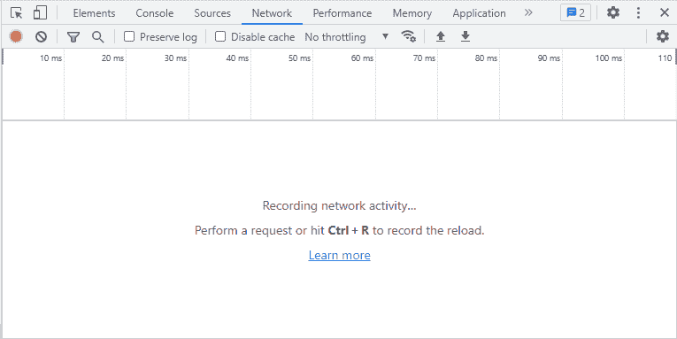
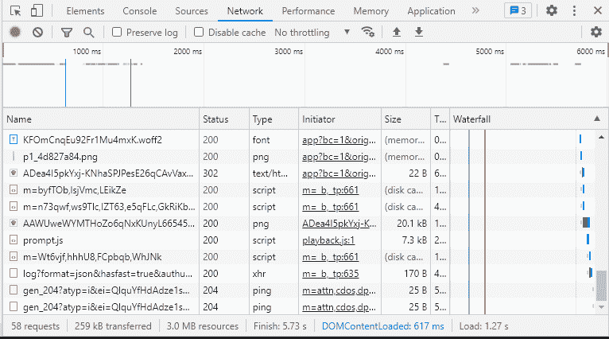
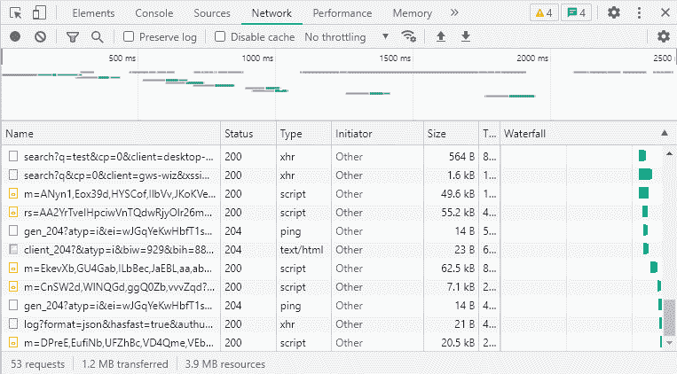

# Chrome Devtools 协议的力量—第二部分

> 原文：<https://medium.com/globant/the-power-of-chrome-devtools-protocol-part-ii-3fb8239785db?source=collection_archive---------1----------------------->

## 网络管区


在[之前的文章](/globant/the-power-of-chrome-devtools-protocol-cbb2c47f1c29)中，我们介绍了使用 [CDP](https://chromedevtools.github.io/devtools-protocol/) 的[跟踪](https://chromedevtools.github.io/devtools-protocol/tot/Tracing/)域的强大特性，以及如何在 Selenium 测试中实现它。在本文中，我们将介绍[网络](https://chromedevtools.github.io/devtools-protocol/tot/Network/)域，以及如何使用该域捕获网络请求。

你可以在 https://github.com/germanbisogno/cdp-utils 找到完整的代码。让我们投入进去吧！

# 使用网络域

让我们首先展示如何在 Chrome 中使用网络选项卡的手动示例。我们将记录一些基于谷歌搜索的请求。

*   打开 devtools (F12)并转到网络选项卡
*   开始录音
*   进入[https://www.google.com](https://www.google.com)
*   在谷歌上进行搜索



The image above is showing Network tab where you can capture requests, start recording by clicking the top left circle.

在记录一些请求后，我们将得到类似于下面的结果。



It is a capture of the Network requests that happened during the search

从工具栏中，您可以通过选择顶部工具栏中的以下图标来导出 HAR 文件。


Export HAR…

导出的文件将包含许多关于请求的有用信息，比如时间、请求类型、大小等等，这些信息可以帮助确定 API 的性能，或者只是分析应用程序中是否存在性能瓶颈。

如果您需要更多关于如何使用网络选项卡的信息，您可以查看此处的。

# 我们如何实现自动化？

这可以通过使用[网络](https://chromedevtools.github.io/devtools-protocol/tot/Network/)域来完成，你将能够收集关于请求的信息。我们将观察一系列事件，这些事件将为我们提供有关网络的必要信息。例如:

```
[
‘Page.loadEventFired’,
‘Page.domContentEventFired’,
‘Page.frameStartedLoading’,
‘Page.frameAttached’,
‘Network.requestWillBeSent’,
‘Network.requestServedFromCache’,
‘Network.dataReceived’,
‘Network.responseReceived’,
‘Network.resourceChangedPriority’,
‘Network.loadingFinished’,
‘Network.loadingFailed’,
];
```

现在，让我们实现一个用 Typescript 编写的类`Network`，我们将从`traceOperations`再次扩展，就像之前我们对`Tracing`类所做的那样。

请注意，将需要在[上一篇文章](/globant/the-power-of-chrome-devtools-protocol-cbb2c47f1c29)中使用的 npm 依赖项。

请注意，在这个类中，我们已经实现了捕获网络事件所需的`Page.enable`和`Network.enable`的用法，当我们停止跟踪时，它会使用 harFromMessages 来调用 chrome-har 实用程序，该实用程序将用于将网络事件转换为可读的 har 文件。

此外，还实现了一种新方法，通过使用`Network.emulateNetworkConditions`命令来模拟网络条件。如果您需要模拟不同的网络条件，如 2G、3G、4G、GPRS 和更多类型的连接，这将非常有用。请在下面找到一些例子:

```
export const NETWORK_PRESETS = {
‘GPRS’: {
‘offline’: false,
‘downloadThroughput’: 50 * 1024 / 8,
‘uploadThroughput’: 20 * 1024 / 8,
‘latency’: 500
},‘Regular2G’: {
‘offline’: false,
‘downloadThroughput’: 250 * 1024 / 8,
‘uploadThroughput’: 50 * 1024 / 8,
‘latency’: 300
},‘Good2G’: {
‘offline’: false,
‘downloadThroughput’: 450 * 1024 / 8,
‘uploadThroughput’: 150 * 1024 / 8,
‘latency’: 150
},.. more presets
```

要使用上述预设，您需要指定您可能希望在测试中使用的网络条件。在这种情况下，它由方法`emulateNetworkConditions`的参数提供，该方法由以下接口表示:

Interface to represent Network Conditions parameters

# 开发一个测试！

接下来，让我们执行测试来生成我们的 HAR 文件！

最后，在执行测试之后，让我们通过选择


Import HAR file …

让我们看看它是什么样子的！



Importing the generated HAR file into the Network tab

# 结论

我们了解了网络领域及其一些不同的功能。网络域允许跟踪网页的网络活动。它公开了关于 HTTP 请求和响应的信息，它们的头、主体、时间等等。此外，使用这个领域来模拟网络条件是伟大的！

我们将在以后的文章中继续讨论更多的领域。

希望你喜欢这次旅行！下次见！

**感谢阅读！**