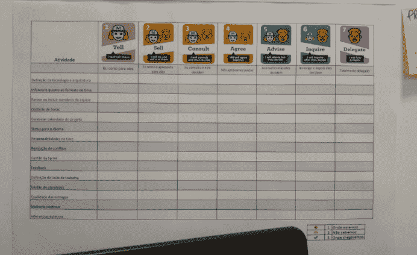

# 授权的力量以及我们如何利用它。

> 原文：<https://medium.com/globant/the-power-of-delegation-and-how-we-can-work-with-it-58f54876c4d9?source=collection_archive---------0----------------------->

**摘要**

如今，我们越来越受到敏捷框架的影响，因此公司正在寻求让他们的员工越来越自主和独立。这篇文章旨在介绍什么是自组织合作者，它是如何发生的，以及我们应该实施或避免什么程序。

**委派**

1.执行传输，授予(权力)。

"在危机中，他已经授权了所有的权力(紧急委员会)"

2.给(某人)权力和代表权；发送。

"该党已委派一名代表参加会议"

基于 HOUAISS 字典中的这些定义，委托过程总是从一个人到另一个人，记住这一点，我们可以想到敏捷中非常重要的另一个主题:

**自组织**

根据维基百科:“自组织是具有许多组成部分的一些物理系统的属性，表现出仅知道该系统的组成部分之间的相互作用而不容易预测的行为”

根据 Jurgen Appelo 的说法，在他的《管理 3.0》一书中，我们对授权的定义是:

“自组织是一个过程，在这个过程中，一个结构或模式出现在一个系统中，而没有一个中央权威或外部因素通过规划强加给它。自组织是常态。这是动态系统的默认行为，无论这些系统是由原子、分子、病毒、物种还是企业组成。或者软件开发人员……”

敏捷性的一个基本原则是与有积极性和自治的团队合作:

***“围绕有积极性的个人建立项目。为他们提供所需的环境和支持，并相信这将有助于他们的工作。”***

Scrum 的原则之一是自组织团队:

**和更有利于增长的创新和创造环境"**

好…现在在这组定义和原则中，它们与授权、自组织和自治有什么关系？

对于一个自组织的团队来说，它不能依赖于任何外部代理的管理，团队必须对他们的工作负责，而不将他们的责任转移给其他人。团队必须确定自己的行动，并且能够理解团队能做什么，不能做什么。

**正在处理**

又是如何做到的？如何打破在我们今天的企业文化中如此具体化的等级流程？

首先，我们必须明白，现有领导层在层级结构中拥有的权力是在一个级联过程中赢得和转移的，这一过程从最高管理者开始，垂直向下，随着权力瀑布的水流下降，他们失去了权力，然后团队只能看到这种权力的微弱闪光。

为了让团队自组织起来，它必须吸收更多的这种权力，它应该被授权，如果我们理解“授权”就是“接受权力”，那么就需要有人放弃这种权力，所以，董事必须将更多的权力让给经理，经理应该将更多的权力让给团队。

现在，我们要去硬币的另一面。给什么权力？多大功率？事实上，那些力量到底是什么？

这种权力不亚于决策权。自主团队是一个决策团队，而自组织团队是一个管理自己活动的团队，并决定在特定情况下采取哪一个是最佳选择。

考虑到这一点，我们有几个级别的授权，这意味着一个团队可以做多远的决策。授权有 7 个层次，Jurgen Appelo 在他的书《管理 3.0》中对此做了很好的描述:

第一级——告诉:你做决定并向你的员工宣布。(这其实根本不是赋权。)

第二级——销售:你做决定，但你试图通过向员工“销售”你的想法来获得他们的承诺。

第三级——咨询:在做出决定之前，你邀请、倾听和思考员工的意见。但是你要明确，是你在做决定。

第 4 级——同意:你邀请员工参加讨论，并作为一个小组达成共识。你的声音和其他人一样。

第五级——建议:你试图通过告诉员工你的观点来影响他们，但最终你还是让他们来决定。

第 6 级——询问:你让团队先做决定，并暗示这很好，尽管不是绝对必要，他们可以在之后说服你。

第 7 级——委派:你把事情完全交给团队来处理，而你出去玩得很开心(或者利用这段时间来管理系统)。

级别描述了团队可以做什么或不可以做什么。这是非常好的，健康的，强烈建议那些层次被很好地定义，清晰和明确，因为首先，一个团队可以有不同程度的自主权，取决于主题和团队想要处理的事情。

在我工作的地方，我们有一组代表团，贴在墙上:

*图 1 —按授权级别划分的活动*

在这里，我们有与每个人一起设置的活动(如解决方案的责任、冲突解决、仪式、系统架构、假期等),我们填写了我们所处的委托级别，换句话说，团队了解他们拥有(或以前拥有)的委托级别，以及我们想要达到的目的。在项目过程中，团队想要什么程度的授权和自主权。

应与组织讨论这些授权级别，以避免团队受挫，并准确了解公司/区域/经理能够/希望团队达到的授权级别。

把这一点说清楚很好，因为我们知道有些活动是可以委托的(例如，开发策略，这是给定问题的最合适的解决方案，等等。)和该区域经理固有的活动(骚扰、晋升、工资等方面的冲突。).此外，当明确我们的责任是什么，我们能做什么和不能做什么时，我们会避免尤尔根·阿佩洛所说的“无形的电栅栏”。

这些栅栏起着“说教者”的作用。当我们不确定我们的授权级别、我们的授权级别，并且我们做出了公司或您的经理不希望您做出的决定时，您最终会在那个围栏中“受到冲击”，并且您采取的每一个失误，您的领导都会再次“冲击您”，直到您在没有首先咨询和征求您的经理同意的情况下不会采取任何行动。

**结论**

我们看到，授权、自治和赋权的行动是密切相关的，其中一个过程像室内管弦乐队一样相互帮助。乐器越合拍，越和谐，就越好。此外，实践表明，明确团队对每项活动的授权级别，可以让每个人清楚我们在哪里，我们的责任是什么，我们希望达到哪里，我们可以与团队一起向更高的责任级别前进，成为决策者，而不仅仅是执行者。

通过定义/揭开“电栅栏”,团队可以在这片土地上行走，无需担心冲突。此外，知道了栅栏在哪里，我们就可以提出修改意见，如果那是不可能的，至少我们知道为什么。