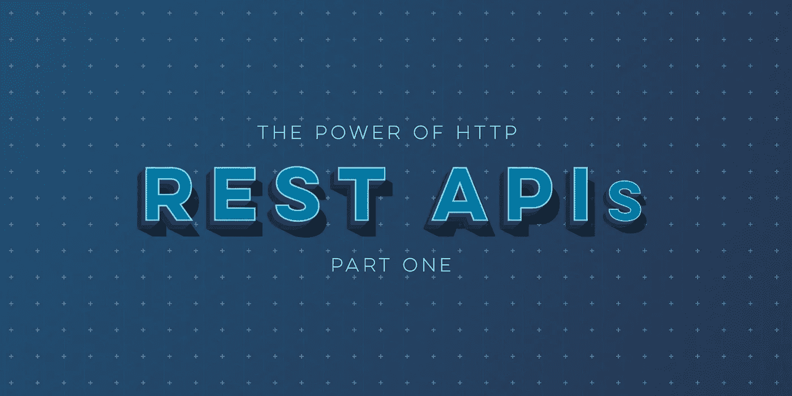

# HTTP 对于 REST APIs 的威力—第 1 部分

> 原文：<https://medium.com/capital-one-tech/the-power-of-http-for-rest-apis-part-1-ca2a2bf525f?source=collection_archive---------4----------------------->

## 从基础到内容和语言谈判



有各种各样的 web 框架和库可以帮助我们快速方便地构建和使用基于 HTTP 的 API。无论您是 HTTP 新手还是老手，让我们提醒自己 HTTP 的强大功能可以帮助我们设计健壮的基于 REST 的 API。我们将主要依靠各种与 HTTP 相关的规范，所以如果您想进一步研究这些概念，我将提供引用该主题的规范的链接。

## **基础知识:URL、HTTP 方法和头文件**

统一资源定位器，或 URL，是互联网上资源位置的一个[识别系统](https://tools.ietf.org/html/rfc3986)。URL 功能强大，因为它们允许在任何可访问的服务器上引用 API。此外，URL 的路径提供了一个层次结构，为我们提供了将资源组织到逻辑分组中的机会。通常是 URL 分配 API 所有权(通过主机名)和资源结构(通过路径)。

[HTTP 方法](https://tools.ietf.org/html/rfc2068#section-5.1.1)指示对特定资源采取的动作。示例包括:GET、POST、PUT、DELETE 和 HEAD。请求的方法通知服务器我们是请求数据还是修改数据。

> 概要:当我们将一个 HTTP 方法与一个 URL(有时称为端点)结合起来时，我们通知一个 API 服务器要采取什么样的动作以及要对什么样的资源采取动作。

状态代码，有时也称为响应代码，为客户端提供一个数字代码，指示客户端应该如何根据请求的结果进行处理。状态代码按系列分组，指示请求是成功(2xx)、请求被重定向(3xx)、由于客户端错误而失败(4xx)还是由于服务器错误而失败(5xx)。

> 摘要:当 API 提供者正确实现时，消费者应该首先检查响应中的状态代码，以确定请求的结果。我们的客户端代码不需要解析响应负载来确定是否返回了成功或失败的消息。

最后， [HTTP 头](https://tools.ietf.org/html/rfc7230#section-3.2)是名称/值对，可以从客户端(作为 HTTP 请求的一部分)传递来通知服务器关于请求和客户端的能力，或者从服务器(作为 HTTP 响应的一部分)传递来通知客户端关于请求的处理结果。HTTP 头旨在将消息的细节与消息(请求/响应的主体)分开。头和消息之间关注点的分离防止了我们的 API 设计将协议级关注点与我们的 API 交换的消息有效负载混合在一起。

> 概要:HTTP 头将客户机/服务器交互与 API 设计分开。这样做使 API 设计人员能够专注于要交付的 API 功能，而不是在请求和响应有效负载中混合协议和资源表示。

基于 HTTP 的基础知识，接下来让我们探索两个对基于 web 的 API 有用的特定头。

## **内容协商:支持多种内容类型**

[内容协商](https://tools.ietf.org/html/rfc7231#section-5.3)允许客户端请求服务器返回特定的内容类型。通过内容协商，我们使单个端点能够支持不同类型的资源表示(例如 CSV、PDF、PNG、JPG、SVG 等)。虽然许多 API 只提供一种内容类型，比如 JSON，但它们可能支持每个端点多种内容类型，允许消费者根据情况选择最佳类型。

客户端可以使用 *Accept* 头请求它喜欢的任何内容类型，包括指定 **/** 如果客户端可以接受任何内容(浏览器通用)。客户可能会建议一种以上的内容类型，使用质量值(或简称为“质量值”)来表示优先顺序。API 服务器将检查 *Accept* 头，并使用与服务器支持的内容类型和客户端请求的内容类型相匹配的内容类型返回响应。如果服务器不能以可接受的内容类型进行响应，它将返回一个 *415 不支持的媒体类型*响应代码。

让我们看一个请求示例:

```
GET [https://api.example.com/projects](https://api.example.com/projects) HTTP/1.1
Accept: application/json;q=0.5,application/xml;q=1.0
```

注意上面例子中 qvalue 的使用。客户机接受多种内容类型:高优先级的 XML 和低优先级的 JSON。q 值提供了内容类型相对于所列出的其他内容类型的相对权重或偏好。如果未指定 qvalue，则默认权重为 1.0。qvalues 的使用允许我们的 API 客户机代码支持特定的类型，也许是 JSON 以提高解析性能，但是在 API 提供者只支持 XML 的情况下，XML 也是可以接受的。

示例响应:

```
HTTP/1.0 200 OK
Date: Tue, 16 June 2015 06:57:43 GMT
Content-Type: application/xml<project>…</project>
```

服务器使用内容类型响应头，以最匹配的内容类型进行响应(假设它已被编码为支持这些内容类型中的一种或两种)。我们可以使用相同的方法为我们的一些或所有端点添加对 CSV 和 PDF 内容类型的支持。

> 摘要:内容协商将我们的 API 扩展到单一格式之外，比如 JSON 或 XML。它允许 API 的一些或所有端点使用最符合 API 消费者需求的内容类型进行响应。我们在请求中使用 Accept 头来列出首选的内容类型。服务器使用 Content-Type 头向客户机通知响应有效负载中的内容类型，从而允许客户机应用适当的解析库来处理响应。

## **语言协商:支持多种语言**

语言协商允许 API 支持多种语言。类似于内容协商，API 客户端向服务器发送*接受语言*报头。如果 API 服务器支持多种语言，它可以用客户端支持的语言之一返回响应负载，由*内容语言*响应头表示。

*注意:对于* [*基于浏览器的语言协商*](https://www.w3.org/International/questions/qa-when-lang-neg#question) *，可能会出现无法正常工作的情况。这导致一些 API 提供者回避使用 HTTP 语言协商。*

> 摘要:如果 API 客户端知道用户喜欢哪种语言，并且 API 支持它，我们就应用语言协商来本地化我们的 API 响应，包括文本、货币等。

## **总结—第 1 部分**

在第 1 部分中，我们只研究了 HTTP 规范中对我们的 API 有用的一小部分。在第 2 部分中，我们将深入探讨超媒体 API、HATEOAS 和缓存。

***特别感谢*** [***达雷尔·米勒***](https://urldefense.proofpoint.com/v2/url?u=https-3A__twitter.com_darrel-5Fmiller&d=DwMFaQ&c=pLULRYW__RtkwsQUPxJVDGboCTdgji3AcHNJU0BpTJE&r=_AA5HejV89MayBA4AaRcjfFZu1EqtyznyyaBerOSTEbGKVYYEZ4vxIKnipbV-u4_KsWlis-DhR-xh8jnPwd4dA&m=qLPLWmuLdkZehA29ITq3ZcZjfOEp1555lgBMyZItMPg&s=gIa_u_VSyR9m4e5KFw-2KYvheYP1G_M4K8D_EgjRONQ&e=) ***对本文的点评。***

[](https://medium.com/capital-one-tech/api/home)

*披露声明:这些观点是作者的观点。除非本帖中另有说明，否则 Capital One 不属于所提及的任何公司，也不被其认可。使用或展示的所有商标和其他知识产权都是其各自所有者的所有权。本文为 2018 首都一。*