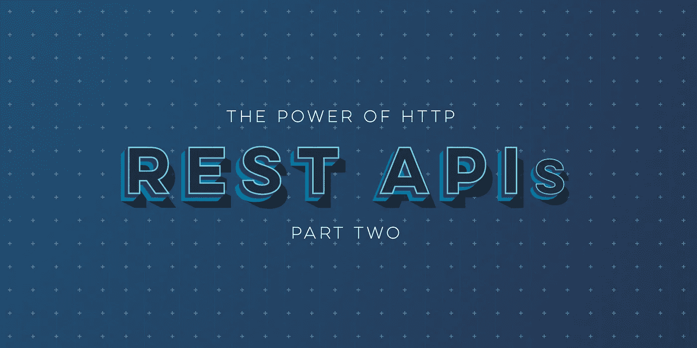

# HTTP 对于 REST APIs 的威力—第 2 部分

> 原文：<https://medium.com/capital-one-tech/the-power-of-http-for-rest-apis-part-2-hypermedia-apis-hateoas-and-caching-2b41b9a40ff8?source=collection_archive---------4----------------------->

## 超媒体 API、HATEOAS 和缓存



在第 1 部分 *的* [*中，我们讲述了使用 HTTP 帮助我们设计健壮的 REST APIs 的基础知识。在第 2 部分中，我们将深入探讨一些细节。*](/capital-one-developers/the-power-of-http-for-rest-apis-part-1-ca2a2bf525f)

# **超媒体链接:都是相对的**

超媒体 API 是由指向其他相关 API 端点的自描述链接驱动的。通常，这些链接指向相关的其他资源，例如项目的所有者，或者基于使用者的上下文指向相关的端点。为了利用超媒体链接，我们通过为资源分配唯一的 URL 来构建 HTTP 的核心原则。

下面是一个在资源表示中嵌入超媒体链接的 Github 示例:

```
GET [https://api.github.com/users/launchany](https://api.github.com/users/launchany)
{
  “login”: “launchany”,
  “id”: 17768866,
 "avatar_url”: “[https://avatars3.githubusercontent.com/u/17768866?v=3](https://avatars3.githubusercontent.com/u/17768866?v=3)",
  “gravatar_id”: “”,
 “url”: “[https://api.github.com/users/launchany](https://api.github.com/users/launchany)",
 “html_url”: “[https://github.com/launchany](https://github.com/launchany)",
 “followers_url”:  “[https://api.github.com/users/launchany/followers](https://api.github.com/users/launchany/followers)",
 “following_url”:
 “[https://api.github.com/users/launchany/following](https://api.github.com/users/launchany/following){/other_user}",
 “gists_url”:   “[https://api.github.com/users/launchany/gists](https://api.github.com/users/launchany/gists){/gist_id}", …
}
```

在这个示例响应中提供的链接帮助客户端导航 API，因为它需要关于用户的更多细节，例如用户的 gravitar 图像。客户端不需要关心图像托管在哪里，以及图像托管服务是否会随着时间的推移而改变——它只是在显示 gravitar 时使用提供的 URL。我们的 API 客户端变得更能适应变化，并且受益于不再需要手工制作 URL。

需要支持分页的 API 通常使用 offset 和 limit 参数来设计，以便在返回第一组结果后请求后续页面。对于经常变化的数据集，更好的方法可能是使用游标来避免跳过或重复结果。我们的分页策略可能需要改变，如果我们改变我们的分页策略，我们不希望导致我们的 API 客户端突然中断。

我们如何设计一种分页方法，既适用于这两种情况，也适用于目前还不知道的其他情况？我们可以再次使用超媒体链接，但是这一次是为了引导 API 客户端在结果中导航，而不仅仅是引用外部图像或 API 的其他部分。

让我们看一个超媒体响应的例子:

```
{
   “_links”: { 
   “self”: {“href”: “/projects” }, 
  “curies”: [{“name”: “cofrel”, “href”:   “[http://api.example.com/hypermedia/rels/](http://api.example.com/hypermedia/rels/){rel}", “templated”: true }],
  “next”: {“href”: “/projects?since=d266f6cd-fddf-41d8–906f355cbecfb2de&maxResults=20” }, 
  “prev”: {“href”: “/projects?since=43be807d-d518–41f3–9206- e43b5a8f0928&maxResults=20” }, 
  “first”: {“href”: “/projects?since=ef24266a-13b3–4730–8a79- ab9647173873&maxResults=20” }, 
  “last”: {“href”: “/projects?since=4e8c74be-0e99–4cb8-a473- 896884be11c8&maxResults=20” }, 
  “cofrel:find”: { “href”: “/orders{?id}”, “templated”: true }, 
 }, 
 “currentlyActive”: 4, 
 “currentlyArchived”: 24
 }
```

有了我们的导航超媒体链接，API 客户能够通过结果在任何方向跟踪结果。他们不必关心分页样式，如何正确地编写 URL，或者样式是否发生了变化。这是非常强大的，甚至模仿了我们今天使用谷歌或必应搜索的方式。

这种管理分页的方法还有一个额外的好处，就是可以将服务器端的状态传递给客户端。如果我们在结果的第一页，不会提供“上一页”链接，用户界面可以通过禁用“上一页”链接来反映这一点。同样，如果我们在结果的最后一页，将不会提供“下一页”链接。这是 HATEOAS 约束的一个应用。

HATEOAS *(“作为应用程序状态引擎的超媒体”*)是 REST 中的一个约束，起源于[菲尔丁的论文](https://www.ics.uci.edu/~fielding/pubs/dissertation/fielding_dissertation.pdf)。HATEOAS 的主要优点是避免发送布尔字段或与状态相关的字段，这些字段需要客户端解释它们并决定接下来可以采取什么行动。相反，服务器提前确定这一点，并通过提供的链接的存在与否来传达什么可以做，什么不可以做。

> 概要:超媒体和 HATEOAS 是由分配给 API 中资源的 URL 驱动的。这些链接可以将状态传递给客户端，根据用户的权限和数据状态，通知用户在特定时间可以做什么和不可以做什么。正是 HTTP 和 URL 的使用使我们能够通过超媒体和 HATEOAS 构建可进化的应用程序。

# **客户端缓存:提升应用性能**

缓存是数据的本地存储，以防止将来重新检索数据。熟悉这个术语的开发人员可能已经使用过服务器端缓存，使用诸如 [memcached](https://memcached.org/) 之类的工具将数据保存在内存中，并减少从数据库获取未更改数据的需求，以提高应用程序性能。

[HTTP 缓存语义](https://tools.ietf.org/html/rfc7234#section-2)允许客户端将可缓存的响应存储在本地，将缓存从服务器端移到离客户端更近的地方，以获得更好的性能并减少对网络的依赖。

为了支持这一点，HTTP 通过 *Cache-Control* response 头提供了几个缓存选项，该头定义了响应是否可缓存，如果可缓存，可缓存多长时间。只有当 HTTP 方法是 GET 或 HEAD 并且正确的 *Cache-Control* 头指示内容可缓存时，才可以缓存响应。

让我们重新检查我们的内容协商示例请求:

```
GET [https://api.example.com/projects](https://api.example.com/projects) HTTP/1.0
Accept: application/json;q=0.5,application/xml;q=1.0
```

下面是一个示例响应，其中包括来自 API 服务器的缓存指令:

```
HTTP/1.0 200 OK
Date: Tue, 16 June 2015 06:57:43 GMT
Content-Type: application/xml
Cache-Control: max-age=240 <project>…</project>
```

在本例中，最大年龄表示在客户端认为数据过时之前，数据最多可以缓存 240 秒(4 分钟)。

谷歌开发者网站上有伊利亚·格里戈利克的一篇很棒的文章，详细描述了 HTTP 缓存的客户端-服务器交互。

> 摘要:HTTP 提供了一个 cache-control 头，通知客户端一个响应是否可以缓存以及缓存多长时间。将这个头应用到我们的 API 客户端代码将会减少网络流量，加快我们的 web 和移动应用程序的速度。为了利用 HTTP 提供的这些功能，需要进行深思熟虑的缓存设计，包括哪些资源可以缓存以及缓存多长时间。

# **中介缓存:减少网络延迟**

HTTP 规范[定义了对中介](https://tools.ietf.org/html/rfc7230#section-2.3)的支持，允许通过一系列连接来处理请求。这些中介根据需要放置在客户机和 API 服务器之间，使网络行为可以在不了解 API 的情况下添加。中介使用的示例包括:

*   一个反向代理/网关，用于路由到防火墙内部的服务并实施安全/速率限制。
*   一个 web 应用程序防火墙，用于防范常见的攻击媒介，如 XML 解析器攻击、SQL 注入等。
*   生成传入请求的度量和分析，以向团队提供关于使用了什么端点、是否有任何端点返回过多的错误响应代码等的见解。
*   缓存服务器可以快速地将响应返回给客户端，而不涉及后端服务，例如由 [Varnish](https://varnish-cache.org/intro/index.html#intro) 和 [nginx+Redis](https://www.nginx.com/resources/wiki/modules/redis/) 提供的那些服务器。

上面列出的最后一点，缓存服务器，是非常强大的。它们位于提供*缓存控制*响应指令的 API 前面，并代表 API 服务器存储响应。这使得 API 客户端无需实现缓存支持，同时在置于 API 后端之前提供透明的应用加速。

缓存服务器离客户端应用程序越远，进行一次往返 API 请求所需的时间就越长。这正是内容分发网络(cdn)的用武之地，因为它们将缓存服务器放在世界各地，离客户端应用程序更近。让我们看一个例子:

在第一次请求时，从伦敦连接到澳大利亚的 API 服务器的移动应用可以通过 CDN 边缘节点透明地连接到远程 API 服务器。然后，CDN 边缘节点缓存 API 服务器响应，并将结果返回给 API 客户端。后续请求将由更靠近移动应用的 CDN 边缘节点提供服务，直到超过缓存到期时间，CDN 边缘节点需要从 API 服务器刷新其缓存。

fastly[发表了一篇关于 API 缓存](https://www.fastly.com/blog/api-caching-part-i)的好文章，提供了它如何工作的详细示例，以及一些后端缓存控制技术，用于在后端数据发生变化时使 CDN 缓存失效。

值得注意的是，当使用缓存服务器时，客户端应用程序仍然必须通过网络连接到缓存服务器来刷新数据。为了完全避免网络往返，可以使用客户端缓存将数据存储在应用程序本身中。总的来说，我们减少了不必要的网络往返，但是当我们需要刷新客户端缓存时，我们从缓存服务器中受益。

> 概要:HTTP 支持 API 客户机和服务器之间的中介。它们理解 HTTP 协议，可以评估传入请求的可缓存性，而不需要解析或理解特定的请求/响应负载。

# **条件请求:保持最新**

条件请求是 HTTP 提供的一个不太为人所知但很强大的功能。条件请求允许客户端仅在某些内容发生变化时请求更新的资源表示。如果内容没有改变，发送条件请求的客户端将接收到未修改的*304*，或者连同改变的内容一起接收到 *200 OK* 。有两种方法可以将客户机的本地缓存副本告知服务器进行比较:eTags 和基于时间。

[实体标签](https://tools.ietf.org/html/rfc7232#section-2.3)，或“eTag”，是一个代表当前资源状态的不透明值。客户端可以在 GET、POST 或 PUT 请求后存储 eTag，并使用该值通过 HEAD 请求检查未来对表示的更改。通常，eTag 是状态的散列值，尽管这不是必需的。所需的只是服务器生成唯一的 eTag 值的方法，该值可用于确定自上次检索以来状态是否已被修改:

```
200 OK
Location: /projects/12345
Cache-Control: public, max-age=31536000
ETag: “17f0fff99ed5aae4edffdd6496d7131f”
```

客户端然后可以使用 *If-None-Match* 请求报头来指示接收到的最后一个 eTag:

```
GET /projects/12345
If-None-Match: “17f0fff99ed5aae4edffdd6496d7131f”
```

或者，我们可以在*最后修改的*响应头中使用基于时间的前提条件。然后， *If-Modified-Since* 请求头可用于指定最后更新的时间戳，以与服务器上的最后更新时间戳进行比较，查看是否有任何更改:

```
200 OK
Location: /projects/12345
Cache-Control: public, max-age=31536000
Last-Modified: Mon, 19 Mar 2018 17:45:57 GMT
```

当 API 客户端发送 GET 请求时，它会将最后修改的时间戳作为条件请求的一部分:

```
GET /projects/12345
If-Modified-Since: Mon, 19 Mar 2018 17:45:57 GMT
```

如果资源自 2018 年 3 月 19 日星期一 17:45:57 GMT 以来没有发生变化，那么客户端将收到一个 *304 Not Modified* 而不是一个带有最新资源表示的 200 OK。

> 摘要:条件请求减少了验证和重新获取缓存资源所需的工作量。etag 是表示当前内部状态的不透明值，而最后修改的时间戳可以用于基于日期的比较，而不是 etag。我们使用适当的前提条件请求头来通知服务器客户机上的版本。然后，API 服务器返回资源的最新表示，或者如果自上次获取以来没有发生任何变化，则返回 304 未修改。

# **并发控制:保护资源完整性**

条件请求也用于支持并发控制。通过将 eTags 或最后修改日期与状态更改方法(例如 PUT)结合起来，我们可以确保数据不会被另一个 API 客户端意外覆盖。这在 PUT 方法的情况下尤其重要，在 PUT 方法中，整个资源表示被客户机提供的新表示所取代。

当 API 客户端发出修改请求时，如果 eTag 已经改变(通过 *If-Match* 请求报头)或者如果时间戳没有改变(通过 *If-Unmodified-Since* 请求报头),它们可以向请求添加前提条件以防止修改。如果前提条件失败，则服务器发送 *412 前提条件失败*响应。如果这两个请求头都没有找到，服务器还可以通过用 *428 要求的前提条件*进行响应来强制执行前提条件头的要求，以强制执行并发控制。

让我们举一个例子，两个 API 客户端试图修改一个项目。首先，每个客户端使用 GET 请求检索客户端，获得以下响应:

```
Location: /projects/12345
Cache-Control: public, max-age=31536000
ETag: “27f0fff99ed5aae4edffdd6496d7131f”{…}
```

然后，第一个 API 客户端通过用新的表示替换当前的表示来修改项目:

```
PUT /projects/1234
If-Match: “27f0fff99ed5aae4edffdd6496d7131f”{ “name”:”Project 1234", “Description”:”My project” }
```

服务器以 *200 OK* 响应，因为 eTag 匹配并返回具有新 eTag 的更新表示:

```
200 OK
Location: /projects/12345
Cache-Control: public, max-age=31536000
ETag: “57f0fff99ed5aae4edffdd6496d7131f”{…}
```

第二个 API 客户机在最初获取项目时具有相同的 eTag，它也试图修改项目:

```
PUT /projects/1234
If-Match: “27f0fff99ed5aae4edffdd6496d7131f”{ “name”:”Project ABCDE”, “Description”:”My renamed project” }
```

不幸的是，项目已经改变，所以第二个 API 客户端收到了不同的响应:

***412 前置条件失败***

第二个 API 客户端现在必须重新获取资源实例的当前表示，然后通知用户这些更改，并允许他们决定是希望重新提交所做的更改还是保持原样。

> 概要:并发控制可以通过请求报头中的 HTTP 前提条件添加到 API 中。如果 eTag/last modified date 没有改变，那么请求被正常处理。如果它已更改，将返回 412 响应代码，防止客户端因两个单独的客户端同时修改同一资源而覆盖数据。

# **总结部分 2**

在这个由两部分组成的系列中，我们只研究了 HTTP 规范中对我们的 API 有用的一小部分。有了这些东西，我们开始意识到 HTTP 是一个支持我们各种需求的健壮协议。通过应用这些技术，我们可以构建健壮的 API 来驱动既有弹性又可发展的复杂应用程序。

***特别感谢*** [***达雷尔·米勒***](https://urldefense.proofpoint.com/v2/url?u=https-3A__twitter.com_darrel-5Fmiller&d=DwMFaQ&c=pLULRYW__RtkwsQUPxJVDGboCTdgji3AcHNJU0BpTJE&r=_AA5HejV89MayBA4AaRcjfFZu1EqtyznyyaBerOSTEbGKVYYEZ4vxIKnipbV-u4_KsWlis-DhR-xh8jnPwd4dA&m=qLPLWmuLdkZehA29ITq3ZcZjfOEp1555lgBMyZItMPg&s=gIa_u_VSyR9m4e5KFw-2KYvheYP1G_M4K8D_EgjRONQ&e=) ***对本文的点评。***

[](https://medium.com/capital-one-tech/api/home)

*披露声明:这些观点仅代表作者个人观点。除非本帖中另有说明，否则 Capital One 不属于所提及的任何公司，也不被其认可。使用或展示的所有商标和其他知识产权均为其各自所有者所有。本文为 2018 首都一。*