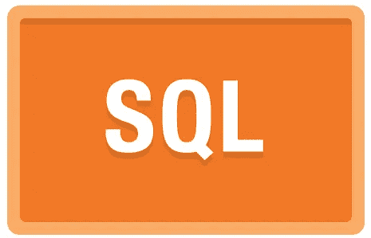

# SQL 调用 PL/SQL 调用 SQL 的问题

> 原文：<https://medium.com/oracledevs/the-problem-with-sql-calling-pl-sql-calling-sql-de9ddd92d188?source=collection_archive---------0----------------------->



在[之前的帖子](https://blogs.oracle.com/sql/entry/optimizing_the_pl_sql_challenge6)中，我们重构了一个关于 [PL/SQL 挑战](https://plsqlchallenge.oracle.com/)的 SQL 查询，因此它不再调用 PL/SQL 函数。这通过消除上下文切换提高了性能。

查询执行时间减少了 10 秒。你们中观察力敏锐的人会注意到该语句处理了 60，000 多行。每行节省不到 200 微秒。

对于单个行来说，这是一个很小的开销。此时你可能会说:

“大不了。我在 top-N 查询中调用函数。最坏的情况是返回 10 行，运行时间增加 2 毫秒。开销微不足道。我更喜欢将我的 SQL 查询保存在 PL/SQL 函数中，因为这有助于代码重用”。

让我们暂时把表演放在一边。如果有常见的查询，为什么不把它们放在 PL/SQL 中，并在 select 语句中调用这些函数呢？如果您需要更改它们，这使得将来的维护更加容易。

因为对于调用 PL/SQL 的 SQL 有一个重要的警告。你可能会得到意想不到的结果。

让我们看一个例子。您的应用程序有一个典型的用户表，其中有一个用户:

```
create table app_users (
  user_id     integer not null primary key,
  given_name  varchar2(100) not null,
  family_name varchar2(100) not null
);insert into app_users values (1, 'Chris', 'Saxon');commit;
```

您已经分别存储了名称的各个组成部分。为了确保您在构建函数的应用程序中一致地显示全名，请使用 get_full_name。这将返回基于 user_id 的格式化名称。执行此操作的查询是:

```
select given_name || ' ' || family_name
from   app_users usr
where  usr.user_id = :user_id;
```

到目前为止一切顺利。但是，如果我们从 SQL 调用它，就会出现问题。

以下查询应为 name_fn 和 name_sql 返回相同的值:

```
select get_full_name ( user_id ) name_fn, 
       given_name || ' ' || family_name name_sql
from   app_users;
```

然而，当我执行它时，我看到以下内容:

```
NAME_FN       NAME_SQL
------------- -----------
Harvey Saxon  Chris Saxon
```

它们返回了不同的值！！这是怎么发生的？！

我没有做任何事情来修改函数中的结果。这是调用在 SQL 语句中执行查询的 PL/SQL 函数的预期结果。您可以(也将会)看到这种影响在您的环境中发生。

为什么？

原因在于 Oracle 的读取一致性模型。每个 SQL 语句在开始执行时都会获得数据的读取一致性视图。函数中的查询开始于主语句之后的某个时间点。这意味着函数内部的语句可以拥有与调用它的 SQL 查询不同的数据视图。它可以看到从父查询开始到它自己开始之间提交的更改。

在这种情况下，在执行上述查询时，我在一个单独的会话中发出了以下命令:

```
update app_users
set    given_name = 'Harvey'
where  user_id = 1;

commit;
```

为了确保主查询和函数返回不同的结果，我不得不稍微作弊。我不够快，无法在一个会话中运行查询，在另一个会话中运行更新。所以在查询之前，我还在 get_full_name 中放置了一个十秒钟的睡眠。这确保了在函数内部的查询开始之前，我有足够的时间提交更改。

这是一个关键点。如果调用 PL/SQL 的查询执行得很快，就很难重现上面的异常。因此，你不太可能在测试中发现这种错误。这导致在生产中“随机”出现错误报告，而您无法重现。这些错误的影响可能介于轻微的烦恼和彻底的灾难之间。如果您不熟悉读取一致性模型，跟踪和解决它们可能会很困难。

幸运的是，解决方案很简单:

复制 PL/SQL 中的所有 SQL，并将其直接粘贴到调用语句中。

这是否意味着没有办法让可重用的查询既正确又高效？

当然不是！

有更好的方法。有风景。

例如，您可以创建以下视图:

```
create or replace view app_users_formatted as
  select user_id, given_name || ' ' || family_name full_name
  from   app_users;
```

用它代替原始查询中的 PL/SQL，我们得到:

```
select (select full_name 
        from   app_users_formatted apuf
        where  apus.user_id = apuf.user_id
       ) name_view, 
       given_name || ' ' || family_name name_sql
from   app_users apus;
```

Name_sql 和 Name_view 现在是同一个语句的一部分。这意味着它们在同一时间点被一致读取。无论查询执行多长时间，都将返回相同的值。

当然，对于这种简单的格式问题，您可以创建一个[虚拟列](https://youtu.be/bEgUVAahlCs)，得到您想要的结果:

```
alter table app_users add (
  full_name as (given_name || ' ' || family_name)
);
```

**结论**

从 SQL 调用 PL/SQL 时，需要注意两件事:

*   上下文切换的性能开销
*   如果 PL/SQL 本身调用 SQL，结果可能不正确

您可以通过提取 PL/SQL 的 SQL 查询并将其直接放在调用语句中来避免这两种情况。如果您取出的查询是您想要重用的查询，请将其保存在视图中。然后在 SQL 中引用视图而不是 PL/SQL 函数。

使用视图代替 PL/SQL 还使优化器能够将 SQL 包含在[查询转换](https://blogs.oracle.com/optimizer/entry/optimizer_transformations_view_merging_part_1)中。这可以产生更有效的执行计划。新计划带来的性能提升甚至比上下文切换节省的时间还要多。

**代码清单**

```
-- note: requires execute privileges on dbms_lock.create table app_users (
  user_id     integer not null primary key,
  given_name  varchar2(100) not null,
  family_name varchar2(100) not null
);insert into app_users values (1, 'Chris', 'Saxon');commit;  

create or replace function get_full_name ( user_id app_users.user_id%type )
  return varchar2 as
  full_name varchar2(200);
begin

  dbms_lock.sleep(10);

  select given_name || ' ' || family_name
  into   full_name
  from   app_users usr
  where  usr.user_id = get_full_name.user_id;

  return full_name;

end get_full_name; 
/ 

-- in session 1:
select get_full_name ( user_id ) name_fn, 
       given_name || ' ' || family_name name_sql
from   app_users;

-- in session 2, while query is still executing in session 1:
update app_users
set    given_name = 'Harvey'
where  user_id = 1;

commit;
```

*原载于 2015 年 8 月 4 日 blogs.oracle.com**的* [*。*](https://blogs.oracle.com/sql/the-problem-with-sql-calling-plsql-calling-sql)