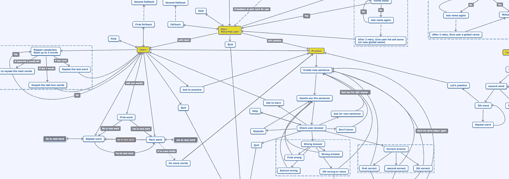

# 谷歌助手产品操作指南

> 原文：<https://medium.com/google-developer-experts/the-product-guide-to-actions-for-google-assistant-ba130e727dbb?source=collection_archive---------3----------------------->

2017 年 11 月 24 日晚上 7 点 52 分 [Uri Shaked](/@urish) 给我发了一条信息:“要不要一起建立一个行动？”

我认识尤里已经六年了，我一直关注他的演讲和帖子。所以我立刻知道我的答案是肯定的。但是当 Uri 告诉我 Google Action 的想法来自一个真实的用户需求时，我更加兴奋了。每个企业家都有很多伟大的想法，但大多数都来自他们的个人需求；发现别人需求的能力是很特别的。

所以当尤里的生活伴侣 Ariella 问谷歌助手，“嘿，谷歌，教我西班牙语”并得到“对不起，我还不知道如何帮助，”尤里的大脑开始工作。

晚上 8 点整，尤里问:“我们需要什么来实现它？”

这是一个关键问题。尤里可能会问“我们如何开始？”但根据我从想法状态到设计阶段再到最终真实产品的项目经验，我知道如何实际开始并不重要:终点才是重要的，如何到达那里才是黄金路径。

我们将任务列表分解为八个简单的步骤来启动和运行我们的新项目:

1.  查看市场，学习他人的经验
2.  确定项目的本质
3.  选择一项技术
4.  创造个性
5.  构建版本 1
6.  从流程开始
7.  数据，数据，数据
8.  立即投入生产

# 查看市场，学习他人的经验

在我们同意这是一个真正的用户需求后，我们开始关注市场，看看已经有什么。我们发现了几个尝试教授各种语言的行动，但在当时，没有一个行动符合 Ariella 的需求或期望。我们记下了她希望从语言学习活动中看到什么，以及她对市场上其他活动的喜欢和不喜欢。

之后，我们开始分析他们的解决方案。他们使用的是什么技术？他们为什么选择它？他们在实际的语言教学中使用了什么方法？我们能从他们的平面设计中学到什么？从他们的文字描述和法律文件中我们能了解到什么？他们试图用他们的产品解决什么问题？

# 确定项目的本质

每个产品都需要一种“精华”本质定义它，区分它，在项目走到十字路口的时候充当指南针。换句话说，本质定义了产品的目的，以及它的目标应该是什么。

我们意识到，现有的机器人技术无法让我们像在学校教室里那样教授语言。不过，它可以教授词汇，并给用户一个练习的机会。

因此，我们产品的本质是教授词汇和基本的西班牙语句子。

定义我们产品的本质有助于我们理解产品应该做什么，更重要的是，它不应该做什么。

# 选择一项技术

选择技术的因素可能会因你要创造的产品而有很大的不同。

我们在另一篇文章“[Google Assistant](https://medium.freecodecamp.org/the-full-stack-guide-to-actions-for-google-assistant-e1765edd075b)全栈行动指南”中介绍了技术之旅以及我们为什么选择 web 技术。

# 创造个性

下一步是定义这个聊天机器人的个性。我在另一篇文章中写了关于设计人物角色的概述，所以如果你想了解更多关于人物角色和谷歌动作的详细信息，我会给你推荐“[为谷歌动作](/@zps270/designing-personas-for-google-action-bdfdcd2b4abc)设计人物角色”。然而，对于这次行动，我们决定做一些独特的事情。

我们决定创建两个角色，而不是创建一个！其中一个会说英语并引导用户完成学习过程，另一个会说西班牙语。我们为他们每个人写了一个简短的描述，解释他们的角色和各自在行动中的作用。

使用两个角色为我们与用户互动开辟了许多新的途径。

根据我们的经验，在开始构建流程和编写代码之前，获得对个性的“感觉”是非常重要的。而最好的方法就是写一些对话，听听动作的“声音”！

如果你使用一个普通的角色动作，你可以复制鹦鹉项目并使用它。鹦鹉是一种回声动作，它会重复你对它说的任何话，所以你可以简单地读出你对动作的对话，然后听听它在你的“角色”中听起来是怎样的

另一种选择是使用 DialogFlow 创建一个固定的脚本，然后使用它进行试验。如果这一切似乎太多，你可以随时使用任何其他计算机语音阅读解决方案。甚至谷歌翻译可以把你的文本读给你听！

因为我们的行动需要两个人物角色，所以我们需要提出一个稍微复杂一点的解决方案来感受我们的人物角色。尽管这需要更多的工作，但代码最终成为了未来的基础。

# 构建版本 1

有些人喜欢称这个阶段为 POC 状态(概念验证)，但是我们跟随尤达大师，并且相信你“做或不做，没有尝试。”

所以:你的第一个版本应该命名为 version 1。不要隐藏你的失败，它们是你产品走向完美的一部分！

从它的版本 1 开始，真正的用户将需要体验和操作这个动作，即使它是一个不完美的版本，即使它只提供了项目计划功能的一小部分。

从这一点开始，我们构建的所有东西都首先通过 Ariella，使我们能够快速收集反馈并做出快速反应。在那之后，我们直接把它发布到世界各地。

# 从流程开始

该应用的最初想法是一个非常严格的流程:用户将学习三个新单词，然后通过翻译几个使用这些单词的句子来练习它们。之后，我们会结束课程，并要求用户明天再来。下一次用户开始这个动作时，我们会再教三个单词，然后让用户用第一次和第二次会话中的单词练习新句子。

我们从一个. doc 文件开始，编写了用户和机器人之间的示例对话框和交互。从快乐之路开始，我们追踪了一个一切顺利的流程。之后，我们添加了越来越复杂的场景。在理解了应用程序中所有不同的流程并弄清楚所有流程的复杂性后，是时候创建流程图了，但这在游戏后期被证明是具有挑战性的。

由于我们在构建和测试人物角色时已经创建了许多对话和场景，我想我可以通过将脚本转换成代码来节省时间——跳过设计流程阶段。我的错误让我们在后期浪费了时间和混乱。

理解用户应该如何与给定的应用程序交互的最佳实践是从编写场景路径开始，然后将它们转换成由流程图表示的设计流程。

从我的错误中吸取教训:不要跳过设计流程图阶段。

我们用 Google drive 上的 draw.io 编写了流程图，但流程很复杂，工具也不太适合这项任务。所以我们搬到了 mindomo.com。这是思维导图和复杂流程图的一个很好的工具。

关于聊天机器人流程和对话的一些提示:

1.  交谈中没有“错误”。不像 GUI(图形用户界面)应用程序，我们不能弹出一个错误消息给用户，并要求他们做一些不同的事情。在 VUI(语音用户界面)，我们试图模仿人类的对话。如果有人一直告诉你你是错的，你就没有办法继续和他交谈。还有其他方法来应对人为错误，我们必须一个接一个地解决它们:例如，如果用户要求我们断章取义，我们可以问他们一个是或否的问题，让他们回到对话流程中。
2.  菜单用于 GUI 和外卖。我们必须通过对话来引导用户了解我们所有的功能。
3.  人类不是特别有逻辑(至少不是大多数)，我们必须注意用户可能在对话中迷失的方式，并试图理解他们漂流到哪里，以及我们如何才能让他们回到正轨。
4.  用户有一个短的保险丝，所以不要开始长篇大论和过度的信息。打破流程，让用户成为对话的实际参与者。我们通过在一个简短的描述之后询问用户的名字来做到这一点，并且我们以用户的名字开始其余的介绍性描述。
5.  用户开始一个动作是有原因的，所以尽量尽快到达要点。当用户感觉到他或她在正确的地方时，所有酷的对话和笑话就会出现。
6.  坚持机器人角色:没有人喜欢两面派的电脑机器人。

**数据，数据和更多数据**

在房地产界，一切都是关于“位置，位置，位置。”在数字世界里，一切都是关于“数据、数据、数据”

为了了解用户行为，我们需要能够检查与系统的每次交互，同时获得所有会话的已处理(和聚合)数据，以便为我们提供关于一般用户行为的信息。换句话说，我们希望存储一切，并开发工具来放大和缩小数据。我们做到了！

能够检查用户的会话并从中学习让我们找到用户可能正确说出的单词，但谷歌助手听到的却不同。例如，当用户说“朋友”时，谷歌助手有时会听出“不同”。因此，考虑到这一点，如果我们希望用户回答“朋友很年轻”，但从助手那里得到的是“不同的是年轻”，我们会将答案标记为正确，即使它不是 100%符合我们最初的预期。

# 立即投入生产

如前所述，第一个版本需要尽快送到真正的用户手中。

为了在 Google 上发布一个动作，开发者必须提供一些通用的东西，比如描述、调用、隐私政策、徽标、横幅等等。所以，我们去买我们需要的东西！

我们在 Fiverr 找到了一个平面设计师来帮助设计标识和横幅，我们请我们才华横溢的帖子编辑 Danny(你好 Danny)来帮助我们为人物角色写句子。尽管它只是版本 1，我们对我们所做的工作很满意。我们从真实用户那里得到了一些非常好的反馈和数据，帮助我们了解我们真正需要的是什么，以及如何在版本 2 中改进我们的行动(现在已经发布了！).

版本 1 运行了 7 周，我们有 1，466 个用户和大量数据要分析。

从版本 1 中获得的一些总体经验:

*   向用户询问他们的名字，让名字更有个性，有助于提高应用的参与度。
*   用户需要对学习过程有更多的控制权。不是所有的用户都能一天学会三个单词，他们中的一些人实际上想要三个以上。同样，他们中的一些人需要比我们最初预算更多的练习时间。
*   我们需要改进对用户答案的反应和反馈方式。反馈在学习过程中非常重要。
*   由于一个错误，我们在一节课的结束时间，我们发现一些用户能够运行超过 15 分钟的练习！然后我们意识到我们需要给每个用户更多的练习时间的灵活性。

我们从 V1 和其他地方学到的东西，我们都在版本 2 中实现了。如果你喜欢自己查看结果，只需说“好的，谷歌，和西班牙语课对话”