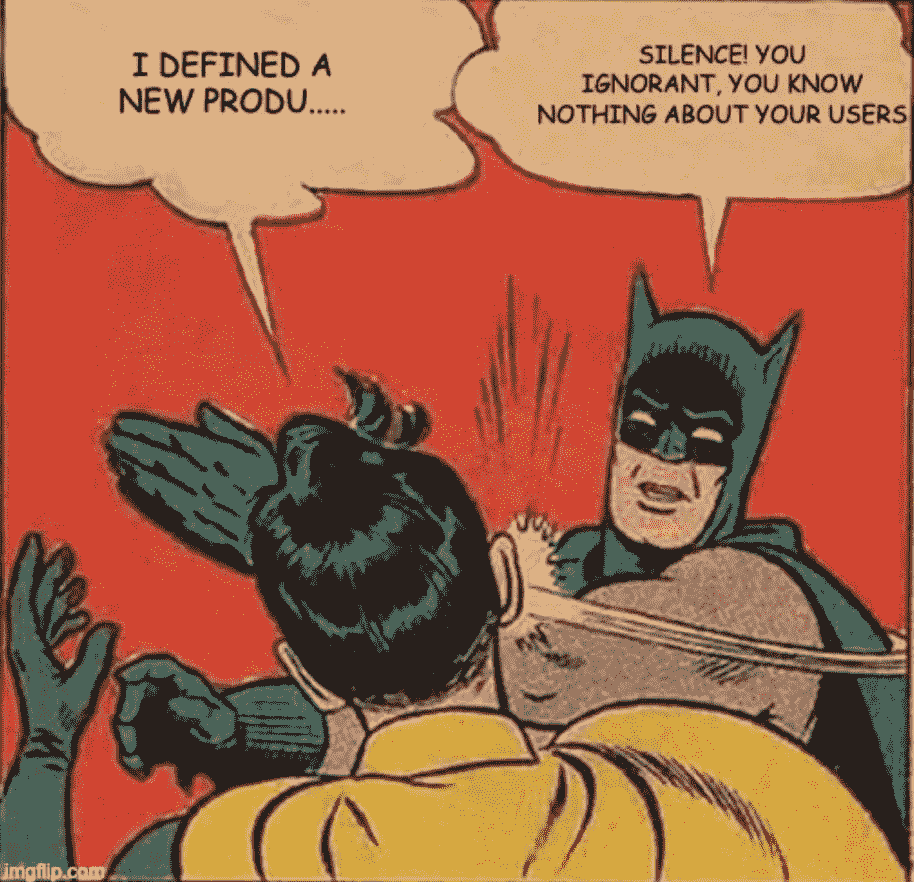
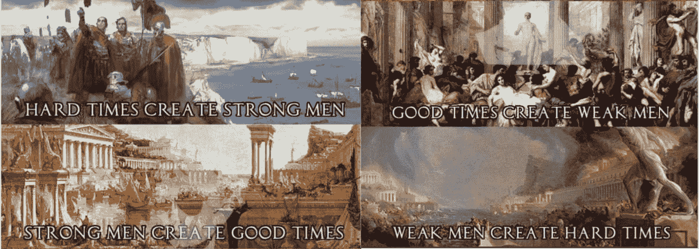
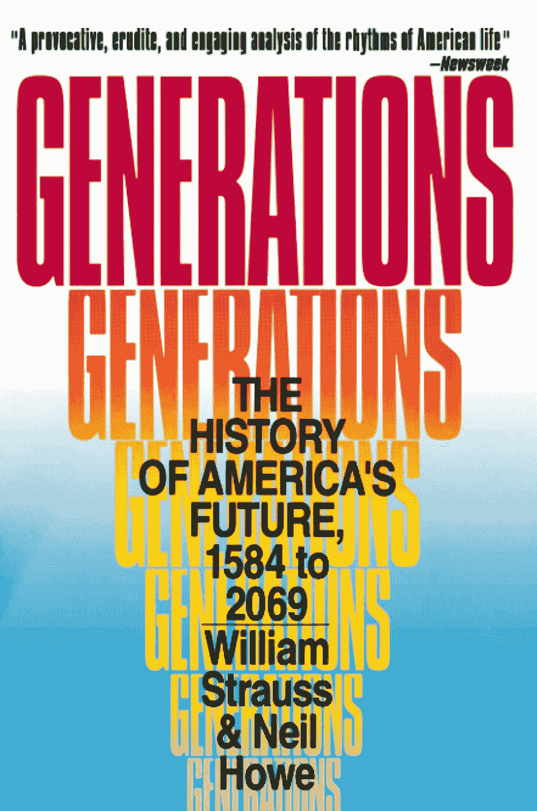
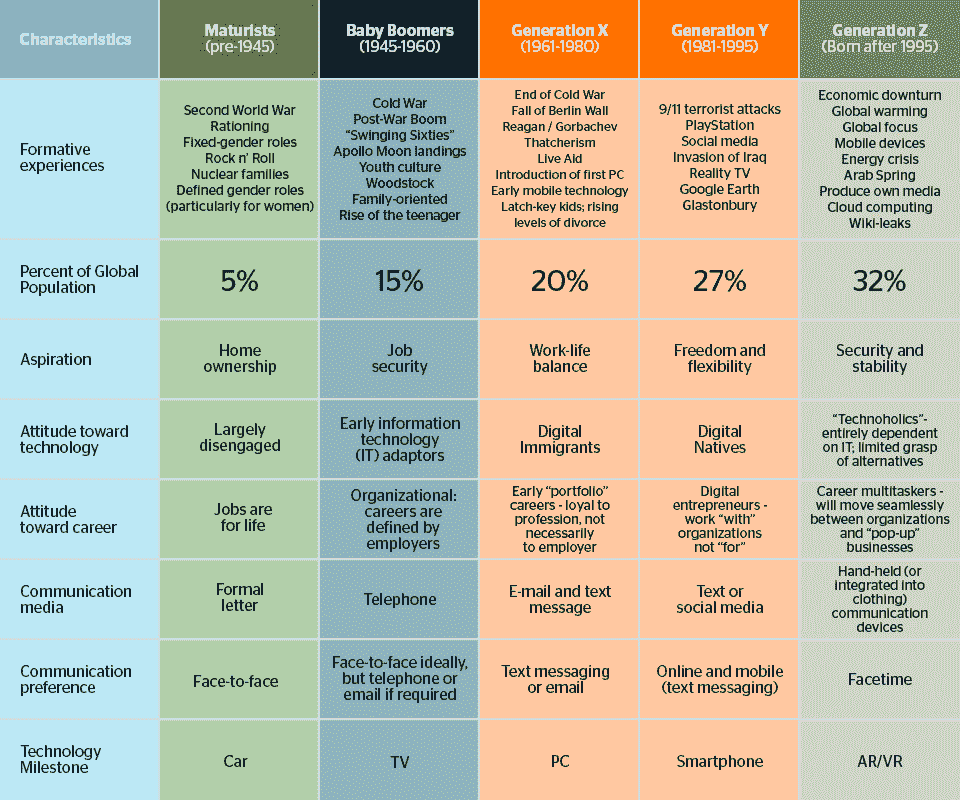
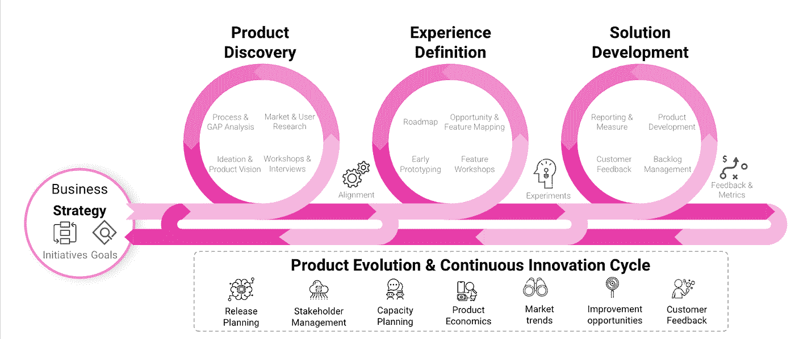
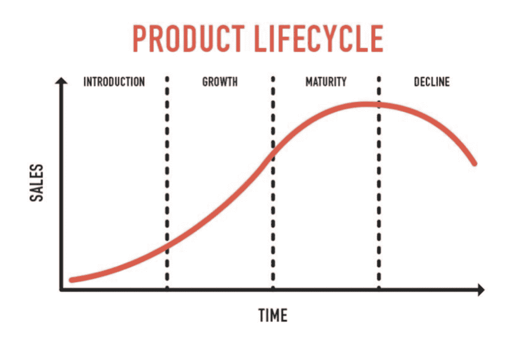

# 一代人的产物

> 原文：<https://medium.com/globant/the-product-of-a-generation-69fb55b6535c?source=collection_archive---------1----------------------->

## 2022 年 10 月

作为产品经理，我们必须能够提出正确的问题，并保持足够的怀疑态度，不要认为任何事情都是理所当然的，甚至在考虑开始制造任何东西之前，无论是物理产品、数字产品还是两者的混合。

我们应该能够问自己这样的问题，我了解这个行业和市场吗？我清楚我想要解决什么吗？我清楚我想如何解决它吗？

但如果我们看看产品的定义:“通过使用或消费自然或人工生产以满足需求或愿望的东西”，那么主要问题应该是:*我真的了解我的产品的潜在用户吗？*

然后，让我们假设我们计划推出一种产品，它的目标受众在某个年龄范围内，有可能为所有人创建一个单一的定义吗？我们有能力确定一套行为特征来描述它们吗？

已经有研究表明这是可能的(1)，尽管本文的目的远不是深入研究或试图证明之前在这方面的研究，让我们继续我们的理论模型，并假设它们是正确的，即在同一时间框架内出生的个体的同辈人格，因此他们生活在相同的社会经济背景下，其中发生了相同的历史事件，标记了他们的行为模式，他们理解生活的方式(2)和他们对未来的期望。

如果我们能够找到这样一个共同的定义，并因此创造出适应它的产品，我们肯定能够减少与任何新发布相关的不确定性，我们的最终创造将有更大的成功机会。

在决定这一共同愿景的事实中，我们可以发现战争，或没有战争，社会背景，技术，政治现实，……所有这些因素，以及许多其他因素，都有助于形成独特的性格特征，一系列共同的抱负和愿望，共同的恐惧以及对生活和未来的行为方式。

当然，总的来说，每个人的特殊经历、家庭、朋友圈、家庭的社会经济地位……都以同样的方式形成了每个人的个性。但是，我们不是都惊呼或者至少听到过“*今天的年轻一代……”*或者“*我父母那一代……*”这样的表达吗？(3).

无论如何，我们产品的目标用户很少会被完美地归类在一个共同的定义下，更多的时候他们会有不同的行为模式，不同的担忧和恐惧。然而，如果我们假设他们的行为特征至少有一部分是共同的，因为他们是基于世代因素，那么我们可以建立我们的基本假设，从这些假设开始做决定。

我们甚至可以从理论上说明，一个人的个性“有多少”是由他所属的那一代人决定的，有多少是由其他因素决定的，比如一生中发生的生理或个人经历。

我无意用更多的理论使这篇文章变得复杂，不幸的是，这不是我的专业领域，只要说有许多关于这个主题的文献，许多作者试图解释人格是如何形成的，以及它是如何沿着被分析个体的样本空间统计分布的，就足够了。

试图了解用户并不是一个非常疯狂的概念，事实上每个新项目都应该考虑到这一点。我指的是目标用户的真实知识，因为如果我们有这些知识并相应地调整我们的产品，我们的计划就有更大的可能成功。

**世代循环**

据说历史是循环前进的，可以根据个人的集体行为进行分析，分成几代人，如果这是真的，我们也知道这些集体成员的典型行为特征，那么根据这些目标群体或一代人采取最适当的策略不是很有意义吗？

*This known meme, based upon a post-apocalyptic novel by G. Michael Hopf, seems to be an accurate representation of this generational theories.*

为了让读者更好地理解这篇文章，我将试图解释这些世代理论是如何产生的，以及它们提出了什么。(5)

早在 1991 年，美国人威廉·施特劳斯和尼尔·豪试图根据居住在美国的不同世代的人的性格特征和看待世界的方式来解释美国的历史。

他们的观点在单一理论下的统一导致他们定义不同的集体人格或原型，这些人格或原型在整个历史中连续不断地连锁出现。

*Generations* of Strauss & Howe

根据他们的理论，历史事件与世代人物或原型相关联。然后，他们确定了四个原型:理想主义者、反应者、公民和适应者，后来被重新定义为先知、游牧者、英雄和艺术家。

他们说，每个原型中的几代人都有共同的价值观和对家庭等制度的态度，以及面对风险、理解文化等的方式。这些原型会随着时间循环往复。每次危机之后，下一代会出现，这将被归类为一个原型。

施特劳斯-豪和其他作者都深刻地从理论上阐述了在塑造个人个性方面的代际影响。

这些理论的学者已经命名了现在共存的几代人:

*Source: Expressworks International*

有大量的分析表明，关于每一代人的特征，可以在互联网上找到。任何有兴趣了解特定一代人的人都可以获得这些信息。

**调整我们的产品**

但是，如果我们尝试使用所有这些关于不同代人特征的知识，会对我们的产品产生什么影响呢？

在这一点上，作为产品经理，我们应该确保在产品定义过程中考虑这些知识，并依靠其他角色，如专门从事设计(服务设计师、用户体验和视觉设计师)或研究(专门从事数据(定量和定性)的收集、分析和解释)的角色，共同定义产品的价值提案，即定义我们如何为用户提供独特的价值。

*Product Cycle*, Product Studio EMEA, Globant.

由于所有这些工作，我们应该能够回答如下问题:

产品最重要的特点是什么？是速度、安全还是透明，还是它所传递的大胆性格或价值观？

或者，我们如何激励用户开始浏览我们的产品？我们如何让他们专注于这个过程？使用的语言会受到影响吗？

同样的，产品的美学，以及导航流程也会受到影响…

因此，如果我们的目的是为特定的目标受众定义产品，作为专业人员，我们不能忽视我们对他们的个性特征、价值观、风险厌恶、对家庭的态度以及最重要的他们与技术的关系的了解。我们对目标用户的承诺程度将完全取决于我们对他们的了解。

**没有永远的产品**

然而，我们已经预见到个人的变化，我们生活的生活经历和变化的环境会对我们的感知和行为产生影响。鉴于个体会发生变化，但从一个共同的集体个性开始，认为进化采取相似的路径是可行的，甚至冒险认为集体个性会进化，因此，我们作为定义产品的基础而建立的假设会发生变异。

我们已经知道，每个产品都有一定的持续时间:销售、市场和竞争对手的演变标志着所谓的产品生命周期。

Source: productcoalition.com

但实际上，一个产品的生存还有另一个不可忽视的因素，那当然就是它的目标受众。一个产品可以拥有世界上所有的质量，低竞争和理想的市场条件来继续取得成功，但如果你的目标受众的特征发生变化，我们的产品不再为他们提供同样的价值，它就会开始衰退，不再被消费。

如果我们的受众发生了变化，它也会发生变化，我们会想要或者能够对我们的产品做出必要的改变以保持它，还是会“让他们走”并寻找新的用户？(6) .就我个人而言，作为一名产品经理，更是如此，当我的工作是基于项目的临时任务，而没有与任何特定产品的永久联系时，我往往会有一个更静态的观点，根据当前的现实来定义产品，所以我还没有做出这个决定。

当然，尽管我们凭直觉知道一个尚未上市的产品的必然结果，但这不应该阻止我们尽我们所能来定义和构建它。

# 海梅·埃尔南德斯·维拉

## 生产部经理

# 注释和参考书目

(1) *“我们解释了一代人是如何被其“年龄位置”塑造的——也就是说，被其年龄决定的对其生命周期中发生的划时代事件的参与。在童年时期，特别是在将青年与成年分开的成长经历中，这一年龄位置产生了我们所说的“同龄人性格”——一套集体行为特征和态度，后来在一代人的生命周期轨迹中表现出来。”·几代美国未来的历史，1584 年至 2069 年，* 1991 年，威廉·施特劳斯&尼尔·豪

(2) *“生命意识的变化是历史上的决定，它表现为一代一代人的形式。一代人不是一个平凡的人，而是一个伟大的人:他们是一个新的社会群体，有一个少数人的选择和如此多的选择，他们的存在有一个重要的决定因素。”，La idea de las generaciones，* 1923 年，奥尔特加和加塞特

(3) *表现得像婴儿潮一代？过去半个世纪成人个性轨迹的出生队列差异，* 2022，心理科学

(4) *“人格是我们对外界的思考、感受、感知、反应的方式，自古以来就被不同的工作者所认为。理论的数量本身反映了人格不是同质的实体，不同时代的精神病学家和心理学家认为人格的发展是生物心理社会的。*、Kavirayani K. *人格的历史视角——过去和现在的概念:寻找尚未结束。* Arch Med 健康科学 2018；6:180–6，只是引用任何现有的研究。

(5) *代人问题*，卡尔·曼海姆，1928*；代*，施特劳斯&豪，19910；*第四次转折*，施特劳斯&豪，1997；还有很多其他的。

(6) *“在一个变化速度较慢、产品和服务种类较少、沟通和分销渠道不太普及、消费者不太成熟的时代，营销可以享受较长时间的相对稳定，从“保持顾客不变”和优化其他变量中获取利润。现在情况不再是这样了。”向主流客户营销和销售高科技产品。摩尔，G. A. (1991 年)。*