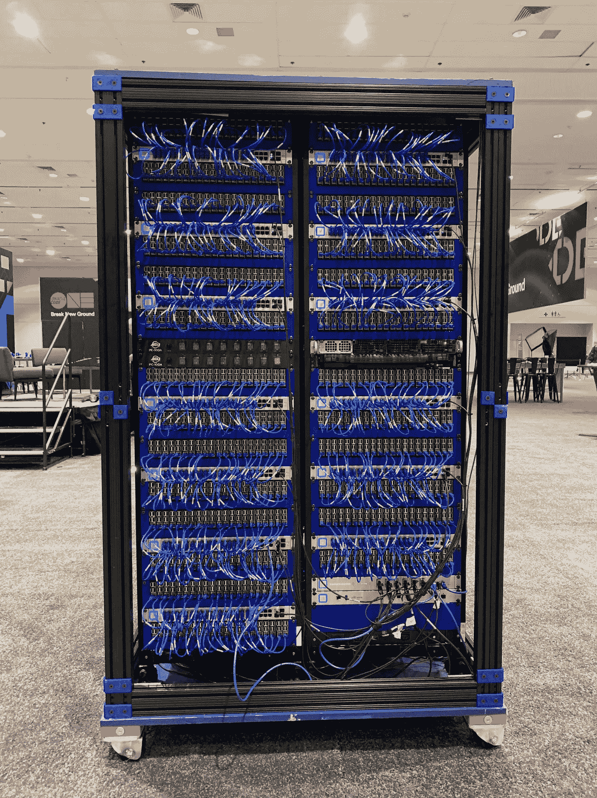
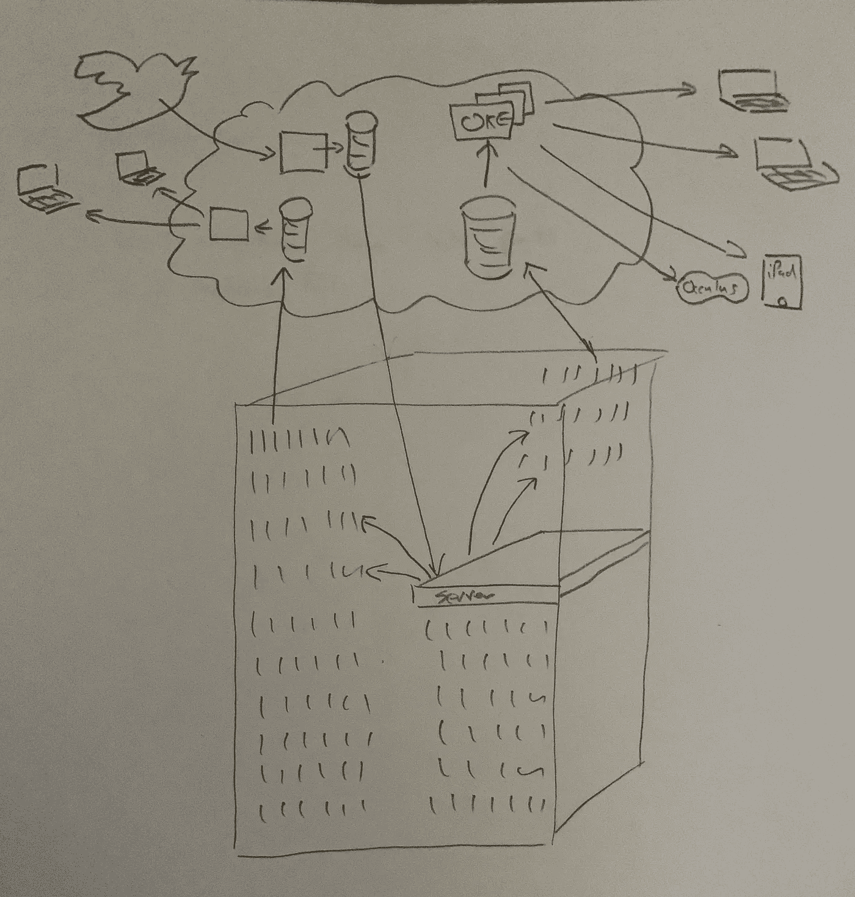

# Java One 2022 上的树莓 Pi 超级计算机

> 原文：<https://medium.com/oracledevs/the-raspberry-pi-super-computer-in-devnucleus-at-cloud-world-2022-2d24208d1712?source=collection_archive---------0----------------------->

克里斯·本森

如果你愿意，你可以在 GitHub [这里](https://github.com/chrisbensen/chris-blogs/blob/main/%CF%80Cluster/CloudWorld2022/CloudWorld-DevNucleus2022.md)阅读这篇博文。

树莓派超级计算机最初是为 2019 年 10 月的甲骨文开放世界打造的。四个服务器机架中有 1050 个树莓 Pi 3b+，配置在一个很大的方形盒子中，让人想起某部 BBC 电视剧中流行的英国警察盒子。快进到今天，树莓派超级电脑 *(Pi 集群)*被送进了电子垃圾，一些零件被剥离，休眠了两年，直到今年 5 月，它找到了我的车库进行彻底检修。



Raspberry Pi Super Computer at Open World 2019

关于 1050 年树莓派如何形成的时间历史，你可以阅读[世界上最大的树莓派集群的时间历史](/chrisbensen/a-temporal-history-of-the-worlds-largest-raspberry-pi-cluster-that-we-know-of-4e4b1e214bdd)。

首先，甲骨文瑞士公司的 Gerald Venzl 向我介绍了 12 节点集群，然后我们与 Stephen Chin 一起讨论了一个大型集群。了解 Pi 群集如何在 COVID 锁定和加州火灾期间变成电子垃圾，以及 Eric Sedlar 如何拯救它，并最终将其存储在 Oracle 实验室。如果你觉得太长，请观看 Gerald Venzl 的原始构建视频[我们所知的世界上最大的树莓 Pi 集群](https://www.youtube.com/watch?v=KbVcRQQ9PNw)，这个[构建世界上最大的树莓 Pi 集群](https://blogs.oracle.com/developers/post/building-the-worlds-largest-raspberry-pi-cluster)，以及这个在我的车库中的 [Big Pi 集群的视频——第一部分](https://www.youtube.com/watch?v=ELvkg_88XSY)。

顺便说一句，如果你正在读这篇文章，你很有可能会成为一个伟大的杰出人物。什么是发光体？这是我们最近推出的开发小组，它将像您这样的开发人员与独家技术内容、免费赠品和社区联系起来，帮助您构建像这个集群一样酷的东西，[成为当今的杰出人物](https://go.oracle.com/luminaries)。

## 恢复

当 CloudWorld 宣布的时候，我们立即提议复活世界上最大的超级计算机*(据我们所知)*。谁不喜欢好的复活故事？这些提议大概是这样的:

1.作为 Pi-Day 的非功能性艺术品捐给计算机历史博物馆。
2。树莓派现在很值钱。从世界上最大的树莓派集群之一中抽彩抽取一块派，赢取免费的树莓派 3B+。
3。我们有一个创造历史的机会。我们为 CloudWorld 修复了它，添加了风扇，使它不会过热，并将其作为“内部”和“边缘”设备运行，展示正在实验室中构建的技术。我们将包括运行在 Pi 集群上每个设备上的 [GraalPython](https://www.oracle.com/java/graalvm/?source=:ex:tb:::::RC_WWMK220210P00062:Medium_CBensen_Pi_DevNucleaus&SC=:ex:tb:::::RC_WWMK220210P00062:Medium_CBensen_Pi_DevNucleaus&pcode=WWMK220210P00062) 、 [Java](https://www.oracle.com/java/?source=:ex:tb:::::RC_WWMK220210P00062:Medium_CBensen_Pi_DevNucleaus&SC=:ex:tb:::::RC_WWMK220210P00062:Medium_CBensen_Pi_DevNucleaus&pcode=WWMK220210P00062) 和 [Oracle Linux 9](https://www.oracle.com/linux/?source=:ex:tb:::::RC_WWMK220210P00062:Medium_CBensen_Pi_DevNucleaus&SC=:ex:tb:::::RC_WWMK220210P00062:Medium_CBensen_Pi_DevNucleaus&pcode=WWMK220210P00062) 。所有这些都通过站点到站点*(滚动到底部查看相关说明)* VPN 连接到 [Oracle 云基础设施(OCI)](https://www.oracle.com/cloud/?source=:ex:tb:::::RC_WWMK220210P00062:Medium_CBensen_Pi_DevNucleaus&SC=:ex:tb:::::RC_WWMK220210P00062:Medium_CBensen_Pi_DevNucleaus&pcode=WWMK220210P00062) 用于内部部署，并通过微服务、计算实例、自治数据库、服务网关和负载平衡器进行连接。AR 可视化将是理想的，我们可以在上面运行一些很酷的东西——就像我们在 Raspberry Pi 迷你超级计算机上运行 SETI@home 时一样，这是一个 84 Pi 集群。我想到了建立一项服务的想法，这样世界上的任何人都可以向集群发送代码来运行工作负载，因为我们展示了我们的数字孪生 AR/VR 服务，并创建了博客和视频来激励开发人员和学生。我们可以向人们展示为什么开发人员和学生在学习和使用 [Oracle 的免费层](https://www.oracle.com/cloud/free/?source=:ex:tb:::::RC_WWMK220309P00059:Medium_CBensen&SC=:ex:tb:::::RC_WWMK220309P00059:Medium_CBensen&pcode=WWMK220309P00059)时会有很多乐趣。另外，我们可以获得吉尼斯世界纪录。

我们选择了第三个选项，开始寻找新的实验室。我与上面提到的各种产品团队的领导，以及树莓 Pi 社区的领导，如 [Jeff Geerling](https://twitter.com/geerlingguy) 和 Eben Upton 进行了交谈，并制定了一个计划。我不能告诉你整个计划，因为我们刚刚为它奠定了基础，但还有更多。这只是将 Pi 集群放入 CloudWorld 的 DevNucleus 的故事，并简单介绍了之后发生的事情。事实证明，吉尼斯世界纪录评审真的很贵！

第一步是确定工作的预算和估算，看看是否可行。我们知道我们需要:

1.粉丝。很多粉丝。
2。更换任何丢失的零件。
3。测试一切。
4。编写新软件。

每个 Pi 网络都会启动。2019 年，我在整个集群上运行了 Oracle Linux 7，但它还能工作吗？我们是否拥有所有的源代码、MAC 地址以及重做所需的一切？

第二步是获得一个在 Pi 集群上工作的地方。试着找一个有双扇门的地方，靠近货运电梯，有足够的电力和空间来工作，并且网络不是锁得很紧——不容易！我查看了甲骨文在世界各地的工厂。远程处理此类事情的后勤工作以及必须投入的所有体力工作意味着，只有满足某些要求，世界上任何地方都可以工作。我必须去那里旅行，安排好一切，并有十几个人来帮忙。我们将它设置为远程访问，但当事情不正常时，必须有人亲自到场。在与我那了不起的妻子享用了一顿美味的午餐后，我们认定我们的车库工作得最好，那就是 [#BigPiClusterInMyGarage](https://twitter.com/search?q=%23BigPiClusterInMyGarage&src=typed_query) 开始的地方。

## 添加风扇—冷却树莓酱

一旦它被交付，我就开始工作，确保我们的预算是准确的，然后在订购替换零件(主要是风扇)的同时进行调整和测试。很多粉丝:准确地说是 250 个新粉丝。该群集最终有 257 个风扇，这还不包括每个交换机、服务器或电源中的风扇。这需要我拆卸整个集群，然后重新组装。并非每个螺栓都被拆除，但所有 21 个 Pi 2U 组都被拆卸，每 5 个 Pi 都被拆除和更换，这意味着必须打印 250 个带有风扇支架的新 Pi 球童。你可以在这里了解那个[。](https://www.thingiverse.com/thing:3958586) [Victor Agreda](https://twitter.com/superpixels) 用他新买的 Ultimaker S5 打印了几十个球迷版的球童。这些风扇都需要电力，非常感谢[伊莱·席林](https://twitter.com/ThatEliGuyatOCI)创造了许多线束。此外，我们还添加了一些复活节彩蛋。我知道如果我把它告诉全世界，它就不算是一个复活节彩蛋，但我会在下面的颤音部分更详细地解释它(因为它太酷了，以至于什么都不说)。我有几个视频记录了一些工作，可以在[中找到，这是世界上最大的树莓派星团](/chrisbensen/a-temporal-history-of-the-worlds-largest-raspberry-pi-cluster-that-we-know-of-4e4b1e214bdd)的时间历史。

## 操作系统—最智能的操作系统

我认为我们很多人在构建基础设施和硬件时低估了一个好的操作系统的价值，而 Oracle Linux 是最棒的。我在[世界上最大的 Raspberry Pi 集群](/chrisbensen/a-temporal-history-of-the-worlds-largest-raspberry-pi-cluster-that-we-know-of-4e4b1e214bdd) *的时间历史中更详细地介绍了操作系统(我还在做一些其他的东西，这样你就可以在家里设置网络引导 Pi)。*因为我们有大量工作要做，所以我们必须从 Oracle Linux 7 升级到 Oracle Linux 9。我告诉你一个秘密:事情没那么简单。尽管如此，Oracle Linux 团队的合作令人惊叹，他们为 Pi 集群设置了操作系统，确实值得称赞。去看看 Oracle Linux 9，它值得使用或升级。有一些小问题，比如增加了安全层，这意味着默认情况下 root 帐户不再拥有 SSH 访问权限。

这里值得一提的是我们如何引导 Pi。集群中的每个 Pi 都通过服务器上的一个只读 NFS 挂载进行网络引导，我们添加了一个 systemd 服务，以便在服务器或 Pi 引导时运行 bash 脚本。这使得配置我们运行的内容几乎毫不费力。

## 软件和云服务— GraalVM 在客户端或云中快速运行

所有的软件都是开源的，可以在我们的 DevRel GitHub 仓库中找到。有些东西来自实验室，甚至不能作为技术预览*(我试过，他们只是还没准备好)*所以这些不包括在内。请注意，大部分代码都是快速编写的。你发现的东西可能没什么意义，所以让我解释一下。

首先，是集群上的软件。服务器在 [GraalVM](https://www.oracle.com/java/graalvm/?source=:ex:tb:::::RC_WWMK220210P00062:Medium_CBensen_Pi_DevNucleaus&SC=:ex:tb:::::RC_WWMK220210P00062:Medium_CBensen_Pi_DevNucleaus&pcode=WWMK220210P00062) 之上运行由 GraalPython 组成的 Docker 容器。那个 **Dockerfile** 正在持续改进中，所以我现在还不建议复制它。我已经提供了一些 bug 报告，但是一旦 Graal 环境变量和 CTRL+C 开始工作*(并且可能为 GraalPython 创建了一个新的映像)*您就会想要深入研究了。同时，要知道这是一种方法。我看到在 GraalVM 下运行纯 Python 代码时，性能提升了[8 倍。真是令人印象深刻！](https://www.graalvm.org/python/)

集群上的每个设备都运行一个 web 服务。服务器广播 UDP 消息及其 IP 地址和端口，供任何设备侦听，并与服务器通信以进行自动发现。这是前几年新增的，当时服务器的 IP 地址被放入环境变量中。IP 地址不会改变，所以我们可以对它进行硬编码，但有两个问题:任何从事这项工作的人都需要在他们的桌面上运行一个测试系统，并在他们的桌面上运行一个 Pi 或几个 Pi 的模拟，一旦您执行了 sudo，环境变量就会丢失。这实际上解决了很多问题！一旦 Pi 启动，它就运行它的 web 服务器，监听 UDP 消息，向服务器注册它的 IP 地址和 MAC 地址，并监听工作。每隔一段时间，服务器将向每个 Pi 发送一个 ping，作为健康检查，以确保它们应该在可用 Pi 的列表中。

每五秒钟，每个 Pi 发送其所有数据 *(CPU、内存、温度等)。)*通过本地 ORDS 支持到自治数据库上的 REST 端点。文件可以在这里[找到。我写了一些代码，如果 Pi 没有发送数据，下次它会等待更长的时间，最多 60 秒。事实证明，这是一座自治数据库可以轻松处理的数据山。我尝试了其他几个不应该被命名的数据库，只能说他们不能处理它，有时会导致超过五秒钟的延迟。](https://docs.oracle.com/en/cloud/paas/autonomous-database/adbsa/ords-autonomous-database.html#GUID-E2E921FF-2D80-4E32-9660-28506D10BADB)

## 带 AR/VR 的数字双胞胎—可视化您的数据


Raspberry Pi Super Computer Rendering

我创建了一个相当详细的 Pi 星团的 3D 模型，可以在[这里](https://github.com/oracle-devrel/picluster/tree/main/models)找到，并在你最喜欢的 3D 程序中打开。我们的 AR/VR 和云专家 [Wojciech Pluta](https://twitter.com/Vojtech_WW) 、 [Victor Martin](https://www.linkedin.com/in/victormartindeveloper) 、[波格丹一世·法卡](https://twitter.com/bogdanfarca)和[斯图尔特·科金斯](https://www.linkedin.com/in/sjcoggins/)着手构建一些令人惊叹的 AR 和 VR 体验。他们调整数据库，编写 APEX 应用程序，并运行 socket.io 进行流式传输。他们利用了一个名为[OCI·奥克](https://docs.oracle.com/en-us/iaas/Content/ContEng/Concepts/contengoverview.htm)的 Kubernettes 集群，因此 3D 体验可以在不倒下的情况下扩展，这意味着任何人都可以在他们的客厅放一个 Pi 集群的数字复制品。我们有用于 AR 的 iPad 和打印的 QR 码，因此 iPad 可以以毫米级的精度跟踪集群，使与会者能够交互式地查看集群的情况。该团队还构建了一个 Meta VR 版本，其细节将很快揭晓。我的车库没有足够的电力来运行整个集群，所以我们将在 CloudWorld 开门之前集成并测试它。它可能成功，也可能失败。无论发生什么，都会是一个好故事！当我们在 AR/VR Digital Twin 上写了一些东西时，我会在这里添加一个链接。

## OCI 服务—每个项目的核心都是云基础设施

在我的车库里，Pi 集群被设置为“本地”服务器。我在我的 Ubiquity Dream Machine Pro 上创建了一个隔离的子网，使用一个 [Bastion](https://www.oracle.com/security/cloud-security/bastion/?source=:ex:tb:::::RC_WWMK220210P00062:Medium_CBensen_Pi_DevNucleaus&SC=:ex:tb:::::RC_WWMK220210P00062:Medium_CBensen_Pi_DevNucleaus&pcode=WWMK220210P00062) 配置了一个到 OCI 的站点到站点 VPN，并使用了一个具有两个网络接口*(一个用于 Pi 集群子网，一个用于 Pi 集群)*的本地跳转箱。因此，Pi 群集对外界来说就像一个 IP 地址。出现，插上网络电源，你就好了。我希望设置也这么简单，我不必测试所有东西——确保电缆不会弹离位置——但我们只能说它很简单，因为它听起来更有趣。

我们不会在 CloudWorld 控制网络，所以 Pi 集群是一个“边缘设备”。它使用云服务，如[服务网关](https://docs.oracle.com/en-us/iaas/Content/Network/Tasks/servicegateway.htm)、[负载均衡器](https://docs.oracle.com/en-us/iaas/Content/Balance/Concepts/balanceoverview.htm)和[域管理](https://docs.oracle.com/en-us/iaas/Content/GSG/Concepts/managing_your_domains.htm)。是的，我们有一个域名。我将在下一节讨论这个问题。

网络看起来像这样:



Pi Cluster Demonstration Network Diagram

如果您对此有任何疑问，请前往甲骨文面向开发者的公共 [Slack 频道](https://bit.ly/odevrel_slack)。问任何你想问的问题。如何设置，使用什么服务。你会在那里找到你的答案！

## 物联网—使用小型廉价微控制器的特定轻量级任务

我们还有一对 Arduinos 在集群上运行。第一个 Arduino 是带有以太网帽子的 Arduino Mega。原代码可以在[这里](https://github.com/oracle-devrel/picluster/tree/main/source/arduino/ServerSwitch)找到。它运行一个 web 服务并打开两个螺线管来远程访问服务器上的物理复位和电源按钮。与资源库相比，我对软件做了一点改动，还没有发布，所以我保留了这个旧版本。我没有发布的版本会自动注册，并等待一个简单的启动命令，这时一个开发人员会进入堡垒。

第二个 Arduino 是相同的硬件，但运行一个监听 JSON 有效载荷的 REST 服务器，并连接到警察局顶部灯中的十几个[新像素](https://www.adafruit.com/product/1426)。

## 一种为 Pi 集群设计的定制编程语言

我们在 OCI 上托管域[https://whirl . with Oracle . cloud](https://warble.withoracle.cloud/code)，由[域管理](https://docs.oracle.com/en-us/iaas/Content/GSG/Concepts/managing_your_domains.htm)、[负载平衡器](https://docs.oracle.com/en-us/iaas/Content/Balance/Concepts/balanceoverview.htm)和[计算实例](https://www.oracle.com/cloud/compute/?source=:ex:tb:::::RC_WWMK220210P00062:Medium_CBensen_Pi_DevNucleaus&SC=:ex:tb:::::RC_WWMK220210P00062:Medium_CBensen_Pi_DevNucleaus&pcode=WWMK220210P00062)提供支持。compute 实例运行的软件与 Pi 集群上运行的软件相同:一个带有 GraalPython 的 Docker 容器和一个 web 服务。这还没有准备好在黄金时间播出，但请在 10 月 18 日至 20 日在这里或 Twitter 上查看，因为它将在 CloudWorld 期间直播，我认为会很有趣。


Warble Logo

我们已经为 Twitter 设计了一个运行在 Pi 集群上的编程语言，叫做[颤声](https://github.com/oracle-devrel/picluster/tree/main/source/warble)。whirling 不是一种全功能的编程语言，我走了很多捷径。它使用尽可能少的字符，这样你就可以在 Twitter 上发布一段颤音，并在 Pi 集群上运行。我有一个运行在计算机实例上的 Python 脚本，使用 Twitter API 搜索标签 **#pi** 。如果下一个字符是一个左花括号，最后一个字符是一个右花括号，那么我们有一个颤音，它被存储在数据库中。例如:

```
> #pi{PRINT(“hello cluster”)}
< hello cluster
```

当服务器有一些空闲周期时，它从数据库中获取一批颤音，找到一个 CPU 利用率低于 30%的 Pi，并将颤音发送给该 Pi 进行处理。颤声是用 Python 写的，将颤声转换成 Python，然后执行它们。目前它使用 Python3，但我们有一个用 GraalPython 编写的版本，使用了一些尖端技术，还没有向公众开放。现在，我们在甲骨文实验室的研究工程师罗德里戈·布鲁诺和 T2 正在准备在集群上运行。目前，通过一个易于设置的 REST API 将结果从颤声发布到一个自治数据库。[斯图尔特·科金斯](https://www.linkedin.com/in/sjcoggins/)和[杰夫·史密斯](https://twitter.com/thatjeffsmith)已经足够亲切地帮助这一点，并确保它坚如磐石。我们将有一个 [APEX](https://apex.oracle.com/en/) 应用程序，将显示鸣鸟和它们的结果，我希望我们可以得到一个自定义可视化的领导板。

看看谁能在世界上最大的树莓派集群上计算出最多位数的圆周率，这不是很酷吗？

```
> #pi{PRINT(2*ROUND(ACOS(0.0),3))}
< 3.142
```

已经够近了。

Twitter 将会非常有趣，尽管它限制了 API，这也是我们拥有托管域的原因。我将提供一个 REST 端点来发布颤音。也许有人会想出如何用[Bailey–borw ein–Plouffe _ formula](https://en.wikipedia.org/wiki/Bailey–Borwein–Plouffe_formula)用颤声或其他方式计算圆周率。

我不打算写语法，但我会给一些例子。

颤声支持变量:

```
> #pi{x=0PRINT(x)}
< 0
```

颤声可以处理复杂的表情:

```
> #pi{x=1/16.0²*(4.0/(8*k+1)-2.0/(8*k+4)-1.0/(8*k+5)-1.0/(8*k+6)}
<
```

While 循环:

```
> #pi{i=0;WHILE(i<10){PRINT(i);i++}}
< 0
< 1
< 2
< 3
< 4
< 5
< 6
< 7
< 8
< 9
```

对于循环:

```
> #pi{FOR(i=0;i<10;i++){PRINT(i)}}
< 0
< 1
< 2
< 3
< 4
< 5
< 6
< 7
< 8
< 9
```

我公开了大多数数学函数以及 **SETPRECISION(x)** 。它并不缺少角色，但这很好。

另外，您可以保存值并再次加载它们。它们是用户特定的:

```
> #pi{SAVE(“pi”,1)}
<
```

然后继续加载:

```
> #pi{x=LOAD(“pi”);x++;SAVE(“pi”,x);PRINT(x)}
< 2
```

最后，复活节彩蛋。颤声可以播放声音。是的，这是另一个连接到集群的物联网设备，但它是一个带放大器的 Pi！不幸的是，只有当你站在它面前时，你才能听到它。让你想来拉斯维加斯参加云世界，不是吗？

```
> #pi{PLAYSOUND(”[http://downloads.bbc.co.uk/doctorwho/sounds/tardis.mp3](http://downloads.bbc.co.uk/doctorwho/sounds/tardis.mp3\\\)");}
<
```

还有灯。这会将第一个灯变成红色:

```
> #pi{LIGHTS(0,255,0,0)}
<
```

如果你想把最后一个灯变成绿色，你应该这样做:

```
> #pi{LIGHTS(23,0,255,0)}
<
```

如果你想改变灯光的颜色，请执行以下操作:

```
> #pi{LIGHTS(0,0,255,0);SLEEP(20);LIGHTS(0,0,255,0)}
<
```

或者结合其中的一些:

```
> #pi{FOR(i=0;i<24;i++){LIGHTS(i,0,255,0)}SLEEP(20);FOR(i=0;i<24;i++){LIGHTS(i,0,0,255)}}
<
```

## 使用 OCI 设置站点到站点 VPN

在无处不在的梦想机器 Pro 上，在[蒂姆·克莱格](https://www.linkedin.com/in/timothy-clegg)的帮助下，我创建了一个新的子网。这是我们遵循的步骤的概要。我不打算提供具体的屏幕截图或视频，因为无处不在和 Oracle Cloud 上的选项会发生变化。相反，这里有一些你需要和应该做的重点:

在网络下创建一个新的网络，我选择“pi”。
VLAN ID: 3
网络类型:标准

创建站点到站点 VPN
网络名称:pivpn
预共享密钥:*******************
服务器地址:<路由器的 IP 地址>(默认应该可以)
远程网关/子网:10.0.0.0/24
远程 IP 地址:<远程 VPN 的 IP 地址>
高级:手动
IPsec 简档:自定义
路由距离:30

我创建了三个防火墙规则:

1.pi 模块 192.168.3.1(网关)

类型:局域网本地
动作:丢弃
源，源类型:网络
源，网络:pi
目的地，源类型:网络
目的地，网络:pi
目的地，网络类型:网关 IP 地址

2.默认接受 pi

类型:LAN In
动作:接受
源，源类型:网络
源，网络:默认
目的地，源类型:网络
目的地，网络:pi

3.pi 块至默认值

类型:LAN Out
动作:丢弃
源，源类型:网络
目的地，网络:pi
目的地，源类型:网络
源，网络:默认
高级:手动
检查匹配状态新
检查匹配状态无效

4.在 OCI 转到网络和站点到站点 VPN
创建 IPSec 连接。
给它起个名字。
你会想要这个来获取你的公共 IP 地址。

```
dig -4 TXT +short o-o.myaddr.l.google.com [@ns1](http://twitter.com/ns1).google.com
```

输入它。

你需要创建两个隧道，所以我设置两个都指向同一个 VPN，因为 OCI 需要两个，我只在我的网络上暴露了一个。您将把它添加到 VPN。

5.设置一个动态路由网关
6。设置一个 VCN，添加一个 CIDR 作为您的本地子网的入口规则，例如我的是 192.168.3.0/24。

## 未来

在 Oracle CloudWorld 上完成了 DevNucleus 的测试后，Pi 集群将前往 Oracle 实验室，在那里……好吧，接下来的部分暂时是一个秘密。潜在的用途包括:
1。运行 GraalVM 和 Java 的附加测试
2。边缘计算项目
3。机器人&并行处理(即神经网络)
5。开发商向我们建议的活动

随着 2023 年圆周率日即将到来，你一定会想继续关注这项不可思议的技术的下一阶段发展。谁知道呢？一些 Pi 甚至会从集群中出来，进入你的手中。

我想感谢参与这个项目的每一个人。阅读[世界上最大的树莓派集群](/chrisbensen/a-temporal-history-of-the-worlds-largest-raspberry-pi-cluster-that-we-know-of-4e4b1e214bdd)的时间历史，了解这个令人疯狂的项目是如何产生的。