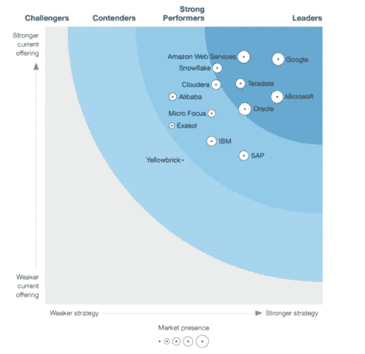

# 分解 BigQuery 的方法——以及修复它的一些方法

> 原文：<https://medium.com/globant/the-recipe-to-break-bigquery-down-and-some-ways-to-fix-it-c1c3c286f451?source=collection_archive---------0----------------------->

Source: [pixabay](https://pixabay.com/photos/ingredients-cooking-preparation-498199/)

> 收集数据是好的，存储数据是好的实践，但从数据中提取知识是一种强大的力量。

在本文中，您将找到一些方法来探索和发现如何分解 BigQuery。根据 [Forrester](https://cloud.google.com/forrester-wave-cloud-data-warehouse-2021) 的说法，BigQuery 是最重要的无服务器、高度可扩展、经济高效的多云数据仓库。

Source: [Forrester, via Google](https://cloud.google.com/forrester-wave-cloud-data-warehouse-2021)

“*能力越大，责任越大*”，正如他们所说，所以你需要知道一些重要的事情来使用 BigQuery 获得价值。很多人认为 BigQuery 是一个牢不可破的服务，你可以放心使用。像任何服务一样，你必须知道如何最好地利用它来挖掘它的全部潜力。我将展示什么是 BigQuery，给你一个灾难性的解决方案，并给出一个有疯狂需求的假想场景，以及一些修复它的方法。

# 分解 BigQuery 的最好方法

为了执行查询，BigQuery 创建一个“查询计划”来获取数据并估计所需的资源。但是，如果应用一些反模式，可能会破坏 Bigquery。

Source: [Memegenerator](https://memegenerator.net/instance/78286280/loses-their-minds-its-a-layer-8-error-everyone-loses-their-minds)

前五个问题是:

1.  **加入操作**。创建查询计划时，它意味着连接，作业可能会失败或花费大量时间。主要原因是 BigQuery 不是一个[在线事务处理(OLTP)](https://en.wikipedia.org/wiki/Online_transaction_processing) 系统。相反，Bigquery 有 [Dremel](https://static.googleusercontent.com/media/research.google.com/en//pubs/archive/36632.pdf) ，它被设计为提供[在线分析处理(OLAP)](https://en.wikipedia.org/wiki/Online_analytical_processing) 遵从性，这意味着如果您的数据是嵌套的并且[非规范化的](https://en.wikipedia.org/wiki/Data_deduplication)，它最适合。如果需要连接，可能会导致查询速度问题。
2.  [**数据偏斜**](https://en.wikipedia.org/wiki/Skewness) **。**如果您的数据分布不平衡(10%的唯一值代表 90%的总记录),并且您想要执行聚合任务，那么性能问题可能会随之而来。对于这样的任务，查询计划将分配大量的片段，这需要更多的资源。BigQuery 无法解决数据的统计分布问题。如果您不尝试根据数据的基数[对查询进行分段，这可能意味着更高的成本和时间。](https://en.wikipedia.org/wiki/Cardinality_(data_modeling))
3.  **通配符的用法。** BigQuery 面向列级。这意味着当您在一个 *SELECT* 语句中使用通配符来获取所有列时，您可能会获得不必要的数据。换句话说，您创建了一个不必要的工作负载。
4.  **用于查询的过滤器。**不能在聚合操作中使用嵌套过滤器。否则，您不能在没有[分区](https://cloud.google.com/bigquery/docs/partitioned-tables)或[集群](https://cloud.google.com/bigquery/docs/clustered-tables)设置的表格中使用过滤器。这是 BigQuery 中错误过滤器的两个例子，因为这对优化过程和有效提取没有影响。
5.  **作为过滤器的子查询:**当您使用一个查询过滤另一个查询时，您需要转到两个表。使用[静态值](https://en.wikipedia.org/wiki/Static_variable)听起来可能不是最好的选择，但它绝对比[子查询](https://cloud.google.com/bigquery/docs/reference/standard-sql/subqueries)更好。BigQuery 首先执行主查询，然后执行子查询，最后根据子查询的结果过滤主查询。但是，这最后一个阶段发生在[洗牌区](https://cloud.google.com/blog/products/bigquery/in-memory-query-execution-in-google-bigquery)，这不是推荐的行为。

# 假设情况

假设 ABC 公司需要创建几个查询来响应下面指定的业务需求。

Source: [pngarea](https://www.pngarea.com/view/54d04d2f_men-graduation-hd-png-download/)

该公司有以下要求:

*   动态更改分区和群集字段。
*   用很少的过滤器创建大型查询，而不是在聚合中使用嵌套条件。
*   创建具有数据偏斜问题的交叉连接操作。
*   所有这些都有以下限制:因为资金问题，你只能使用 1000 个[插槽](https://cloud.google.com/bigquery/docs/slots)。

ABC 公司试图自己解决上述需求，从而产生了打破 BigQuery 的完美方法:

*   他们创建了一个“测试查询”，期望得到 1000 个字段的结果，并(意外地)创建了一个超过 100，000，000，000 行的中间表。
*   该查询由 998 个具有嵌套条件的聚合组成。
*   这个查询由两个源表组成，左边的表有 4，000，000 行，右边的表有 25，000 行，两个表之间有一个交叉连接操作。

# 建议的方法

作为一名数据架构师，您可以按顺序通过以下建议来解决这一具有挑战性的需求:

1.  **执行数据分析。**要理解数据，首先探索它是一个好主意。您可以考虑使用统计工具来确定每个事件的唯一索引，并找到正确的策略来对数据进行聚类，以解决相关的业务需求。
2.  **割裂问题。** [分而治之策略](https://en.wikipedia.org/wiki/Divide-and-conquer_algorithm)是解决大问题的最好方法……你不需要创建一个包含数百个复杂聚合的大查询。通过使用窗口类型、功能和其他相关主题来避免使用嵌套条件的聚合，每次构建查询。
3.  **预处理您的数据。**创建计划流程以清除重复事件，并尝试丢弃两个表之间有任何关系的事件。对于这种方法，您可以创建一个临时表来保存原始数据。
4.  **使用中间表。**如果您有一个包含几个阶段的复杂查询，尝试将这个查询分成几个小步骤，并使用中间表(尽可能使用集群和分区)。使用这种策略，您可以有机会调整您的查询计划，并负责使用您的洗牌区。
5.  **处理数据倾斜。**你可以试试[逆势而为](https://en.wikipedia.org/wiki/Data_binning)的策略。分桶包括通过添加新的列键并在联接中使用它来重新分配数据。这种方法的主要缺点是，您的数据将在所有存储桶中被复制多次。您还可以尝试将高基数数据与低基数数据分开。当你采用这些策略时，主要的问题是得到一个[广播加入](https://cloud.google.com/bigquery/docs/best-practices-performance-compute#optimize_your_join_patterns)作为结果。这是指某个插槽需要处理的数据块具有正确的大小，可以毫无延迟地解决操作。
6.  **了解** [**信息 _ 模式**](https://cloud.google.com/bigquery/docs/information-schema-intro) **视图。**始终在这个重要的系统提供的视图中检查每个日志，以调整您的策略，并找到解决您查询中瓶颈阶段的正确解决方案。

# 最后

是的，不遵循最佳实践和应用查询反模式可能会破坏 BigQuery。您必须非常了解数据理论和产品特性，才能充分利用它的强大功能。BigQuery 是一款优秀的产品，但就像世界上几乎所有的东西一样，它并不完美，也有局限性。在正确的人手中，BigQuery 确实有正确的答案来解决您的数据问题，并从您的数据中提取所有价值。