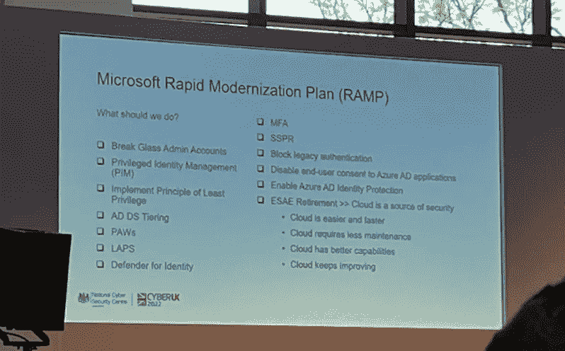
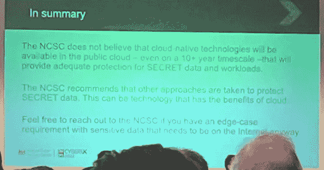

# 网络英国 2022 的回归

> 原文：<https://medium.com/version-1/the-return-of-cyber-uk-2022-278d69ac3829?source=collection_archive---------0----------------------->

对于那些不知道的人来说， [CyberUK](https://www.ncsc.gov.uk/section/keep-up-to-date/cyberuk) 由国家网络安全中心(NCSC)创建，是英国政府的旗舰安全活动，旨在告知和教育与会者关于网络安全的最新思想。

ICC Wales — CyberUK 2022 Venue

来自行业、政府和学术界的演讲者涵盖了从技术深度挖掘到推动更多网络教育进入学校的话题。

该活动通常有大牌发言人，如英国政府部长、GCHQ 或美国国家安全局的领导人。这一次，我们有 GCHQ 主任杰里米·弗莱明爵士，兰开斯特公爵郡大臣史蒂夫·巴克利，国家网络安全中心首席执行官呼唤·卡梅隆 CB OBE(有趣的是，NCSC 现任和前任首席执行官 Ciaran Martin CB 都来自北爱尔兰)，安全部长达米安·海因兹，[美国 CISA](https://www.cisa.gov/) 主任珍·伊斯特利，以及美国国家安全局网络安全主任罗布·乔伊斯。

这是我第四次参加 CyberUK 活动，之前的活动分别在利物浦、曼彻斯特和格拉斯哥举行。很高兴能参加这次活动，我真的认为它让英国在网络安全领导和指导方面脱颖而出。干得好，NCSC。

你可以在[cyber uk ONLINE-YouTube](https://www.youtube.com/c/CYBERUKONLINE/videos)频道上观看部分内容，下面是我的一些会议记录。在那之前是 TL；我从这个事件中发现了有趣的一般要点:

**TL；博士**

*   有迹象表明，俄罗斯的网络特工继续在反对他们行动的国家寻找目标。
*   英国电信观察到，在封锁期间，他们的网络流量增加了 62%，每 24 小时就有 6500 次网络攻击。
*   在微软，每秒钟都有 921 起密码攻击事件发生。
*   国家网络部队正在积极瓦解有组织的犯罪团伙。这意味着数千万英镑的潜在欺诈得以避免。
*   第一次，英国现在有了国家网络战略。我们必须共同努力提高网络弹性。
*   Microsoft RAMP 是一种以一致的方式将良好实践应用于特权访问的好方法。
*   创建一个超级强大的“非 MFA”启用帐户非常有用，以防 MFA 不可用，然后被锁定。
*   [默认设置为](https://www.ncsc.gov.uk/collection/cyber-security-design-principles/cyber-security-design-principles)。我们需要从严格的认证程序转向平衡速度和安全的程序。
*   “NCSC 没有看到任何证据表明公共云将能够达到‘秘密’级别”。
*   赛博英国明年在贝尔法斯特！(这是一个比威尔士的纽波特更容易到达的目的地)

下面是我的一些课堂笔记，供感兴趣的人参考。在结束这一部分之前，我想说的是，会议的总体氛围是:

1.  一个组织和为该组织工作的人之间不再有任何隔阂。注意你分享的东西。你的组织很可能成为网络入侵的目标。
2.  由于疫情，我们更多的工作和生活都在网上进行。大量组织已经成功过渡到远程工作，但这意味着我们需要格外警惕，因为我们不再处于安全的工作环境中，而是在家里使用我们的家庭网络。见第 1 点。
3.  工业界和政府必须继续合作。供应链必须得到保护。(作者——一位小组成员想对供应链管理不善处以罚款。我不认为我们会达到那个阶段，因为它不实际，但是我确实期望在我们如何构造软件，以及我们从哪里得到库和框架上付出更多的努力

**技术大师班 1:保护通往王国的钥匙—采用有效的特权访问策略—** *了解保护特权帐户的重要性，以及如何根据微软的安全快速现代化计划为您的组织采用有效的特权访问策略。本课程介绍了路线图并讨论了成功的关键要素，让代表们在自己的产业中实施有效的变革。*

Microsoft RAMP

本次会议似乎不是在线的，但它侧重于了解微软*快速现代化计划(RAMP)* ( [快速现代化您的安全基础设施](https://docs.microsoft.com/en-us/security/compass/security-rapid-modernization-plan))这是微软推荐的特权访问策略。

有趣的是，每秒钟有 921 次密码攻击(参见[这个世界密码日考虑完全抛弃密码——微软安全博客](https://www.microsoft.com/security/blog/2022/05/05/this-world-password-day-consider-ditching-passwords-altogether/)了解更多细节)。

实施 RAMP 之前的一个关键信息是，您应该首先关注为您的组织做好基础工作。避免仅使用单因素身份认证(例如，仅使用密码)，实施 AD 安全性，强化您的终端，并应用网络隔离。哦，还有限制宏执行。这都是很好的建议，看到它以简洁的方式放在一起很有用，不仅解释了“什么”，还解释了“为什么、如何、谁”，最重要的是，如何衡量成功。这些内容可以很容易地转化为遗留环境审查的快速清单。

会议还提供了以下要点:

*   **分离特权帐户的管理:**不要在本地和云之间重用一个管理员帐户，不要同步本地管理员或服务帐户，限制管理员帐户的数量并从微软官方下载中心推出[本地管理员密码解决方案(LAPS)](https://www.microsoft.com/en-us/download/details.aspx?id=46899)。

真正有趣的一点是创建一个超级安全的非 MFA 紧急访问帐户，因为如果 MFA 离线会发生什么？这种情况以前也发生过… [微软 365 MFA 中断锁定用户帐户(bleepingcomputer.com)](https://www.bleepingcomputer.com/news/microsoft/microsoft-365-mfa-outage-locks-users-out-of-their-accounts/)

*   **实现 Azure 特权访问管理:**提供基于时间和基于批准的激活。还建议显示身份验证请求来自的位置——这可以避免用户在周一早上盲目点击“批准”。你也可以收到每周的访问请求摘要邮件。
*   **使用 MS Defender for Identity:**Microsoft Defender for Identity(以前称为 Azure Advanced Threat Protection，也称为 Azure ATP)是一种基于云的安全解决方案，它利用您的内部 Active Directory 信号来识别、检测和调查针对您组织的高级威胁、泄露的身份和恶意内部操作。
*   **启用 SSPR(自助密码重置):**基本上，允许用户重置自己的密码，从而提高用户满意度并降低支持人员的工作量/成本。
*   **保护管理员帐户:** 跨所有管理员角色启用 Azure MFA。要求管理员将 FIDO2 安全密钥或 Windows Hello for Business 等无密码登录方法与唯一、长且复杂的密码结合使用。用一份组织政策文件来强制实施这种改变。
*   **阻止遗留认证:** 要准确知道什么在访问您的遗留系统总是很棘手的。有机增长意味着许多应用程序可以秘密连接到你的后端数据库。在我之前参与的一个项目中，我们通过在传统应用程序前面放置防火墙并阻止所有端口来确定哪些传统应用程序正在访问敏感区域。然后，您可以逐渐跟踪进出流量，以确定哪个应用程序通过哪个端口进行连接。
*   **禁用用户同意:** 简而言之，通过禁止用户同意可能恶意访问您组织数据的应用程序，阻止用户增加您组织的风险状况。
*   **管理用户登录时的风险:**启用 Azure AD 身份保护并清除发现的任何风险。这包括寻找弱密码或泄露的密码。

然后，发言人谈到了微软 PAWS(特权访问工作站)。这部分谈话的关键点是“如果你的笔记本电脑被入侵，那么你的爪子就被入侵了”。你还需要信任硬件，因此需要采用[安全核心电脑:针对内核攻击的芯片到云安全的简要展示——微软安全博客](https://www.microsoft.com/security/blog/2020/03/17/secured-core-pcs-a-brief-showcase-of-chip-to-cloud-security-against-kernel-attacks/)。

本次会议的结论是，上面提到的所有这些都是有用的，但它们确实来自许可和管理工作。也就是说，Microsoft RAMP 看起来是一个非常有用的工具，可以快速保护您组织的数据和资产。

**技术大师班 2:攻击者进去后做什么？** *这个大师班将讲述攻击者如何在你的网络中活动，你如何使之变得更加困难，以及你如何发现他们这样做。我们将涵盖常见的横向移动工具和技术，如何安全地测试，以确保它们不会在您的地产上工作，或者如果阻止它们是不可能的，如何检测它们。*

这个会话是“好的”。它主要关注攻击者在访问环境时会使用的工具。我在下面列出了其中的一些工具，但是我觉得它更关注工具，而不是“识别攻击者或测试元素”。会议还直接跳到在系统上有一个立足点，这是错过了一个妥协系统的路径的一个巨大部分。

会议中一个有用的引用是我们经常听到的短语*‘攻击者只需要正确一次就可以访问您的系统*’演讲者对此进行了扩展，说“*虽然这是真的，但当攻击者站稳脚跟时，情况会发生逆转，然后角色互换，防御者只需发现他们一次。”*。这里的教训是，您需要有强大的监控和审计系统，并根据信息采取行动。

提到的工具有:

*   [Bloodhound](https://www.sans.org/blog/bloodhound-sniffing-out-path-through-windows-domains/) — Bloodhound 是一款允许分析广告权利和关系的工具，重点关注攻击者可能滥用的权利和关系。
*   [PowerView](https://github.com/PowerShellMafia/PowerSploit/blob/dev/Recon/PowerView.ps1) —通过 PowerShell*枚举用户、计算机和域
*   [host recon](https://github.com/dafthack/HostRecon)—Invoke-host recon 在系统上运行大量检查，以帮助在参与的侦察阶段为渗透测试人员提供态势感知。它收集有关本地系统、用户和域信息的信息。它不使用任何“net”、“ipconfig”、“whoami”、“netstat”或其他系统命令来帮助避免检测。
*   [Mimikatz](https://github.com/ParrotSec/mimikatz) —从内存中提取明文密码、哈希、PIN 码和 kerberos 票据。Mimikatz 还可以执行传递散列、传递票证或构建黄金票证。

看到专业渗透测试人员使用的工具和方法是很有趣的。演示中缺少的一个部分是机器上的初始立足点。通常，这将通过反向外壳连接回攻击者的机器。也许这部分不在测试范围内😊。

***不要愤怒地回头*** — *从你想要的开始继续——根据设计原则打开安全包装——这是一个强调优势和揭穿神话的机会。SbyD 概念介绍。侧重于打破传统认证方法的好处，并强调方案交付导致安全考虑的风险。为什么设计比翻新更好。观众将有机会向代表 NCSC、内阁办公室、国防部、谷歌和微软的小组提问。*

“设计安全”是一项超级倡议。而不是把安全当做构建软件最后才出现的东西，在开发时就应该是一等公民。我对此有自己的看法，基本上是在正式开始项目之前，应该通过了解对您的服务的威胁来开始安全性工作。

这本身就值得写一篇博文，但本质上它归结为理解谁想要攻击你的系统，识别你的设计中的薄弱环节，并应用“相称的”安全措施。比例位在这里很重要，因为安全性必须与可用性和成本相平衡。

本次小组讨论引用了一些很棒的话，例如:

*   “将安全性看得比非功能性需求更重要。这是现在的功能需求。”[作者—这是一个公平的观点。您的 backlog 中的每一个用户故事都应该考虑安全性。你有一个无害的邮政编码查询，如果它每分钟被请求 200，000 次会发生什么？]
*   “这不是为了让认证者开心”[作者——的确如此。我见过许多组织专注于通过“操作权限”这一关。安全问题随时可能发生，您可能需要比鉴定人员更快地做出反应。如果你花了 1 天的时间来修复，花了 2 天的时间来获得认证，那一定是出了问题。]
*   “我们在高速公路上开得更快，但是没有红绿灯。据统计，高速公路更安全。我们需要将这种想法应用到安全性上”[作者——我非常喜欢谷歌一位小组成员的这句话。如果一个漏洞在野外变得很普遍，你有一个有限的窗口来解决它。您需要能够快速部署软件变更，以修补和缓解风险。]

有关“安全设计”的更多信息，请访问 NCSC 网站:

*   [安全设计原则—NCSC.GOV.UK](https://www.ncsc.gov.uk/collection/cyber-security-design-principles)
*   [网络安全设计原则——NCSC.GOV.UK](https://www.ncsc.gov.uk/collection/cyber-security-design-principles/cyber-security-design-principles)

**大风险思维—从超大规模到袖珍型，这些风险无处不在—** *四个简短的大风险思维讲座涉及我们现在和未来的一些更普遍的网络安全技术主题，包括:云环境中的高敏感性数据处理，为什么我们认为一些设备是可信的，而其他设备不是，与云可移植技术相比，云原生处理的优势和缺点，以及英国在跨域解决方案方面的进步、地位和方向。*

**设备安全**——这是一场非常有趣的会议，讨论苹果和安卓哪个更安全(几年前我就此写过一篇论文[你可以在这里阅读](https://www.dropbox.com/s/4ugv372vyms0myh/The%20proliferation%20of%20smartphone%20malware.pdf?dl=0)——实际上没什么变化。苹果有更多的审查，安卓有更多的灵活性。

**云安全** —这可能是本次会议中我最喜欢的演讲之一。来自 NCSC 的直爽主持人提供清晰明确的最新消息。

NCSC thinking on SECRET data and workloads in Public Cloud

简而言之,“NCSC 认为，即使在 10 年以上的时间内，云原生技术也不会出现在公共云中，不会为机密数据和工作负载提供足够的保护。

演讲者继续解释了 3 个选项(如果绝对需要的话)，如下所示:

1.  在秘密级别的私有云中托管数据和服务。
2.  适当保护数据，例如不同级别的加密。
3.  降低风险，减少数据，将安全性提高到最高水平(作者——显然这有成本和可用性影响)。

**跨域解决方案—** 我以前从未听说过这样的描述，但跨域解决方案是一种将具有不同威胁模型、风险特征或数据敏感性的系统连接起来的解决方案。简而言之，这是一个集成模式，涵盖三件事:转换、验证、重构。

举个例子，如果你上传了一个 PDF 到一个网站，里面可能有可执行代码。消除威胁的方法是将文件转换成无害的东西，比如一个简单的文本文件。然后，您将验证该文件，然后再次重建它。

在[模式:安全导入数据—NCSC.GOV.UK](https://www.ncsc.gov.uk/guidance/pattern-safely-importing-data)之前，NCSC 已经对此进行了阐述，该指南涉及协议破坏的层面，如果您通过 TCP 上传文件，那么您将使用另一种协议继续其进入您系统的旅程，以防止 TCP 存在漏洞。

这些技术是考虑到安全性的最高水平，可能不具有普遍适用性。但是，有这样的指导是非常好的。干得好，NCSC。

**关于作者:** Davey McGlade 是英国数字数据和云计算实践的领导者，负责版本 1。