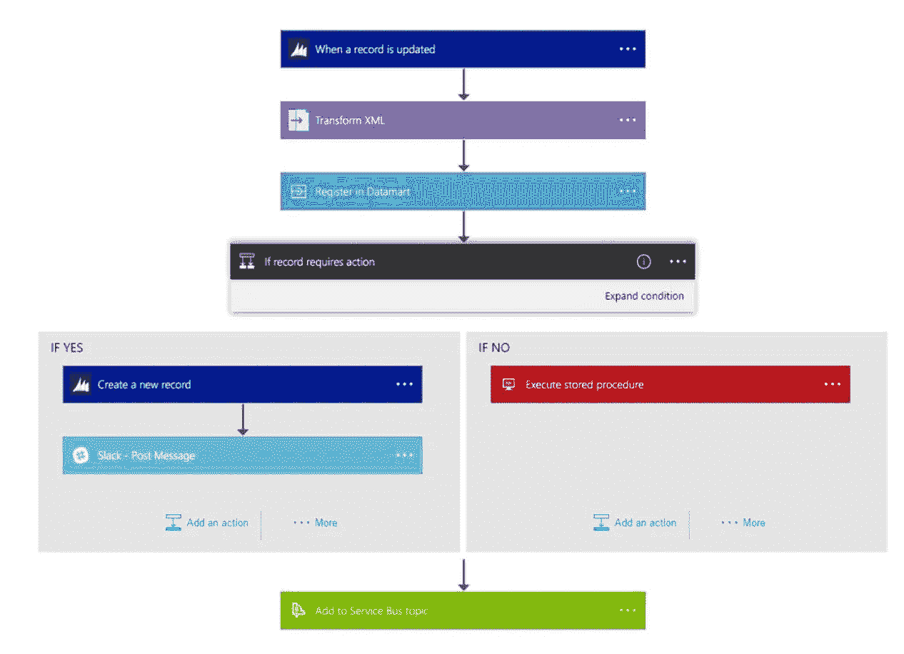

# 在 Azure 中实现 E2E 的正确方法

> 原文：<https://medium.com/version-1/the-right-way-of-implementing-e2e-in-azure-a7844fb7048d?source=collection_archive---------0----------------------->

# 介绍

现代企业应用程序开发不仅涵盖高效安全的工作应用程序，还涵盖若干非功能性需求，如应用程序可用性监控、性能监控、服务可用性和应用程序日志记录，以便更好地维护和支持应用程序。Microsoft Azure 平台可以很好地支持这些非功能性和功能性需求。在这篇博客中，我们将使用 Azure 基础设施，如 Azure AD B2C、App service、Azure Monitor、Application Insights、Logic App 和 APIM，覆盖 web 应用的端到端流程。

High Level Flow Diagram for the Web App

# **什么是 Azure AD B2C，目的是什么？**

Azure AD B2C 是一项独立于 Azure Active Directory (Azure AD)的服务。它基于与 Azure AD 相同的技术构建，但目的不同。它允许企业构建面向客户的应用程序，然后允许任何人注册这些应用程序，对用户帐户没有任何限制。

它被广泛应用于企业级，因为它为任何希望使用白标认证解决方案对其 web/移动应用程序的最终用户进行认证的企业或个人提供了一个平台。除了身份验证，Azure AD B2C 服务还用于授权，例如通过身份验证的用户对 API 资源的访问。

在我们后面的案例研究中，请求清除了防火墙 IP 限制，被应用程序网关重定向到 AD B2C。Azure AD B2C 正在使用凭据对用户进行身份验证，从而生成令牌、guid 等。

# **什么是 APIM，如何使用它？**

Azure API Management (APIM)提供了一种为现有后端服务开发一致的现代 API 网关的方法。

API 管理帮助组织向外部、合作伙伴和内部开发人员发布 API，以有效地提供释放其数据和服务潜力的平台。世界各地的企业都在一个敏捷的环境中工作，以扩展他们作为数字平台的运营，创建新的渠道，寻找新的客户，并推动与现有客户的更深入接触。API 管理提供了核心能力，如开发人员参与、业务洞察力、分析、安全性和保护，确保了 API 计划的成功。在我们的例子中，我们使用 Azure API 管理来获取后端服务，并基于它启动一个成熟的 API 程序。

# **保护 APIM 的应用程序？**

在我们的研究中，我们使用 AD B2C 在认证后生成有效令牌。当应用程序向 APIM 端点发出相关调用时，需要在 APIM 层验证该令牌。

使用 APIM 策略和 XML 标记，例如 APIM 的 **< validate-jwt >** ，我们可以验证 jwt 令牌。此外，为了更好地保护应用程序，我们可以使用 XML 标签，比如**<write-uri>**，它可以向前端用户隐藏实际的 URL。

此外，APIM 还提供了一些功能，如限制呼叫率(通过订阅或通过密钥)，我们正在将这些功能用于我们的案例研究体系结构中。

> 示例:在以下示例中，每 60 秒钟 10 个呼叫的速率限制是由呼叫者 IP 地址键入的。每次策略执行后，该时间段内允许的剩余调用都存储在变量`remainingCallsPerIP`中
> 
>  <policies><入站>
> <基站/ >
> <按键通话限速="10"
> 续保-期间="60"
> 增量-条件= @(上下文。response . status code = = 200)"
> counter-key = @(context。请求. IpAddress)"
> 剩余呼叫-变量-name = " remainingCallsPerIP "/>
> </入站>
> <出站>
> <基/出站>
> </保单>
> /保单></policies>

更多详情:

 [## Azure API 管理访问限制策略

### 本主题为以下 API 管理策略提供了参考。有关添加和配置的信息…

docs.microsoft.com](https://docs.microsoft.com/en-us/azure/api-management/api-management-access-restriction-policies#LimitCallRateByKey) 

# **逻辑应用及其在流程中的应用？**

Azure Logic 应用程序提供了一种在云中简化和实施可扩展集成和工作流的方法。它提供了一个可视化的设计器，将您的过程建模和自动化为一系列称为工作流的步骤。逻辑应用程序允许开发人员设计通过触发器和一系列步骤来表达意图的工作流，每个步骤调用一个应用程序服务应用程序接口应用程序，同时安全地处理身份验证和最佳实践，如持久执行。

在这里的案例场景中，我们在架构图中使用逻辑应用程序工作流，因为来自后端服务的响应数据需要修改，然后由前端应用程序使用。这里的逻辑应用程序工作流提供了一种开发和管理流程的简单方法，帮助我们改变响应的结构，同时还向响应中添加自定义字段。这里的替代方案可以是使用 Azure Functions，但这取决于具体的用例场景。

# **使用应用洞察的优势**

Application Insights 是一项主要针对 web 应用程序的 Azure 性能管理服务，使您能够在 Azure 中对网站性能进行所有监控。

这在我们的案例中是有益的，因为它也提供了一个强大的分析工具，有助于诊断问题并了解人们如何使用您的 web 应用程序。它帮助我们满足非功能性要求，如网站可用性、性能标准和出现问题时的警报。我们可以为每个应用洞察资源创建多达 100 个可用性测试。

在我们的案例中可能用到的一些测试有:

*   使用 **URL Ping 测试监控可用性**验证端点是否使用高级 HTTP 请求进行响应。衡量与此响应相关的绩效。能够设置自定义成功标准。

*   类似于 URL Ping 测试，Azure 提供了**标准测试(预览版)。**除了验证端点是否响应和测量性能，标准测试还包括 SSL 证书有效性、主动生命周期检查、HTTP 请求动词(例如`GET`、`HEAD`、`POST`等)。)、自定义标头以及与您的 HTTP 请求相关联的自定义数据。
*   **报告** —针对应用洞察的可用性警报。我们可以使用 SLA 工作簿作为一种方式，通过您的 Application Insights 资源和 Azure 订阅的单一控制台来计算和报告 Web 测试的 SLA(服务级别协议)。停机和停机报告提供了强大的预建查询和数据可视化功能，以增强您对客户的连接性、典型应用程序响应时间和经历的停机时间的了解。
*   Application Insights 为监控性能提供了**主动诊断**“例如，如果您依赖的某项服务出现故障，或者您刚刚部署的新版本运行不太好，那么您一查看电子邮件就会知道。”提供的**实时指标流**允许我们查看延迟等指标，以及检查故障等的方法。**应用地图**自动发现您的应用拓扑，将性能信息置于其上，让您轻松识别分布式环境中的性能瓶颈和有问题的流程。

# **结论**

这篇 5 到 6 分钟的文章旨在让您了解 Azure 环境中的开发和端到端实现。本文提出了一个架构流程，可以被不同的企业用于他们的项目。虽然在这里我试图把重点放在 Azure 提供的一些最好的工具上，但是实际的实现当然是基于用例以及业务场景的。

**关于作者:** Siddhant Kandoi 是这里 1 版的全栈工程师。