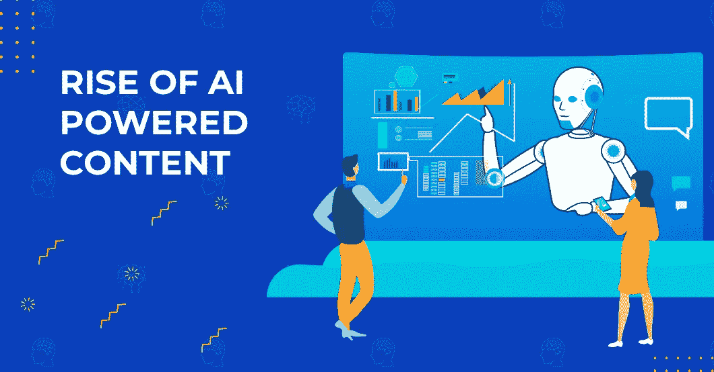
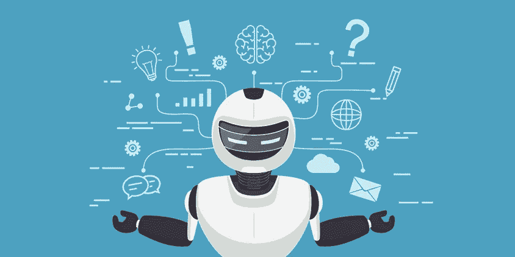

# 人工智能驱动的内容的崛起

> 原文：<https://medium.com/quick-code/the-rise-of-ai-powered-content-9cdf2c5b10f7?source=collection_archive---------0----------------------->

这听起来可能有点不可思议，但我的侄孙可以比他父母的名字更好地发音 Alexa。这是他在房子里听到最多的名字。

我敢肯定，在这件事上，他家并不孤单。人们在家里使用人工智能有很多用途。Alexa 只是其中之一。

我们每天都与人工智能擦肩而过。从我们用智能手机捕捉的图片，到我们在脸书页面上看到的广告，人工智能控制了一切。

这是当今的流行语。人工智能的力量在未来一定会上升，因为所有的科技巨头都享受到了它在促进他们的利益方面的力量。

# **什么是 AI？**

当机器表现出类似人类智能的品质时，我们使用人工智能或 AI 这一术语。这台机器被认为是“智能的”

在这个过程中，计算机被编程为使用大量数据来执行通常由人类完成的任务。

这项技术最近变得非常流行。几乎所有行业都用。它帮助机器更好地运行。机器人学会自己改变它们的表现。

设备像人类一样识别变化。这些因为 AI 而成为可能。随着使用范围的扩大，我们将 AI 分为不同的类型。

## **纯粹无功**

这是 AI 的最低级形式。这种人工智能可以观察情况并采取相应行动。它无法形成自己的想法。它处理当前案例并完成一项任务。具有这种人工智能形式的机器没有记忆。

## **有限的记忆**

这是人工智能的一种稍微高级的形式。它有足够的智慧来做小决定。它有一个存储数据的存储器。它使用这些数据来完成小任务。这方面的例子有聊天机器人、自动汽车和数字个人助理。

## **心理理论**

这种类型仍处于萌芽阶段。专家期望这能理解我们的情绪并与我们互动。

## **自我意识**

这是 AI 的顶级水平。在这个层面上，机器可以与我们进行社交互动。他们会逐渐发展自己的个性。他们会有感觉，会形成自己的看法。

# **人工智能和内容**

可能人工智能使用最多的领域是数字营销。无论是在分析客户行为还是在内容创作方面，人工智能都有巨大的帮助。在这里，使用可用的数据是有帮助的。

我们不需要 AI 开发公司来告诉我们 AI 是如何分析我们的行为的。我们可以看到，当我们撰写电子邮件时，我们在脸书上获得广告或建议。这些应用程序检查我们的习惯，并提供正确的提示。这是人工智能的主要用途之一。

# **AI 和 CMS**

内容管理系统或 CMS 是任何组织不可或缺的一部分。它在很多方面都有帮助，因为它使用起来非常方便。它可以让您从任何地方跟踪和监控您的内容。不管你用的是什么设备或者什么操作系统。

人工智能帮助公司从网站访问者那里获得他们需要的信息。人工智能可以向客户提供定制的内容。它有助于发起更有针对性的活动。人工智能也有助于有驾驶经验的商业。

人工智能帮助设备根据输入的数据做出明智的决策。如果你把 AI 应用到 CMS 上，那么它就可以大有用武之地。它将能够使用控制器的模式。人工智能将帮助他们更好地通过内容管理系统简化内容。

CMS 的一个问题是它不能准确地组织内容。它也不能列出内容。困难在于不能联系到文档中提到的人、地点和其他相关信息。人工智能以这种方式帮助组织内容。

人工智能在检查合同方面也很有用。它将审查和审计协议中的内容，并根据需要进行更正。人工智能可以利用它检查合同的经验来识别合同中的错误。它使用旧数据作为参考。

# **用于内容创建和生成的人工智能**

数字营销是人工智能非常有用的另一个领域。Salesforce 调查了数字营销专业人士。其中 56%的人确认他们已经在使用 AI，27%的人表示他们非常有可能在 2019 年使用它。人工智能站在数字营销人员将使用的技术增长的第一位。

有大量关于潜在消费者的数据，而且还在增长。人工智能相关技术，如机器学习、深度学习和自然语言处理，将对基于数据的决策产生最大影响。

当谈到数字营销中的内容时，人工智能可以帮助创建内容，这将有助于为您的网站带来流量。你可以因此节省大量的时间和精力。AI 已经在根据现有数据撰写报道和新闻了。

美联社和福布斯等新闻机构已经在使用人工智能工具创建的内容。这帮助他们让更多的人访问他们的网站。如果你提供必要的数据、关键词和模板，人工智能可以帮助你创造优秀的素材。这些内容看起来像是人类设计的。许多受欢迎的新闻机构已经在使用这种技术。

# **智能内容展示**

是 AI 的另一种用途。它会按照你的要求分析、整理、呈现内容。这将有助于访问者在你的网站上找到更多相关的主题。它非常适合让访问者停留在你的网站上。

顶尖的 AI 开发者已经在使用这项技术，你几乎每天都能看到。人工智能为查看出现在电子商务网站上的相关商品提供建议。你会经常发现类似“买了这个的人也买了 XXX”这样的消息。AI 设计了这些。

网飞使用同样的技术。它使用人工智能内容管理方法向你推荐电影。这在数字营销中是非常有益的，因为当访问者访问你的网站时，它会推荐相关的博客。这将使访问者在网站上停留更长时间。

# **电子邮件营销**

我们都习惯了电子邮件营销。你在谷歌上搜索一些商品，很快你就会在你的账户里找到与你搜索的商品相关的邮件。许多公司正在使用人工智能来研究你的行为，并使他们的电子邮件活动更加有效。这项技术可以锁定正确的受众。

AI 可以分析大量数据。它会找出哪些主题行将产生点击。AI 还能够从数据中解读出，一天中的哪个时间，一周中的哪一天，给你发邮件是最好的。公司甚至可以知道他们给你发邮件的频率。

人工智能用来分析和创建电子邮件内容的一些工具有 Boomtrain、Phrasee 和 Persado。据报道，Phrasee 创建电子邮件主题的能力比人类高 95%。根据 Persado 的分析，内容的性质和人类一样好。

# **数字广告**

数字广告是互联网营销的一部分，在很大程度上使用了人工智能。我们已经在谷歌和脸书的广告中发现了人工智能的应用。这些广告平台正在使用人工智能和机器学习来识别将执行广告商最想要的动作的人。

他们使用人工智能来分析脸书和谷歌用户的行为。有了这些信息，他们就能找到合适的受众来投放广告。他们会根据一个人的地域、兴趣等来进行搜索。找到目标客户。它可以让广告商花最少的钱进行转化。

人工智能和机器学习不仅仅有助于找到正确的受众。他们还帮助找到一个平台，是一个特定产品的最佳广告。这意味着广告将获得最好的转化率。

# **整理照片**

今天的照片是人工智能操控的产物。大多数智能手机的摄像头都使用人工智能。它有助于点击更好的图片。有很多功能，比如识别人脸。脸书使用人脸识别来标记照片。

AI 发挥非常重要作用的另一个地方是组织照片。Google 相册非常有效地使用了 AI。Google 相册会根据位置等不同参数自动排列您的照片。该功能还允许您使用图库中的图像制作电影或拼贴画。这些都用 AI。

# **新闻提要**

脸书、Twitter 或 Instagram 上的新闻源只会显示你喜欢的内容。如果你想知道这是如何发生的，这又是人工智能在起作用。AI 可以从你的动作中分析出你的口味。它在研究你的效果后得出你喜欢的结论。

它不仅仅忠实于新闻提要。社交媒体广告也是如此。营销人员非常明智地利用这一点来增加他们在社交媒体平台上与客户的互动。这有助于他们找到合适的人购买他们的产品。

# **AI 符合性认证**

所有的组织都应该遵循一定的惯例。这些可以是法律标准，也可以是行业制定的特定标准。坚持这些实践通常被称为遵从。监管机构会定期检查并颁发合规证书。

今天，我们看到了人工智能在合规性测试中的应用。自然语言处理用于检查文档。该流程使用一组关键字来查看法规文本是否有任何变化。

深度学习用于减少涉嫌洗钱的交易量。通过使用预测分析和情景构建，公司还可以保持在法定资本要求的范围内。人工智能正在帮助企业避免欺诈。

# **对知识型员工的支持**

AI 已经能够在很大程度上减少人类的工作。公司可以将人力资源用于更好的目的。人工智能帮助人类劳动力的领域是知识工作者。人工智能有助于分析大量可用的信息。

有些公司里，受过高等教育的人从事研究工作。但这些人可能缺乏计算能力。人工智能正在帮助他们处理他们所拥有的信息。这样 AI 可以为研究机构节省很多时间。

# **聊天机器人**

我们经常在各种网站上看到聊天机器人。这是利用人工智能给客户更好体验的另一种方式。

越来越多的公司正在部署聊天机器人来与客户交谈，并帮助他们获得必要的信息。

聊天机器人可以协助客户支持。聊天机器人还可以根据客户的要求向他们发送材料。

[**商家正在提供人工智能聊天机器人**](https://becominghuman.ai/how-businesses-are-providing-a-befitting-customer-service-with-ai-chatbots-4be9a9f8a654) **。**所以，你应该意识到这个事实。

# **搜索**

语音搜索有所增加。AI 有助于理解语音请求，并提供最合适的搜索结果。人工智能不仅能够知道我们问什么，而且能够找出上下文。它会产生更精确的搜索结果。

谷歌的 RankBrain 和语音搜索在搜索和搜索引擎优化方面产生了巨大的变化。亚马逊 Echo，微软 Cortana 等。可以根据你的声音命令给你结果。人们使用标准的对话命令。人工智能正在帮助计算机识别权威并提供正确的结果。

# **用户体验**

一个网站或应用的成功很大程度上取决于用户体验。人工智能开发者可以帮助网站提供更好的用户体验。人工智能研究用户操作电脑时的行为。在人工智能的支持下，公司可以分析个人偏好，并提供适当的用户体验。

# **预测分析**

它是使用人工智能分析现有数据的方法，以帮助公司采取行动来转换潜在客户。公司可以预测顾客的需求并给他们想要的东西，而不是对顾客的要求做出反应。它有助于加快转化客户的过程。

然而，这里的一个危险是，人工智能完全依赖于你提供的数据。只有在此基础上，它给出了建议。但是如果你正确地完成了这个过程，它将帮助营销人员节省时间，而这些时间将花费在那些永远不会转化为客户的潜在客户身上。

●我们已经看到人工智能驱动的内容如何在各个领域发挥其威力。

●人工智能有助于营销人员根据客户的行为为他们创造合适的内容。

●使用人工智能可以更好地组织 CMS。你可以安排关于人或地方的材料。

●人工智能创造的内容有助于吸引你网站的访问者。

●人工智能可以利用你输入的信息片段，帮助创造内容。这些内容与人类创造的内容非常相似。

●电子商务网站会创建提示性内容，促使客户查看更多产品。

●人工智能在电子邮件营销中有很大帮助。它将分析我们的电子邮件，并向营销人员建议什么主题行会让我们打开并阅读邮件。

●人工智能和机器学习有助于公司找到合适的受众，他们将执行他们期望的行动。这也有助于找出最合适的广告渠道。

● Google Photos 使用 AI 来组织照片，并创建令人兴奋的拼贴画和电影。

●社交媒体平台中的新闻源使用人工智能为我们提供我们会觉得最有趣的故事。

●人工智能在分析文件和报告方面有很多用途，可以让公司遵守所有法律法规。

●知识工作者从人工智能中受益匪浅，他们可以更快地履行自己的职能。

●聊天机器人是人工智能的一个结果。

● AI 辅助提炼搜索结果。它还有助于识别声音并提供正确的搜索结果。

●由于人工智能，我们在网站上获得了更好的用户体验。

●人工智能进行预测分析，帮助公司将时间和金钱花在合适的潜在客户身上，这些潜在客户将转化为客户。

# **结论**

随着公司之间的竞争加剧，他们正在寻找各种技术来帮助他们以更好的方式为客户服务。为顾客创造合适的内容是必要的。通过关注客户的需求来让他们满意是非常重要的。有必要确保他们在网上有最好的用户体验。

美国专注于人工智能的最好的移动应用程序开发公司肯定会发现自己比以往任何时候都更忙，因为越来越多的企业转向了他们。他们将是帮助公司分析客户及其需求的人。人工智能是一种技术，它将通过更好的内容让客户参与变得更智能。

**作者简介:**

Harikrishna Kundariya，营销人员、开发人员、物联网、聊天机器人和区块链专家、设计师、联合创始人、移动应用开发公司[**eSparkBiz Technologies**](https://www.esparkinfo.com/)董事。他的 8+经验使他能够为基于物联网和聊天机器人的新创企业提供数字化解决方案。