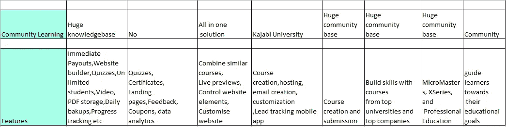
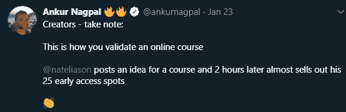

# 新冠肺炎时代电子学习产业中创作者平台的兴起

> 原文：<https://medium.com/quick-code/the-rise-of-creator-platforms-in-the-e-learning-industry-during-covid-19-d6c74df61877?source=collection_archive---------0----------------------->

“人类的每一个成员都有**潜力**成为创意经济成功故事的**成员**——朴槿惠(大韩民国总统)”

时代有办法，迫使你去适应

[亚当·沃森](https://www.indiehackers.com/podcast/098-adam-wathan-of-refactoring-ui)从书籍/课程中赚了 250 万美元。

丹尼尔·瓦萨洛通过一本书和视频课程赚了 10 万美元。

Emma Bostian 在她的书出版前就赚了 4 万美元。

李·罗宾逊通过在线教学赚了 7000 美元

因此，如果你看到你身边的一些人特别强调他们/他们的产品/服务与关键时刻或这些时代同步。如 Gumroad，可教

根据国际劳工组织的最新评估，新冠肺炎疫情造成的经济和劳动力危机可能会使全球失业人数增加近 2500 万

除了数百万新近失业的人之外，还有数百万人在家工作，他们关心自己的工作，并在探索收入多元化的途径

传统工作不再受欢迎，也不再缺少工作。一个人只能靠自己来做面包和黄油。

技术总是在破坏我们提供或获得服务的方式中扮演重要角色。

因此，在线业务或基本业务在这种锁定场景中得到了推动。无论是购物、捐赠、提高技能，还是提供学习服务。

从古代文明开始，主要关注的是食物、衣服和环境。对此，我们作为地球上一个进步的物种已经增加了知识或学习。

由于新冠肺炎，每个人都想通过学习或传授教育或以任何形式增加彼此生活的价值来利用他们的时间。

因为我们有进一步发展的条件和基础。

基本的互联网连接，设备和渠道来拯救我们。

因为我们的生活方式正在从办公室模式向 WFH 模式转变。

从面对面的团队会议或面对面的课堂/辅导到松散/缩放会议和网络研讨会。

在商业模式方面，个人/创作者可以更容易地通过新的数字工具和平台来发展、培养和货币化受众，从而启动他们的业务，与人才只是众多成本之一的现任者相比，他们的企业成本结构要低得多

这种经济上的不确定性使得创新的在线创收途径变得前所未有的紧迫——把非生产者变成生产者。

比如，从占星学到学科领域专家，从家庭主妇到新手，有很多人在 Youtube creator 频道上分享他们的经验和展示他们的技能。

以比特和字节消费内容的简短形式是通过 tik tok 作为媒介来提供的

在线课程平台，如 Teachable、Podia、Thinkific 和 Mighty Networks。

所以，时间已经清楚地表明或证明了一个事实，今年是一个演出+创作者的经济。

受 a16z 激情经济的启发，我们将更深入地探究本质，让人们能够驾驭这股浪潮，用双手控制方向盘。

检查[这里](https://li.substack.com/p/how-the-passion-economy-will-disrupt)和[这里](https://a16z.com/2020/01/08/key-metrics-for-the-passion-economy/)和[这里](https://a16z.com/2019/10/08/passion-economy/)。

# 从课堂学习到在线学习的演变

基于技术，市场分为

学习管理系统/SaaS，

快速电子学习，

在线电子学习，

移动电子学习，

虚拟教室

Learning

D-learning

M-learning

# 什么是电子学习/在线学习？

定义:基于正式教学但借助电子资源的学习系统被称为 E-learning。电子学习也可以被称为通过网络实现的技能和知识的转移，教育是在同一时间或不同时间向大量的接受者提供的。

这就是为什么电子学习和在线学习可以互换使用，因为技术已经从软盘和 DVD 发展到个人云和 CDN(内容交付网络)

查看[此处](https://hbr.org/2019/03/educating-the-next-generation-of-leaders)学习和教育的不断发展过程以及它们是如何交织在一起的。

## 关于电子学习行业的事实

今天，电子学习正在成为最有前途的软件开发市场之一。根据 2019 年全球市场洞察公司的报告，它将增长到 3000 亿美元。到 2025 年(相对于 1900 亿美元。2018 年)。增长的主要驱动力是企业和学术部门对经济高效的培训和学习技术的需求。

下表列出了当前的电子学习市场细分:

2019 年，内容提供商细分市场占电子学习市场份额的 60%左右。电子学习提供商通过与帮助他们开发学习内容的领域专家合作，共享各种主题的内容。他们专注于根据最终用户的要求提供特定的定制内容。

# 全球电子学习

到 2025 年，全球电子学习市场预计将达到 3，053 亿美元，这是因为人们越来越重视建立一个知识库，以此作为经济发展的重要力量倍增器，并确保随时随地通过任何设备接受电子学习文化。中国是一个主要市场，这是由教育日益重要等因素导致的，尤其是在劳动力市场竞争激烈的亚洲国家。澳大利亚在最成熟的市场中排名第一，其次是中国、印度和韩国。

欧洲占据了超过 35%的市场收入份额，由于发达的电信基础设施，加上企业和教育部门采用最新技术，欧洲将在 2026 年实现稳步增长。强大的网络连接是增强在线学习体验的首要要求。5G 技术的部署将促进员工和学生在数字环境中的无缝培训和学习。

在线学习平台将教师和学生联系起来，让他们可以在自己家中舒适地进行教育。

随着社交距离成为常态，许多大学转向在线课程，有很多方法可以在家自学。

通常被称为[大规模开放在线课程(mooc)](https://en.wikipedia.org/wiki/Massive_open_online_course)，它们与付费平台略有不同。你的课程进入市场，学生可以直接付费，而不是自己托管文件。

[在新冠肺炎时报学习完全是另一回事](https://useinsider.com/online-learning-during-covid-19/)

# 电子学习的优势和劣势

## 电子学习平台的类型

1.独立的学习平台

2.在线课程市场

3.混合/开源

4.Wordpress 插件

5.打包的现成学习

**电子学习平台最流行的例子**

市场正在快速增长。在所有主要国家，建立在线学习平台的供应商数量都在增加。然而，市场核心由几家公司组成，提供世界领先的电子学习技术

好处是你可以利用这些网站来获得新的受众。不利的一面是，你每次销售赚不到那么多钱，而且市场竞争更加激烈

## 最佳在线课程平台

有思想的

可教的

指挥台

我的学院

教师

鲁祖库

乌德米

卡贾比

Flora LMS

WizIQ

学习世界

LearnDash

技能共享

亚马孙

跳板

edX

[https://www.adamenfroy.com/best-online-course-platforms](https://www.adamenfroy.com/best-online-course-platforms)

打包或现成电子学习课程的一些主要提供商包括:

Skillsoft

Lynda.com

多视角

商业图书馆

芝麻开门

Cegos

# 创作者在经济中的角色

创作者经济的目标是帮助有创造力的个人将他们独特的激情货币化，并追求新的工作形式。这些指标有助于提供一种方法来衡量一段时间内的有效性和成功。通过跟踪这些关键指标，初创公司可以为他们的创造者创造价值，进而为他们的客户创造价值。

# 商业模型画布

**订阅**。在线教育中最流行的盈利模式，当你向你的客户收取一定量内容的月费。

**广告**。电子学习假定每个定期网站用户的知识几乎是完美的——开始一门课程，他们留下他们的数据。有了这样一个目标明确的受众，就有了通过广告获利的好机会。

**赞助**。与在线学生打交道，你肯定知道他们感兴趣的领域。根据课程的不同，你可以为公司提供赞助机会，并向他们出售非常准确和完美的目标受众。

Source: Mirasee.com

# 创作者的平台

激情/创作者经济创作者为小众受众制作内容。互联网使创作者和粉丝能够在世界各地立即找到彼此。这使得利基足够大，可以追求。

其中，发现和分配是需要考虑的主要因素。

平台的主要目的不仅仅是提供可发现性、真实性、可信赖性、志同道合的专业人士以及社区学习和繁荣的感知价值，而不仅仅是金钱价值。

因此，这是一个封闭的内容和排他性，创作者愿意为此付费和投资。

因此，这些平台为创作者提供并支持订阅 Patreon、Twitch 和 Substack 等服务。

积极的粉丝可以在 Podia 和 Teachable 等服务上购买他们最喜欢的创作者制作的更高端的课程。

由于 2010 年影响者营销策略的爆发，每个品牌都希望利用他们的观众来获得虚荣指标和接受各种赞助的创作者。

Passion economy business model

Consumer fan/ demand cycle

查看在线课程上的[这里](https://sellcoursesonline.com/best-online-course-platforms)，这里[这里](https://self-publishingschool.com/best-online-course-platforms/)和[这里](https://www.guru99.com/best-online-course-platforms.html)

# 电子学习平台的发展

# 他们如何实现增长

1.为每个人开放数字化学习

2.为您的课程提供折扣

3.通过覆盖为受 COVID 影响的用户提供个性化折扣

4.宣布由于新冠肺炎的信息和政策变化

5.通过相关课程满足 COVID-times 的需求

6.作为特别推荐强调你的新课程

7.为每位用户提供个性化的课程建议

## **更多的增长秘诀如下**

使用智能横幅宣传您的移动应用

建立客户信任的客户评价

在您的门户网站中实施用户调查，以选择定制课程

在您的移动网站和应用程序中利用课程发现工具的强大功能

向您的用户展示趋势和相关课程

利用社交故事的力量提高参与度

释放全渠道营销的力量

人工智能驱动的电子学习体验。

可教的成长[故事](/teachable/scaling-teachable-our-journey-to-500k-in-mrr-d4adce0cb648)

> Teachable 的创始人安库尔·纳格帕尔(Ankur Nagpal)表示，“平台在每个阶段都需要不同的增长‘剧本’”

查看更多信息[点击这里](https://sellcoursesonline.com/teachable-review)

根据 Ankur 的推文，可教的统计数据

4000 万美元

150 名员工

追踪 70%的年同比增长率

位于北卡罗来纳州和纽约市

与他们相关的 3 万多名创作者

## Twitterati 对创作者经济有什么看法

[https://twitter.com/ankurnagpal/status/1217915911862136842?s=20](https://twitter.com/ankurnagpal/status/1217915911862136842?s=20)

[https://twitter.com/ankurnagpal/status/1220154562021142528?s=20](https://twitter.com/ankurnagpal/status/1220154562021142528?s=20)

[**https://twitter.com/ankurnagpal/status/1242104145965912064?s=20**](https://twitter.com/ankurnagpal/status/1242104145965912064?s=20)

[**https://twitter.com/ankurnagpal/status/1255862749059518466?s=20**](https://twitter.com/ankurnagpal/status/1255862749059518466?s=20)

[**https://twitter.com/ankurnagpal/status/1212608493158588417?s=20**](https://twitter.com/ankurnagpal/status/1212608493158588417?s=20)

[**https://twitter.com/ankurnagpal/status/1212392601879556097?s=20**](https://twitter.com/ankurnagpal/status/1212392601879556097?s=20)

[**https://twitter.com/ankurnagpal/status/1189616594965749761?s=20**](https://twitter.com/ankurnagpal/status/1189616594965749761?s=20)

[**https://twitter.com/spencerfry/status/1258118651951136768**](https://twitter.com/spencerfry/status/1258118651951136768)

[**https://twitter.com/ankurnagpal/status/1254749452038004736**](https://twitter.com/ankurnagpal/status/1254749452038004736)

[**https://twitter.com/ankurnagpal/status/1242535833585975297**](https://twitter.com/ankurnagpal/status/1242535833585975297)

[**https://twitter.com/ankurnagpal/status/1230222297379807233**](https://twitter.com/ankurnagpal/status/1230222297379807233)

[**https://twitter.com/david_perell/status/1228873220167753728**](https://twitter.com/david_perell/status/1228873220167753728)

[https://twitter.com/spencerfry/status/1270016425038675968](https://twitter.com/spencerfry/status/1270016425038675968)

关于创造者经济的永无止境的推文…..

# 这些平台的优势

1.创建和销售课程

2.简单的课程管理

3.跟踪用户进度

4.获取实时统计数据

5.与其他工具的集成

6.拖放页面生成器

7.营销工具

8.通过电子邮件、消息、推送通知等使沟通变得简单

9.可视化营销渠道

10.社区建设/网络

# 创作者使用这些平台的挑战

所用技术的复杂程度:这取决于创作者的要求和他/她到底在寻找什么。有时候经历了目标就会很清晰。大多数平台都建立在负担较少的特性上。Eg Learn Worlds 平台一开始看起来太吓人了，让人不知所措。创作者大多选择拖放功能，这可以在较少的帮助或呼叫支持的情况下进行 DIY 排序。

会员网站意味着从订阅你网站的粉丝那里获得每月或每年的收入。一个很好的例子是一个由教练创建的会员网站，每月提供新的锻炼。一个复杂的产品会吓跑你的粉丝，而不是使用或推广他们。简单明了、易于理解的产品在大多数时候都能发挥作用。

产品:数字产品，通常被称为数字下载，可以包括许多不同类型的被动收入。例如，电子书、工作簿、模板等等。如果在使用(上传/下载)平台时遇到一些技术挑战，也会破坏整个创作和推广的体验。

**会员资格**:在线课程通常会给他们的粉丝提供一个会员网站来登录，但与实际会员产品的不同之处在于一次性付款并可重复使用该产品。您提供的服务不应局限于注册课程的成员数量。限制销售的产品类型。

Teachable 因其提供的学习体验而闻名

Kajabi 因其用于商业目的和高端的一体化平台而闻名。

Thinkific 以其专为课程设计的一体化解决方案而闻名

Class Central 以 MOOC 的一体化解决方案而闻名

Hackr.io 在编程方面是出了名的。

**支持和沟通**:如前所述，产品和服务的体验极大地影响了创作者的决定，因为他们手边有太多的选择。任何形式的摩擦或不援助都会造成不好的印象，而且很多人没有一个领导，然而，这会在社区驱动的网络中产生负面的男子气概。强烈建议做出快速而直观的反应，从而为产品/服务赢得良好的口碑。

**服务费**:看平台是按月还是一次性向创作者收费。以及他们对指控的透明度。当开始新的创造者可能会权衡它的每一分钱。

**营销和广告**:一旦你进入这个创造和销售行业，你必须帮助自己尝试推广和营销产品/服务的新方法。平台有很多创作者要推广，这不仅仅是你的课程。他们会平等地提升。休息创作者必须根据他/她的信用汗出。

**创作**:有经验的创作者可以摇摇摆摆地进行创作，但是对于新的和有经验的创作者，平台必须不断检查他们的状态和进度，并保持主动。如果再次错过入职机会，就会错失良机，需要时间来恢复。

# 创造力的挑战

基于上述挑战和观点，创建者在各种平台上创建课程有很多选择。重要的是如前所述的可发现性和分发的定制简易性。因为平台和创作者之间有很多竞争。一种不同的方法将会颠覆整个经济学。

# 上升的平台

[**Coursesity**](https://coursesity.com/) 是全球初露头角的全球学习课程聚合商。这是一个帮助全球学习者发现最适合他们需求的课程的平台。**大学**拥有超过 5000 门**课程**，涵盖 200 个不同的**科目**。网站上每个月大约有 30，000 个**课程**被用户浏览

Coursesity 是一个数据驱动的产品，专注于通过比较和简化决策过程来帮助决策中的个人注册理想的课程。它通过将全球范围内大量不同的课程整合在一起，帮助想要提高技能和获取特定主题或科目知识的全球学习者一次浏览多个选项。

该产品专门向学习者推荐最相关的课程，并将他们与合格和经验丰富的导师/创作者联系起来。课程是(付费和免费的)。

创建者也发现通过简化的用户界面和极简主义的特征，设计和上传他们的课程很容易。所以提交变得很容易，创作者也不受课程数量的限制

对于创作者/讲师来说，Coursesity 解决了“发现问题”:顶级培训师努力让自己引人注目并接触到学生。我们从学习中去除了偶然性因素

**结论**:现在是成为一名创造者的最佳时机。

创造者的经济必定会留下来，并将在新冠肺炎之后改变整个经济。睁大眼睛

来源:

[https://laptrinhx . com/kaja bi-vs-teacheble-which-platform-out-on-top-2324041000/](https://laptrinhx.com/kajabi-vs-teachable-which-platform-comes-out-on-top-2324041000/)

[https://anujabrol . com/welcome-to-the-passion-economy-BBC 7 ced bb 538](https://anujabrol.com/welcome-to-the-passion-economy-bbc7cedbb538)