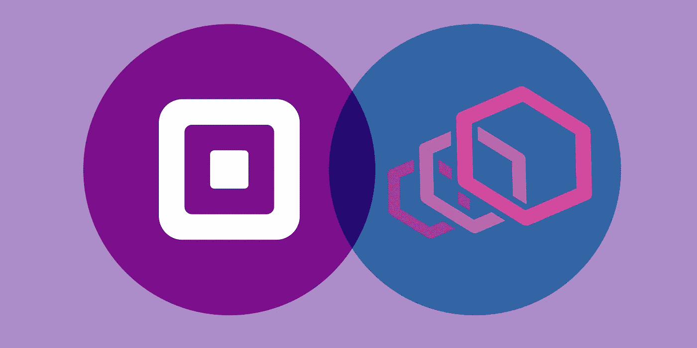
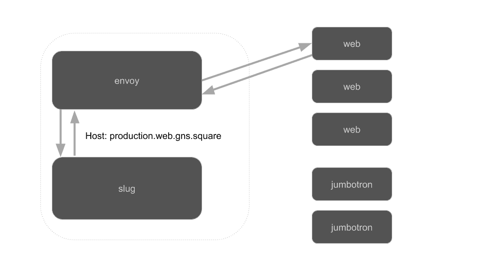

# 通向特使服务网之路

> 原文：<https://medium.com/square-corner-blog/the-road-to-an-envoy-service-mesh-d1a51cbd31dd?source=collection_archive---------0----------------------->



> 注意，我们已经行动了！如果您想继续了解 Square 的最新技术内容，请访问我们的新家[https://developer.squareup.com/blog](https://developer.squareup.com/blog)

在 Square，我们多年来一直在运行微服务架构，主要使用三种不同的语言:Java、Ruby 和 Go。运行如此多样化的堆栈会使不同语言/框架之间的互操作性变得具有挑战性，在这篇文章中，我将谈论 Square 在过去是如何处理这一问题的，以及我们今天所处的位置——积极地向全服务网格迁移。

## **旧世界**

像许多其他公司一样，Square 一开始只是运行一个大型的整体。对于 Square 来说，这是一个巨大的 Ruby on Rails 服务，处理 Square 所做的一切。monolith 使得服务对服务的通信变得完全没有必要:所有的东西都在一个数据库上的相同代码库中运行，所以所有的东西都可以在不进行任何出站网络调用的情况下实现(除了对 Square 之外的第三方)。

过了一段时间，Square 决定更多地转向面向服务的架构，以减少对单个大型应用程序的依赖。为了做到这一点，Square 受 Google Stubby 的启发，决定构建自己的基于 Protobuf 的 RPC 框架。这是 gRPC 创建之前的几年，所以当时没有任何开源选项。这个名为 Sake 的 RPC 框架是为 Java 和 Go 实现的，因为这些语言用于更高可用性的服务，而常规的 REST HTTP 用于不理解 Sake 的服务之间。(顺便提一下，[清酒成为 gRPC DNA 的一部分](/square-corner-blog/grpc-reaches-1-0-85728518393b))

随着时间的推移，这个框架变得相当复杂，具有许多通常不可用的特性:

*   自动故障转移的智能重试
*   基于上游健康状况的优先路由
*   流量整形和服务发现

这最终工作得很好，但是依赖于胖客户端/服务器库，所以很难扩展对其他语言的支持。人们试图以各种方式实现语言之间的功能对等:

*   连接 HTTP 和 Sake 的 Sidecar 进程
*   集中式 L4 代理与 L7 功能的智能客户端库相结合

这两种方法都没有完全解决问题，虽然都缩小了功能差距，但它们并不完全匹配。在调试问题时，应用程序所有者仍然被迫知道使用了哪种机制，这导致了很多混乱。

试图从 Sake 迁移到 gRPC，但是事实证明，Sake 提供的大量特性集对于迁移到 gRPC 是一个挑战，需要实现定制的负载平衡和名称解析器来与`grpc-go`和`grpc-java`一起工作。在部分实现了必要的功能后，由于各种原因，迁移被搁置，部分原因是因为作为 Sake 的替代产品意味着应用程序所有者没有什么动力进行迁移。

除此之外，我们还利用内部硬件负载平衡器对服务呼叫进行负载平衡。虽然我们在 Sake 中对客户端负载平衡提供了部分支持，但是大量的 Sake 流量和所有的 HTTP 流量仍然依赖于这些负载平衡器。随着公司的不断发展，硬件负载平衡器的负载量也在增加。

**反思服务到服务**

在我们的硬件负载平衡器出现一系列问题后，我们决定需要改进我们的服务设置。我们现有的服务对服务设置需要在硬件负载平衡器上为每个新服务创建新的虚拟 IP，因此随着服务数量的增长，负载只会增加，因此我们必须添加更多的硬件负载平衡器或迁移到可扩展性更强的基础架构。

这被证明是一个简化的好机会:我们不再运行 Sake 和许多其他基础设施，而是集中在一个单一的服务到服务机制上。这为应用程序所有者简化了事情，带来了额外的好处:他们不再需要担心多个负载平衡器、连接池等。他们可以专注于理解单个实现的语义，使得从日常操作到灾难恢复的所有事情都更容易推理。

环顾四周，特使脱颖而出，作为一个伟大的候选人，由于

*   特使负载平衡器数据结构和 Sake 数据结构之间的相似性
*   流式配置 API
*   对 gRPC 的一流支持
*   进程外架构

回想起来，在我们能够协调 Sake 和 Envoy 之前，映射负载平衡器实现需要相当多的额外上游工作([智能重试](https://github.com/envoyproxy/envoy/issues/3958)、[降级健康检查](https://github.com/envoyproxy/envoy/issues/5063)和[每次尝试超时](https://github.com/envoyproxy/envoy/issues/4903)等等)。值得庆幸的是，特使维护者非常乐于助人，并乐于接受新的功能，允许我们构建我们需要的一切。

配置 API 意味着我们可以轻松地在现有的基于 Zookeeper 的服务发现系统上构建它:一个集中的控制平面将侦听 Zookeeper 的更改，并使用配置 API 将这些更改推送给 Envoy。

对 gRPC 的支持意味着我们可以接手已经部分铺开的 gRPC 工作，但是依赖于 Envoy 的负载平衡器逻辑。对我们来说更重要的是，这意味着我们可以对 RPC 和 HTTP 流量使用完全相同的负载平衡器。这也是进程外架构如此伟大的原因:无论什么应用程序使用它，实现都是相同的，因为在任何地方都使用相同的二进制文件。

**构建服务网格**

为了迁移到 Envoy，我们最终构建了一个基于 https://github.com/envoyproxy/java-control-plane[的控制平面，它与我们现有的服务发现基础设施相集成。这让我们可以使用用于形成清酒流量的相同数据，让应用程序所有者不必担心流量来自哪里。](https://github.com/envoyproxy/java-control-plane)

Envoy 进程部署在每个应用程序旁边，并且为每种语言提供了一个非常瘦的客户端库，以便通过 unix 套接字与该进程进行通信。该库有意保持精简，以确保我们将尽可能多的逻辑集中在控制平面或特使中，因为这确保了不同语言之间的行为一致。

我们决定使用 unix 套接字，因为我们的应用程序部署在多租户机器上，对 TLS 证书的访问受到文件权限的保护。使用 unix 套接字允许我们使用类似的权限来限制对给定应用程序的特使实例的访问，这使我们可以使用普通 HTTP，而无需向同一主机上的所有其他应用程序开放对机密的访问。此外，这提供了不必多次加密和解密流量的性能优化。路由的主要形式仅仅依赖于主机头，主机头指示请求应该被路由到哪个服务。



How Envoy selects a backend host based on the Host header

因为我们保持客户端非常瘦，所以任何人构建一个特使客户端都变得非常容易。如果没有别的，一个简单的 curl 命令就可以给你同样的流量整形、重试行为等。一个“完整”的客户端实现将:

```
curl --unix-socket egress.sock production.web.gns.square
```

这使得开发人员可以在几分钟内，而不是几个月内，在 Square 上以一种与我们的服务网格集成的方式开发新语言的原型。

**迁徙**

一旦这些都设置好了，迁移工作就可以开始了。我们的主要关注点是摆脱服务基础设施的替代服务，弃用应用程序并将其从其他代理服务器上移走。这是一个非常缓慢的过程，因为它依赖于与各个团队协调配置更改和应用程序部署。这在很大程度上是由于我们的客户手动路由到 Envoy:不像 Istio 这样的系统可以控制网络并充当透明代理，我们必须更改代码才能使客户路由到 Envoy。不幸的是，由于应用程序多租户和缺乏网络名称空间，这种透明代理使用的方法不是我们的选择。

为了帮助促进迁移，我们发布了一个名为`tcli`(traffic CLI 的缩写)的内部 CLI 工具，以简化应用程序切换到 Envoy 所需的操作。

对于一个希望通过 Envoy 转移其客户端调用的应用程序，步骤如下所示:

要分配端口，将 Envoy 添加到部署中，并请求访问现有的服务对服务的依赖关系，请从开发人员笔记本电脑上运行一条命令:

```
tcli add-envoy -a <app> -d <datacenter> -e <environment>
```

一旦访问请求被批准，更新 Git 中的客户端配置以使用 Envoy:

```
userService:
  url: user.global.square # CNAME to a hardware load balancer VIP
```

将需要更改为

```
userService:
  envoy: { app: user }
```

通过这两个简单的更改，流量将开始通过特使边车路由。让应用程序所有者尽可能简单是推动推广的关键:大多数应用程序所有者通常对处理迁移的细节不感兴趣，因此将其抽象化并使其自助化非常有帮助。

**现状**

推广还远未完成，但总的来说非常顺利，大多数问题源于 Envoy 与传统系统在工作方式上的细微差异。我们很高兴继续致力于在 Square 上推出 Envoy，希望在 2019 年完全放弃 Sake，支持 gRPC 而不是 Envoy。

我们也期待着探索将 Envoy 用于我们流量堆栈的其他部分，并利用 Envoy 在我们服务网络中不断增加的存在来提高 Square 的安全性，或使 Square 应用程序所有者的工作更容易。